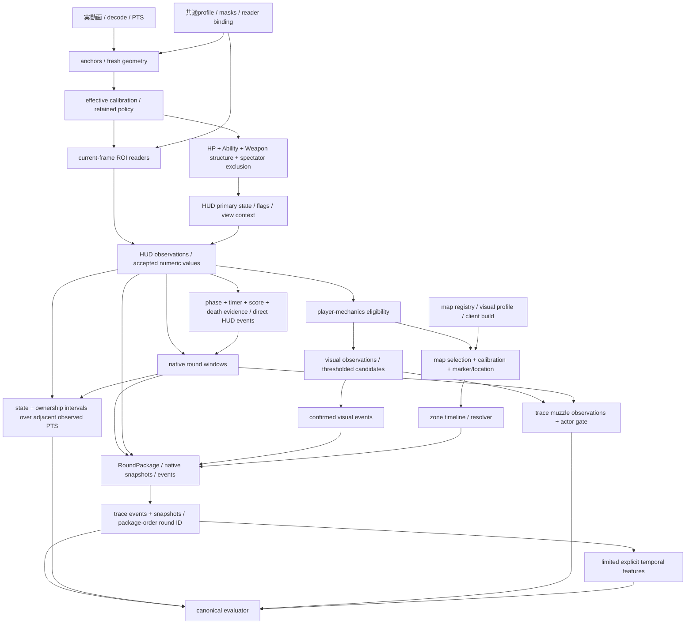

# E2E failure analysis

## 1. Executive Summary

**最大の最初の阻害条件はround packageの範囲・所属で、29/55 FAIL（52.73%）です。** 25件はround2の出力がすべて`sample_round_1`に入ること、4件は最初のpackage開始より前のR1 snapshot／derived zoneに対応します。直接のround境界4件を合わせると33件に影響しますが、33件のPASS増加を意味しません。

次に1つだけ着手するなら、**round lifecycleの縦断契約（phase/境界の実画像証拠→native package→traceのactor・round所属）を完成させる**ことです。真の開始2回・終了1回を検出し、actor/time/countを満たす場合、6 FAILと1 NEがPASSになり、**23→30 PASS／49 FAIL／3 NE**が条件付き目標になります。現時点で保証できる実runの増加は0です。round IDだけの照合条件を一時的に外した論理感度診断ではR2の25件がすべて残り、単なるrelabelでは23 PASSのままです。

停滞はrecognizer精度だけではありません。package／snapshotの上流gateと、検出結果を必要なフィールドへ運ぶ未完成の契約が混在しています。11の失敗snapshotは現行producer／adapterにない明示フィールドを要求します。timerの数字を読み取れても、元の表示文字列を保持する経路がないため4 snapshotは通りません。round detectorはactor=`team`、packは`system`を要求し、deathの要求属性も現在の出力にありません。

fresh geometry=1は重大な観測上の弱点ですが、effective geometryは4661/4661で有効、geometry-invalid unknownは0です。現在の55件から**geometryが単独原因と証明できるFAILは0件**です。「影響がない」という意味ではありません。保持calibrationの実画像上の位置誤差と、失敗への因果寄与は未証明です。

round／event／mapのコードパスは呼ばれています。roundはphase・state・score等の証拠不足、eventは属性・ownership・閾値を満たす入力不足、mapは選択／profile不足とeligibility不足です。rawのdomain eventは0ですがtraceには262の`state_snapshot` eventと4のactor不明muzzle observationがあります。

candidate方式は廃止せず、**実装すべき契約と解消対象IDを先に固定する方式へ変更**します。未完成producerを埋めずに数値recognizer候補を増やす方式は止めます。

## 2. Current E2E status

分析開始時に`git fetch origin`、`git checkout main`、`git pull --ff-only`を実行し、開始SHAは`d6d7e5188b9b51c0d8dba2b8afd16b0e9ffa32a1`、origin/mainと一致しました。既存の未コミット`docs/pi_recognition_improvement.md`は保持しています。

最新の正常**処理完了**fullは`outputs/recognition-investigation/timer-only-profile15/full16`、開始2026-10-07 13:19:14 UTC、wall15149.129秒（4時間12分29秒）、4661 analyzed framesです。23 PASS /55 FAIL /4 NE、schema valid、error_code=null、native analyzer exit0、canonical evaluator exit1（既存FAIL）です。処理完了は精度合格を意味しません。profile16はtimer誤読3件で却下済みで、採用していません。採用可能な比較profile13も23/55/4で、82 statusは同じです。

歴史的run metadataは`e05c495…`のdirty tree、code fingerprint`22defc36…`です。最新clean mainのfullを今回新規に走らせたとは扱いません。最新mainのHUD／round／map／visual／E2E producerソースは検証済みcommit3d0dc37から変更されていないことをGit差分で確認しました。後続mainのobservability更新を含む全code fingerprintは一致しません。

入力video SHA256：`71d58558559d6f578433ce9f234bf176f76fd5a86657dbfe3eba1e7d36136b06`。pack fingerprint：`7f0b7798857670f08074adbeea73d24176967ad5bf1f2f7300d2c2f792cf956f`。assertions SHA256：`c5e242b611ce227d1d2633e5e24c00dfe65168d8124ab58fbdea84b1d7f0d820`。terminal raw／trace／evaluation hashを照合し、最新mainのcanonical evaluatorで保存traceを再評価して全82 status／全failure codeの一致を確認しました。history／summaryもこの終了runを記録しています。artifact source hashはJSONにあります。

| 指標 | 値 |
| --- | ---: |
| unknown / live / buy menu / spectator | 3731 /455 /301 /174 |
| identity不足（positive count<3） | 3771 |
| HP / Ability / Weapon identity missing | 794 /2318 /2610 |
| fresh / effective / retained geometry | 1 /4661 /4660 |
| native package | 1、境界未完了fragment |
| round start / end / raw HUD events / raw Visual events | 0 /0 /0 /0 |
| map resolved / held | 0 /0 |
| trace events / snapshots / visual observations | 262 /930 /4 |
| negative violations / discontinuity violations | 0 /0 |

## 3. 82 assertion matrix

この一覧のprimary rootは**最初に観測した阻害条件を一つ選んだ排他的分類**です。下流機能が実装済みと保証する分類ではありません。複数の実装欠落・recognition gateはJSONのsecondary_blockers／upstream_dependenciesと次章に残しています。NE4件はground truth欠落ではなく、必須point eventがないためorderingを評価できません。

| Assertion | Status | Category | Primary root | Direct / Upstream | Fix target |
| --- | --- | --- | --- | --- | --- |
| GT-R1-ROUND-START | FAIL | round start/end | C03 | direct | round phase evidence and temporal lifecycle |
| GT-R1-DEATH | FAIL | kill/death/combat event | C05 | direct | current-frame death evidence plus semantic attribute producer |
| GT-R1-ROUND-END | FAIL | round start/end | C03 | direct | round phase evidence and temporal lifecycle |
| GT-R2-ROUND-START | FAIL | round package | C01 | upstream | round lifecycle / package context / adapter association |
| GT-R2-DEATH | FAIL | round package | C01 | upstream | round lifecycle / package context / adapter association |
| ordering_constraints-000 | NE | evaluator / ordering upstream | point dependency | upstream | point event producers |
| ordering_constraints-001 | NE | evaluator / ordering upstream | point dependency | upstream | point event producers |
| ordering_constraints-002 | NE | evaluator / ordering upstream | point dependency | upstream | point event producers |
| ordering_constraints-003 | NE | evaluator / ordering upstream | point dependency | upstream | point event producers |
| GT-R1-BUY-FLAG | FAIL | buy phase | C08 | direct | qualified phase evidence and stable score inputs |
| GT-R1-ASTRAL-1 | FAIL | remote state | C06 | direct | Astra compound current-frame evidence |
| GT-R1-ASTRAL-2 | FAIL | remote state | C06 | direct | Astra compound current-frame evidence |
| GT-R1-SMOKE | FAIL | smoke state | C09 | direct | smoke structural/temporal evidence |
| GT-R1-COMBAT-REPORT | PASS | combat report | — | - | 維持・回帰保護 |
| GT-R2-BUY-FLAG | FAIL | round package | C01 | upstream | round lifecycle / package context / adapter association |
| GT-R2-BUY-MENU-1 | FAIL | round package | C01 | upstream | round lifecycle / package context / adapter association |
| GT-R2-BUY-MENU-2 | FAIL | round package | C01 | upstream | round lifecycle / package context / adapter association |
| GT-R2-ASTRAL-1 | FAIL | round package | C01 | upstream | round lifecycle / package context / adapter association |
| GT-R2-ASTRAL-2 | FAIL | round package | C01 | upstream | round lifecycle / package context / adapter association |
| GT-R2-EXPANDED-MAP | FAIL | round package | C01 | upstream | round lifecycle / package context / adapter association |
| GT-R2-SPECTATOR | FAIL | round package | C01 | upstream | round lifecycle / package context / adapter association |
| OWN-R1-SELF | FAIL | live identity | C10 | direct | independent current-frame identity and view ownership coverage |
| OWN-R1-SELF-DEAD | FAIL | ownership | C11 | direct | death ownership contract producer and adapter |
| OWN-R2-SELF | FAIL | round package | C01 | upstream | round lifecycle / package context / adapter association |
| OWN-R2-SELF-DEAD | FAIL | round package | C01 | upstream | round lifecycle / package context / adapter association |
| OWN-R2-TEAMMATE | FAIL | round package | C01 | upstream | round lifecycle / package context / adapter association |
| GT-R1-SNAP-0035 | FAIL | round package | C01 | upstream | round lifecycle / package context / adapter association |
| GT-R1-SNAP-0415 | FAIL | round package | C01 | upstream | round lifecycle / package context / adapter association |
| GT-R1-SNAP-475 | FAIL | killfeed / snapshot | C12 | direct | nonself killfeed visibility evidence and trace export |
| GT-R1-SNAP-585 | FAIL | snapshot | C02 | upstream | correct state/identity evidence and snapshot admission contract |
| GT-R1-SNAP-595 | FAIL | snapshot | C02 | upstream | correct state/identity evidence and snapshot admission contract |
| GT-R1-SNAP-705 | PASS | snapshot | — | - | 維持・回帰保護 |
| GT-R1-SNAP-728 | FAIL | snapshot | C02 | upstream | correct state/identity evidence and snapshot admission contract |
| GT-R1-SNAP-733 | FAIL | temporal context | C07 | upstream | temporal input coverage diagnosis under unchanged full sampler |
| GT-R1-SNAP-734 | FAIL | snapshot | C02 | upstream | correct state/identity evidence and snapshot admission contract |
| GT-R1-SNAP-7425 | FAIL | snapshot | C02 | upstream | correct state/identity evidence and snapshot admission contract |
| GT-R1-SNAP-7438 | FAIL | snapshot | C02 | upstream | correct state/identity evidence and snapshot admission contract |
| GT-R1-SNAP-7440 | FAIL | snapshot | C02 | upstream | correct state/identity evidence and snapshot admission contract |
| GT-R1-SNAP-7445 | FAIL | temporal context | C07 | upstream | temporal input coverage diagnosis under unchanged full sampler |
| GT-R2-SNAP-820 | FAIL | round package | C01 | upstream | round lifecycle / package context / adapter association |
| GT-R2-SNAP-1050 | FAIL | round package | C01 | upstream | round lifecycle / package context / adapter association |
| GT-R2-SNAP-11145 | FAIL | round package | C01 | upstream | round lifecycle / package context / adapter association |
| GT-R2-SNAP-143 | FAIL | round package | C01 | upstream | round lifecycle / package context / adapter association |
| GT-R2-SNAP-1475 | FAIL | round package | C01 | upstream | round lifecycle / package context / adapter association |
| GT-R2-SNAP-1476 | FAIL | round package | C01 | upstream | round lifecycle / package context / adapter association |
| GT-R2-SNAP-1477 | FAIL | round package | C01 | upstream | round lifecycle / package context / adapter association |
| GT-R2-SNAP-149 | FAIL | round package | C01 | upstream | round lifecycle / package context / adapter association |
| GT-R2-SNAP-151 | FAIL | round package | C01 | upstream | round lifecycle / package context / adapter association |
| GT-R2-SNAP-170 | FAIL | round package | C01 | upstream | round lifecycle / package context / adapter association |
| GT-R1-SNAP-0035-DERIVED-zone_id | FAIL | round package | C01 | upstream | round lifecycle / package context / adapter association |
| GT-R1-SNAP-0415-DERIVED-zone_id | FAIL | round package | C01 | upstream | round lifecycle / package context / adapter association |
| GT-R2-SNAP-820-DERIVED-zone_id | FAIL | round package | C01 | upstream | round lifecycle / package context / adapter association |
| GT-R1-MUZZLE-1 | FAIL | visual event | C04 | upstream | owned HUD/weapon evidence plus visual observation producer |
| GT-R1-MUZZLE-2 | FAIL | visual event | C04 | upstream | owned HUD/weapon evidence plus visual observation producer |
| GT-R1-MUZZLE-3 | FAIL | visual event | C04 | upstream | owned HUD/weapon evidence plus visual observation producer |
| event_count_constraints-000 | FAIL | round start/end | C03 | direct | round phase evidence and temporal lifecycle |
| event_count_constraints-001 | FAIL | kill/death/combat event | C05 | direct | current-frame death evidence plus semantic attribute producer |
| event_count_constraints-002 | FAIL | round start/end | C03 | direct | round phase evidence and temporal lifecycle |
| event_count_constraints-003 | FAIL | event detection | C13 | upstream | qualified shot inputs and event aggregation |
| event_count_constraints-004 | FAIL | round package | C01 | upstream | round lifecycle / package context / adapter association |
| event_count_constraints-005 | FAIL | round package | C01 | upstream | round lifecycle / package context / adapter association |
| event_count_constraints-006 | PASS | round end | — | - | 維持・回帰保護 |
| NEG-REMOTE-R1A | PASS | safety / negative assertion | — | - | 維持・回帰保護 |
| NEG-REMOTE-R1B | PASS | safety / negative assertion | — | - | 維持・回帰保護 |
| NEG-REMOTE-R2A | PASS | safety / negative assertion | — | - | 維持・回帰保護 |
| NEG-REMOTE-R2B | PASS | safety / negative assertion | — | - | 維持・回帰保護 |
| NEG-ASTRAL-NOT-SMOKE | PASS | safety / negative assertion | — | - | 維持・回帰保護 |
| NEG-SMOKE-NOT-ASTRAL | PASS | safety / negative assertion | — | - | 維持・回帰保護 |
| NEG-SMOKE-WORLD-SPOT | PASS | safety / negative assertion | — | - | 維持・回帰保護 |
| NEG-NONSELF-KILLFEED | PASS | safety / negative assertion | — | - | 維持・回帰保護 |
| NEG-RELOAD-NOT-SHOT | PASS | safety / negative assertion | — | - | 維持・回帰保護 |
| NEG-BUY-MENU-1 | PASS | safety / negative assertion | — | - | 維持・回帰保護 |
| NEG-BUY-MENU-2 | PASS | safety / negative assertion | — | - | 維持・回帰保護 |
| NEG-SPECTATOR-COUNT-TEXT | PASS | safety / negative assertion | — | - | 維持・回帰保護 |
| NEG-DEAD-PLAYER-MECHANICS | PASS | safety / negative assertion | — | - | 維持・回帰保護 |
| NEG-EXPANDED-MAP-MECHANICS | PASS | safety / negative assertion | — | - | 維持・回帰保護 |
| NEG-SPECTATOR-POISON-151 | PASS | safety / negative assertion | — | - | 維持・回帰保護 |
| NEG-SPECTATOR-POISON-170 | PASS | safety / negative assertion | — | - | 維持・回帰保護 |
| NEG-STALE-COMBAT-REPORT | PASS | safety / negative assertion | — | - | 維持・回帰保護 |
| NEG-R2-NO-ROUND-END | PASS | safety / negative assertion | — | - | 維持・回帰保護 |
| NEG-SAME-ZONE-CALLOUT-CHANGE | PASS | safety / negative assertion | — | - | 維持・回帰保護 |
| NEG-CONTENT-JUMP-SPAN | PASS | safety / negative assertion | — | - | 維持・回帰保護 |

## 4. 55 FAIL classification

expectedはpackの定義そのままです。actualの`missing`はフィールド不在でありnull／falseと同一視しません。元の全定義とactualの詳細は`e2e_reports/match_001/failure_analysis.json`に保存しました。各行の同一原因ID、実装状態、fix targetはgroup headingに共通です。各FAILのPASS確度はpossible（全predicateを満たす実画像証拠が必要）、無条件guaranteed増加は0です。

### C01: round_package_scope（29件）

Category: round package。実装状態: upstream依存。Fix target: round lifecycle / package context / adapter association。

1 partial package [7.369336,171.002669] mapped exclusively to sample_round_1; no sample_round_2; pre-window R1 observations excluded。

| Assertion / 目的 / PTS・範囲 | expected | actual / failure field・reason | upstream / 追加条件 |
| --- | --- | --- | --- |
| GT-R2-ROUND-START round_start [111.38000000000001,111.5] | `{"id":"GT-R2-ROUND-START","round_id":"sample_round_2","type":"round_start","actor":"system","acceptance_window":[111.38000000000001,111.5],"facts":{"score_before":"0-2"},"required_event_attributes":{}}` | {"matching_type_actor_time_count":0} fields: event.round_start missing_point:GT-R2-ROUND-START | round_boundary, round_package_scope missing_point; event_actor_contract |
| GT-R2-DEATH player_death [147.57,147.75] | `{"id":"GT-R2-DEATH","round_id":"sample_round_2","type":"player_death","actor":"player","acceptance_window":[147.57,147.75],"facts":{"victim_name":"sharkman","killer_agent":"Fade","combat_report_damage_received":194},"required_event_attributes":{"victim_name":"sharkman","killer_agent":"Fade","combat_report_damage_received":194}}` | {"matching_type_actor_time_count":0} fields: event.player_death missing_point:GT-R2-DEATH | current_frame_death_evidence, death_attributes, round_package_scope missing_point; event_attribute_contract |
| GT-R2-BUY-FLAG buy_phase_banner [82.0,111.4] | `{"id":"GT-R2-BUY-FLAG","round_id":"sample_round_2","state_class":"flag","state":"buy_phase_banner","subtype":null,"core_interval":[82.0,111.4],"outer_interval":[81.5,111.45],"min_core_coverage":0.9,"exhaustive":false}` | coverage=0.00000 / required=0.9; round-neutral=0.00000 fields: coverage.buy_phase_banner state_coverage:GT-R2-BUY-FLAG | state_evidence, round_package_scope state_coverage |
| GT-R2-BUY-MENU-1 buy_menu_open [83.352669,91.402669] | `{"id":"GT-R2-BUY-MENU-1","round_id":"sample_round_2","state_class":"primary_state","state":"buy_menu_open","subtype":null,"core_interval":[83.352669,91.402669],"outer_interval":[83.252669,91.452669],"min_core_coverage":0.9,"exhaustive":true,"edge_brackets":{"start":{"last_absent_sec":83.252669,"first_present_sec":83.352669},"end":{"last_present_sec":91.402669,"first_absent_sec":91.452669}}}` | coverage=0.00000 / required=0.9; round-neutral=0.99172 fields: coverage.buy_menu_open state_coverage:GT-R2-BUY-MENU-1 | state_evidence, round_package_scope state_overreach,state_start_edge,state_end_edge |
| GT-R2-BUY-MENU-2 buy_menu_open [108.052669,110.802669] | `{"id":"GT-R2-BUY-MENU-2","round_id":"sample_round_2","state_class":"primary_state","state":"buy_menu_open","subtype":null,"core_interval":[108.052669,110.802669],"outer_interval":[107.952669,110.852669],"min_core_coverage":0.9,"exhaustive":true,"edge_brackets":{"start":{"last_absent_sec":107.952669,"first_present_sec":108.052669},"end":{"last_present_sec":110.802669,"first_absent_sec":110.852669}}}` | coverage=0.00000 / required=0.9; round-neutral=0.56970 fields: coverage.buy_menu_open state_coverage:GT-R2-BUY-MENU-2 | state_evidence, round_package_scope state_coverage,state_start_edge,state_end_edge |
| GT-R2-ASTRAL-1 remote_control_view [111.302669,112.402669] | `{"id":"GT-R2-ASTRAL-1","round_id":"sample_round_2","state_class":"primary_state","state":"remote_control_view","subtype":"astra_astral","core_interval":[111.302669,112.402669],"outer_interval":[111.102669,112.502669],"min_core_coverage":0.9,"exhaustive":true,"edge_brackets":{"start":{"last_absent_sec":111.102669,"first_present_sec":111.302669},"end":{"last_present_sec":112.402669,"first_absent_sec":112.502669}}}` | coverage=0.00000 / required=0.9; round-neutral=0.00000 fields: coverage.remote_control_view state_coverage:GT-R2-ASTRAL-1 | state_evidence, round_package_scope state_coverage |
| GT-R2-ASTRAL-2 remote_control_view [115.602669,120.102669] | `{"id":"GT-R2-ASTRAL-2","round_id":"sample_round_2","state_class":"primary_state","state":"remote_control_view","subtype":"astra_astral","core_interval":[115.602669,120.102669],"outer_interval":[115.502669,120.202669],"min_core_coverage":0.9,"exhaustive":true,"edge_brackets":{"start":{"last_absent_sec":115.502669,"first_present_sec":115.602669},"end":{"last_present_sec":120.102669,"first_absent_sec":120.202669}}}` | coverage=0.00000 / required=0.9; round-neutral=0.00000 fields: coverage.remote_control_view state_coverage:GT-R2-ASTRAL-2 | state_evidence, round_package_scope state_coverage |
| GT-R2-EXPANDED-MAP expanded_tactical_map [149.0,150.5] | `{"id":"GT-R2-EXPANDED-MAP","round_id":"sample_round_2","state_class":"primary_state","state":"expanded_tactical_map","subtype":null,"core_interval":[149.0,150.5],"outer_interval":[148.8,150.8],"min_core_coverage":0.7,"exhaustive":true}` | coverage=0.00000 / required=0.7; round-neutral=0.00000 fields: coverage.expanded_tactical_map state_coverage:GT-R2-EXPANDED-MAP | state_evidence, round_package_scope state_coverage |
| GT-R2-SPECTATOR spectator_first_person [151.0,171.0] | `{"id":"GT-R2-SPECTATOR","round_id":"sample_round_2","state_class":"primary_state","state":"spectator_first_person","subtype":null,"core_interval":[151.0,171.0],"outer_interval":[150.5,171.019336],"min_core_coverage":0.9,"exhaustive":true}` | coverage=0.00000 / required=0.9; round-neutral=0.29167 fields: coverage.spectator_first_person state_coverage:GT-R2-SPECTATOR | state_evidence, round_package_scope state_coverage |
| OWN-R2-SELF self [82.0,147.6] | `{"id":"OWN-R2-SELF","round_id":"sample_round_2","owner":"self","core_interval":[82.0,147.6],"outer_interval":[81.5,147.7],"min_core_coverage":0.9}` | coverage=0.00000 / required=0.9; round-neutral=0.05462 fields: coverage.self ownership_coverage:OWN-R2-SELF | state_evidence, round_package_scope ownership_coverage; ownership_contract |
| OWN-R2-SELF-DEAD self_dead_ui [147.7,150.0] | `{"id":"OWN-R2-SELF-DEAD","round_id":"sample_round_2","owner":"self_dead_ui","core_interval":[147.7,150.0],"outer_interval":[147.7,150.5],"min_core_coverage":0.9}` | coverage=0.00000 / required=0.9; round-neutral=0.00000 fields: coverage.self_dead_ui ownership_coverage:OWN-R2-SELF-DEAD | state_evidence, round_package_scope ownership_coverage; ownership_contract |
| OWN-R2-TEAMMATE teammate_spectated [150.5,171.0] | `{"id":"OWN-R2-TEAMMATE","round_id":"sample_round_2","owner":"teammate_spectated","core_interval":[150.5,171.0],"outer_interval":[150.0,171.019336],"min_core_coverage":0.9}` | coverage=0.00000 / required=0.9; round-neutral=0.28455 fields: coverage.teammate_spectated ownership_coverage:OWN-R2-TEAMMATE | state_evidence, round_package_scope ownership_coverage; ownership_contract |
| GT-R1-SNAP-0035 required_snapshots 3.5 ±0.05 | `{"primary_state":"live_first_person","buy_phase_banner":true,"player_alive":true,"location_label_raw":"A ロビー"}` | snapshot candidates=0; fields={"primary_state":{"present":false,"value":null},"buy_phase_banner":{"present":false,"value":null},"player_alive":{"present":false,"value":null},"location_label_raw":{"present":false,"value":null}}; native samples=2 / qualified=0 fields: primary_state, buy_phase_banner, player_alive, location_label_raw missing_snapshot:GT-R1-SNAP-0035 | round_package_scope, hud_confidence_gate, snapshot_materialization, primary_state, buy_phase_banner, player_alive, location_label_raw  |
| GT-R1-SNAP-0415 required_snapshots 4.15 ±0.05 | `{"primary_state":"live_first_person","buy_phase_banner":false,"player_alive":true,"score_player":0,"score_enemy":1,"game_timer_display":"1:39","location_label_raw":"A メイン"}` | snapshot candidates=0; fields={"primary_state":{"present":false,"value":null},"buy_phase_banner":{"present":false,"value":null},"player_alive":{"present":false,"value":null},"score_player":{"present":false,"value":null},"score_enemy":{"present":false,"value":null},"game_timer_display":{"present":false,"value":null},"location_label_raw":{"present":false,"value":null}}; native samples=2 / qualified=0 fields: primary_state, buy_phase_banner, player_alive, score_player, score_enemy, game_timer_display, location_label_raw missing_snapshot:GT-R1-SNAP-0415 | round_package_scope, hud_confidence_gate, snapshot_materialization, primary_state, buy_phase_banner, player_alive, score_player, score_enemy, game_timer_display, location_label_raw missing_trace_fields |
| GT-R2-SNAP-820 required_snapshots 82.0 ±0.1 | `{"primary_state":"live_first_person","buy_phase_banner":true,"player_alive":true,"player_hp":100,"location_label_raw":"アタック側スポーン","combat_report_visible":true}` | snapshot candidates=0; fields={"primary_state":{"present":false,"value":null},"buy_phase_banner":{"present":false,"value":null},"player_alive":{"present":false,"value":null},"player_hp":{"present":false,"value":null},"location_label_raw":{"present":false,"value":null},"combat_report_visible":{"present":false,"value":null}}; native samples=1 / qualified=0 fields: primary_state, buy_phase_banner, player_alive, player_hp, location_label_raw, combat_report_visible missing_snapshot:GT-R2-SNAP-820 | round_package_scope, hud_confidence_gate, snapshot_materialization, primary_state, buy_phase_banner, player_alive, player_hp, location_label_raw, combat_report_visible missing_snapshot |
| GT-R2-SNAP-1050 required_snapshots 105.0 ±0.1 | `{"primary_state":"live_first_person","buy_phase_banner":true,"player_alive":true,"combat_report_visible":true}` | snapshot candidates=0; fields={"primary_state":{"present":false,"value":null},"buy_phase_banner":{"present":false,"value":null},"player_alive":{"present":false,"value":null},"combat_report_visible":{"present":false,"value":null}}; native samples=4 / qualified=0 fields: primary_state, buy_phase_banner, player_alive, combat_report_visible missing_snapshot:GT-R2-SNAP-1050 | round_package_scope, hud_confidence_gate, snapshot_materialization, primary_state, buy_phase_banner, player_alive, combat_report_visible missing_snapshot |
| GT-R2-SNAP-11145 required_snapshots 111.45 ±0.05 | `{"buy_phase_banner":false,"player_alive":true,"score_player":0,"score_enemy":2,"game_timer_display":"1:40"}` | snapshot candidates=0; fields={"buy_phase_banner":{"present":false,"value":null},"player_alive":{"present":false,"value":null},"score_player":{"present":false,"value":null},"score_enemy":{"present":false,"value":null},"game_timer_display":{"present":false,"value":null}}; native samples=2 / qualified=0 fields: buy_phase_banner, player_alive, score_player, score_enemy, game_timer_display missing_snapshot:GT-R2-SNAP-11145 | round_package_scope, hud_confidence_gate, snapshot_materialization, buy_phase_banner, player_alive, score_player, score_enemy, game_timer_display missing_snapshot; missing_trace_fields |
| GT-R2-SNAP-143 required_snapshots 143.0 ±0.1 | `{"primary_state":"live_first_person","player_alive":true,"player_hp":80}` | snapshot candidates=0; fields={"primary_state":{"present":false,"value":null},"player_alive":{"present":false,"value":null},"player_hp":{"present":false,"value":null}}; native samples=6 / qualified=0 fields: primary_state, player_alive, player_hp missing_snapshot:GT-R2-SNAP-143 | round_package_scope, hud_confidence_gate, snapshot_materialization, primary_state, player_alive, player_hp missing_snapshot |
| GT-R2-SNAP-1475 required_snapshots 147.5 ±0.05 | `{"primary_state":"live_first_person","player_alive":true,"player_hp":80}` | snapshot candidates=0; fields={"primary_state":{"present":false,"value":null},"player_alive":{"present":false,"value":null},"player_hp":{"present":false,"value":null}}; native samples=2 / qualified=0 fields: primary_state, player_alive, player_hp missing_snapshot:GT-R2-SNAP-1475 | round_package_scope, hud_confidence_gate, snapshot_materialization, primary_state, player_alive, player_hp missing_snapshot |
| GT-R2-SNAP-1476 required_snapshots 147.6 ±0.05 | `{"primary_state":"live_first_person","player_alive":true,"player_hp":22}` | snapshot candidates=0; fields={"primary_state":{"present":false,"value":null},"player_alive":{"present":false,"value":null},"player_hp":{"present":false,"value":null}}; native samples=3 / qualified=0 fields: primary_state, player_alive, player_hp missing_snapshot:GT-R2-SNAP-1476 | round_package_scope, hud_confidence_gate, snapshot_materialization, primary_state, player_alive, player_hp missing_snapshot |
| GT-R2-SNAP-1477 required_snapshots 147.7 ±0.05 | `{"player_alive":false,"combat_report_visible":true}` | snapshot candidates=0; fields={"player_alive":{"present":false,"value":null},"combat_report_visible":{"present":false,"value":null}}; native samples=1 / qualified=0 fields: player_alive, combat_report_visible missing_snapshot:GT-R2-SNAP-1477 | round_package_scope, hud_confidence_gate, snapshot_materialization, player_alive, combat_report_visible missing_snapshot |
| GT-R2-SNAP-149 required_snapshots 149.0 ±0.1 | `{"primary_state":"expanded_tactical_map","player_alive":false,"combat_report_visible":true}` | snapshot candidates=0; fields={"primary_state":{"present":false,"value":null},"player_alive":{"present":false,"value":null},"combat_report_visible":{"present":false,"value":null}}; native samples=2 / qualified=0 fields: primary_state, player_alive, combat_report_visible missing_snapshot:GT-R2-SNAP-149 | round_package_scope, hud_confidence_gate, snapshot_materialization, primary_state, player_alive, combat_report_visible missing_snapshot |
| GT-R2-SNAP-151 required_snapshots 151.0 ±0.1 | `{"primary_state":"spectator_first_person","player_alive":false,"view_owner":"teammate_spectated","spectated_name":"チェンバーのおチェンバー","spectated_hp":100,"spectated_ammo_mag":21,"spectated_ammo_reserve":50,"spectated_weapon":"Vandal","combat_report_visible":true,"spectated_location_label_raw":"中央ファウンテン"}` | snapshot candidates=0; fields={"primary_state":{"present":false,"value":null},"player_alive":{"present":false,"value":null},"view_owner":{"present":false,"value":null},"spectated_name":{"present":false,"value":null},"spectated_hp":{"present":false,"value":null},"spectated_ammo_mag":{"present":false,"value":null},"spectated_ammo_reserve":{"present":false,"value":null},"spectated_weapon":{"present":false,"value":null},"combat_report_visible":{"present":false,"value":null},"spectated_location_label_raw":{"present":false,"value":null}}; native samples=5 / qualified=0 fields: primary_state, player_alive, view_owner, spectated_name, spectated_hp, spectated_ammo_mag, spectated_ammo_reserve, spectated_weapon, combat_report_visible, spectated_location_label_raw missing_snapshot:GT-R2-SNAP-151 | round_package_scope, hud_confidence_gate, snapshot_materialization, primary_state, player_alive, view_owner, spectated_name, spectated_hp, spectated_ammo_mag, spectated_ammo_reserve, spectated_weapon, combat_report_visible, spectated_location_label_raw missing_snapshot; missing_trace_fields |
| GT-R2-SNAP-170 required_snapshots 170.0 ±0.1 | `{"primary_state":"spectator_first_person","player_alive":false,"view_owner":"teammate_spectated","spectated_name":"TRIGGER","spectated_hp":85,"spectated_ammo_mag":22,"spectated_ammo_reserve":31,"spectated_weapon":"Vandal","muzzle_flash_visible":true,"combat_report_visible":true,"spectated_location_label_raw":"Bメイン"}` | snapshot candidates=0; fields={"primary_state":{"present":false,"value":null},"player_alive":{"present":false,"value":null},"view_owner":{"present":false,"value":null},"spectated_name":{"present":false,"value":null},"spectated_hp":{"present":false,"value":null},"spectated_ammo_mag":{"present":false,"value":null},"spectated_ammo_reserve":{"present":false,"value":null},"spectated_weapon":{"present":false,"value":null},"muzzle_flash_visible":{"present":false,"value":null},"combat_report_visible":{"present":false,"value":null},"spectated_location_label_raw":{"present":false,"value":null}}; native samples=7 / qualified=6 fields: primary_state, player_alive, view_owner, spectated_name, spectated_hp, spectated_ammo_mag, spectated_ammo_reserve, spectated_weapon, muzzle_flash_visible, combat_report_visible, spectated_location_label_raw missing_snapshot:GT-R2-SNAP-170 | round_package_scope, hud_confidence_gate, snapshot_materialization, primary_state, player_alive, view_owner, spectated_name, spectated_hp, spectated_ammo_mag, spectated_ammo_reserve, spectated_weapon, muzzle_flash_visible, combat_report_visible, spectated_location_label_raw player_alive,spectated_name,spectated_hp,spectated_ammo_mag,spectated_ammo_reserve,spectated_weapon,muzzle_flash_visible,spectated_location_label_raw; missing_trace_fields |
| GT-R1-SNAP-0035-DERIVED-zone_id derived_assertions 3.5 ±0.05 | `"summit_a_approach"` | snapshot candidates=0; fields={"zone_id":{"present":false,"value":null}}; native samples=2 / qualified=0 fields: zone_id missing_derived_snapshot:GT-R1-SNAP-0035-DERIVED-zone_id | round_package_scope, hud_confidence_gate, snapshot_materialization, zone_id  |
| GT-R1-SNAP-0415-DERIVED-zone_id derived_assertions 4.15 ±0.05 | `"summit_a_approach"` | snapshot candidates=0; fields={"zone_id":{"present":false,"value":null}}; native samples=2 / qualified=0 fields: zone_id missing_derived_snapshot:GT-R1-SNAP-0415-DERIVED-zone_id | round_package_scope, hud_confidence_gate, snapshot_materialization, zone_id  |
| GT-R2-SNAP-820-DERIVED-zone_id derived_assertions 82.0 ±0.1 | `"summit_attacker_spawn"` | snapshot candidates=0; fields={"zone_id":{"present":false,"value":null}}; native samples=1 / qualified=0 fields: zone_id missing_derived_snapshot:GT-R2-SNAP-820-DERIVED-zone_id | round_package_scope, hud_confidence_gate, snapshot_materialization, zone_id missing_derived_snapshot |
| event_count_constraints-004 round_start sample_round_2全package | `{"type":"round_start","actor":"system","min":1,"max":1,"round_id":"sample_round_2"}` | {"count":0} fields: count.round_start count:sample_round_2:round_start | event_producer, round_package_scope count:round_start; event_actor_contract |
| event_count_constraints-005 player_death sample_round_2全package | `{"type":"player_death","actor":"player","min":1,"max":1,"round_id":"sample_round_2"}` | {"count":0} fields: count.player_death count:sample_round_2:player_death | event_producer, round_package_scope count:player_death; event_attribute_contract |

### C02: snapshot_hud_confidence（7件）

Category: snapshot。実装状態: upstream依存。Fix target: correct state/identity evidence and snapshot admission contract。

No HUD observation with hud_confidence>=0.65 inside assertion tolerance; builder admits none。

| Assertion / 目的 / PTS・範囲 | expected | actual / failure field・reason | upstream / 追加条件 |
| --- | --- | --- | --- |
| GT-R1-SNAP-585 required_snapshots 58.5 ±0.1 | `{"primary_state":"live_first_person","vision_obscured_smoke":false}` | snapshot candidates=0; fields={"primary_state":{"present":false,"value":null},"vision_obscured_smoke":{"present":false,"value":null}}; native samples=6 / qualified=0 fields: primary_state, vision_obscured_smoke missing_snapshot:GT-R1-SNAP-585 | round_package_scope, hud_confidence_gate, snapshot_materialization, primary_state, vision_obscured_smoke  |
| GT-R1-SNAP-595 required_snapshots 59.5 ±0.1 | `{"primary_state":"live_first_person","vision_obscured_smoke":true,"remote_control_subtype":null}` | snapshot candidates=0; fields={"primary_state":{"present":false,"value":null},"vision_obscured_smoke":{"present":false,"value":null},"remote_control_subtype":{"present":false,"value":null}}; native samples=10 / qualified=0 fields: primary_state, vision_obscured_smoke, remote_control_subtype missing_snapshot:GT-R1-SNAP-595 | round_package_scope, hud_confidence_gate, snapshot_materialization, primary_state, vision_obscured_smoke, remote_control_subtype  |
| GT-R1-SNAP-728 required_snapshots 72.8 ±0.08 | `{"primary_state":"live_first_person","player_alive":true,"ammo_mag":9,"ammo_reserve":36,"reload_animation_visible":true}` | snapshot candidates=0; fields={"primary_state":{"present":false,"value":null},"player_alive":{"present":false,"value":null},"ammo_mag":{"present":false,"value":null},"ammo_reserve":{"present":false,"value":null},"reload_animation_visible":{"present":false,"value":null}}; native samples=1 / qualified=0 fields: primary_state, player_alive, ammo_mag, ammo_reserve, reload_animation_visible missing_snapshot:GT-R1-SNAP-728 | round_package_scope, hud_confidence_gate, snapshot_materialization, primary_state, player_alive, ammo_mag, ammo_reserve, reload_animation_visible missing_trace_fields |
| GT-R1-SNAP-734 required_snapshots 73.4 ±0.08 | `{"primary_state":"live_first_person","player_alive":true,"ammo_mag":12,"ammo_reserve":33,"reload_animation_visible":false}` | snapshot candidates=0; fields={"primary_state":{"present":false,"value":null},"player_alive":{"present":false,"value":null},"ammo_mag":{"present":false,"value":null},"ammo_reserve":{"present":false,"value":null},"reload_animation_visible":{"present":false,"value":null}}; native samples=1 / qualified=0 fields: primary_state, player_alive, ammo_mag, ammo_reserve, reload_animation_visible missing_snapshot:GT-R1-SNAP-734 | round_package_scope, hud_confidence_gate, snapshot_materialization, primary_state, player_alive, ammo_mag, ammo_reserve, reload_animation_visible missing_trace_fields |
| GT-R1-SNAP-7425 required_snapshots 74.25 ±0.05 | `{"primary_state":"live_first_person","player_alive":true,"player_hp":48,"muzzle_flash_visible":true,"location_label_raw":"中央ファウンテン","spectator_primary_state":false}` | snapshot candidates=0; fields={"primary_state":{"present":false,"value":null},"player_alive":{"present":false,"value":null},"player_hp":{"present":false,"value":null},"muzzle_flash_visible":{"present":false,"value":null},"location_label_raw":{"present":false,"value":null},"spectator_primary_state":{"present":false,"value":null}}; native samples=2 / qualified=0 fields: primary_state, player_alive, player_hp, muzzle_flash_visible, location_label_raw, spectator_primary_state missing_snapshot:GT-R1-SNAP-7425 | round_package_scope, hud_confidence_gate, snapshot_materialization, primary_state, player_alive, player_hp, muzzle_flash_visible, location_label_raw, spectator_primary_state missing_trace_fields |
| GT-R1-SNAP-7438 required_snapshots 74.38 ±0.03 | `{"primary_state":"live_first_person","player_alive":true,"muzzle_flash_visible":true,"game_timer_display":"0:29","score_player":0,"score_enemy":1}` | snapshot candidates=0; fields={"primary_state":{"present":false,"value":null},"player_alive":{"present":false,"value":null},"muzzle_flash_visible":{"present":false,"value":null},"game_timer_display":{"present":false,"value":null},"score_player":{"present":false,"value":null},"score_enemy":{"present":false,"value":null}}; native samples=1 / qualified=0 fields: primary_state, player_alive, muzzle_flash_visible, game_timer_display, score_player, score_enemy missing_snapshot:GT-R1-SNAP-7438 | round_package_scope, hud_confidence_gate, snapshot_materialization, primary_state, player_alive, muzzle_flash_visible, game_timer_display, score_player, score_enemy missing_trace_fields |
| GT-R1-SNAP-7440 required_snapshots 74.4 ±0.03 | `{"player_alive":false,"combat_report_visible":true}` | snapshot candidates=0; fields={"player_alive":{"present":false,"value":null},"combat_report_visible":{"present":false,"value":null}}; native samples=1 / qualified=0 fields: player_alive, combat_report_visible missing_snapshot:GT-R1-SNAP-7440 | round_package_scope, hud_confidence_gate, snapshot_materialization, player_alive, combat_report_visible  |

### C03: round_boundary（4件）

Category: round start/end。実装状態: 部分実装。Fix target: round phase evidence and temporal lifecycle。

No round_start/end HUD events; missing banner/score context for temporal detector。

| Assertion / 目的 / PTS・範囲 | expected | actual / failure field・reason | upstream / 追加条件 |
| --- | --- | --- | --- |
| GT-R1-ROUND-START round_start [4.08,4.2] | `{"id":"GT-R1-ROUND-START","round_id":"sample_round_1","type":"round_start","actor":"system","acceptance_window":[4.08,4.2],"facts":{"score_before":"0-1"},"required_event_attributes":{}}` | {"matching_type_actor_time_count":0} fields: event.round_start missing_point:GT-R1-ROUND-START | round_boundary, round_package_scope event_actor_contract |
| GT-R1-ROUND-END round_end [74.387,74.483] | `{"id":"GT-R1-ROUND-END","round_id":"sample_round_1","type":"round_end","actor":"system","acceptance_window":[74.387,74.483],"facts":{"ace_team":"enemy","score_before":"0-1","score_after_confirmed_after_discontinuity":"0-2"},"required_event_attributes":{}}` | {"matching_type_actor_time_count":0} fields: event.round_end missing_point:GT-R1-ROUND-END | round_boundary, round_package_scope event_actor_contract |
| event_count_constraints-000 round_start sample_round_1全package | `{"type":"round_start","actor":"system","min":1,"max":1,"round_id":"sample_round_1"}` | {"count":0} fields: count.round_start count:sample_round_1:round_start | event_producer, round_package_scope event_actor_contract |
| event_count_constraints-002 round_end sample_round_1全package | `{"type":"round_end","actor":"system","min":1,"max":1,"round_id":"sample_round_1"}` | {"count":0} fields: count.round_end count:sample_round_1:round_end | event_producer, round_package_scope event_actor_contract |

### C04: weapon_visual_input_guard（3件）

Category: visual event。実装状態: upstream依存。Fix target: owned HUD/weapon evidence plus visual observation producer。

No eligible player muzzle observation in required time; HUD identity unknown and visual evidence insufficient。

| Assertion / 目的 / PTS・範囲 | expected | actual / failure field・reason | upstream / 追加条件 |
| --- | --- | --- | --- |
| GT-R1-MUZZLE-1 muzzle_flash 73.95 ±0.08 | `{"id":"GT-R1-MUZZLE-1","round_id":"sample_round_1","observation":"muzzle_flash","actor":"player","time_sec":73.95,"tolerance_sec":0.08}` | {"matching_count":0} fields: visual.muzzle_flash missing_visual_observation:GT-R1-MUZZLE-1 | player_mechanics_eligibility, weapon_visual_evidence, round_package_scope  |
| GT-R1-MUZZLE-2 muzzle_flash 74.25 ±0.08 | `{"id":"GT-R1-MUZZLE-2","round_id":"sample_round_1","observation":"muzzle_flash","actor":"player","time_sec":74.25,"tolerance_sec":0.08}` | {"matching_count":0} fields: visual.muzzle_flash missing_visual_observation:GT-R1-MUZZLE-2 | player_mechanics_eligibility, weapon_visual_evidence, round_package_scope  |
| GT-R1-MUZZLE-3 muzzle_flash 74.38 ±0.08 | `{"id":"GT-R1-MUZZLE-3","round_id":"sample_round_1","observation":"muzzle_flash","actor":"player","time_sec":74.38,"tolerance_sec":0.08}` | {"matching_count":0} fields: visual.muzzle_flash missing_visual_observation:GT-R1-MUZZLE-3 | player_mechanics_eligibility, weapon_visual_evidence, round_package_scope  |

### C05: player_death_semantics（2件）

Category: kill/death/combat event。実装状態: 部分実装。Fix target: current-frame death evidence plus semantic attribute producer。

No player_death event; death transition evidence and victim/killer/report attributes unavailable。

| Assertion / 目的 / PTS・範囲 | expected | actual / failure field・reason | upstream / 追加条件 |
| --- | --- | --- | --- |
| GT-R1-DEATH player_death [74.35,74.45] | `{"id":"GT-R1-DEATH","round_id":"sample_round_1","type":"player_death","actor":"player","acceptance_window":[74.35,74.45],"facts":{"victim_name":"sharkman","killer_agent":"Fade","combat_report_damage_received":130},"required_event_attributes":{"victim_name":"sharkman","killer_agent":"Fade","combat_report_damage_received":130}}` | {"matching_type_actor_time_count":0} fields: event.player_death missing_point:GT-R1-DEATH | current_frame_death_evidence, death_attributes, round_package_scope event_attribute_contract |
| event_count_constraints-001 player_death sample_round_1全package | `{"type":"player_death","actor":"player","min":1,"max":1,"round_id":"sample_round_1"}` | {"count":0} fields: count.player_death count:sample_round_1:player_death | event_producer, round_package_scope event_attribute_contract |

### C06: astra_evidence（2件）

Category: remote state。実装状態: 認識失敗。Fix target: Astra compound current-frame evidence。

remote_control_view/astra_astral absent; existing feature/classifier evidence not qualified。

| Assertion / 目的 / PTS・範囲 | expected | actual / failure field・reason | upstream / 追加条件 |
| --- | --- | --- | --- |
| GT-R1-ASTRAL-1 remote_control_view [10.202669,12.102669] | `{"id":"GT-R1-ASTRAL-1","round_id":"sample_round_1","state_class":"primary_state","state":"remote_control_view","subtype":"astra_astral","core_interval":[10.202669,12.102669],"outer_interval":[10.102669,12.202669],"min_core_coverage":0.9,"exhaustive":true,"edge_brackets":{"start":{"last_absent_sec":10.102669,"first_present_sec":10.202669},"end":{"last_present_sec":12.102669,"first_absent_sec":12.202669}}}` | coverage=0.00000 / required=0.9; round-neutral=0.00000 fields: coverage.remote_control_view state_coverage:GT-R1-ASTRAL-1 | state_evidence, round_package_scope  |
| GT-R1-ASTRAL-2 remote_control_view [16.502669,28.402669] | `{"id":"GT-R1-ASTRAL-2","round_id":"sample_round_1","state_class":"primary_state","state":"remote_control_view","subtype":"astra_astral","core_interval":[16.502669,28.402669],"outer_interval":[16.402669,28.502669],"min_core_coverage":0.9,"exhaustive":true,"edge_brackets":{"start":{"last_absent_sec":16.402669,"first_present_sec":16.502669},"end":{"last_present_sec":28.402669,"first_absent_sec":28.502669}}}` | coverage=0.00000 / required=0.9; round-neutral=0.00000 fields: coverage.remote_control_view state_coverage:GT-R1-ASTRAL-2 | state_evidence, round_package_scope  |

### C07: native_sample_tolerance（2件）

Category: temporal context。実装状態: upstream依存。Fix target: temporal input coverage diagnosis under unchanged full sampler。

No analyzed native HUD sample inside required tolerance; cannot fix by changing returned recognition value alone。

| Assertion / 目的 / PTS・範囲 | expected | actual / failure field・reason | upstream / 追加条件 |
| --- | --- | --- | --- |
| GT-R1-SNAP-733 required_snapshots 73.3 ±0.08 | `{"primary_state":"live_first_person","player_alive":true,"ammo_mag":9,"ammo_reserve":36,"reload_animation_visible":true}` | snapshot candidates=0; fields={"primary_state":{"present":false,"value":null},"player_alive":{"present":false,"value":null},"ammo_mag":{"present":false,"value":null},"ammo_reserve":{"present":false,"value":null},"reload_animation_visible":{"present":false,"value":null}}; native samples=0 / qualified=0 fields: primary_state, player_alive, ammo_mag, ammo_reserve, reload_animation_visible missing_snapshot:GT-R1-SNAP-733 | round_package_scope, hud_confidence_gate, snapshot_materialization, primary_state, player_alive, ammo_mag, ammo_reserve, reload_animation_visible missing_trace_fields |
| GT-R1-SNAP-7445 required_snapshots 74.45 ±0.03 | `{"player_alive":false,"combat_report_visible":true,"game_timer_display":"0:06","score_player":0,"score_enemy":2}` | snapshot candidates=0; fields={"player_alive":{"present":false,"value":null},"combat_report_visible":{"present":false,"value":null},"game_timer_display":{"present":false,"value":null},"score_player":{"present":false,"value":null},"score_enemy":{"present":false,"value":null}}; native samples=0 / qualified=0 fields: player_alive, combat_report_visible, game_timer_display, score_player, score_enemy missing_snapshot:GT-R1-SNAP-7445 | round_package_scope, hud_confidence_gate, snapshot_materialization, player_alive, combat_report_visible, game_timer_display, score_player, score_enemy missing_trace_fields |

### C08: buy_phase_evidence（1件）

Category: buy phase。実装状態: 部分実装。Fix target: qualified phase evidence and stable score inputs。

buy_phase_banner absent on all4661 observations; profile lacks buy-phase template and score readers。

| Assertion / 目的 / PTS・範囲 | expected | actual / failure field・reason | upstream / 追加条件 |
| --- | --- | --- | --- |
| GT-R1-BUY-FLAG buy_phase_banner [0.0,4.1] | `{"id":"GT-R1-BUY-FLAG","round_id":"sample_round_1","state_class":"flag","state":"buy_phase_banner","subtype":null,"core_interval":[0.0,4.1],"outer_interval":[0.0,4.15],"min_core_coverage":0.8,"exhaustive":false}` | coverage=0.00000 / required=0.8; round-neutral=0.00000 fields: coverage.buy_phase_banner state_coverage:GT-R1-BUY-FLAG | state_evidence, round_package_scope  |

### C09: smoke_evidence（1件）

Category: smoke state。実装状態: 認識失敗。Fix target: smoke structural/temporal evidence。

vision_obscured_smoke absent; conservative existing smoke feature conditions not satisfied。

| Assertion / 目的 / PTS・範囲 | expected | actual / failure field・reason | upstream / 追加条件 |
| --- | --- | --- | --- |
| GT-R1-SMOKE vision_obscured_smoke [59.502669,70.202669] | `{"id":"GT-R1-SMOKE","round_id":"sample_round_1","state_class":"flag","state":"vision_obscured_smoke","subtype":null,"core_interval":[59.502669,70.202669],"outer_interval":[59.402669,70.302669],"min_core_coverage":0.9,"exhaustive":true,"edge_brackets":{"start":{"last_absent_sec":59.402669,"first_present_sec":59.502669},"end":{"last_present_sec":70.202669,"first_absent_sec":70.302669}}}` | coverage=0.00000 / required=0.9; round-neutral=0.00000 fields: coverage.vision_obscured_smoke state_coverage:GT-R1-SMOKE | state_evidence, round_package_scope  |

### C10: live_ownership_coverage（1件）

Category: live identity。実装状態: 認識失敗。Fix target: independent current-frame identity and view ownership coverage。

455 identified live frames cannot cover90% of required R1 self interval。

| Assertion / 目的 / PTS・範囲 | expected | actual / failure field・reason | upstream / 追加条件 |
| --- | --- | --- | --- |
| OWN-R1-SELF self [0.036003,74.38] | `{"id":"OWN-R1-SELF","round_id":"sample_round_1","owner":"self","core_interval":[0.036003,74.38],"outer_interval":[0.0,74.4],"min_core_coverage":0.9}` | coverage=0.08855 / required=0.9; round-neutral=0.08855 fields: coverage.self ownership_coverage:OWN-R1-SELF | state_evidence, round_package_scope ownership_contract |

### C11: self_dead_owner_export（1件）

Category: ownership。実装状態: 未実装。Fix target: death ownership contract producer and adapter。

trace adapter emits self/teammate_spectated/unknown only; self_dead_ui has no emission path。

| Assertion / 目的 / PTS・範囲 | expected | actual / failure field・reason | upstream / 追加条件 |
| --- | --- | --- | --- |
| OWN-R1-SELF-DEAD self_dead_ui [74.4,81.5] | `{"id":"OWN-R1-SELF-DEAD","round_id":"sample_round_1","owner":"self_dead_ui","core_interval":[74.4,81.5],"outer_interval":[74.4,82.0],"min_core_coverage":0.9}` | coverage=0.00000 / required=0.9; round-neutral=0.00000 fields: coverage.self_dead_ui ownership_coverage:OWN-R1-SELF-DEAD | state_evidence, round_package_scope ownership_contract |

### C12: nonself_killfeed_snapshot_field（1件）

Category: killfeed / snapshot。実装状態: 未実装。Fix target: nonself killfeed visibility evidence and trace export。

Matching snapshot lacks nonself_killfeed_row_visible; current snapshot/adapter has no producer for this field。

| Assertion / 目的 / PTS・範囲 | expected | actual / failure field・reason | upstream / 追加条件 |
| --- | --- | --- | --- |
| GT-R1-SNAP-475 required_snapshots 47.5 ±0.1 | `{"primary_state":"live_first_person","player_alive":true,"nonself_killfeed_row_visible":true}` | snapshot candidates=6; fields={"primary_state":{"present":true,"value":"live_first_person"},"player_alive":{"present":true,"value":true},"nonself_killfeed_row_visible":{"present":false,"value":null}}; native samples=11 / qualified=6 fields: nonself_killfeed_row_visible snapshot:GT-R1-SNAP-475:nonself_killfeed_row_visible | round_package_scope, hud_confidence_gate, snapshot_materialization, primary_state, player_alive, nonself_killfeed_row_visible missing_trace_fields |

### C13: shot_evidence（1件）

Category: event detection。実装状態: upstream依存。Fix target: qualified shot inputs and event aggregation。

No shot in required window; visual candidate path exists but all14 candidates suppressed below threshold。

| Assertion / 目的 / PTS・範囲 | expected | actual / failure field・reason | upstream / 追加条件 |
| --- | --- | --- | --- |
| event_count_constraints-003 shot [73.9,74.39] | `{"type":"shot","actor":"player","window":[73.9,74.39],"min":1,"max":3,"note":"Visual contract uses burst/trigger-start granularity; three muzzle flashes are observed but exact event count is intentionally a range.","round_id":"sample_round_1"}` | {"count":0} fields: count.shot count:sample_round_1:shot | event_producer, round_package_scope  |

## 5. Root cause summary

| Root cause | FAIL | 全55に占める割合 | 修正可能性と制約 |
| --- | ---: | ---: | --- |
| C01 round_package_scope | 29 | 52.73% | 高・縦断契約の実装。ただし下流も必要 |
| C02 snapshot_hud_confidence | 7 | 12.73% | 中・独立証拠と契約完成が必要 |
| C03 round_boundary | 4 | 7.27% | 中・独立証拠と契約完成が必要 |
| C04 weapon_visual_input_guard | 3 | 5.45% | 中・独立証拠と契約完成が必要 |
| C05 player_death_semantics | 2 | 3.64% | 中・独立証拠と契約完成が必要 |
| C06 astra_evidence | 2 | 3.64% | 中・独立証拠と契約完成が必要 |
| C07 native_sample_tolerance | 2 | 3.64% | 中・独立証拠と契約完成が必要 |
| C08 buy_phase_evidence | 1 | 1.82% | 中・独立証拠と契約完成が必要 |
| C09 smoke_evidence | 1 | 1.82% | 中・独立証拠と契約完成が必要 |
| C10 live_ownership_coverage | 1 | 1.82% | 中・独立証拠と契約完成が必要 |
| C11 self_dead_owner_export | 1 | 1.82% | 中・独立証拠と契約完成が必要 |
| C12 nonself_killfeed_snapshot_field | 1 | 1.82% | 中・独立証拠と契約完成が必要 |
| C13 shot_evidence | 1 | 1.82% | 中・独立証拠と契約完成が必要 |

合計55件。round/package29と直接境界4は互いに重ならず33件（60%）。map／timer／identityの影響タグは重複するため、この排他的集計に加算しません。修正可能性の高／中は工学上の優先判断で、PASS転換確率を測定した数値ではありません。

検討したcategoryはprimary分類と依存タグを分離しました。次の件数は**要求または依存に関係するFAIL行数**で、原因別に加算しません。

| Category / tag | 関係するFAIL行数 |
| --- | ---: |
| HP reader | 5 |
| ally score | 4 |
| buy menu | 2 |
| buy phase | 1 |
| enemy score | 4 |
| event detection | 1 |
| kill/death/combat event | 4 |
| killfeed / snapshot | 1 |
| live identity | 1 |
| map detection | 4 |
| map resolution | 3 |
| ownership | 1 |
| remote state | 2 |
| round end | 2 |
| round package | 29 |
| round start | 4 |
| round start/end | 4 |
| smoke state | 1 |
| snapshot | 25 |
| spectator detection | 4 |
| temporal context | 2 |
| timer reader | 4 |
| upstream dependency failure | 42 |
| visual event | 3 |
| 未実装field / export | 12 |
| HUD geometry（直接のinvalid-effective gate） | 0 |
| map trajectory（positive assertion） | 0 |
| validation data（不正と証明済み） | 0 |

combat reportはpositive intervalがPASSで、death/window関連snapshotで追加の意味解釈が必要です。既存のreport-visible検出自体を全未実装と分類しません。

## 6. Dependency graph

state／ownership intervalsはpackageのsnapshotから作るものではありません。raw observationsにpackage window/round所属を適用して作ります。visual observationsもrawから直接変換し、packageが所属範囲を制限します。resolved zoneは独立map timelineからsnapshotへmergeします。HUDのexpanded-map stateとmap-zone resolutionは別の機能です。したがって、mapだけ直してexpanded-map intervalがPASSになるとは扱いません。

実装参照：`hud/analyzers.py:259–368,466–476,585–635`、`hud/temporal.py:77–225,336–407`、`rounds/builder.py:276–396,451–579`、`tests/e2e/trace_adapter.py:35–220`、`visual/runtime.py:138`、`visual/map_pipeline.py`、`maps/calibration.py`、`maps/resolver.py`。詳細行・source hashはJSON内の調査evidenceに保存しました。

## 7. Missing implementation analysis

| 第一阻害条件の種類 | FAIL | 割合 |
| --- | ---: | ---: |
| 未実装 | 2 | 3.64% |
| 部分実装 | 7 | 12.73% |
| 認識失敗 | 4 | 7.27% |
| upstream依存 | 42 | 76.36% |
| evaluator / validation | 0 | 0.00% |

上流依存42件（76.36%）は「下流は完成済み」を意味しません。最初のgateに隠れている欠落も確認しました。

| 不足する明示trace field | そのfieldを要求するFAIL数 | 現行コードの不足 |
| --- | ---: | --- |
| game_timer_display | 4 | source/producerからsnapshot/adapterへ渡す経路がない |
| muzzle_flash_visible | 3 | source/producerからsnapshot/adapterへ渡す経路がない |
| nonself_killfeed_row_visible | 1 | source/producerからsnapshot/adapterへ渡す経路がない |
| reload_animation_visible | 3 | source/producerからsnapshot/adapterへ渡す経路がない |
| spectated_name | 2 | source/producerからsnapshot/adapterへ渡す経路がない |
| spectator_primary_state | 1 | source/producerからsnapshot/adapterへ渡す経路がない |

この6fieldの件数は重複し、対象は**11 distinct FAIL snapshots**です。検出器の一部（reload/visualなど）が存在しても、必要なboolean/name/display fieldを出力できる完全実装ではありません。数値secondsから表示文字列を推測して埋めることは禁止し、OCRの原文とprovenanceを保持する契約が必要です。`nonself_killfeed_row_visible`は現在matching snapshotがあり他のpredicateが通るため、正しいfieldを加えられれば条件付きで+1になる最小課題です。

`self_dead_ui`のownership出力経路がないことはR1/R2の2件に関係します（排他的集計ではR1の1件、R2はpackage scopeに分類）。`self`も現在liveだけへ写像するため、GTが含むremote／buy UIのcontroller ownershipを将来どう証明・保持するかを完成させる必要があります。player-specific HUDをremote/menuへ許可する修正とは分けます。

round boundaryのactorはnative=`team`、pack=`system`です。deathは現行`cause_known`だけで、`victim_name`／`killer_agent`／`combat_report_damage_received`がありません。これはproducer→traceの契約不足で、packを変更すべき証拠ではありません。map registry/resolver自体は実装済みです。現在のmap設定不足を「map全体未実装」と分類しません。evaluator／validation不良をprimary原因と断定できるFAILは0件で、canonical再評価も保存reportと一致しています。

## 8. Recognition accuracy analysis

unknown数という単独KPIでは採否を決めません（最新は3731）。current-frameの独立証拠、元のreader値、所有者と正解をPTS/hashで対応付け、`unknown→correct`、`unknown→wrong`、`correct→wrong`、`wrong→unknown`、`wrong→correct`を別々に記録します。全フレームについて独立GTがあるとは限らず、未レビューのunknownをwrong/正解に換算しません。unknown→wrong、correct→wrongを増やす変更は原則却下します。

profile16はtimer3411件を出力しても高confidence誤読3件で却下。profile17もsampled27 correct/2 unknown/1 wrongで却下しました。aggregate PASS増加とfieldの正確性は別です。HPはidentified live455件中444に値があり11 unknownで、非owned値はクリアされています。score_ally/enemyは全4661 nullで、profileにreaderがないというconfiguration不足です。NCCやacceptanceを緩める根拠にはしません。

positive/zero-count/negativeのPASS内訳を取り違えません：20 negative＋R1 combat-report interval＋R1 SNAP-705＋R2 round-end count0=23です。20 negative PASSは安全性の必要条件であり、空のイベント出力でも成立するものがあるためpositive認識の証明ではありません。NE4の理由はすべてpoint欠落です。

## 9. Geometry impact analysis

| Anchor | mask | accepted / rejected | min / median / max |
| --- | --- | ---: | --- |
| round_timer | 無 | 2 /4659 | 0.3130 /0.7708 /0.9995 |
| top_match_bar | 有 | 4661 /0 | 0.9577 /0.9958 /0.9983 |
| player_hp_armor | 無 | 1 /4660 | 0.0000 /0.5245 /0.9995 |
| abilities | 無 | 1 /4660 | 0.0000 /0.4328 /0.9993 |

閾値はすべて0.90、4候補中minimum3 anchorが必要です。top_match_barだけが全件受理され、timer／HP／Abilityがほぼ毎回棄却されるためfresh failure4660件はすべて`insufficient_anchors`です。HP／Ability／timerのraw referenceは動的な画素を含みmaskがなく、temporal-generationの構造referenceもtraining support不足でinvalidです。既存のvariance／edge-persistence／median／共同translation試験はsupportを満たさず却下済みです。maskの不足と低NCCは直接観測できますが、それだけで全失敗の因果説明とはしません。

現在の制御フローは最初の実画像でinitial calibrationを作り、loop index0はそのcalibrationを使います。effective全4661、fresh1という集計と合わせると、唯一freshはframe0/PTS0.036003と推論できます。保存済みper-frame timestampではなくコードからの推論です。保持フレームは0.202669〜171.002669（span170.8秒）、最後のcalibration age170.966666秒。後続4660 fresh failureが同じinsufficient原因なので、その間の置換0回もコードからの推論です。

| 新鮮さ | frames | unknown | nonunknown | timer value present / absent | live / HP-present |
| --- | ---: | ---: | ---: | ---: | ---: |
| fresh（frame0） | 1 | 1 | 0 | 1 /0 | 0 /0 |
| retained | 4660 | 3730 | 930 | 3410 /1250 | 455 /444 |

retainedのunknown率は80.04%ですが、fresh側が1点しかなく因果比較はできません。geometry-invalid unknownは0、geometry-valid unknown3731。geometryがretainedでも455 liveと444 HPが成立します。HPの欠落はownership clearが混ざるためOCR失敗とは同義ではなく、score欠落はreader未設定です。full13も同じanchor assetでfresh1/effective4634、unknown3715、owned HP444/455で、timer0に対してfull16 timer3411でも55 FAILは不変でした。

raw primary-state transitionは319回（unknown↔live264、unknown↔spectator49、unknown↔menu6）。state transition自体をcalibration reset条件にはしておらず、これらもretainedの区間にあります。camera transitionが認識されないunknown→unknownの場面はこの319回に含まれません。spectator／combat report／menu／content jump後に同じcalibrationを保持することは確認できますが、物理的にROIが外れたかはaggregate telemetryからは証明できません。top barは全件NCC>=0.9577で保たれています。必要な追加診断はper-frame anchor confidence、effective transform、age、reset理由と現ROIの独立位置誤差であり、今回acceptance policyは変更していません。

R1 SNAP-733（73.3±0.08）とSNAP-7445（74.45±0.03）にはnative analyzed sample自体が0件です。read valueだけ直しても通りません。これは動画のPTSが存在しないという意味ではなく、full samplerの実際の入力coverageの問題です。今後も現行full samplerを変更せず、連続性を保つ診断から必要証拠を確かめます。

## 10. Round / Event / Map analysis

| 機能 | 実装・呼び出し | 0となる観測された理由 |
| --- | --- | --- |
| round start | HudDirectEventBuilder実行済み | timer resetはあるがbuy/banner→liveの両フレームconfidence>=0.65とstate証拠が不足 |
| round end | 同上 | round_end_banner0、score全null、corroboration不足 |
| death | 同上 | combat reportだけでは死を確定しない。第二cueとrequired semantic attrs不足 |
| round package | builder実行済み、診断require_detected_rounds=False | 1 partial fragment[7.369336,171.002669]。境界不在で2roundへ分かれない |
| HUD events | builder呼び出し済み | 必須入力／確信度を満たすeventなし。trace262件はderived state_snapshot |
| Visual events | analyzer実行済み | eligibility455/4661、shot candidate14全件below_candidate_thresholdでsuppressed |
| map resolution | registry/calibrator/timeline/resolver実行済み | visual profile/manual map/build未指定、eligible455でauto selection455失敗、残4206はeligibilityでskip |
| map trajectory | map timelineコードあり | marker/map/zoneの入力未成立。専用positive trajectory assertionは82件内にない |
| temporal context | 内容不連続の保護あり | trace temporal_features0。negative span0違反はpositive continuityの証明ではない |

visual traceは4件、actor全unknown（59.402669、59.552669、75.786003、75.802669）。要求は73.95／74.25／74.38±0.08、actor playerです。要求窓の近傍ではplayer_mechanics=falseかつmuzzle最大0.4266<adapter0.5で、ownershipだけを直しても3 visual FAILは通りません。実shot candidateのconfidenceは約0.503〜0.64、独立sourceはweapon cueのみ、tier Aの0.65/0.85等の条件を緩めません。

## 11. Estimated PASS gain by fix

「保証」は現runへ実装した場合の保証を意味し、全targetとも0です。以下のpossibleは明記した全契約が成立した場合の有限なassertion ID集合で、期待確率や実測予測ではありません。重複するaffected件数を足してPASS目標にしません。

| 改善対象 | affected FAIL（重複あり） | 単独・縦断taskでの条件付きFAIL→PASS | NE→PASS | 条件・注意 |
| --- | ---: | ---: | ---: | --- |
| round lifecycle/package/actor contract | 33 | 6 | 1 | Three true boundary point events, exact actor/time/count contract and correct native package scope; includes P1 IDs; not ID-only relabeling |
| death event producer + required event attributes | 26 | 4 | 3 | Correct point times, exactly one death per round, victim/killer/report attributes and round lifecycle already qualified |
| nonself killfeed snapshot export | 1 | 1 | 0 | Only failed field corrected from actual current-frame evidence; existing snapshot and fields unchanged |
| numeric timer + original display preservation | 4 | 0（他契約込みmax 4） | 0 | Timer alone insufficient: package, identity/snapshot, scores and original display-string provenance must also qualify |
| ally/enemy score readers | 4 | 0（他契約込みmax 4） | 0 | Complete snapshot predicates plus phase/round detector corroboration; never implicit score fallback with demonstrated errors |
| owned HP reader | 5 | 0（他契約込みmax 5） | 0 | HP already works444/455 live frames; requested frames are mostly upstream unknown; identity/package and other expected fields also required |
| spectator state/ownership and spectated values | 4 | 0（他契約込みmax 4） | 0 | Round2 scope,90% state/ownership coverage, separate spectated-player value/name fields; no player-value poisoning |
| map selection/calibration/zone resolver | 3 | 0（他契約込みmax 3） | 0 | Eligible correctly located snapshots exist and correct zone is independently resolved; expanded-map state is separate |
| owned muzzle/shot pipeline | 7 | 0（他契約込みmax 4） | 0 | P6 outputs qualified; snapshot fields require additional contract work |
| fresh geometry anchors | 0 | 0 | 0 | No direct geometry assertion and zero invalid-effective frames; causal gain unproven. May support future recognition, cannot assign arbitrary55 gains |

root単位の現在件数と全IDは第5章／JSONにあります。原子的なround ID変更、timer数値、map resolver、spectator存在判定だけではguaranteed増加0です。round lifecycle taskの+6はdirect-boundary4とR2 startのpoint/count2を合わせた**別の縦断taskの契約目標**で、package29をPASSへ置き換えた値ではありません。R1 ordering(start<end)1 NEはその3point窓が正しく満たされればPASSになります。

各root causeの解消可能数も排他的メンバーを使って記録します。右列は**他のpredicateもすべて完成した場合の上限**で、単独修正の増加ではありません。現実runで保証できる数は全rootで0。C01のlabel-only感度試験は0、nonself_killfeed_snapshot_fieldだけは既存matching snapshot上の唯一の不一致なので条件付き単独+1です。

| Root | 現FAIL | 無条件保証 | 全他条件成立後のprimaryメンバー上限 | 確度 |
| --- | ---: | ---: | ---: | --- |
| C01 round_package_scope | 29 | 0 | 29 | possible |
| C02 snapshot_hud_confidence | 7 | 0 | 7 | possible |
| C03 round_boundary | 4 | 0 | 4 | possible |
| C04 weapon_visual_input_guard | 3 | 0 | 3 | possible |
| C05 player_death_semantics | 2 | 0 | 2 | possible |
| C06 astra_evidence | 2 | 0 | 2 | possible |
| C07 native_sample_tolerance | 2 | 0 | 2 | possible |
| C08 buy_phase_evidence | 1 | 0 | 1 | possible |
| C09 smoke_evidence | 1 | 0 | 1 | possible |
| C10 live_ownership_coverage | 1 | 0 | 1 | possible |
| C11 self_dead_owner_export | 1 | 0 | 1 | possible |
| C12 nonself_killfeed_snapshot_field | 1 | 0 | 1 | possible |
| C13 shot_evidence | 1 | 0 | 1 | possible |

## 12. Recommended priority

### Priority 1: round lifecycleとproducer→trace契約を完成させる

33 FAILへ影響。最初の明示受入IDはR1 start/endとR2 startのpoint/count6＋ordering1です。現画像からphase／timer reset／score/bannerを独立に証明し、current ownershipとconfidence条件を保ったまま境界を作ります。actor=team/systemの意味をevent contractに合わせて解決し、buy/pre-round contextを含むpackage所属を仕様として明確化します。時刻やround数をGTから注入しません。targeted isolated PTSはreader診断だけに使い、境界検証は実際の連続区間・temporal integration＋採用前fullが必要です。難度高、誤境界・discontinuity越えのリスク高、packに正解窓あり。

### Priority 2: snapshotの未完成field契約とownership契約

11 distinct snapshotにfieldの欠落、self_dead ownership2に未実装写像があります。最初の小さな受入IDはGT-R1-SNAP-475で、matching snapshotの唯一の失敗fieldを正しいnonself killfeed観測で出力することです（条件付き+1）。動的な値や名前をidentityへ使いません。timer原文、reload/muzzle boolean、spectated name/value等はsource別に所有者を保持する設計へ進み、unknownなplayer_aliveをfalseで埋めません。targeted/sampleでreader/sourceとfieldの回帰を確認でき、snapshot cadence／owner timelineの採用はfullが必要。難度中〜高、誤ownerリスク高。

### Priority 3: IDを指定したstate/identity coverage

直接11 state＋5 ownership、さらにsnapshot admissionに影響。Astra4、buy phase2、menu2、smoke1、expanded-map1、spectator1の必須interval・edge・個別coverage条件（70/80/90%）を順に診断し、identity3独立構造とspectator exclusionを保ちます。menuは存在301件でもedge/overreach不合格、spectatorは174件でも90% coverage不足です。unknown低下を合格指標にしません。targeted/sampleでcurrent-frame誤認を除き、interval・edgeは連続区間またはfullで検証。難度高、GT intervalあり。

### Priority 4: map選択・calibration設定と入力の完成

3 derived zoneの明示目標。registryはあるが選択0で、正しいmap/profileの独立証拠を用意する必要があります。手動設定を使う場合も実動画から正当に確認したsource metadataを使い、GT zoneをruntime入力へコピーしません。snapshotとownershipが成立してからzoneを比較します。targetedで選択／calibration／境界errorを診断、held trajectoryとnegativeはfull。難度中〜高、誤zoneリスク高。

### Priority 5: owned visual/shot pipeline

3 muzzle＋1 shot-count、関連snapshot3に影響。eligibilityとammo/weapon、muzzle cueの実画像を順に確認し、単にactorをplayerへ書き換えません。採用には連続PTSのburst/reload/discontinuity検証とfull。難度高、false shotリスク高。

geometryは上記と独立した**診断優先課題**としてper-frame age/transformを観測します。55件の主原因という未証明な前提でreferenceを再生成し続けません。今回の調査ではgeometry policyやprofileを変更していません。

## 13. PASS milestone plan

均等な+10ではなく、現assertion IDを排他的に割り当てた契約上の目標です。phaseは検証集合の区切りであり実装作業の厳密な順序ではありません。P1のstate入力、P4のmuzzle sourceなど、後phaseに数える機能でも前phaseの必須依存は先に実装・資格確認します。実装成功を保証する予定ではありません。phaseより早く別のIDがPASSした場合は同じIDを再加算しません。NE→PASSもFAIL減少と区別します。

| Phase | 対象 | FAIL→PASS / NE→PASS | 条件付き累積 PASS / FAIL / NE | 必要実装・検証 |
| --- | --- | ---: | --- | --- |
| P1 | Round lifecycle + producer/trace contract | +6 /+1 | 30 /49 /3 | phase入力、境界actor/time/count、native package契約。temporal unit＋連続実画像＋full |
| P2 | Death evidence + required semantics | +4 /+3 | 37 /45 /0 | 独立death cue、名前/agent/report attrs、round所属、R1 death<endのstrict ordering。semantic targeted＋temporal regression＋full |
| P3 | State/ownership coverage + nonself killfeed export | +17 /+0 | 54 /28 /0 | 11 state/5 ownershipのinterval/edge、nonself field1。targeted/sample＋interval replay＋full |
| P4 | Remaining source-backed snapshot contracts | +21 /+0 | 75 /7 /0 | 残21 snapshotのreader/原文/actor/boolean/location/cadence。field targeted＋native integration＋full |
| P5 | Map selection/calibration/resolver + eligible snapshots | +3 /+0 | 78 /4 /0 | map/profile選択、calibration、zone解決とsnapshot merge。map targeted＋negative/full |
| P6 | Owned weapon visual observation + confirmed shot | +4 /+0 | 82 /0 /0 | owned visual muzzle3、shot count1。連続burst/reload/discontinuity＋full |

P4は21件の複合snapshot契約を含む大きな最終目標で、一つのrecognizer変更ではありません。全機能・個々の証拠が揃わなければ75は成立しません。全82 PASSの最後にも20 negative、R2 round_end=0、discontinuity保護を維持します。各phaseの全IDリスト、累積計算、非重複確認はJSONにあります。

## 14. Next recommended implementation task

**「round lifecycleの入力・イベント契約・package所属を一つの縦断featureとして完成させる」**を次の依頼にします。受入条件を先に固定します。

1. 実動画のR1開始[4.08,4.20]、R1終了[74.387,74.483]、R2開始[111.38,111.50]にsource evidenceを持つtrue境界。R2終了は生成しない。
2. raw event、native package、trace eventのtype/actor/time/countとpre-round contextの所属が一致。`system`を検出失敗の代替ラベルとして注入しない。
3. 全6 event/point/count IDとordering_constraints-001をcanonical evaluatorで確認。29 blocked downstreamを同時にPASSと主張しない。
4. 既存のidentity/ownership/spectator/geometry/OCR threshold、NCC0.90、GT/pack/assertion/full samplerを維持。判定に使うtraining/holdoutを分離し、未資格なら原因を診断。
5. unit→対象reader targeted→固定sampled→連続実画像temporal validation→候補だけ全回帰/full。4時間fullを全局所candidateへ要求しない。

この分析中は新しいcandidate、targeted/sample/full、production instrumentationを起動・追加していません。canonical保存traceの評価は軽量なoffline分析で、実動画fullの再実行ではありません。raw/trace/pack/GTやreport/historyを書き換えませんでした。成果物はこのMarkdownとfailure_analysis.jsonです。

### Verification

機械検証：82 unique IDs、23/55/4、canonical status/failure code一致、primary cause合計55、milestoneのFAIL ID55とNE ID4が非重複、宣言terminal hash一致。既存history/summary/geometry reportのmetadata・countsもterminalと一致。Ruff PASS、mypy PASS（96 source files）、関連runner/adapter/summary test28 PASS・1 SKIP（任意のsibling-pack fixture未配置）。production source変更0、新しいfull/targeted/sample起動0、pack/GT/trace/report/history変更0です。既存の作業記録以外の変更は本MarkdownとJSONのみ。source/GT hash保持とGit差分を最終確認しました。
