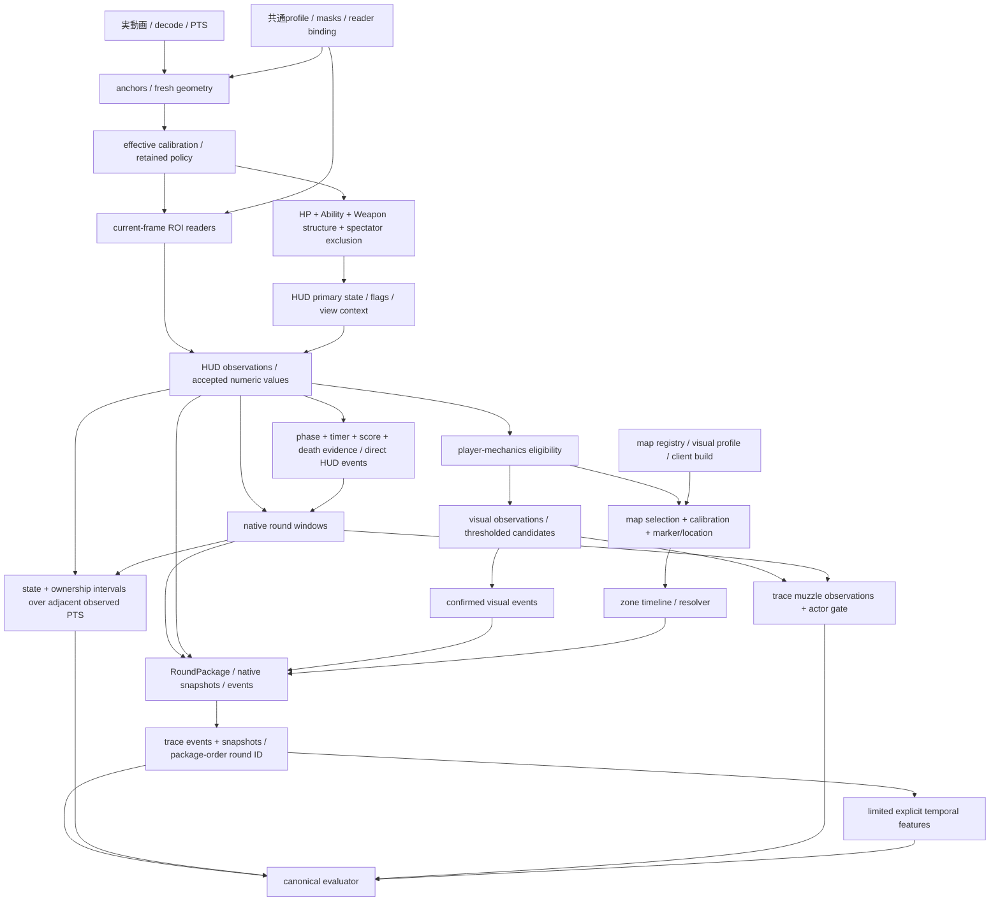

# E2E failure analysis

> Latest native-source follow-up: every native frame in two explicit preparation windows is now verified (60frames). Source-crop review after predictions:54correct displayed strings/6unknown/0wrong; this is development evidence, not independent clock/continuity qualification. R1 genuinely displays `0:00→2:25→1:39`, and R2 lacks enough same-segment preparation. Both start simulations remain0 even at native source cadence. Denser input and phase latching alone are therefore insufficient; next separate display reading from clock temporal qualification and source-safe phase context. A prior58-frame cohort failed the new probe-coverage audit and is excluded from continuous acceptance. No production thresholds/GT/sampler or canonical status changed. New16tests/Ruff/mypy100 pass; no unnecessary full run. [Detailed source findings](../e2e_reports/match_001/native_global_preparation_diagnostics.json).

> Latest qualified-source contract follow-up: the opt-in analyzer prevents external signals from replacing source phase/result/continuity evidence or measured reader confidence. The lifecycle requires segment-local phase samples spanning the existing0.05sec minimum; older semantic PTS cannot supply that duration. Before-fix synthetic controls reproduce4proof overwrites and1short-duration start, all rejected after the fix. Related183tests/Ruff/mypy100 pass. Actual-image optimistic projection remains0starts over263samples with identical continuity outcomes. This fixes unsafe contracts, not real boundary coverage; canonical23/55/4 remains historical, with no new measurement or PASS gain. Next inspect contiguous native source support between saved analysis PTS. [Current measurements and remaining blockers](../e2e_reports/match_001/global_source_contract_diagnostics.json).

> Authorized global lifecycle implementation: the user approved qualified identity-independent system events and assertion-fixed numeric development. A profile/code-bound qualification gate and independently attested continuity now guard the opt-in start/end path; native package/trace integration preserves unknown player identity and no self ownership in synthetic tests. Related159 tests, Ruff and mypy pass. No real qualified input profile or runtime continuity producer exists yet; fresh full results and PASS gains remain unmeasured. See [current contract](global_round_start_contract.md) and [implementation verification](../e2e_reports/match_001/global_lifecycle_implementation_diagnostics.json).

> Dense R1 end follow-up: ten consecutive source frames at 74.36–74.52 reveal a one-frame `TEAM ACE` banner at 74.436003, absent from archived full-native PTS but present in an older targeted input. This is a source evidence/transport and corroboration problem, not proven absence of end evidence in the video. Timer/score update after this frame; continuity, safe readers and temporal corroboration remain unqualified. No production or sampler change, new candidate or canonical PASS. See [source diagnostic](../e2e_reports/match_001/r1_end_dense_source_diagnostics.json).

> Legacy contract compatibility: current native builder and trace adapter reproduce the archived profile13 (4634 observations, 37.824 s) and rejected profile16 (4661 observations, 43.489 s) packages, traces and all 82 assertion outcomes exactly. Counts remain 23/55/4, all deltas zero. This is offline reconstruction of archived inputs, not fresh recognition/full E2E or safety qualification of the new phase/display paths. Both traces have zero temporal features, so unchanged discontinuity results are not affirmative cut-safety evidence. See [machine-readable verification](../e2e_reports/match_001/legacy_contract_compatibility.json).

> Global start contract diagnostic: fresh image replay supports diagnostic start proposals at 4.152669 and 111.436003 from independently confirmed phase, timer reset and later strong timer observations, while all 19 primary states remain unknown. Current production still emits zero events because it requires player-live identity and immediate timer availability. Proposals remain outside production/package/trace evaluation; the borrowed existing timer reader belongs to still-rejected profile16. Numeric configuration alone is therefore insufficient. The global system-event contract decision is pending; no assertion status changes. See [proposal and source limits](global_round_start_contract.md).

> Source timer-display follow-up: the reader→HUD→native snapshot→trace path now preserves accepted source text and provenance through optional typed fields; it does not format seconds as text. A diagnostic-only real replay with the still-rejected profile16 verifies `0:33` transport at PTS 70.402669. This fixes a transport gap, not timer qualification or the four display-dependent assertion predicates. No new full result or PASS gain is claimed. See [contract and limits](timer_display_contract.md).

> Latest lifecycle contract follow-up: source-qualified global purchase-phase confidence now reaches the direct start-candidate gate and `pre_round` lifecycle state while player HUD confidence remains zero. Real short-window replay confirms preparation at 3.902669 and 111.352669; accepted boundary timers/live evidence remain missing, so no boundary or canonical PASS is claimed. Fresh targeted remains 0/5/2 and sampled 7/12/11 with unchanged failure sets. Details and current safety limits: [implementation](round_lifecycle_implementation.md), [diagnostics](../e2e_reports/match_001/lifecycle_preparation_confidence_diagnostics.json). The 82 assertion matrix below remains the historical full result, not an evaluation of this working tree.

> Current phase-contract follow-up: the structural text profile and temporal phase tracker produce 64 confirmed global purchase-phase flags on all 224 native frames in 0–9 seconds. The native package remains a partial fragment `[7.369336, 8.502669]`, with no start/end events. Qualified preparation extends an actual detected round's context; it cannot create a missing start. The earlier hypothesis that phase confidence alone would resolve package scope is rejected. Canonical 23/55/4 and all 82 historical assertion classifications remain unchanged. See [phase qualification](phase_reference_qualification.md) and [native package diagnostics](../e2e_reports/match_001/semantic_phase_contract_diagnostics.json).

> Post-analysis follow-up (2026-10-08, main `8e3cf32`): the match lifecycle actor contract is now consistently `system`, with conservative lifecycle/package/trace unit coverage. The historical report below describes the earlier full run; its actor mismatch is no longer an unresolved code-contract gap. Real boundaries remain unqualified and no additional canonical PASS is proven. [Purchase-phase reference qualification](phase_reference_qualification.md) subsequently verified 11 semantic matches over 18 native boundary-window frames, with unchanged unknown states, no accepted score/timer pairs and zero boundary events. This diagnostic profile is not adopted; the 23/55/4 classification and 29 package-scope failures remain authoritative until a new canonical evaluation proves otherwise.

## 1. Executive Summary

**最大の最初の阻害条件はround packageの範囲・所属で、29/55 FAIL（52.73%）です。** 25件はround2の出力がすべて`sample_round_1`に入ること、4件は最初のpackage開始より前のR1 snapshot／derived zoneに対応します。直接のround境界4件を合わせると33件に影響しますが、33件のPASS増加を意味しません。

次に1つだけ着手するなら、**round lifecycleの縦断契約（phase/境界の実画像証拠→native package→traceのactor・round所属）を完成させる**ことです。真の開始2回・終了1回を検出し、actor/time/countを満たす場合、6 FAILと1 NEがPASSになり、**23→30 PASS／49 FAIL／3 NE**が条件付き目標になります。現時点で保証できる実runの増加は0です。round IDだけの照合条件を一時的に外した論理感度診断ではR2の25件がすべて残り、単なるrelabelでは23 PASSのままです。

停滞はrecognizer精度だけではありません。package／snapshotの上流gateと、検出結果を必要なフィールドへ運ぶ未完成の契約が混在しています。11の失敗snapshotは現行producer／adapterにない明示フィールドを要求します。timerの数字を読み取れても、元の表示文字列を保持する経路がないため4 snapshotは通りません。round detectorはactor=`team`、packは`system`を要求し、deathの要求属性も現在の出力にありません。

fresh geometry=1は重大な観測上の弱点ですが、effective geometryは4661/4661で有効、geometry-invalid unknownは0です。現在の55件から**geometryが単独原因と証明できるFAILは0件**です。「影響がない」という意味ではありません。保持calibrationの実画像上の位置誤差と、失敗への因果寄与は未証明です。

round／event／mapのコードパスは呼ばれています。roundはphase・state・score等の証拠不足、eventは属性・ownership・閾値を満たす入力不足、mapは選択／profile不足とeligibility不足です。rawのdomain eventは0ですがtraceには262の`state_snapshot` eventと4のactor不明muzzle observationがあります。

candidate方式は廃止せず、**実装すべき契約と解消対象IDを先に固定する方式へ変更**します。未完成producerを埋めずに数値recognizer候補を増やす方式は止めます。

## 2. Current E2E status

分析開始時に`git fetch origin`、`git checkout main`、`git pull --ff-only`を実行し、開始SHAは`d6d7e5188b9b51c0d8dba2b8afd16b0e9ffa32a1`、origin/mainと一致しました。既存の未コミット`docs/pi_recognition_improvement.md`は保持しています。

最新の正常**処理完了**fullは`outputs/recognition-investigation/timer-only-profile15/full16`、開始2026-10-07 13:19:14 UTC、wall15149.129秒（4時間12分29秒）、4661 analyzed framesです。23 PASS /55 FAIL /4 NE、schema valid、error_code=null、native analyzer exit0、canonical evaluator exit1（既存FAIL）です。処理完了は精度合格を意味しません。profile16はtimer誤読3件で却下済みで、採用していません。採用可能な比較profile13も23/55/4で、82 statusは同じです。

歴史的run metadataは`e05c495…`のdirty tree、code fingerprint`22defc36…`です。最新clean mainのfullを今回新規に走らせたとは扱いません。最新mainのHUD／round／map／visual／E2E producerソースは検証済みcommit3d0dc37から変更されていないことをGit差分で確認しました。後続mainのobservability更新を含む全code fingerprintは一致しません。

入力video SHA256：`71d58558559d6f578433ce9f234bf176f76fd5a86657dbfe3eba1e7d36136b06`。pack fingerprint：`7f0b7798857670f08074adbeea73d24176967ad5bf1f2f7300d2c2f792cf956f`。assertions SHA256：`c5e242b611ce227d1d2633e5e24c00dfe65168d8124ab58fbdea84b1d7f0d820`。terminal raw／trace／evaluation hashを照合し、最新mainのcanonical evaluatorで保存traceを再評価して全82 status／全failure codeの一致を確認しました。history／summaryもこの終了runを記録しています。artifact source hashはJSONにあります。

| 指標 | 値 |
| --- | ---: |
| unknown / live / buy menu / spectator | 3731 /455 /301 /174 |
| identity不足（positive count<3） | 3771 |
| HP / Ability / Weapon identity missing | 794 /2318 /2610 |
| fresh / effective / retained geometry | 1 /4661 /4660 |
| native package | 1、境界未完了fragment |
| round start / end / raw HUD events / raw Visual events | 0 /0 /0 /0 |
| map resolved / held | 0 /0 |
| trace events / snapshots / visual observations | 262 /930 /4 |
| negative violations / discontinuity violations | 0 /0 |

## 3. 82 assertion matrix

この一覧のprimary rootは**最初に観測した阻害条件を一つ選んだ排他的分類**です。下流機能が実装済みと保証する分類ではありません。複数の実装欠落・recognition gateはJSONのsecondary_blockers／upstream_dependenciesと次章に残しています。NE4件はground truth欠落ではなく、必須point eventがないためorderingを評価できません。

| Assertion | Status | Category | Primary root | Direct / Upstream | Fix target |
| --- | --- | --- | --- | --- | --- |
| GT-R1-ROUND-START | FAIL | round start/end | C03 | direct | round phase evidence and temporal lifecycle |
| GT-R1-DEATH | FAIL | kill/death/combat event | C05 | direct | current-frame death evidence plus semantic attribute producer |
| GT-R1-ROUND-END | FAIL | round start/end | C03 | direct | round phase evidence and temporal lifecycle |
| GT-R2-ROUND-START | FAIL | round package | C01 | upstream | round lifecycle / package context / adapter association |
| GT-R2-DEATH | FAIL | round package | C01 | upstream | round lifecycle / package context / adapter association |
| ordering_constraints-000 | NE | evaluator / ordering upstream | point dependency | upstream | point event producers |
| ordering_constraints-001 | NE | evaluator / ordering upstream | point dependency | upstream | point event producers |
| ordering_constraints-002 | NE | evaluator / ordering upstream | point dependency | upstream | point event producers |
| ordering_constraints-003 | NE | evaluator / ordering upstream | point dependency | upstream | point event producers |
| GT-R1-BUY-FLAG | FAIL | buy phase | C08 | direct | qualified phase evidence and stable score inputs |
| GT-R1-ASTRAL-1 | FAIL | remote state | C06 | direct | Astra compound current-frame evidence |
| GT-R1-ASTRAL-2 | FAIL | remote state | C06 | direct | Astra compound current-frame evidence |
| GT-R1-SMOKE | FAIL | smoke state | C09 | direct | smoke structural/temporal evidence |
| GT-R1-COMBAT-REPORT | PASS | combat report | — | - | 維持・回帰保護 |
| GT-R2-BUY-FLAG | FAIL | round package | C01 | upstream | round lifecycle / package context / adapter association |
| GT-R2-BUY-MENU-1 | FAIL | round package | C01 | upstream | round lifecycle / package context / adapter association |
| GT-R2-BUY-MENU-2 | FAIL | round package | C01 | upstream | round lifecycle / package context / adapter association |
| GT-R2-ASTRAL-1 | FAIL | round package | C01 | upstream | round lifecycle / package context / adapter association |
| GT-R2-ASTRAL-2 | FAIL | round package | C01 | upstream | round lifecycle / package context / adapter association |
| GT-R2-EXPANDED-MAP | FAIL | round package | C01 | upstream | round lifecycle / package context / adapter association |
| GT-R2-SPECTATOR | FAIL | round package | C01 | upstream | round lifecycle / package context / adapter association |
| OWN-R1-SELF | FAIL | live identity | C10 | direct | independent current-frame identity and view ownership coverage |
| OWN-R1-SELF-DEAD | FAIL | ownership | C11 | direct | death ownership contract producer and adapter |
| OWN-R2-SELF | FAIL | round package | C01 | upstream | round lifecycle / package context / adapter association |
| OWN-R2-SELF-DEAD | FAIL | round package | C01 | upstream | round lifecycle / package context / adapter association |
| OWN-R2-TEAMMATE | FAIL | round package | C01 | upstream | round lifecycle / package context / adapter association |
| GT-R1-SNAP-0035 | FAIL | round package | C01 | upstream | round lifecycle / package context / adapter association |
| GT-R1-SNAP-0415 | FAIL | round package | C01 | upstream | round lifecycle / package context / adapter association |
| GT-R1-SNAP-475 | FAIL | killfeed / snapshot | C12 | direct | nonself killfeed visibility evidence and trace export |
| GT-R1-SNAP-585 | FAIL | snapshot | C02 | upstream | correct state/identity evidence and snapshot admission contract |
| GT-R1-SNAP-595 | FAIL | snapshot | C02 | upstream | correct state/identity evidence and snapshot admission contract |
| GT-R1-SNAP-705 | PASS | snapshot | — | - | 維持・回帰保護 |
| GT-R1-SNAP-728 | FAIL | snapshot | C02 | upstream | correct state/identity evidence and snapshot admission contract |
| GT-R1-SNAP-733 | FAIL | temporal context | C07 | upstream | temporal input coverage diagnosis under unchanged full sampler |
| GT-R1-SNAP-734 | FAIL | snapshot | C02 | upstream | correct state/identity evidence and snapshot admission contract |
| GT-R1-SNAP-7425 | FAIL | snapshot | C02 | upstream | correct state/identity evidence and snapshot admission contract |
| GT-R1-SNAP-7438 | FAIL | snapshot | C02 | upstream | correct state/identity evidence and snapshot admission contract |
| GT-R1-SNAP-7440 | FAIL | snapshot | C02 | upstream | correct state/identity evidence and snapshot admission contract |
| GT-R1-SNAP-7445 | FAIL | temporal context | C07 | upstream | temporal input coverage diagnosis under unchanged full sampler |
| GT-R2-SNAP-820 | FAIL | round package | C01 | upstream | round lifecycle / package context / adapter association |
| GT-R2-SNAP-1050 | FAIL | round package | C01 | upstream | round lifecycle / package context / adapter association |
| GT-R2-SNAP-11145 | FAIL | round package | C01 | upstream | round lifecycle / package context / adapter association |
| GT-R2-SNAP-143 | FAIL | round package | C01 | upstream | round lifecycle / package context / adapter association |
| GT-R2-SNAP-1475 | FAIL | round package | C01 | upstream | round lifecycle / package context / adapter association |
| GT-R2-SNAP-1476 | FAIL | round package | C01 | upstream | round lifecycle / package context / adapter association |
| GT-R2-SNAP-1477 | FAIL | round package | C01 | upstream | round lifecycle / package context / adapter association |
| GT-R2-SNAP-149 | FAIL | round package | C01 | upstream | round lifecycle / package context / adapter association |
| GT-R2-SNAP-151 | FAIL | round package | C01 | upstream | round lifecycle / package context / adapter association |
| GT-R2-SNAP-170 | FAIL | round package | C01 | upstream | round lifecycle / package context / adapter association |
| GT-R1-SNAP-0035-DERIVED-zone_id | FAIL | round package | C01 | upstream | round lifecycle / package context / adapter association |
| GT-R1-SNAP-0415-DERIVED-zone_id | FAIL | round package | C01 | upstream | round lifecycle / package context / adapter association |
| GT-R2-SNAP-820-DERIVED-zone_id | FAIL | round package | C01 | upstream | round lifecycle / package context / adapter association |
| GT-R1-MUZZLE-1 | FAIL | visual event | C04 | upstream | owned HUD/weapon evidence plus visual observation producer |
| GT-R1-MUZZLE-2 | FAIL | visual event | C04 | upstream | owned HUD/weapon evidence plus visual observation producer |
| GT-R1-MUZZLE-3 | FAIL | visual event | C04 | upstream | owned HUD/weapon evidence plus visual observation producer |
| event_count_constraints-000 | FAIL | round start/end | C03 | direct | round phase evidence and temporal lifecycle |
| event_count_constraints-001 | FAIL | kill/death/combat event | C05 | direct | current-frame death evidence plus semantic attribute producer |
| event_count_constraints-002 | FAIL | round start/end | C03 | direct | round phase evidence and temporal lifecycle |
| event_count_constraints-003 | FAIL | event detection | C13 | upstream | qualified shot inputs and event aggregation |
| event_count_constraints-004 | FAIL | round package | C01 | upstream | round lifecycle / package context / adapter association |
| event_count_constraints-005 | FAIL | round package | C01 | upstream | round lifecycle / package context / adapter association |
| event_count_constraints-006 | PASS | round end | — | - | 維持・回帰保護 |
| NEG-REMOTE-R1A | PASS | safety / negative assertion | — | - | 維持・回帰保護 |
| NEG-REMOTE-R1B | PASS | safety / negative assertion | — | - | 維持・回帰保護 |
| NEG-REMOTE-R2A | PASS | safety / negative assertion | — | - | 維持・回帰保護 |
| NEG-REMOTE-R2B | PASS | safety / negative assertion | — | - | 維持・回帰保護 |
| NEG-ASTRAL-NOT-SMOKE | PASS | safety / negative assertion | — | - | 維持・回帰保護 |
| NEG-SMOKE-NOT-ASTRAL | PASS | safety / negative assertion | — | - | 維持・回帰保護 |
| NEG-SMOKE-WORLD-SPOT | PASS | safety / negative assertion | — | - | 維持・回帰保護 |
| NEG-NONSELF-KILLFEED | PASS | safety / negative assertion | — | - | 維持・回帰保護 |
| NEG-RELOAD-NOT-SHOT | PASS | safety / negative assertion | — | - | 維持・回帰保護 |
| NEG-BUY-MENU-1 | PASS | safety / negative assertion | — | - | 維持・回帰保護 |
| NEG-BUY-MENU-2 | PASS | safety / negative assertion | — | - | 維持・回帰保護 |
| NEG-SPECTATOR-COUNT-TEXT | PASS | safety / negative assertion | — | - | 維持・回帰保護 |
| NEG-DEAD-PLAYER-MECHANICS | PASS | safety / negative assertion | — | - | 維持・回帰保護 |
| NEG-EXPANDED-MAP-MECHANICS | PASS | safety / negative assertion | — | - | 維持・回帰保護 |
| NEG-SPECTATOR-POISON-151 | PASS | safety / negative assertion | — | - | 維持・回帰保護 |
| NEG-SPECTATOR-POISON-170 | PASS | safety / negative assertion | — | - | 維持・回帰保護 |
| NEG-STALE-COMBAT-REPORT | PASS | safety / negative assertion | — | - | 維持・回帰保護 |
| NEG-R2-NO-ROUND-END | PASS | safety / negative assertion | — | - | 維持・回帰保護 |
| NEG-SAME-ZONE-CALLOUT-CHANGE | PASS | safety / negative assertion | — | - | 維持・回帰保護 |
| NEG-CONTENT-JUMP-SPAN | PASS | safety / negative assertion | — | - | 維持・回帰保護 |

## 4. 55 FAIL classification

expectedはpackの定義そのままです。actualの`missing`はフィールド不在でありnull／falseと同一視しません。元の全定義とactualの詳細は`e2e_reports/match_001/failure_analysis.json`に保存しました。各行の同一原因ID、実装状態、fix targetはgroup headingに共通です。各FAILのPASS確度はpossible（全predicateを満たす実画像証拠が必要）、無条件guaranteed増加は0です。

### C01: round_package_scope（29件）

Category: round package。実装状態: upstream依存。Fix target: round lifecycle / package context / adapter association。

1 partial package [7.369336,171.002669] mapped exclusively to sample_round_1; no sample_round_2; pre-window R1 observations excluded。

| Assertion / 目的 / PTS・範囲 | expected | actual / failure field・reason | upstream / 追加条件 |
| --- | --- | --- | --- |
| GT-R2-ROUND-START round_start [111.38000000000001,111.5] | `{"id":"GT-R2-ROUND-START","round_id":"sample_round_2","type":"round_start","actor":"system","acceptance_window":[111.38000000000001,111.5],"facts":{"score_before":"0-2"},"required_event_attributes":{}}` | {"matching_type_actor_time_count":0} fields: event.round_start missing_point:GT-R2-ROUND-START | round_boundary, round_package_scope missing_point; event_actor_contract |
| GT-R2-DEATH player_death [147.57,147.75] | `{"id":"GT-R2-DEATH","round_id":"sample_round_2","type":"player_death","actor":"player","acceptance_window":[147.57,147.75],"facts":{"victim_name":"sharkman","killer_agent":"Fade","combat_report_damage_received":194},"required_event_attributes":{"victim_name":"sharkman","killer_agent":"Fade","combat_report_damage_received":194}}` | {"matching_type_actor_time_count":0} fields: event.player_death missing_point:GT-R2-DEATH | current_frame_death_evidence, death_attributes, round_package_scope missing_point; event_attribute_contract |
| GT-R2-BUY-FLAG buy_phase_banner [82.0,111.4] | `{"id":"GT-R2-BUY-FLAG","round_id":"sample_round_2","state_class":"flag","state":"buy_phase_banner","subtype":null,"core_interval":[82.0,111.4],"outer_interval":[81.5,111.45],"min_core_coverage":0.9,"exhaustive":false}` | coverage=0.00000 / required=0.9; round-neutral=0.00000 fields: coverage.buy_phase_banner state_coverage:GT-R2-BUY-FLAG | state_evidence, round_package_scope state_coverage |
| GT-R2-BUY-MENU-1 buy_menu_open [83.352669,91.402669] | `{"id":"GT-R2-BUY-MENU-1","round_id":"sample_round_2","state_class":"primary_state","state":"buy_menu_open","subtype":null,"core_interval":[83.352669,91.402669],"outer_interval":[83.252669,91.452669],"min_core_coverage":0.9,"exhaustive":true,"edge_brackets":{"start":{"last_absent_sec":83.252669,"first_present_sec":83.352669},"end":{"last_present_sec":91.402669,"first_absent_sec":91.452669}}}` | coverage=0.00000 / required=0.9; round-neutral=0.99172 fields: coverage.buy_menu_open state_coverage:GT-R2-BUY-MENU-1 | state_evidence, round_package_scope state_overreach,state_start_edge,state_end_edge |
| GT-R2-BUY-MENU-2 buy_menu_open [108.052669,110.802669] | `{"id":"GT-R2-BUY-MENU-2","round_id":"sample_round_2","state_class":"primary_state","state":"buy_menu_open","subtype":null,"core_interval":[108.052669,110.802669],"outer_interval":[107.952669,110.852669],"min_core_coverage":0.9,"exhaustive":true,"edge_brackets":{"start":{"last_absent_sec":107.952669,"first_present_sec":108.052669},"end":{"last_present_sec":110.802669,"first_absent_sec":110.852669}}}` | coverage=0.00000 / required=0.9; round-neutral=0.56970 fields: coverage.buy_menu_open state_coverage:GT-R2-BUY-MENU-2 | state_evidence, round_package_scope state_coverage,state_start_edge,state_end_edge |
| GT-R2-ASTRAL-1 remote_control_view [111.302669,112.402669] | `{"id":"GT-R2-ASTRAL-1","round_id":"sample_round_2","state_class":"primary_state","state":"remote_control_view","subtype":"astra_astral","core_interval":[111.302669,112.402669],"outer_interval":[111.102669,112.502669],"min_core_coverage":0.9,"exhaustive":true,"edge_brackets":{"start":{"last_absent_sec":111.102669,"first_present_sec":111.302669},"end":{"last_present_sec":112.402669,"first_absent_sec":112.502669}}}` | coverage=0.00000 / required=0.9; round-neutral=0.00000 fields: coverage.remote_control_view state_coverage:GT-R2-ASTRAL-1 | state_evidence, round_package_scope state_coverage |
| GT-R2-ASTRAL-2 remote_control_view [115.602669,120.102669] | `{"id":"GT-R2-ASTRAL-2","round_id":"sample_round_2","state_class":"primary_state","state":"remote_control_view","subtype":"astra_astral","core_interval":[115.602669,120.102669],"outer_interval":[115.502669,120.202669],"min_core_coverage":0.9,"exhaustive":true,"edge_brackets":{"start":{"last_absent_sec":115.502669,"first_present_sec":115.602669},"end":{"last_present_sec":120.102669,"first_absent_sec":120.202669}}}` | coverage=0.00000 / required=0.9; round-neutral=0.00000 fields: coverage.remote_control_view state_coverage:GT-R2-ASTRAL-2 | state_evidence, round_package_scope state_coverage |
| GT-R2-EXPANDED-MAP expanded_tactical_map [149.0,150.5] | `{"id":"GT-R2-EXPANDED-MAP","round_id":"sample_round_2","state_class":"primary_state","state":"expanded_tactical_map","subtype":null,"core_interval":[149.0,150.5],"outer_interval":[148.8,150.8],"min_core_coverage":0.7,"exhaustive":true}` | coverage=0.00000 / required=0.7; round-neutral=0.00000 fields: coverage.expanded_tactical_map state_coverage:GT-R2-EXPANDED-MAP | state_evidence, round_package_scope state_coverage |
| GT-R2-SPECTATOR spectator_first_person [151.0,171.0] | `{"id":"GT-R2-SPECTATOR","round_id":"sample_round_2","state_class":"primary_state","state":"spectator_first_person","subtype":null,"core_interval":[151.0,171.0],"outer_interval":[150.5,171.019336],"min_core_coverage":0.9,"exhaustive":true}` | coverage=0.00000 / required=0.9; round-neutral=0.29167 fields: coverage.spectator_first_person state_coverage:GT-R2-SPECTATOR | state_evidence, round_package_scope state_coverage |
| OWN-R2-SELF self [82.0,147.6] | `{"id":"OWN-R2-SELF","round_id":"sample_round_2","owner":"self","core_interval":[82.0,147.6],"outer_interval":[81.5,147.7],"min_core_coverage":0.9}` | coverage=0.00000 / required=0.9; round-neutral=0.05462 fields: coverage.self ownership_coverage:OWN-R2-SELF | state_evidence, round_package_scope ownership_coverage; ownership_contract |
| OWN-R2-SELF-DEAD self_dead_ui [147.7,150.0] | `{"id":"OWN-R2-SELF-DEAD","round_id":"sample_round_2","owner":"self_dead_ui","core_interval":[147.7,150.0],"outer_interval":[147.7,150.5],"min_core_coverage":0.9}` | coverage=0.00000 / required=0.9; round-neutral=0.00000 fields: coverage.self_dead_ui ownership_coverage:OWN-R2-SELF-DEAD | state_evidence, round_package_scope ownership_coverage; ownership_contract |
| OWN-R2-TEAMMATE teammate_spectated [150.5,171.0] | `{"id":"OWN-R2-TEAMMATE","round_id":"sample_round_2","owner":"teammate_spectated","core_interval":[150.5,171.0],"outer_interval":[150.0,171.019336],"min_core_coverage":0.9}` | coverage=0.00000 / required=0.9; round-neutral=0.28455 fields: coverage.teammate_spectated ownership_coverage:OWN-R2-TEAMMATE | state_evidence, round_package_scope ownership_coverage; ownership_contract |
| GT-R1-SNAP-0035 required_snapshots 3.5 ±0.05 | `{"primary_state":"live_first_person","buy_phase_banner":true,"player_alive":true,"location_label_raw":"A ロビー"}` | snapshot candidates=0; fields={"primary_state":{"present":false,"value":null},"buy_phase_banner":{"present":false,"value":null},"player_alive":{"present":false,"value":null},"location_label_raw":{"present":false,"value":null}}; native samples=2 / qualified=0 fields: primary_state, buy_phase_banner, player_alive, location_label_raw missing_snapshot:GT-R1-SNAP-0035 | round_package_scope, hud_confidence_gate, snapshot_materialization, primary_state, buy_phase_banner, player_alive, location_label_raw  |
| GT-R1-SNAP-0415 required_snapshots 4.15 ±0.05 | `{"primary_state":"live_first_person","buy_phase_banner":false,"player_alive":true,"score_player":0,"score_enemy":1,"game_timer_display":"1:39","location_label_raw":"A メイン"}` | snapshot candidates=0; fields={"primary_state":{"present":false,"value":null},"buy_phase_banner":{"present":false,"value":null},"player_alive":{"present":false,"value":null},"score_player":{"present":false,"value":null},"score_enemy":{"present":false,"value":null},"game_timer_display":{"present":false,"value":null},"location_label_raw":{"present":false,"value":null}}; native samples=2 / qualified=0 fields: primary_state, buy_phase_banner, player_alive, score_player, score_enemy, game_timer_display, location_label_raw missing_snapshot:GT-R1-SNAP-0415 | round_package_scope, hud_confidence_gate, snapshot_materialization, primary_state, buy_phase_banner, player_alive, score_player, score_enemy, game_timer_display, location_label_raw missing_trace_fields |
| GT-R2-SNAP-820 required_snapshots 82.0 ±0.1 | `{"primary_state":"live_first_person","buy_phase_banner":true,"player_alive":true,"player_hp":100,"location_label_raw":"アタック側スポーン","combat_report_visible":true}` | snapshot candidates=0; fields={"primary_state":{"present":false,"value":null},"buy_phase_banner":{"present":false,"value":null},"player_alive":{"present":false,"value":null},"player_hp":{"present":false,"value":null},"location_label_raw":{"present":false,"value":null},"combat_report_visible":{"present":false,"value":null}}; native samples=1 / qualified=0 fields: primary_state, buy_phase_banner, player_alive, player_hp, location_label_raw, combat_report_visible missing_snapshot:GT-R2-SNAP-820 | round_package_scope, hud_confidence_gate, snapshot_materialization, primary_state, buy_phase_banner, player_alive, player_hp, location_label_raw, combat_report_visible missing_snapshot |
| GT-R2-SNAP-1050 required_snapshots 105.0 ±0.1 | `{"primary_state":"live_first_person","buy_phase_banner":true,"player_alive":true,"combat_report_visible":true}` | snapshot candidates=0; fields={"primary_state":{"present":false,"value":null},"buy_phase_banner":{"present":false,"value":null},"player_alive":{"present":false,"value":null},"combat_report_visible":{"present":false,"value":null}}; native samples=4 / qualified=0 fields: primary_state, buy_phase_banner, player_alive, combat_report_visible missing_snapshot:GT-R2-SNAP-1050 | round_package_scope, hud_confidence_gate, snapshot_materialization, primary_state, buy_phase_banner, player_alive, combat_report_visible missing_snapshot |
| GT-R2-SNAP-11145 required_snapshots 111.45 ±0.05 | `{"buy_phase_banner":false,"player_alive":true,"score_player":0,"score_enemy":2,"game_timer_display":"1:40"}` | snapshot candidates=0; fields={"buy_phase_banner":{"present":false,"value":null},"player_alive":{"present":false,"value":null},"score_player":{"present":false,"value":null},"score_enemy":{"present":false,"value":null},"game_timer_display":{"present":false,"value":null}}; native samples=2 / qualified=0 fields: buy_phase_banner, player_alive, score_player, score_enemy, game_timer_display missing_snapshot:GT-R2-SNAP-11145 | round_package_scope, hud_confidence_gate, snapshot_materialization, buy_phase_banner, player_alive, score_player, score_enemy, game_timer_display missing_snapshot; missing_trace_fields |
| GT-R2-SNAP-143 required_snapshots 143.0 ±0.1 | `{"primary_state":"live_first_person","player_alive":true,"player_hp":80}` | snapshot candidates=0; fields={"primary_state":{"present":false,"value":null},"player_alive":{"present":false,"value":null},"player_hp":{"present":false,"value":null}}; native samples=6 / qualified=0 fields: primary_state, player_alive, player_hp missing_snapshot:GT-R2-SNAP-143 | round_package_scope, hud_confidence_gate, snapshot_materialization, primary_state, player_alive, player_hp missing_snapshot |
| GT-R2-SNAP-1475 required_snapshots 147.5 ±0.05 | `{"primary_state":"live_first_person","player_alive":true,"player_hp":80}` | snapshot candidates=0; fields={"primary_state":{"present":false,"value":null},"player_alive":{"present":false,"value":null},"player_hp":{"present":false,"value":null}}; native samples=2 / qualified=0 fields: primary_state, player_alive, player_hp missing_snapshot:GT-R2-SNAP-1475 | round_package_scope, hud_confidence_gate, snapshot_materialization, primary_state, player_alive, player_hp missing_snapshot |
| GT-R2-SNAP-1476 required_snapshots 147.6 ±0.05 | `{"primary_state":"live_first_person","player_alive":true,"player_hp":22}` | snapshot candidates=0; fields={"primary_state":{"present":false,"value":null},"player_alive":{"present":false,"value":null},"player_hp":{"present":false,"value":null}}; native samples=3 / qualified=0 fields: primary_state, player_alive, player_hp missing_snapshot:GT-R2-SNAP-1476 | round_package_scope, hud_confidence_gate, snapshot_materialization, primary_state, player_alive, player_hp missing_snapshot |
| GT-R2-SNAP-1477 required_snapshots 147.7 ±0.05 | `{"player_alive":false,"combat_report_visible":true}` | snapshot candidates=0; fields={"player_alive":{"present":false,"value":null},"combat_report_visible":{"present":false,"value":null}}; native samples=1 / qualified=0 fields: player_alive, combat_report_visible missing_snapshot:GT-R2-SNAP-1477 | round_package_scope, hud_confidence_gate, snapshot_materialization, player_alive, combat_report_visible missing_snapshot |
| GT-R2-SNAP-149 required_snapshots 149.0 ±0.1 | `{"primary_state":"expanded_tactical_map","player_alive":false,"combat_report_visible":true}` | snapshot candidates=0; fields={"primary_state":{"present":false,"value":null},"player_alive":{"present":false,"value":null},"combat_report_visible":{"present":false,"value":null}}; native samples=2 / qualified=0 fields: primary_state, player_alive, combat_report_visible missing_snapshot:GT-R2-SNAP-149 | round_package_scope, hud_confidence_gate, snapshot_materialization, primary_state, player_alive, combat_report_visible missing_snapshot |
| GT-R2-SNAP-151 required_snapshots 151.0 ±0.1 | `{"primary_state":"spectator_first_person","player_alive":false,"view_owner":"teammate_spectated","spectated_name":"チェンバーのおチェンバー","spectated_hp":100,"spectated_ammo_mag":21,"spectated_ammo_reserve":50,"spectated_weapon":"Vandal","combat_report_visible":true,"spectated_location_label_raw":"中央ファウンテン"}` | snapshot candidates=0; fields={"primary_state":{"present":false,"value":null},"player_alive":{"present":false,"value":null},"view_owner":{"present":false,"value":null},"spectated_name":{"present":false,"value":null},"spectated_hp":{"present":false,"value":null},"spectated_ammo_mag":{"present":false,"value":null},"spectated_ammo_reserve":{"present":false,"value":null},"spectated_weapon":{"present":false,"value":null},"combat_report_visible":{"present":false,"value":null},"spectated_location_label_raw":{"present":false,"value":null}}; native samples=5 / qualified=0 fields: primary_state, player_alive, view_owner, spectated_name, spectated_hp, spectated_ammo_mag, spectated_ammo_reserve, spectated_weapon, combat_report_visible, spectated_location_label_raw missing_snapshot:GT-R2-SNAP-151 | round_package_scope, hud_confidence_gate, snapshot_materialization, primary_state, player_alive, view_owner, spectated_name, spectated_hp, spectated_ammo_mag, spectated_ammo_reserve, spectated_weapon, combat_report_visible, spectated_location_label_raw missing_snapshot; missing_trace_fields |
| GT-R2-SNAP-170 required_snapshots 170.0 ±0.1 | `{"primary_state":"spectator_first_person","player_alive":false,"view_owner":"teammate_spectated","spectated_name":"TRIGGER","spectated_hp":85,"spectated_ammo_mag":22,"spectated_ammo_reserve":31,"spectated_weapon":"Vandal","muzzle_flash_visible":true,"combat_report_visible":true,"spectated_location_label_raw":"Bメイン"}` | snapshot candidates=0; fields={"primary_state":{"present":false,"value":null},"player_alive":{"present":false,"value":null},"view_owner":{"present":false,"value":null},"spectated_name":{"present":false,"value":null},"spectated_hp":{"present":false,"value":null},"spectated_ammo_mag":{"present":false,"value":null},"spectated_ammo_reserve":{"present":false,"value":null},"spectated_weapon":{"present":false,"value":null},"muzzle_flash_visible":{"present":false,"value":null},"combat_report_visible":{"present":false,"value":null},"spectated_location_label_raw":{"present":false,"value":null}}; native samples=7 / qualified=6 fields: primary_state, player_alive, view_owner, spectated_name, spectated_hp, spectated_ammo_mag, spectated_ammo_reserve, spectated_weapon, muzzle_flash_visible, combat_report_visible, spectated_location_label_raw missing_snapshot:GT-R2-SNAP-170 | round_package_scope, hud_confidence_gate, snapshot_materialization, primary_state, player_alive, view_owner, spectated_name, spectated_hp, spectated_ammo_mag, spectated_ammo_reserve, spectated_weapon, muzzle_flash_visible, combat_report_visible, spectated_location_label_raw player_alive,spectated_name,spectated_hp,spectated_ammo_mag,spectated_ammo_reserve,spectated_weapon,muzzle_flash_visible,spectated_location_label_raw; missing_trace_fields |
| GT-R1-SNAP-0035-DERIVED-zone_id derived_assertions 3.5 ±0.05 | `"summit_a_approach"` | snapshot candidates=0; fields={"zone_id":{"present":false,"value":null}}; native samples=2 / qualified=0 fields: zone_id missing_derived_snapshot:GT-R1-SNAP-0035-DERIVED-zone_id | round_package_scope, hud_confidence_gate, snapshot_materialization, zone_id  |
| GT-R1-SNAP-0415-DERIVED-zone_id derived_assertions 4.15 ±0.05 | `"summit_a_approach"` | snapshot candidates=0; fields={"zone_id":{"present":false,"value":null}}; native samples=2 / qualified=0 fields: zone_id missing_derived_snapshot:GT-R1-SNAP-0415-DERIVED-zone_id | round_package_scope, hud_confidence_gate, snapshot_materialization, zone_id  |
| GT-R2-SNAP-820-DERIVED-zone_id derived_assertions 82.0 ±0.1 | `"summit_attacker_spawn"` | snapshot candidates=0; fields={"zone_id":{"present":false,"value":null}}; native samples=1 / qualified=0 fields: zone_id missing_derived_snapshot:GT-R2-SNAP-820-DERIVED-zone_id | round_package_scope, hud_confidence_gate, snapshot_materialization, zone_id missing_derived_snapshot |
| event_count_constraints-004 round_start sample_round_2全package | `{"type":"round_start","actor":"system","min":1,"max":1,"round_id":"sample_round_2"}` | {"count":0} fields: count.round_start count:sample_round_2:round_start | event_producer, round_package_scope count:round_start; event_actor_contract |
| event_count_constraints-005 player_death sample_round_2全package | `{"type":"player_death","actor":"player","min":1,"max":1,"round_id":"sample_round_2"}` | {"count":0} fields: count.player_death count:sample_round_2:player_death | event_producer, round_package_scope count:player_death; event_attribute_contract |

### C02: snapshot_hud_confidence（7件）

Category: snapshot。実装状態: upstream依存。Fix target: correct state/identity evidence and snapshot admission contract。

No HUD observation with hud_confidence>=0.65 inside assertion tolerance; builder admits none。

| Assertion / 目的 / PTS・範囲 | expected | actual / failure field・reason | upstream / 追加条件 |
| --- | --- | --- | --- |
| GT-R1-SNAP-585 required_snapshots 58.5 ±0.1 | `{"primary_state":"live_first_person","vision_obscured_smoke":false}` | snapshot candidates=0; fields={"primary_state":{"present":false,"value":null},"vision_obscured_smoke":{"present":false,"value":null}}; native samples=6 / qualified=0 fields: primary_state, vision_obscured_smoke missing_snapshot:GT-R1-SNAP-585 | round_package_scope, hud_confidence_gate, snapshot_materialization, primary_state, vision_obscured_smoke  |
| GT-R1-SNAP-595 required_snapshots 59.5 ±0.1 | `{"primary_state":"live_first_person","vision_obscured_smoke":true,"remote_control_subtype":null}` | snapshot candidates=0; fields={"primary_state":{"present":false,"value":null},"vision_obscured_smoke":{"present":false,"value":null},"remote_control_subtype":{"present":false,"value":null}}; native samples=10 / qualified=0 fields: primary_state, vision_obscured_smoke, remote_control_subtype missing_snapshot:GT-R1-SNAP-595 | round_package_scope, hud_confidence_gate, snapshot_materialization, primary_state, vision_obscured_smoke, remote_control_subtype  |
| GT-R1-SNAP-728 required_snapshots 72.8 ±0.08 | `{"primary_state":"live_first_person","player_alive":true,"ammo_mag":9,"ammo_reserve":36,"reload_animation_visible":true}` | snapshot candidates=0; fields={"primary_state":{"present":false,"value":null},"player_alive":{"present":false,"value":null},"ammo_mag":{"present":false,"value":null},"ammo_reserve":{"present":false,"value":null},"reload_animation_visible":{"present":false,"value":null}}; native samples=1 / qualified=0 fields: primary_state, player_alive, ammo_mag, ammo_reserve, reload_animation_visible missing_snapshot:GT-R1-SNAP-728 | round_package_scope, hud_confidence_gate, snapshot_materialization, primary_state, player_alive, ammo_mag, ammo_reserve, reload_animation_visible missing_trace_fields |
| GT-R1-SNAP-734 required_snapshots 73.4 ±0.08 | `{"primary_state":"live_first_person","player_alive":true,"ammo_mag":12,"ammo_reserve":33,"reload_animation_visible":false}` | snapshot candidates=0; fields={"primary_state":{"present":false,"value":null},"player_alive":{"present":false,"value":null},"ammo_mag":{"present":false,"value":null},"ammo_reserve":{"present":false,"value":null},"reload_animation_visible":{"present":false,"value":null}}; native samples=1 / qualified=0 fields: primary_state, player_alive, ammo_mag, ammo_reserve, reload_animation_visible missing_snapshot:GT-R1-SNAP-734 | round_package_scope, hud_confidence_gate, snapshot_materialization, primary_state, player_alive, ammo_mag, ammo_reserve, reload_animation_visible missing_trace_fields |
| GT-R1-SNAP-7425 required_snapshots 74.25 ±0.05 | `{"primary_state":"live_first_person","player_alive":true,"player_hp":48,"muzzle_flash_visible":true,"location_label_raw":"中央ファウンテン","spectator_primary_state":false}` | snapshot candidates=0; fields={"primary_state":{"present":false,"value":null},"player_alive":{"present":false,"value":null},"player_hp":{"present":false,"value":null},"muzzle_flash_visible":{"present":false,"value":null},"location_label_raw":{"present":false,"value":null},"spectator_primary_state":{"present":false,"value":null}}; native samples=2 / qualified=0 fields: primary_state, player_alive, player_hp, muzzle_flash_visible, location_label_raw, spectator_primary_state missing_snapshot:GT-R1-SNAP-7425 | round_package_scope, hud_confidence_gate, snapshot_materialization, primary_state, player_alive, player_hp, muzzle_flash_visible, location_label_raw, spectator_primary_state missing_trace_fields |
| GT-R1-SNAP-7438 required_snapshots 74.38 ±0.03 | `{"primary_state":"live_first_person","player_alive":true,"muzzle_flash_visible":true,"game_timer_display":"0:29","score_player":0,"score_enemy":1}` | snapshot candidates=0; fields={"primary_state":{"present":false,"value":null},"player_alive":{"present":false,"value":null},"muzzle_flash_visible":{"present":false,"value":null},"game_timer_display":{"present":false,"value":null},"score_player":{"present":false,"value":null},"score_enemy":{"present":false,"value":null}}; native samples=1 / qualified=0 fields: primary_state, player_alive, muzzle_flash_visible, game_timer_display, score_player, score_enemy missing_snapshot:GT-R1-SNAP-7438 | round_package_scope, hud_confidence_gate, snapshot_materialization, primary_state, player_alive, muzzle_flash_visible, game_timer_display, score_player, score_enemy missing_trace_fields |
| GT-R1-SNAP-7440 required_snapshots 74.4 ±0.03 | `{"player_alive":false,"combat_report_visible":true}` | snapshot candidates=0; fields={"player_alive":{"present":false,"value":null},"combat_report_visible":{"present":false,"value":null}}; native samples=1 / qualified=0 fields: player_alive, combat_report_visible missing_snapshot:GT-R1-SNAP-7440 | round_package_scope, hud_confidence_gate, snapshot_materialization, player_alive, combat_report_visible  |

### C03: round_boundary（4件）

Category: round start/end。実装状態: 部分実装。Fix target: round phase evidence and temporal lifecycle。

No round_start/end HUD events; missing banner/score context for temporal detector。

| Assertion / 目的 / PTS・範囲 | expected | actual / failure field・reason | upstream / 追加条件 |
| --- | --- | --- | --- |
| GT-R1-ROUND-START round_start [4.08,4.2] | `{"id":"GT-R1-ROUND-START","round_id":"sample_round_1","type":"round_start","actor":"system","acceptance_window":[4.08,4.2],"facts":{"score_before":"0-1"},"required_event_attributes":{}}` | {"matching_type_actor_time_count":0} fields: event.round_start missing_point:GT-R1-ROUND-START | round_boundary, round_package_scope event_actor_contract |
| GT-R1-ROUND-END round_end [74.387,74.483] | `{"id":"GT-R1-ROUND-END","round_id":"sample_round_1","type":"round_end","actor":"system","acceptance_window":[74.387,74.483],"facts":{"ace_team":"enemy","score_before":"0-1","score_after_confirmed_after_discontinuity":"0-2"},"required_event_attributes":{}}` | {"matching_type_actor_time_count":0} fields: event.round_end missing_point:GT-R1-ROUND-END | round_boundary, round_package_scope event_actor_contract |
| event_count_constraints-000 round_start sample_round_1全package | `{"type":"round_start","actor":"system","min":1,"max":1,"round_id":"sample_round_1"}` | {"count":0} fields: count.round_start count:sample_round_1:round_start | event_producer, round_package_scope event_actor_contract |
| event_count_constraints-002 round_end sample_round_1全package | `{"type":"round_end","actor":"system","min":1,"max":1,"round_id":"sample_round_1"}` | {"count":0} fields: count.round_end count:sample_round_1:round_end | event_producer, round_package_scope event_actor_contract |

### C04: weapon_visual_input_guard（3件）

Category: visual event。実装状態: upstream依存。Fix target: owned HUD/weapon evidence plus visual observation producer。

No eligible player muzzle observation in required time; HUD identity unknown and visual evidence insufficient。

| Assertion / 目的 / PTS・範囲 | expected | actual / failure field・reason | upstream / 追加条件 |
| --- | --- | --- | --- |
| GT-R1-MUZZLE-1 muzzle_flash 73.95 ±0.08 | `{"id":"GT-R1-MUZZLE-1","round_id":"sample_round_1","observation":"muzzle_flash","actor":"player","time_sec":73.95,"tolerance_sec":0.08}` | {"matching_count":0} fields: visual.muzzle_flash missing_visual_observation:GT-R1-MUZZLE-1 | player_mechanics_eligibility, weapon_visual_evidence, round_package_scope  |
| GT-R1-MUZZLE-2 muzzle_flash 74.25 ±0.08 | `{"id":"GT-R1-MUZZLE-2","round_id":"sample_round_1","observation":"muzzle_flash","actor":"player","time_sec":74.25,"tolerance_sec":0.08}` | {"matching_count":0} fields: visual.muzzle_flash missing_visual_observation:GT-R1-MUZZLE-2 | player_mechanics_eligibility, weapon_visual_evidence, round_package_scope  |
| GT-R1-MUZZLE-3 muzzle_flash 74.38 ±0.08 | `{"id":"GT-R1-MUZZLE-3","round_id":"sample_round_1","observation":"muzzle_flash","actor":"player","time_sec":74.38,"tolerance_sec":0.08}` | {"matching_count":0} fields: visual.muzzle_flash missing_visual_observation:GT-R1-MUZZLE-3 | player_mechanics_eligibility, weapon_visual_evidence, round_package_scope  |

### C05: player_death_semantics（2件）

Category: kill/death/combat event。実装状態: 部分実装。Fix target: current-frame death evidence plus semantic attribute producer。

No player_death event; death transition evidence and victim/killer/report attributes unavailable。

| Assertion / 目的 / PTS・範囲 | expected | actual / failure field・reason | upstream / 追加条件 |
| --- | --- | --- | --- |
| GT-R1-DEATH player_death [74.35,74.45] | `{"id":"GT-R1-DEATH","round_id":"sample_round_1","type":"player_death","actor":"player","acceptance_window":[74.35,74.45],"facts":{"victim_name":"sharkman","killer_agent":"Fade","combat_report_damage_received":130},"required_event_attributes":{"victim_name":"sharkman","killer_agent":"Fade","combat_report_damage_received":130}}` | {"matching_type_actor_time_count":0} fields: event.player_death missing_point:GT-R1-DEATH | current_frame_death_evidence, death_attributes, round_package_scope event_attribute_contract |
| event_count_constraints-001 player_death sample_round_1全package | `{"type":"player_death","actor":"player","min":1,"max":1,"round_id":"sample_round_1"}` | {"count":0} fields: count.player_death count:sample_round_1:player_death | event_producer, round_package_scope event_attribute_contract |

### C06: astra_evidence（2件）

Category: remote state。実装状態: 認識失敗。Fix target: Astra compound current-frame evidence。

remote_control_view/astra_astral absent; existing feature/classifier evidence not qualified。

| Assertion / 目的 / PTS・範囲 | expected | actual / failure field・reason | upstream / 追加条件 |
| --- | --- | --- | --- |
| GT-R1-ASTRAL-1 remote_control_view [10.202669,12.102669] | `{"id":"GT-R1-ASTRAL-1","round_id":"sample_round_1","state_class":"primary_state","state":"remote_control_view","subtype":"astra_astral","core_interval":[10.202669,12.102669],"outer_interval":[10.102669,12.202669],"min_core_coverage":0.9,"exhaustive":true,"edge_brackets":{"start":{"last_absent_sec":10.102669,"first_present_sec":10.202669},"end":{"last_present_sec":12.102669,"first_absent_sec":12.202669}}}` | coverage=0.00000 / required=0.9; round-neutral=0.00000 fields: coverage.remote_control_view state_coverage:GT-R1-ASTRAL-1 | state_evidence, round_package_scope  |
| GT-R1-ASTRAL-2 remote_control_view [16.502669,28.402669] | `{"id":"GT-R1-ASTRAL-2","round_id":"sample_round_1","state_class":"primary_state","state":"remote_control_view","subtype":"astra_astral","core_interval":[16.502669,28.402669],"outer_interval":[16.402669,28.502669],"min_core_coverage":0.9,"exhaustive":true,"edge_brackets":{"start":{"last_absent_sec":16.402669,"first_present_sec":16.502669},"end":{"last_present_sec":28.402669,"first_absent_sec":28.502669}}}` | coverage=0.00000 / required=0.9; round-neutral=0.00000 fields: coverage.remote_control_view state_coverage:GT-R1-ASTRAL-2 | state_evidence, round_package_scope  |

### C07: native_sample_tolerance（2件）

Category: temporal context。実装状態: upstream依存。Fix target: temporal input coverage diagnosis under unchanged full sampler。

No analyzed native HUD sample inside required tolerance; cannot fix by changing returned recognition value alone。

| Assertion / 目的 / PTS・範囲 | expected | actual / failure field・reason | upstream / 追加条件 |
| --- | --- | --- | --- |
| GT-R1-SNAP-733 required_snapshots 73.3 ±0.08 | `{"primary_state":"live_first_person","player_alive":true,"ammo_mag":9,"ammo_reserve":36,"reload_animation_visible":true}` | snapshot candidates=0; fields={"primary_state":{"present":false,"value":null},"player_alive":{"present":false,"value":null},"ammo_mag":{"present":false,"value":null},"ammo_reserve":{"present":false,"value":null},"reload_animation_visible":{"present":false,"value":null}}; native samples=0 / qualified=0 fields: primary_state, player_alive, ammo_mag, ammo_reserve, reload_animation_visible missing_snapshot:GT-R1-SNAP-733 | round_package_scope, hud_confidence_gate, snapshot_materialization, primary_state, player_alive, ammo_mag, ammo_reserve, reload_animation_visible missing_trace_fields |
| GT-R1-SNAP-7445 required_snapshots 74.45 ±0.03 | `{"player_alive":false,"combat_report_visible":true,"game_timer_display":"0:06","score_player":0,"score_enemy":2}` | snapshot candidates=0; fields={"player_alive":{"present":false,"value":null},"combat_report_visible":{"present":false,"value":null},"game_timer_display":{"present":false,"value":null},"score_player":{"present":false,"value":null},"score_enemy":{"present":false,"value":null}}; native samples=0 / qualified=0 fields: player_alive, combat_report_visible, game_timer_display, score_player, score_enemy missing_snapshot:GT-R1-SNAP-7445 | round_package_scope, hud_confidence_gate, snapshot_materialization, player_alive, combat_report_visible, game_timer_display, score_player, score_enemy missing_trace_fields |

### C08: buy_phase_evidence（1件）

Category: buy phase。実装状態: 部分実装。Fix target: qualified phase evidence and stable score inputs。

buy_phase_banner absent on all4661 observations; profile lacks buy-phase template and score readers。

| Assertion / 目的 / PTS・範囲 | expected | actual / failure field・reason | upstream / 追加条件 |
| --- | --- | --- | --- |
| GT-R1-BUY-FLAG buy_phase_banner [0.0,4.1] | `{"id":"GT-R1-BUY-FLAG","round_id":"sample_round_1","state_class":"flag","state":"buy_phase_banner","subtype":null,"core_interval":[0.0,4.1],"outer_interval":[0.0,4.15],"min_core_coverage":0.8,"exhaustive":false}` | coverage=0.00000 / required=0.8; round-neutral=0.00000 fields: coverage.buy_phase_banner state_coverage:GT-R1-BUY-FLAG | state_evidence, round_package_scope  |

### C09: smoke_evidence（1件）

Category: smoke state。実装状態: 認識失敗。Fix target: smoke structural/temporal evidence。

vision_obscured_smoke absent; conservative existing smoke feature conditions not satisfied。

| Assertion / 目的 / PTS・範囲 | expected | actual / failure field・reason | upstream / 追加条件 |
| --- | --- | --- | --- |
| GT-R1-SMOKE vision_obscured_smoke [59.502669,70.202669] | `{"id":"GT-R1-SMOKE","round_id":"sample_round_1","state_class":"flag","state":"vision_obscured_smoke","subtype":null,"core_interval":[59.502669,70.202669],"outer_interval":[59.402669,70.302669],"min_core_coverage":0.9,"exhaustive":true,"edge_brackets":{"start":{"last_absent_sec":59.402669,"first_present_sec":59.502669},"end":{"last_present_sec":70.202669,"first_absent_sec":70.302669}}}` | coverage=0.00000 / required=0.9; round-neutral=0.00000 fields: coverage.vision_obscured_smoke state_coverage:GT-R1-SMOKE | state_evidence, round_package_scope  |

### C10: live_ownership_coverage（1件）

Category: live identity。実装状態: 認識失敗。Fix target: independent current-frame identity and view ownership coverage。

455 identified live frames cannot cover90% of required R1 self interval。

| Assertion / 目的 / PTS・範囲 | expected | actual / failure field・reason | upstream / 追加条件 |
| --- | --- | --- | --- |
| OWN-R1-SELF self [0.036003,74.38] | `{"id":"OWN-R1-SELF","round_id":"sample_round_1","owner":"self","core_interval":[0.036003,74.38],"outer_interval":[0.0,74.4],"min_core_coverage":0.9}` | coverage=0.08855 / required=0.9; round-neutral=0.08855 fields: coverage.self ownership_coverage:OWN-R1-SELF | state_evidence, round_package_scope ownership_contract |

### C11: self_dead_owner_export（1件）

Category: ownership。実装状態: 未実装。Fix target: death ownership contract producer and adapter。

trace adapter emits self/teammate_spectated/unknown only; self_dead_ui has no emission path。

| Assertion / 目的 / PTS・範囲 | expected | actual / failure field・reason | upstream / 追加条件 |
| --- | --- | --- | --- |
| OWN-R1-SELF-DEAD self_dead_ui [74.4,81.5] | `{"id":"OWN-R1-SELF-DEAD","round_id":"sample_round_1","owner":"self_dead_ui","core_interval":[74.4,81.5],"outer_interval":[74.4,82.0],"min_core_coverage":0.9}` | coverage=0.00000 / required=0.9; round-neutral=0.00000 fields: coverage.self_dead_ui ownership_coverage:OWN-R1-SELF-DEAD | state_evidence, round_package_scope ownership_contract |

### C12: nonself_killfeed_snapshot_field（1件）

Category: killfeed / snapshot。実装状態: 未実装。Fix target: nonself killfeed visibility evidence and trace export。

Matching snapshot lacks nonself_killfeed_row_visible; current snapshot/adapter has no producer for this field。

| Assertion / 目的 / PTS・範囲 | expected | actual / failure field・reason | upstream / 追加条件 |
| --- | --- | --- | --- |
| GT-R1-SNAP-475 required_snapshots 47.5 ±0.1 | `{"primary_state":"live_first_person","player_alive":true,"nonself_killfeed_row_visible":true}` | snapshot candidates=6; fields={"primary_state":{"present":true,"value":"live_first_person"},"player_alive":{"present":true,"value":true},"nonself_killfeed_row_visible":{"present":false,"value":null}}; native samples=11 / qualified=6 fields: nonself_killfeed_row_visible snapshot:GT-R1-SNAP-475:nonself_killfeed_row_visible | round_package_scope, hud_confidence_gate, snapshot_materialization, primary_state, player_alive, nonself_killfeed_row_visible missing_trace_fields |

### C13: shot_evidence（1件）

Category: event detection。実装状態: upstream依存。Fix target: qualified shot inputs and event aggregation。

No shot in required window; visual candidate path exists but all14 candidates suppressed below threshold。

| Assertion / 目的 / PTS・範囲 | expected | actual / failure field・reason | upstream / 追加条件 |
| --- | --- | --- | --- |
| event_count_constraints-003 shot [73.9,74.39] | `{"type":"shot","actor":"player","window":[73.9,74.39],"min":1,"max":3,"note":"Visual contract uses burst/trigger-start granularity; three muzzle flashes are observed but exact event count is intentionally a range.","round_id":"sample_round_1"}` | {"count":0} fields: count.shot count:sample_round_1:shot | event_producer, round_package_scope  |

## 5. Root cause summary

| Root cause | FAIL | 全55に占める割合 | 修正可能性と制約 |
| --- | ---: | ---: | --- |
| C01 round_package_scope | 29 | 52.73% | 高・縦断契約の実装。ただし下流も必要 |
| C02 snapshot_hud_confidence | 7 | 12.73% | 中・独立証拠と契約完成が必要 |
| C03 round_boundary | 4 | 7.27% | 中・独立証拠と契約完成が必要 |
| C04 weapon_visual_input_guard | 3 | 5.45% | 中・独立証拠と契約完成が必要 |
| C05 player_death_semantics | 2 | 3.64% | 中・独立証拠と契約完成が必要 |
| C06 astra_evidence | 2 | 3.64% | 中・独立証拠と契約完成が必要 |
| C07 native_sample_tolerance | 2 | 3.64% | 中・独立証拠と契約完成が必要 |
| C08 buy_phase_evidence | 1 | 1.82% | 中・独立証拠と契約完成が必要 |
| C09 smoke_evidence | 1 | 1.82% | 中・独立証拠と契約完成が必要 |
| C10 live_ownership_coverage | 1 | 1.82% | 中・独立証拠と契約完成が必要 |
| C11 self_dead_owner_export | 1 | 1.82% | 中・独立証拠と契約完成が必要 |
| C12 nonself_killfeed_snapshot_field | 1 | 1.82% | 中・独立証拠と契約完成が必要 |
| C13 shot_evidence | 1 | 1.82% | 中・独立証拠と契約完成が必要 |

合計55件。round/package29と直接境界4は互いに重ならず33件（60%）。map／timer／identityの影響タグは重複するため、この排他的集計に加算しません。修正可能性の高／中は工学上の優先判断で、PASS転換確率を測定した数値ではありません。

検討したcategoryはprimary分類と依存タグを分離しました。次の件数は**要求または依存に関係するFAIL行数**で、原因別に加算しません。

| Category / tag | 関係するFAIL行数 |
| --- | ---: |
| HP reader | 5 |
| ally score | 4 |
| buy menu | 2 |
| buy phase | 1 |
| enemy score | 4 |
| event detection | 1 |
| kill/death/combat event | 4 |
| killfeed / snapshot | 1 |
| live identity | 1 |
| map detection | 4 |
| map resolution | 3 |
| ownership | 1 |
| remote state | 2 |
| round end | 2 |
| round package | 29 |
| round start | 4 |
| round start/end | 4 |
| smoke state | 1 |
| snapshot | 25 |
| spectator detection | 4 |
| temporal context | 2 |
| timer reader | 4 |
| upstream dependency failure | 42 |
| visual event | 3 |
| 未実装field / export | 12 |
| HUD geometry（直接のinvalid-effective gate） | 0 |
| map trajectory（positive assertion） | 0 |
| validation data（不正と証明済み） | 0 |

combat reportはpositive intervalがPASSで、death/window関連snapshotで追加の意味解釈が必要です。既存のreport-visible検出自体を全未実装と分類しません。

## 6. Dependency graph

state／ownership intervalsはpackageのsnapshotから作るものではありません。raw observationsにpackage window/round所属を適用して作ります。visual observationsもrawから直接変換し、packageが所属範囲を制限します。resolved zoneは独立map timelineからsnapshotへmergeします。HUDのexpanded-map stateとmap-zone resolutionは別の機能です。したがって、mapだけ直してexpanded-map intervalがPASSになるとは扱いません。

実装参照：`hud/analyzers.py:259–368,466–476,585–635`、`hud/temporal.py:77–225,336–407`、`rounds/builder.py:276–396,451–579`、`tests/e2e/trace_adapter.py:35–220`、`visual/runtime.py:138`、`visual/map_pipeline.py`、`maps/calibration.py`、`maps/resolver.py`。詳細行・source hashはJSON内の調査evidenceに保存しました。

## 7. Missing implementation analysis

| 第一阻害条件の種類 | FAIL | 割合 |
| --- | ---: | ---: |
| 未実装 | 2 | 3.64% |
| 部分実装 | 7 | 12.73% |
| 認識失敗 | 4 | 7.27% |
| upstream依存 | 42 | 76.36% |
| evaluator / validation | 0 | 0.00% |

上流依存42件（76.36%）は「下流は完成済み」を意味しません。最初のgateに隠れている欠落も確認しました。

| 不足する明示trace field | そのfieldを要求するFAIL数 | 現行コードの不足 |
| --- | ---: | --- |
| game_timer_display | 4 | source/producerからsnapshot/adapterへ渡す経路がない |
| muzzle_flash_visible | 3 | source/producerからsnapshot/adapterへ渡す経路がない |
| nonself_killfeed_row_visible | 1 | source/producerからsnapshot/adapterへ渡す経路がない |
| reload_animation_visible | 3 | source/producerからsnapshot/adapterへ渡す経路がない |
| spectated_name | 2 | source/producerからsnapshot/adapterへ渡す経路がない |
| spectator_primary_state | 1 | source/producerからsnapshot/adapterへ渡す経路がない |

この6fieldの件数は重複し、対象は**11 distinct FAIL snapshots**です。検出器の一部（reload/visualなど）が存在しても、必要なboolean/name/display fieldを出力できる完全実装ではありません。数値secondsから表示文字列を推測して埋めることは禁止し、OCRの原文とprovenanceを保持する契約が必要です。`nonself_killfeed_row_visible`は現在matching snapshotがあり他のpredicateが通るため、正しいfieldを加えられれば条件付きで+1になる最小課題です。

`self_dead_ui`のownership出力経路がないことはR1/R2の2件に関係します（排他的集計ではR1の1件、R2はpackage scopeに分類）。`self`も現在liveだけへ写像するため、GTが含むremote／buy UIのcontroller ownershipを将来どう証明・保持するかを完成させる必要があります。player-specific HUDをremote/menuへ許可する修正とは分けます。

round boundaryのactorはnative=`team`、pack=`system`です。deathは現行`cause_known`だけで、`victim_name`／`killer_agent`／`combat_report_damage_received`がありません。これはproducer→traceの契約不足で、packを変更すべき証拠ではありません。map registry/resolver自体は実装済みです。現在のmap設定不足を「map全体未実装」と分類しません。evaluator／validation不良をprimary原因と断定できるFAILは0件で、canonical再評価も保存reportと一致しています。

## 8. Recognition accuracy analysis

unknown数という単独KPIでは採否を決めません（最新は3731）。current-frameの独立証拠、元のreader値、所有者と正解をPTS/hashで対応付け、`unknown→correct`、`unknown→wrong`、`correct→wrong`、`wrong→unknown`、`wrong→correct`を別々に記録します。全フレームについて独立GTがあるとは限らず、未レビューのunknownをwrong/正解に換算しません。unknown→wrong、correct→wrongを増やす変更は原則却下します。

profile16はtimer3411件を出力しても高confidence誤読3件で却下。profile17もsampled27 correct/2 unknown/1 wrongで却下しました。aggregate PASS増加とfieldの正確性は別です。HPはidentified live455件中444に値があり11 unknownで、非owned値はクリアされています。score_ally/enemyは全4661 nullで、profileにreaderがないというconfiguration不足です。NCCやacceptanceを緩める根拠にはしません。

positive/zero-count/negativeのPASS内訳を取り違えません：20 negative＋R1 combat-report interval＋R1 SNAP-705＋R2 round-end count0=23です。20 negative PASSは安全性の必要条件であり、空のイベント出力でも成立するものがあるためpositive認識の証明ではありません。NE4の理由はすべてpoint欠落です。

## 9. Geometry impact analysis

| Anchor | mask | accepted / rejected | min / median / max |
| --- | --- | ---: | --- |
| round_timer | 無 | 2 /4659 | 0.3130 /0.7708 /0.9995 |
| top_match_bar | 有 | 4661 /0 | 0.9577 /0.9958 /0.9983 |
| player_hp_armor | 無 | 1 /4660 | 0.0000 /0.5245 /0.9995 |
| abilities | 無 | 1 /4660 | 0.0000 /0.4328 /0.9993 |

閾値はすべて0.90、4候補中minimum3 anchorが必要です。top_match_barだけが全件受理され、timer／HP／Abilityがほぼ毎回棄却されるためfresh failure4660件はすべて`insufficient_anchors`です。HP／Ability／timerのraw referenceは動的な画素を含みmaskがなく、temporal-generationの構造referenceもtraining support不足でinvalidです。既存のvariance／edge-persistence／median／共同translation試験はsupportを満たさず却下済みです。maskの不足と低NCCは直接観測できますが、それだけで全失敗の因果説明とはしません。

現在の制御フローは最初の実画像でinitial calibrationを作り、loop index0はそのcalibrationを使います。effective全4661、fresh1という集計と合わせると、唯一freshはframe0/PTS0.036003と推論できます。保存済みper-frame timestampではなくコードからの推論です。保持フレームは0.202669〜171.002669（span170.8秒）、最後のcalibration age170.966666秒。後続4660 fresh failureが同じinsufficient原因なので、その間の置換0回もコードからの推論です。

| 新鮮さ | frames | unknown | nonunknown | timer value present / absent | live / HP-present |
| --- | ---: | ---: | ---: | ---: | ---: |
| fresh（frame0） | 1 | 1 | 0 | 1 /0 | 0 /0 |
| retained | 4660 | 3730 | 930 | 3410 /1250 | 455 /444 |

retainedのunknown率は80.04%ですが、fresh側が1点しかなく因果比較はできません。geometry-invalid unknownは0、geometry-valid unknown3731。geometryがretainedでも455 liveと444 HPが成立します。HPの欠落はownership clearが混ざるためOCR失敗とは同義ではなく、score欠落はreader未設定です。full13も同じanchor assetでfresh1/effective4634、unknown3715、owned HP444/455で、timer0に対してfull16 timer3411でも55 FAILは不変でした。

raw primary-state transitionは319回（unknown↔live264、unknown↔spectator49、unknown↔menu6）。state transition自体をcalibration reset条件にはしておらず、これらもretainedの区間にあります。camera transitionが認識されないunknown→unknownの場面はこの319回に含まれません。spectator／combat report／menu／content jump後に同じcalibrationを保持することは確認できますが、物理的にROIが外れたかはaggregate telemetryからは証明できません。top barは全件NCC>=0.9577で保たれています。必要な追加診断はper-frame anchor confidence、effective transform、age、reset理由と現ROIの独立位置誤差であり、今回acceptance policyは変更していません。

R1 SNAP-733（73.3±0.08）とSNAP-7445（74.45±0.03）にはnative analyzed sample自体が0件です。read valueだけ直しても通りません。これは動画のPTSが存在しないという意味ではなく、full samplerの実際の入力coverageの問題です。今後も現行full samplerを変更せず、連続性を保つ診断から必要証拠を確かめます。

## 10. Round / Event / Map analysis

| 機能 | 実装・呼び出し | 0となる観測された理由 |
| --- | --- | --- |
| round start | HudDirectEventBuilder実行済み | timer resetはあるがbuy/banner→liveの両フレームconfidence>=0.65とstate証拠が不足 |
| round end | 同上 | round_end_banner0、score全null、corroboration不足 |
| death | 同上 | combat reportだけでは死を確定しない。第二cueとrequired semantic attrs不足 |
| round package | builder実行済み、診断require_detected_rounds=False | 1 partial fragment[7.369336,171.002669]。境界不在で2roundへ分かれない |
| HUD events | builder呼び出し済み | 必須入力／確信度を満たすeventなし。trace262件はderived state_snapshot |
| Visual events | analyzer実行済み | eligibility455/4661、shot candidate14全件below_candidate_thresholdでsuppressed |
| map resolution | registry/calibrator/timeline/resolver実行済み | visual profile/manual map/build未指定、eligible455でauto selection455失敗、残4206はeligibilityでskip |
| map trajectory | map timelineコードあり | marker/map/zoneの入力未成立。専用positive trajectory assertionは82件内にない |
| temporal context | 内容不連続の保護あり | trace temporal_features0。negative span0違反はpositive continuityの証明ではない |

visual traceは4件、actor全unknown（59.402669、59.552669、75.786003、75.802669）。要求は73.95／74.25／74.38±0.08、actor playerです。要求窓の近傍ではplayer_mechanics=falseかつmuzzle最大0.4266<adapter0.5で、ownershipだけを直しても3 visual FAILは通りません。実shot candidateのconfidenceは約0.503〜0.64、独立sourceはweapon cueのみ、tier Aの0.65/0.85等の条件を緩めません。

## 11. Estimated PASS gain by fix

「保証」は現runへ実装した場合の保証を意味し、全targetとも0です。以下のpossibleは明記した全契約が成立した場合の有限なassertion ID集合で、期待確率や実測予測ではありません。重複するaffected件数を足してPASS目標にしません。

| 改善対象 | affected FAIL（重複あり） | 単独・縦断taskでの条件付きFAIL→PASS | NE→PASS | 条件・注意 |
| --- | ---: | ---: | ---: | --- |
| round lifecycle/package/actor contract | 33 | 6 | 1 | Three true boundary point events, exact actor/time/count contract and correct native package scope; includes P1 IDs; not ID-only relabeling |
| death event producer + required event attributes | 26 | 4 | 3 | Correct point times, exactly one death per round, victim/killer/report attributes and round lifecycle already qualified |
| nonself killfeed snapshot export | 1 | 1 | 0 | Only failed field corrected from actual current-frame evidence; existing snapshot and fields unchanged |
| numeric timer + original display preservation | 4 | 0（他契約込みmax 4） | 0 | Timer alone insufficient: package, identity/snapshot, scores and original display-string provenance must also qualify |
| ally/enemy score readers | 4 | 0（他契約込みmax 4） | 0 | Complete snapshot predicates plus phase/round detector corroboration; never implicit score fallback with demonstrated errors |
| owned HP reader | 5 | 0（他契約込みmax 5） | 0 | HP already works444/455 live frames; requested frames are mostly upstream unknown; identity/package and other expected fields also required |
| spectator state/ownership and spectated values | 4 | 0（他契約込みmax 4） | 0 | Round2 scope,90% state/ownership coverage, separate spectated-player value/name fields; no player-value poisoning |
| map selection/calibration/zone resolver | 3 | 0（他契約込みmax 3） | 0 | Eligible correctly located snapshots exist and correct zone is independently resolved; expanded-map state is separate |
| owned muzzle/shot pipeline | 7 | 0（他契約込みmax 4） | 0 | P6 outputs qualified; snapshot fields require additional contract work |
| fresh geometry anchors | 0 | 0 | 0 | No direct geometry assertion and zero invalid-effective frames; causal gain unproven. May support future recognition, cannot assign arbitrary55 gains |

root単位の現在件数と全IDは第5章／JSONにあります。原子的なround ID変更、timer数値、map resolver、spectator存在判定だけではguaranteed増加0です。round lifecycle taskの+6はdirect-boundary4とR2 startのpoint/count2を合わせた**別の縦断taskの契約目標**で、package29をPASSへ置き換えた値ではありません。R1 ordering(start<end)1 NEはその3point窓が正しく満たされればPASSになります。

各root causeの解消可能数も排他的メンバーを使って記録します。右列は**他のpredicateもすべて完成した場合の上限**で、単独修正の増加ではありません。現実runで保証できる数は全rootで0。C01のlabel-only感度試験は0、nonself_killfeed_snapshot_fieldだけは既存matching snapshot上の唯一の不一致なので条件付き単独+1です。

| Root | 現FAIL | 無条件保証 | 全他条件成立後のprimaryメンバー上限 | 確度 |
| --- | ---: | ---: | ---: | --- |
| C01 round_package_scope | 29 | 0 | 29 | possible |
| C02 snapshot_hud_confidence | 7 | 0 | 7 | possible |
| C03 round_boundary | 4 | 0 | 4 | possible |
| C04 weapon_visual_input_guard | 3 | 0 | 3 | possible |
| C05 player_death_semantics | 2 | 0 | 2 | possible |
| C06 astra_evidence | 2 | 0 | 2 | possible |
| C07 native_sample_tolerance | 2 | 0 | 2 | possible |
| C08 buy_phase_evidence | 1 | 0 | 1 | possible |
| C09 smoke_evidence | 1 | 0 | 1 | possible |
| C10 live_ownership_coverage | 1 | 0 | 1 | possible |
| C11 self_dead_owner_export | 1 | 0 | 1 | possible |
| C12 nonself_killfeed_snapshot_field | 1 | 0 | 1 | possible |
| C13 shot_evidence | 1 | 0 | 1 | possible |

## 12. Recommended priority

### Priority 1: round lifecycleとproducer→trace契約を完成させる

33 FAILへ影響。最初の明示受入IDはR1 start/endとR2 startのpoint/count6＋ordering1です。現画像からphase／timer reset／score/bannerを独立に証明し、current ownershipとconfidence条件を保ったまま境界を作ります。actor=team/systemの意味をevent contractに合わせて解決し、buy/pre-round contextを含むpackage所属を仕様として明確化します。時刻やround数をGTから注入しません。targeted isolated PTSはreader診断だけに使い、境界検証は実際の連続区間・temporal integration＋採用前fullが必要です。難度高、誤境界・discontinuity越えのリスク高、packに正解窓あり。

### Priority 2: snapshotの未完成field契約とownership契約

11 distinct snapshotにfieldの欠落、self_dead ownership2に未実装写像があります。最初の小さな受入IDはGT-R1-SNAP-475で、matching snapshotの唯一の失敗fieldを正しいnonself killfeed観測で出力することです（条件付き+1）。動的な値や名前をidentityへ使いません。timer原文、reload/muzzle boolean、spectated name/value等はsource別に所有者を保持する設計へ進み、unknownなplayer_aliveをfalseで埋めません。targeted/sampleでreader/sourceとfieldの回帰を確認でき、snapshot cadence／owner timelineの採用はfullが必要。難度中〜高、誤ownerリスク高。

### Priority 3: IDを指定したstate/identity coverage

直接11 state＋5 ownership、さらにsnapshot admissionに影響。Astra4、buy phase2、menu2、smoke1、expanded-map1、spectator1の必須interval・edge・個別coverage条件（70/80/90%）を順に診断し、identity3独立構造とspectator exclusionを保ちます。menuは存在301件でもedge/overreach不合格、spectatorは174件でも90% coverage不足です。unknown低下を合格指標にしません。targeted/sampleでcurrent-frame誤認を除き、interval・edgeは連続区間またはfullで検証。難度高、GT intervalあり。

### Priority 4: map選択・calibration設定と入力の完成

3 derived zoneの明示目標。registryはあるが選択0で、正しいmap/profileの独立証拠を用意する必要があります。手動設定を使う場合も実動画から正当に確認したsource metadataを使い、GT zoneをruntime入力へコピーしません。snapshotとownershipが成立してからzoneを比較します。targetedで選択／calibration／境界errorを診断、held trajectoryとnegativeはfull。難度中〜高、誤zoneリスク高。

### Priority 5: owned visual/shot pipeline

3 muzzle＋1 shot-count、関連snapshot3に影響。eligibilityとammo/weapon、muzzle cueの実画像を順に確認し、単にactorをplayerへ書き換えません。採用には連続PTSのburst/reload/discontinuity検証とfull。難度高、false shotリスク高。

geometryは上記と独立した**診断優先課題**としてper-frame age/transformを観測します。55件の主原因という未証明な前提でreferenceを再生成し続けません。今回の調査ではgeometry policyやprofileを変更していません。

## 13. PASS milestone plan

均等な+10ではなく、現assertion IDを排他的に割り当てた契約上の目標です。phaseは検証集合の区切りであり実装作業の厳密な順序ではありません。P1のstate入力、P4のmuzzle sourceなど、後phaseに数える機能でも前phaseの必須依存は先に実装・資格確認します。実装成功を保証する予定ではありません。phaseより早く別のIDがPASSした場合は同じIDを再加算しません。NE→PASSもFAIL減少と区別します。

| Phase | 対象 | FAIL→PASS / NE→PASS | 条件付き累積 PASS / FAIL / NE | 必要実装・検証 |
| --- | --- | ---: | --- | --- |
| P1 | Round lifecycle + producer/trace contract | +6 /+1 | 30 /49 /3 | phase入力、境界actor/time/count、native package契約。temporal unit＋連続実画像＋full |
| P2 | Death evidence + required semantics | +4 /+3 | 37 /45 /0 | 独立death cue、名前/agent/report attrs、round所属、R1 death<endのstrict ordering。semantic targeted＋temporal regression＋full |
| P3 | State/ownership coverage + nonself killfeed export | +17 /+0 | 54 /28 /0 | 11 state/5 ownershipのinterval/edge、nonself field1。targeted/sample＋interval replay＋full |
| P4 | Remaining source-backed snapshot contracts | +21 /+0 | 75 /7 /0 | 残21 snapshotのreader/原文/actor/boolean/location/cadence。field targeted＋native integration＋full |
| P5 | Map selection/calibration/resolver + eligible snapshots | +3 /+0 | 78 /4 /0 | map/profile選択、calibration、zone解決とsnapshot merge。map targeted＋negative/full |
| P6 | Owned weapon visual observation + confirmed shot | +4 /+0 | 82 /0 /0 | owned visual muzzle3、shot count1。連続burst/reload/discontinuity＋full |

P4は21件の複合snapshot契約を含む大きな最終目標で、一つのrecognizer変更ではありません。全機能・個々の証拠が揃わなければ75は成立しません。全82 PASSの最後にも20 negative、R2 round_end=0、discontinuity保護を維持します。各phaseの全IDリスト、累積計算、非重複確認はJSONにあります。

## 14. Next recommended implementation task

**「round lifecycleの入力・イベント契約・package所属を一つの縦断featureとして完成させる」**を次の依頼にします。受入条件を先に固定します。

1. 実動画のR1開始[4.08,4.20]、R1終了[74.387,74.483]、R2開始[111.38,111.50]にsource evidenceを持つtrue境界。R2終了は生成しない。
2. raw event、native package、trace eventのtype/actor/time/countとpre-round contextの所属が一致。`system`を検出失敗の代替ラベルとして注入しない。
3. 全6 event/point/count IDとordering_constraints-001をcanonical evaluatorで確認。29 blocked downstreamを同時にPASSと主張しない。
4. 既存のidentity/ownership/spectator/geometry/OCR threshold、NCC0.90、GT/pack/assertion/full samplerを維持。判定に使うtraining/holdoutを分離し、未資格なら原因を診断。
5. unit→対象reader targeted→固定sampled→連続実画像temporal validation→候補だけ全回帰/full。4時間fullを全局所candidateへ要求しない。

この分析中は新しいcandidate、targeted/sample/full、production instrumentationを起動・追加していません。canonical保存traceの評価は軽量なoffline分析で、実動画fullの再実行ではありません。raw/trace/pack/GTやreport/historyを書き換えませんでした。成果物はこのMarkdownとfailure_analysis.jsonです。

### Verification

機械検証：82 unique IDs、23/55/4、canonical status/failure code一致、primary cause合計55、milestoneのFAIL ID55とNE ID4が非重複、宣言terminal hash一致。既存history/summary/geometry reportのmetadata・countsもterminalと一致。Ruff PASS、mypy PASS（96 source files）、関連runner/adapter/summary test28 PASS・1 SKIP（任意のsibling-pack fixture未配置）。production source変更0、新しいfull/targeted/sample起動0、pack/GT/trace/report/history変更0です。既存の作業記録以外の変更は本MarkdownとJSONのみ。source/GT hash保持とGit差分を最終確認しました。

### Authorized timer-input follow-up

Subsequent authorized development adds an opt-in strict glyph comparison representation; the original analysis and its 82 canonical statuses above remain historical and unchanged. A frozen candidate passes training support for all ten digits with NCC 0.90 and class margin 0.04 unchanged. Fresh same-video frame holdout: 25 correct / 7 unknown / 0 wrong; previously reviewed error controls: 0 correct / 4 unknown / 0 wrong; eight spatial source-field type negatives: zero false positives. These are reference-coordinate reader diagnostics, not temporal or calibrated analyzer acceptance. Natural timer-absent controls, qualified continuity, same-segment end evidence and canonical full remain outstanding; no profile adoption or PASS gain is claimed. Related146 tests, Ruff and mypy99 pass. See [implementation and scope](round_lifecycle_implementation.md#frozen-timer-representation-and-fresh-frame-holdout) and [hashed diagnostic report](../e2e_reports/match_001/timer_glyph_training_holdout_diagnostics.json).

### Source correspondence follow-up

Descriptive camera-region bidirectional optical flow/NCC on the same 130 previously measured source pairs adds evidence about the continuity blocker. R1 start has two high-NCC tracks across two spatial cells, R2 start three within one cell, and the reviewed content jump two across two cells. Sparse matching alone cannot distinguish these contexts; texture support cannot be reduced to force qualification. No confidence/segment producer, qualification, new canonical result or production behavior change is claimed. Diagnostic tests8 and Ruff pass. See [exact measurements and source hashes](../e2e_reports/match_001/source_correspondence_diagnostics.json).

### Composite continuity producer follow-up

The qualified global path now has an opt-in internal source producer: distributed camera-grid NCC, accepted timer-pair physics and prior confirmed purchase phase for reset. Unknown/weak inputs, gaps, invalid geometry and explicit cuts break segments; external continuity tokens are ignored. No real qualification report exists, so default profiles and canonical statuses remain unchanged. Training-only135-frame simulation proposes63links; 56timer-unavailable,11spatial-support failures,4gaps and1initial frame. This does not qualify continuity or prove boundaries. Related168 tests21.91s, Ruff and mypy100 PASS. Next fresh composite holdout/negative qualification. [Exact scope and binding](../e2e_reports/match_001/composite_source_continuity_diagnostics.json).

### Composite positive holdout follow-up

Fixed16 four-frame contexts (64 disjoint heldoutsourceframes) were selected after candidate freeze and manually reviewed before predictions. Actual calibrated analyzer67frames includingprefix: timer center27correct/5unknown/0wrong; separate composite simulation5proposedlinks/11abstentions (8camera/3timer). Positive-only visible-continuity review does not measure false-positive rate; independent cuts/phase-reset negatives remain incomplete. No qualification/adoption/canonical-status change. Analyzer135.131sec; no comparable prior run. Source/archive/frame/code/profile bindings verified. [Holdout scope and hashes](../e2e_reports/match_001/composite_continuity_holdout_diagnostics.json).

### Stale-source qualification defect and v2 follow-up

Nine counterfactual repeated-source controls exposev1 falsecontinuity9/9: identical image/timer with test PTS advanced0.1s was accepted. V1 is rejected; v2 exactdecodedpixel SHA equality breakssegment, preserveshashprovenance and reducesstaleattestations9→0. Priorpositive regression5links/11abstentions staysunchanged. These are test-only simulations, not natural-cut/freshv2 qualification; no canonical status or profileadoption change. Related170tests23.15s,Ruff/mypy100PASS. Freshv2 holdout/cut/reset/end evidence remain. [Defect evidence and fix](../e2e_reports/match_001/composite_stale_source_diagnostics.json).
### Global lifecycle source-pair gate follow-up

The latest opt-in composite v2 diagnostic rejects all three correlated frame pairs across one previously reviewed native content cut (zero false links; 1.177 seconds). This is regression evidence, not independent qualification. An optimistic replay of saved calibrated source inputs still produces zero starts: R1 has 75 unobserved / 3 pre-round samples, and R2 has 185 unobserved samples. Missing continuity clears preparation before the accepted timer reset; the consumer also does not consume the semantic producer's temporal source PTS. See [pipeline gate diagnostics](../e2e_reports/match_001/composite_pipeline_gate_diagnostics.json) for scope, hashes and assumptions. Canonical 23 PASS / 55 FAIL / 4 NE remains historical, with no new canonical measurement or PASS gain.

The next implementation must carry genuine phase/source-pair provenance without joining unsupported continuity segments. Code inspection additionally finds that the final `{**row_evidence, **supplemental}` merge can overwrite an internally produced `global_continuity` mapping; a qualified route must protect this producer contract before activation. This is an inspected trust-boundary concern, not yet an end-to-end reproduced exploit or a fixed defect. No thresholds, Validation Pack, assertions, source sampler or player ownership policy changed in this diagnostic follow-up. The existing semantic source PTS are present in intermediate signals; the missing consumer use and continuity binding, rather than complete producer omission, need correction.

### Active round latch: phase jitter regression

The qualified global consumer could overwrite `round_active` with `pre_round` after two sufficiently separated purchase-phase observations. A later reset then emits another start without a qualified end. A phase observation at a genuine qualified score/result end also overwrites active state before the end predicate runs, hiding that end. This is a consumer state-machine defect, independent of OCR accuracy.

A before-fix synthetic control through the real `HudDirectEventBuilder` reproduces two starts and zero ends. The consumer now ignores phase as new preparation while the round is active. A qualified end or a source reset must close that lifecycle before new preparation can arm it. Existing confidence/duration requirements remain. Phase is still available to the end predicate; observations and player facts are unchanged. After the fix the same synthetic sequence emits one system start and one system end. A separate source-cut case rejects old preparation, then accepts a start only after new-segment preparation. Existing R1-to-R2 package/trace contract tests pass. These fixtures supply synthetic qualified proofs; they do not establish real-image continuity or boundary acceptance.

| Synthetic contract metric | Previous | Current | Delta |
| --- | ---: | ---: | ---: |
| Starts in one active lifecycle | 2 | 1 | -1 |
| Qualified ends retained during phase reappearance | 0 | 1 | +1 |

Related151tests PASS in23.86sec with the local Validation Pack path; Ruff PASS; mypy100 PASS. This is a focused regression suite, not full regression. Target assertions remain `GT-R1-ROUND-START`, `GT-R1-ROUND-END`, `GT-R2-ROUND-START`, event counts000/002/004 and ordering001. No new canonical assertion is claimed PASS. The accepted23/55/4 is historical; current/delta are unmeasured. No new targeted/sampled/full run is justified while native clock/phase/continuity evidence and end qualification remain unsupported. No threshold, geometry, identity/ownership, GT, assertion or sampler changed.

The recognizer fingerprint changes to `e9cd7c81e972a3e548b0da40819b31bef99f8329366c1be58ab216c9454bca9e`; older qualification bindings must not be reused. No real report is installed or profile adopted. Next: obtain independent qualified global clock/phase/continuity evidence; accurately read transient display values are not automatically lifecycle clocks. Windows remains unverified. [Synthetic contract diagnostics](../e2e_reports/match_001/global_active_round_diagnostics.json).

### Opt-in global score reader: development evidence, not qualification

The result/score end path lacks a qualified score producer. Under the user's explicit fixed-assertion timer/score authorization, `StrictScoreGlyphReader` and profile kind `strict_score_glyphs` now support only `ally_score` / `enemy_score`. They reuse the complete ten-class binary-reference validation and optional symmetric gaussian3x3 comparison, with fixed NCC0.90 and competitor margin0.04. Score grammar is independent of timer grammar: one or two aligned digits, no leading zero, colon, extra components or clipped foreground. Invalid explicit profiles stay present as unknown readers and cannot fall back to OCR or supply HP/timer roles. Success preserves source display/confidence; it neither establishes player identity nor emits a boundary. Default profiles and geometry are unchanged.

The first local development sidecar borrows the already reviewed timer glyph assets, keeping all ten competing digits rather than limiting classes to observed scores. Inner ROI bounds follow the visible score field, not GT values. An initial development crop probe reads ally0 but rejects enemy1 for border foreground. That rejection is retained, not filled. The frozen sidecar then evaluates all60previously extracted/hash-bound native frames (120score readings), with the original integer PTS, source/video/profile/assets/code/script binding. This cohort overlaps existing timer/phase development and is not independent holdout. Manual review of both source contact sheets occurs after prediction. Source PNG hashes are checked again after review.

| Development source result | Ally | Enemy | Total |
| --- | ---: | ---: | ---: |
| Correct displayed strings | 60 | 24 | 84 |
| Unknown | 0 | 36 | 36 |
| Wrong displayed strings | 0 | 0 | 0 |

All30visible enemy1 readings in the first window remain unknown. In the second window24enemy2 readings are correct and the first6unknown. All36abstentions are foreground-border failures. In an inspected first-window crop Otsu chooses140, includes score-card background/edge pixels and triggers the unchanged border guard. Do not treat those source-visible labels as runtime values, remove competitor classes or relax the border/NCC/margin guards. Next investigate value-invariant foreground extraction on explicit training frames, then fresh disjoint holdout/negative controls. The current sidecar is development-only and is not copied into the runtime HUD profile.

Runtime8.265sec,60frames,7.259frames/sec: this is score-only source diagnostics, not E2E. Previous comparable run and runtime delta are unavailable. Related194tests PASS24.49sec, Ruff PASS and mypy101 PASS; full regression was not run. The measured diagnostic harness is preserved privately with its frozen hash; a subsequent explicit-reader-kind validation affects only invalid configurations, and its current hash is separately recorded. Recognition code/profile did not change after this measured run.

No qualification report, adoption, canonical event or new PASS is claimed. Canonical23/55/4 remains historical; current/delta are unmeasured. Targeted/sampled/full are gated because starts remain unqualified, enemy score coverage is incomplete, and R1 end still lacks corroborated same-segment result/score evidence. New code fingerprint invalidates earlier qualification bindings. Validation Pack/GT/assertions, sampler and player-owned policies remain fixed. Windows is unverified. [Source statistics and bindings](../e2e_reports/match_001/score_glyph_development_diagnostics.json).

### Score foreground extraction and same-video heldout source comparison

The first reader's Otsu partition mixes bright score-card backgrounds with thin white glyphs. The opt-in `foreground_preprocessing: white200_v1` now extracts only fixed bright uint8 text above200 after the same resizing. This is a preprocessing threshold, not a lower acceptance threshold. Default `otsu_v1`, NCC0.90, competitor gap0.04, all ten classes, source-display output and the structural border/layout guards remain. There is no retry or alternate-reader fallback after rejection. Invalid foreground modes fail closed; profile fingerprints include the explicit mode. Unit controls cover all ten digits, two-digit scores, dim text, bright backgrounds, clipping and extra components. No generic timer/HP preprocessing changed.

The same60developmentframes improve120readings from84correct/36unknown/0wrong to114correct/6unknown/0wrong. This is training/development evidence, not qualification. Code and sidecar are then frozen before heldout selection. Fixed whole-video fractions generate six short native windows; intervals within0.12sec of any source in the frozen128frame glyph cohort,12additional seven-training frames or60score-development frames are rejected before extraction. Three heldout contexts (27frames) and three separate spatial-negative source contexts (27frames) preserve every source PTS inside their explicit windows, checked with the existing exact native extraction contract. Source-video/profile/code/input hashes are checked before and after; all54PNG/pixel hashes are checked again after evaluation. No Validation Pack is loaded and no GT window chooses inputs. Manual source labels are recorded **before** predictions; neither recognizer nor candidate selector loads them.

| Same heldout54score reads | Previous Otsu | Current white200 | Delta |
| --- | ---: | ---: | ---: |
| Correct | 19 | 36 | +17 |
| Unknown | 35 | 18 | -17 |
| Wrong | 0 | 0 | 0 |
| Wall-clock seconds | 5.561358 | 5.560424 | -0.000934 |

The per-reading transitions are17unknown→correct,19correct→correct and18unknown→unknown. No unknown→wrong or correct→wrong occurs. The tiny runtime difference is measurement variation, not a speed claim. Baseline Otsu is reevaluated on the same frozen source set after labeling solely for comparison; labels remain evaluator inputs. Development runtime8.265→8.807sec (+0.541sec,+6.55%); heldout and development runtimes measure score-only diagnostics, not E2E. Source extraction54frames takes46.697sec.

Spatial controls use54fixed non-score crops from the separate27sourceframes, reviewed before prediction. False acceptance0/54; negative-reader runtime3.473sec. These are field-type controls, **not** natural absent-score UI, content-cut or round-event negatives. Heldout evidence covers three correlated short contexts of the same video and displayed classes0/1/2; it does not establish independent-video/all-score qualification. The18heldout abstentions still reject bright background/particles at the ROI border. Keep them unknown; do not use source labels to fill values or lower guards.

Related217tests PASS25.14sec, Ruff PASS, mypy101 PASS. No complete runtime qualification, profile adoption, canonical boundary or new PASS is claimed. Historical canonical23/55/4 remains; current/delta unmeasured. No targeted/sampled/full/full-regression run is warranted while starts and same-segment R1-end corroboration remain unsupported. GT/assertions, full sampler, identity/player ownership and geometry thresholds are unchanged. The changed code fingerprint invalidates older qualification bindings; Windows is unverified. Next investigate source-safe foreground/absent-UI negatives and carry qualified global evidence without bridging rejected clock/camera links. [Frozen comparison and provenance](../e2e_reports/match_001/score_white_holdout_diagnostics.json).

### Score reader → actual calibrated analyzer source verification

Reader-only holdout does not prove that the production analyzer retains accepted scores after geometry/state/identity handling. A separate development sidecar combines the unchanged existing template/anchor/timer profile with the frozen opt-in score readers. It is not installed as the runtime profile. Three actual `RealHudAnalyzer` instances each process the three historically source-associated calibration prefix frames and all nine native source frames of one heldout window:36inputs including27heldout. No injected anchors, reader objects, signals, Validation Pack or qualification object are supplied. The historical prefix only establishes geometry under the existing retained policy; its long gap cannot corroborate temporal events. Source video, profile/assets, current code, diagnostic script and every input frame are hash-checked before and after.

| Same27source frames /54score reads | Reader-only previous | Actual analyzer current | Delta |
| --- | ---: | ---: | ---: |
| Correct | 36 | 36 | 0 |
| Unknown | 18 | 18 | 0 |
| Wrong | 0 | 0 | 0 |

All27heldout primary states stay unknown. No player-specific HUD-valid, HP, armor, weapon-text or populated ability-slot fact is released. Accepted score integers and their reader ROI confidence reach actual observations while unknown identity stays unknown; no global proof is borrowed for player facts. All18score abstentions remain null. Each12-input instance has1fresh geometry/12effective/11retained; aggregate3fresh/36effective/33retained includes the repeated prefix. This is not a full-video geometry-rate improvement and does not prove scene continuity across the prefix gap. The analyzer emits zero events, because actual global qualification remains absent and no boundary evidence is injected. Production package/trace/evaluator acceptance is still unverified.

Actual-analyzer runtime85.399sec for36inputs (0.422processedframes/sec). Reader-only holdout5.560sec processes27inputs without template/identity/state/calibration/HP OCR; these runtimes are not comparable and no speed conclusion follows. Previous comparable analyzer run/runtime delta is unavailable. No production code changed in this diagnostic; prior217relatedtests25.14sec, Ruff PASS and mypy101 PASS remain valid for that unchanged source. No new regression suite, targeted/sampled/full or canonical result is claimed. Historical23/55/4 remains; current/delta are unmeasured. No profile adoption, threshold/geometry/identity/ownership/GT/assertion/full-sampler change. Windows is unverified. Next: qualify absent-score/UI controls and genuine same-segment phase/clock/result evidence, preserving current abstentions and player ownership gates. [Actual source analyzer contract measurements](../e2e_reports/match_001/score_source_analyzer_diagnostics.json).

### R1 result qualification gap: current numeric source inputs rechecked

Current frozen score/timer readers were replayed against the10previously reviewed native R1-end images. The raw source images and original integer PTS are hash-bound to the prior source review; the video SHA is verified at the terminal of this short replay and every PNG hash is checked again. No labels are passed to readers. Post-prediction review gives score18correct/2unknown/0wrong (20reads), timer4correct/6unknown/0wrong (10reads). In the previously reviewed TEAM ACE frame the timer reader abstains and scores read0/1. Later source0/2reads are correct. An optimistic actual-camera composite simulation with assumed geometry and a never-installed test-only qualification object still attests0links:1initial,8accepted-timer-pair-unavailable and1insufficient-spatial-camera-support. These are development/archived-source measurements, not fresh qualification or real events. Runtime5.161sec; no comparable previous run/delta.

The available verified result-positive support is1frame **in this10frame local reviewed window**, not a proved whole-video count. It cannot establish the required semantic reference's3supported independent training images plus separate reviewed holdout/negative controls. The source score update after the recorded content discontinuity cannot corroborate or backdate the earlier result. Better score reading alone therefore does not satisfy the current end contract. Do not duplicate/synthetically perturb the single image and count it as independent support, copy review labels into runtime, bridge the cut or relax acceptance.

Asked for the Pi path of another unedited source video with phase→start or result→score continuity. Additional source data may qualify shared recognizers; it does not remove the need for independent same-segment evidence on the target video. No reply is assumed, and another genuinely qualified global cue remains a possible source-backed alternative. There is still no real qualification report, production boundary, profile adoption or canonical PASS change. Historical23/55/4 remains; current/delta unmeasured. No production source changed; prior217relatedtests/Ruff/mypy101 remain historical checks on unchanged source. No new full E2E is warranted. [Current inputs and exact qualification gap](../e2e_reports/match_001/round_result_qualification_gap.json).

### Roster source investigation and source-link safety repair

The ten archived native R1-end frames were inspected for an alternative global cue. The first two images visibly show one ally portrait and five enemy portraits; the remaining eight show no ally portraits and five enemy portraits. This is a source-visible UI description, not a qualified alive-count or player death. Existing fixed-slot saturation/contrast heuristics mark all five ally slots alive in frame7 despite no visible ally portraits. Other frames are ambiguous. Color-only roster is therefore rejected as independent boundary evidence; no threshold, identity gate or detector is relaxed and no new round/death fact is generated. Existing camera witness measurements also fail to establish continuous corroboration across this window.

A separate safety defect was reproduced in the existing roster debounce: both endpoints of duplicate-PTS, reversed-PTS and explicit-cut pairs could receive corroborated counts. Six synthetic invalid endpoint acceptances fall from6 to0 (delta−6), using the exact HEAD helper as the comparison without rolling back tracked source. The helper now requires finite strictly increasing adjacent PTS, the existing maximum1second gap and no content_jump/discontinuity at the later frame. The analyzer supplies cut indices from extracted and supplemental signals so look-ahead cannot bridge a supplied cut. Two new agreeing frames within the new segment remain eligible under the unchanged five-slot/confidence policy. This repairs a source contract; it does not qualify the underlying color heuristic or add a new global roster route.

Six new parameterized unit cases cover duplicate/backward times, feature cuts, post-cut recovery and both supplemental cut markers through the actual analyzer. Related198tests pass in28.71sec; one trace test initially skips without its external pack path, then all9trace-adapter tests pass in0.29sec with the installed pack, zero skips (199unique related cases pass across these runs). Ruff passes; mypy passes101source files. Production code fingerprint changes from6011f168… to8ea9523e…; earlier image measurements remain historical and cannot be rebound as current runtime qualification. Validation Pack, GT, assertion semantics, full sampler, NCC0.90, geometry/OCR acceptance and player-owned fact gates remain unchanged. No targeted/sampled/full E2E is run because the three boundary acceptance points still lack real qualified continuous evidence. Canonical23/55/4 remains historical; current/delta unmeasured, no newly accepted assertion. Windows remains unverified. The pending additional-source question has no assumed answer. [Source rows, synthetic comparison and bindings](../e2e_reports/match_001/roster_source_link_diagnostics.json).

### Archived context expansion and natural-absence control inventory

The three fixed first/middle/last buy-menu review images (PTS83.419336,88.786003,110.019336) still display timer and both scores. They cannot serve as absent-score/timer negatives. All64images from the prior uniformly ranked unknown review were then inspected using four topbar sheets, with every decoded pixel hash verified against the source manifest. All64show timer and scores. This is an inventory of this cohort only, not a whole-video absence claim. Spatial field-type negatives remain useful but do not replace natural absent-UI or content-cut controls.

For broader score coverage, the frozen Otsu/white readers were evaluated on50of those64archived frames after excluding14within0.12sec of the full128glyph cohort, additional12seven-training frames,60development frames and54previous heldout/negative-source frames. Source selection is fixed before predictions and uses no GT/Validation Pack values or windows. Manual topbar review precedes predictions; source label JSON is serialized afterward solely for evaluation and never loaded by readers/selector. Input hashes, code, profile, script and exclusion bindings are verified at terminal; source-video SHA is rechecked. The archived timestamps are rounded observation PTS, not a fresh native continuous extraction. Reference-size ROI geometry is assumed, not calibrated analyzer verification. This is supplementary same-video positive evidence, not independent lifecycle qualification.

| Same50source frames /100score readings | Previous Otsu | Current white200 | Delta |
| --- | ---: | ---: | ---: |
| Correct | 55 | 76 | +21 |
| Unknown | 45 | 24 | −21 |
| Wrong | 0 | 0 | 0 |
| Wall-clock seconds | 3.677137 | 3.646539 | −0.030598 |

Transitions:55correct→correct,21unknown→correct,24unknown→unknown, zero new wrongs. Runtime−0.83%is short-run variation; no E2E speed claim. The24abstentions remain unknown. These sources still cover displayed classes0/1/2of one video. No natural absent-UI controls were obtained and no qualification report/profile adoption is created. Existing source interruptions and R1 result support gaps still prevent the three actual boundary acceptances. Canonical23/55/4 is historical; current/delta unmeasured, no new assertion PASS. No targeted/sampled/full E2E is justified before these gates pass. Production/test/shared-script source is unchanged during this diagnostic, so the prior199unique related cases/Ruff/mypy101 checks remain applicable. GT, thresholds, ownership, geometry and full sampler stay fixed; Windows unverified. [Source inventory, comparison and bindings](../e2e_reports/match_001/score_archived_context_diagnostics.json).

### Later result reference development: support exists, target transfer fails

The prior75.802669source image was rechecked and visibly contains TEAM ACE. Inspecting25hash-bound archived source images in75.2–76.4shows the same result text in all25. This clarifies the earlier gap: one positive was verified in the short74.36–74.52window; it was never a whole-video count. Later reference-development images do exist. They are correlated frames of one result episode **after** the target content discontinuity, not25independent events or evidence of when R1 ended. They cannot corroborate/backdate the earlier boundary.

A single fixed reference hypothesis uses three actual distinct images at75.402669,75.802669and76.269336. Training-only foreground intersection above210(uint8), a one-pixel contrast ring, median grayscale reference and three spatial groups feed the existing SemanticTextReference with unchanged per-group NCC0.90. No numerical/GT value, boundary time or ID goes into the matcher. Reference/mask are frozen before predictions; no retry or tuning occurs. All three training examples meet0.90, so the existing constructor succeeds. Eleven other source images remain after0.12sec training-neighbourhood exclusion:3correct accepts,8unknown,0wrong. All were reviewed before predictions. These are same-episode heldout frames, not independent event qualification. Three actual canonical banner-ROI controls (purchase-phase text and two ordinary world views) have0false positives; they do not qualify content-cut or false-round safety.

The already-reviewed early ten-frame source window is then tested as a regression transfer control. The TEAM ACE at74.436002604sec scores0.3876 and stays unknown; the other nine source frames have0false acceptances. The hypothesis is rejected as a sufficient R1-end input. Do not tune on this target control, lower0.90, or count copies/perturbations of its one image as new support. Broader independent training/holdout and qualified same-segment corroboration remain necessary. Existing geometry, player ownership and source-discontinuity policy are unchanged.

Reference development/evaluation runtime1.446sec; no comparable previous runtime/delta. Production/test/shared-script code is unchanged; prior199unique related cases/Ruff/mypy101 checks remain applicable. No runtime sidecar/profile adoption, global qualification report, generated boundary, targeted/sampled/full or canonical PASS change. Historical23/55/4 remains; current/delta unmeasured. Reference images stay Pi-local; hashes/counts/PTS/NCC/reasons are shared in [result-reference diagnostics](../e2e_reports/match_001/round_result_reference_development.json). Windows unverified. This is component source investigation, not lifecycle completion.

### Latest main synchronization and accepted-source contract replay

Read-only remote verification found87upstream commits after the earlier9bb50abd work baseline. Fetched origin and fast-forwarded local main to **fd099fd938830745c749d1a58e9092565bcd7ed3** while preserving the existing uncommitted tracked/untracked source and report files. A private recovery snapshot is kept locally. Only builder.py and test_round_boundary_regressions.py overlap: builder merges cleanly; equivalent boundary filtering uses upstream style, retaining the additional local partial-fragment safety test. Unaffected local changes are byte-verified after synchronization. No new commit or push is made.

Main adds a partial-fragment rule that retains later observed-but-unusable timestamps within the observed fragment; it does not use them as gameplay continuity. Existing local timer-display and global-boundary work remains. Related199tests pass with the installed Validation Pack, zero skips31.44sec; package-builder3tests pass1.90sec. Ruff and mypy101source files pass, as does diff checking. This updates verification to current main; earlier runs keep their original code/commit bindings.

The adopted profile13terminal archive is then replayed through the actual latest builder, trace adapter and unchanged canonical evaluator. All4634saved observations, events, visual observations and zone resolutions are supplied unchanged. No image recognition is rerun, no qualification/GT/round ID/time is injected. Input archive/evaluator assertion hashes and source-video SHA are verified before and after; production-source hashes are frozen through processing. The native packages, trace, all82assertion outcomes and failure set are exactly equal to the archived result:23PASS/55FAIL/4NE, delta0/0/0. One partial package remains at7.369336–171.002669, with no round boundaries. Negative assertion failures remain0in this archived compatibility replay, which does not establish fresh recognition or temporal detection safety. Replay runtime34.047sec; no directly comparable previous run, since the earlier replay used rejected profile16 rather than accepted13. Full video recognition still requires about3h36m36for the historical accepted run; no new full E2E is executed.

This confirms that main synchronization and package scope changes do not repair the real boundary source gap or alter historical assertion statuses. Real lifecycle qualification and all three continuous boundary acceptances remain unmet; fresh full result/delta are unmeasured. No new PASS or feature completion is claimed. Next priority remains source-qualified global lifecycle evidence, with fixed GT/thresholds/identity/ownership/discontinuity policy. Windows unverified. [Latest-main compatibility evidence](../e2e_reports/match_001/latest_main_contract_compatibility.json).

### R1 independent scene investigation (2026-10-09)

The native R1 phase disappearance and both timer-anomaly links now have timer/phase-independent distributed crop NCC and bidirectional feature tracking. At the reset, all six NCC values exceed0.995 and135accepted patches span six regions; the following display drop has minimum NCC0.946 and137accepted patches in five regions. This supports scene continuity/UI transition rather than whole-camera replacement, but cannot exclude edits preserving the same view or prove uninterrupted gameplay time. Every raw display is retained. An actual discontinuity control retains55patch tracks, so LK alone cannot authorize continuity. Excluded-pixel mutation leaves all metrics unchanged. ORB support is insufficient and explicitly inconclusive.

R2 receives the same frozen method; full-view purple occlusion and teammate overlays make R1 crops unsuitable as universal background evidence. It stays inconclusive rather than being declared a cut or qualified continuous. The proposed contract separates image scene status, raw clock/display semantics and content-time vetoes with an explicit pending transient UI state. Production adoption is not enabled; no thresholds, discontinuity/ownership policies, GT, assertions, sampler or runtime source are changed. Related95unit tests pass6.88sec, Ruff passes and mypy101files passes. No targeted/sampled/full is justified without qualification; canonical historical23/55/4 stays the baseline, current/delta unmeasured. No assertion is relabelled. See [full investigation and contract specification](r1_scene_transition_investigation.md) and [source-bound measurements](../e2e_reports/match_001/r1_independent_scene_diagnostics.json). Next priority is the qualified transient-UI evidence contract, with scene-preserving-edit and occlusion negatives; R1-end reference transfer remains separate.

### Transient UI diagnostic temporal prototype

The independent-scene investigation now has an executable diagnostic state machine that retains every raw timer display, models confirmed preparation and pending UI transition, and refuses all event/clock authorization. Cuts, duplicate pixels, gaps, uncertain scene support and phase jitter clear context. Eleven targeted unit cases pass; current106related tests passed before the final state-label correction, with the11prototype cases rerun afterward. Production source and policies remain unchanged.

A frozen all-six-crop NCC0.90 + distributed LK/affine descriptive predicate is insufficient across actual continuous source motion: the preparation span resets before R1 phase loss, producing6phase candidates and24unobserved outputs; R2 gives2and28. No transient state or boundary is declared. This is a rejected automated evidence hypothesis, not a reason to reduce thresholds or invalidate the separate critical-link image finding. The next source-producer work is motion-compensated correspondence and occlusion validity with real cut/duplicate/occlusion controls. Canonical23/55/4is historical, current/delta unmeasured. [Contract, results and limitations](r1_scene_transition_investigation.md#diagnostic-temporal-contract-prototype-follow-up); [source-bound replay](../e2e_reports/match_001/transient_ui_contract_replay.json).

### Crop-local affine scene diagnostics

Source-only affine compensation now supplements the scene diagnostic, with crop-local warping and valid masks to prevent excluded UI entering transformed ROIs. All previous raw R1/R2metrics remain exactly equal; original code SHA is preserved in a private version1snapshot and new diagnostics have separate bindings. At4.302669,2raw high-NCC crops become5compensated ones, indicating motion rather than an automatic cut; the remaining0.899crop is not rounded into acceptance. Weak-texture crops remain unknown. A real cut still has one compensated0.915crop, reinforcing that single-ROI similarity cannot authorize continuity. The different-scene control has no usable affine transform.

All107related cases pass7.31sec, Ruff passes and mypy101production files passes. Production source, thresholds, canonical statuses, full sampler and GT remain unchanged. No qualification or event is created; R2occlusion and R1clock semantics remain blockers. Next work is explicit background/occlusion validity and independent qualification; no full E2E is justified by these descriptive metrics. [Source evidence and controls](../e2e_reports/match_001/scene_motion_compensation_diagnostics.json).

### Opt-in production camera evidence excludes phase/result pixels

The actual CompositeSourceContinuity camera grid overlapped the phase/result panel, violating separation of phase and camera witnesses. Camera-cell NCC now removes a padded canonical panel rectangle from its inputs instead of zero-filling it; OpenCV receives explicit2Dvalid vectors. NCC0.90, variance/support/spatial minima, timer/reset semantics, duplicate/gap/geometry/content-cut vetoes remain unchanged. Method provenance is versioned and the shared code fingerprint changes, so stale qualification reports cannot be reused. No new real qualification or profile is adopted. This is limited panel exclusion, not full semantic-background or occlusion recognition.

All60native R1/R2images and58adjacent pairs are compared against the original HEAD camera method, with terminal video/report/image/pixel/code bindings. R1spatial-quorum links remain25/29; R2falls24→23/29. At111.386002604the old3witnesses become2after panel exclusion, removing an occluded link's camera quorum. This is not a content-cut label or canonical gain. Timer-dependent R1breaks remain fail-closed. Four new unit cases and the complete135related tests pass8.71sec; Ruff and mypy101files pass. Canonical23/55/4is historical, current/delta unmeasured; no full E2E is justified before actual qualification and three continuous boundary acceptances. [Implementation and limitations](r1_scene_transition_investigation.md#production-camera-evidence-phase-contamination-removed); [actual camera comparison](../e2e_reports/match_001/phase_excluded_camera_diagnostics.json).

### Frozen scene-only holdout: static crops are insufficient

A predecode reservation freezes production/scene fingerprints and three explicit source intervals, separate from the60scene-development images. All90native frames and87adjacent pairs are decoded/verified; frame hashes are disjoint from that scene development set. All90contact-sheet panels are reviewed with timer/top HUD and phase/result pixels masked in the visualization only. Ordinary camera/knife/teammate motion is visible, with no obvious whole-scene replacement; uninterrupted game time is not certified.

Phase-excluded production camera quorum covers5/29,1/29and17/29links respectively:23/87total,64abstentions. All-six raw crop NCC succeeds0/87, while LK covers≥3regions on87/87. Fixed crops visibly include foreground/teammates in these withheld contexts, so distributed tracks are not sufficient world-background evidence. Universal fixed-ROI qualification is rejected; neither missing NCC nor motion is labelled a cut, and no threshold is reduced. The next source requirement is region visibility/foreground validity plus motion-aware correspondence. The cohort now supplies development evidence and must not be reused as qualification holdout after method redesign.

Runtime63.483sec includes decode/hashes/measurements; no comparable previous timing. Production code is unchanged in this follow-up and terminal fingerprints match the prior135tests/Ruff/mypy101checks. No new runtime qualification, event, canonical assertion result or full run. Historical23/55/4stays the baseline; current/delta unmeasured. [Decision and source scope](scene_continuity_qualification.md); [withheld measurements](../e2e_reports/match_001/scene_holdout_diagnostics.json); [review provenance](../e2e_reports/match_001/scene_holdout_review.json).

### Cross-region motion diagnostic removes self-fit support

The accepted source patches now have a leave-one-region-out affine diagnostic. The tested region does not fit its own prediction model, and missing peer support stays unknown. This identifies a concrete distinction missed by raw patch counts: the known discontinuity's55patches have peer residual medians10.023/9.671/2.776px in their three supported regions, whereas R1timer reset/drop medians are below0.56px in available groups. Duplicate images fit perfectly and still need an explicit pixel veto.

Ordinary-motion former-holdout spans have high residual in at least one group on70/87links, so error cannot itself label foreground or cuts; parallax/model mismatch also contributes. The150frames/145pairs and three controls are source/hash-bound. Old scene outputs remain exactly equal with an optional track sink; the prior code version is preserved. These cohorts are development now, not new qualification. Six new cases and141related tests pass9.27sec; Ruff and mypy101source files pass. Production, safety thresholds, geometry, GT and assertion statuses remain unchanged; no proof/event/profile/full or canonical gain is claimed. [Results and limits](scene_continuity_qualification.md#out-of-region-motion-consensus-development-follow-up); [model evidence](../e2e_reports/match_001/out_of_region_motion_diagnostics.json).

### Qualified transient UI contract (2026-10-09)

The independent R1 image investigation supports visible scene continuity at phase disappearance and the two anomalous clock links, while scene-preserving edits remain unresolved. An opt-in production `transient_ui_transition` contract now requires separately qualified current-frame scene/UI evidence, preserves every original clock display and source linkage, and confirms an active clock without GT timing/value constants. Synthetic native→package→trace tests cover two rounds, preparation association and no inferred second end; external supplemental proof remains filtered.

No real scene/UI producer or paired qualification is installed, so actual R1/R2 start detection remains incomplete. Historical canonical23/55/4 is unchanged as the baseline; Current/Delta are unmeasured, not synthetic-unit results. No full E2E is justified before qualified source inputs and the three-boundary acceptance gate. Prior diagnostic fingerprints are historical version bindings and cannot qualify changed production code. [Current contract and verification](transient_ui_lifecycle_contract.md) details the remaining background/occlusion and positive UI-evidence producer task. R1-end result reference remains a separate blocker; thresholds, GT, assertions, sampler, geometry and ownership are fixed.

Current follow-up verification: **200 related unit tests PASS (24.97sec), Ruff PASS, mypy102source files PASS**. No fresh canonical E2E or real-source qualification is claimed.

### Reviewed-world feature development follow-up

Restricting background labels to actually linked reviewed reference features raises R1descriptive support21→26of29native links and establishes diagnostic pre_round→transient_ui_transition while retaining every display. Whole-crop matching and a three-reference bank had failed the existing preparation-duration gate. No qualification or runtime event follows from training data; R2remains unsupported and canonical Current/Delta unmeasured. The prototype also no longer counts an initially unattested image toward phase duration. All219related cases pass26.05sec, Ruff passes, and production fingerprint matches the earlier mypy102file check. A prospective same-video holdout is frozen before decode. [Evidence, alternative hypotheses, tests and next gate](scene_world_feature_development.md).

## Frozen scene-world reference holdout result

The subsequent [native holdout investigation](scene_world_feature_holdout.md) measured36previously reserved frames /30adjacent links. The frozen method supported0links, including no distributed adjacent support in nearby R1 camera poses. All36masked panels were reviewed. This rejects production qualification of the current reference bank; missing support remains unknown, not a content-cut label. The original R1 critical-link evidence still favours visible scene continuity with a transient UI display change, while uninterrupted game time remains unproven. No scene/UI qualification or runtime boundary was created, no canonical E2E was rerun, and the82assertion statuses remain unchanged. Reference coverage and trusted producer qualification precede production activation.

## Wider world-patch search: insufficient remedy

The [96-native-image comparison](scene_patch_search_investigation.md) tests whether crop-local search range alone caused the failed scene qualification. Unique reciprocal NCC≥0.90search across existing non-UI crops reduces R1support26→19/29; R2stays0/29and the30former-holdout links remain unsupported. Rejection-stage diagnostics expose repeated-wall ambiguity and missing appearance support. Wider search is rejected as a sufficient remedy; no threshold relaxation, cut inference, qualification or event follows. Production and the82assertion matrix are unchanged; canonical Current/Delta is unmeasured. Next work needs distinctive world-feature structure/reference coverage and independent qualification, not looser patch acceptance.

## Joint feature translation trial

The [four-pose constellation investigation](scene_constellation_investigation.md) retains ambiguous patch alternatives and rejects competing distributed motions. Real poses yield0accepted tracks: either the finite peak budget cannot assess all alternatives, or the changed pose supplies no coherent distributed translation. Static reference-only eligibility removes21/114patches but does not establish support. This implementation is rejected for qualification; neither all spatial methods nor visible scene continuity is disproved. Production and all82assertions are unchanged; no qualification/event/full run or canonical gain is claimed. Next work is distinguishable reviewed background structure and reference pose coverage, preserving the source/producer qualification gate.

## Continuous reviewed-world chain checkpoint

The [continuous tracking investigation](scene_world_chain_investigation.md) preserves reviewed source feature identities without reseeding. Prefix support is0/35; separate stable-input feature support4/29 stops despite86tracks because spatial witnesses occupy one row. Dense source-world crops support3/29; adding a manually reviewed seventh background region leaves3/29 unchanged. Upper and added lower crop NCC values are below0.90 despite full valid warp coverage. These methods remain diagnostic-only and unqualified; missing support is not a cut label. Seven focused tests and Ruff pass. Production fingerprints and all82assertion rows are unchanged; no fresh canonical run, qualification or real boundary is claimed. Work pauses at the requested checkpoint with trusted scene/UI producer qualification still unfinished.
