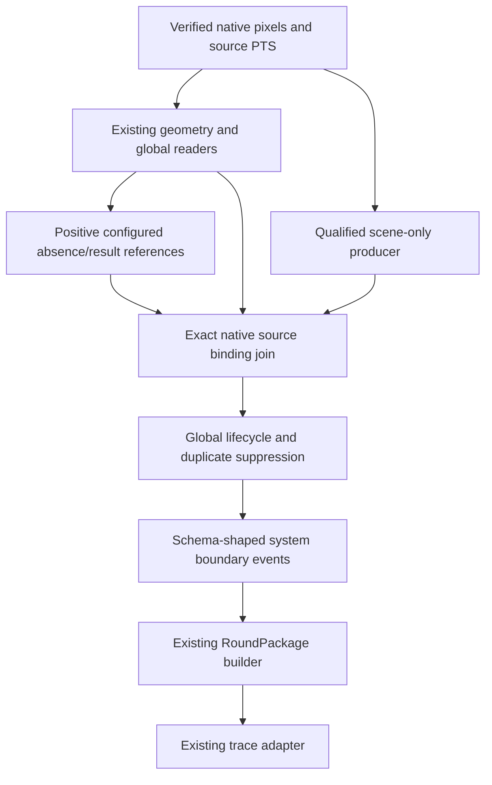

# Qualified native lifecycle producer and package contract

## Problem

Native system observations and qualified scene-only measurements had separate
production entrances, but no analyzer-owned join to the global lifecycle. The
consumer already required positive UI transition evidence. A missing phase text
match could not provide that evidence, and generic HUD events could not safely
stand in for identity-independent system boundaries.

Target assertions remain `GT-R1-ROUND-START`, `GT-R1-ROUND-END`,
`GT-R2-ROUND-START`, lifecycle count constraints and ordering. Package association
can affect 29 first-blocker FAILs, but their other predicates remain unresolved.

## Evidence and competing hypotheses

The preceding native prefix run acquired geometry once and measured the displayed
`0:00 → 2:25 → 1:39` sequence from actual source frames, without supplied geometry.
It does not independently qualify foreground continuity or phase disappearance.
The fixed R1 panel-background proposal failed the unchanged per-group contrast
floor5, despite favorable whole-crop NCC. It remains rejected.

Two causes therefore remain distinct: missing native orchestration and missing
qualified real-image UI/source inputs. Completing the former does not prove the
latter or justify a canonical PASS gain.

## Independent image evidence and continuity decision

No additional image qualification is claimed in this change. Existing background
continuity evidence and the foreground ambiguity retain their prior scope.
A new actual saved-frame guard verifies four native pixel hashes and confirms
that the production entrance rejects absent paired qualification before releasing
any proof/event. The R1 transient is still unqualified; no threshold, animation
whitelist, reference profile, GT or source-cut decision is changed.

## Contract change

The explicit `RealHudAnalyzer.observe_qualified_native_lifecycle_frames(...)`
entrance gathers all three inputs from the same verified native frames:

The native producer cannot accept external saved proofs or supplemental signals.
It requires configured scene assets and a current paired scene/UI qualification
bound to the complete profile/code fingerprint. Cached profile drift or terminal
report/native/config/code changes withhold buffered output.

`phase_absence_template` is a separate opt-in reference role in the existing
profile format, using `semantic_text_ncc_v1` on the bounded phase ROI. It retains
the same three supported distinct training hashes, three/four spatial groups,
minimum32pixels/group, contrast5 and NCC0.90. A nonmatch is unknown. This role
matches a positively reviewed absence structure; it is never inferred from a
failed purchase-phase presence match. No actual absence reference was generated
or adopted here. The current flat-background proposal still cannot load under
these requirements. Whole-producer holdout/control qualification is additionally
required before this role can authorize a transition.

The analyzer captures calibration-gated actual reference measurements separately
from player facts. The join validates video hash, epoch, timebase, ticks, seconds
and current/previous pixel hashes. It rejects scene rows that try to supply UI
or owned evidence. Only a prior qualified phase observation plus current positive
absence measurement in a compatible state can supply a UI transition. The global
lifecycle still requires segment-local preparation duration, independent scene
proofs and coherent accepted clocks. Original transient displays are preserved.

Round end additionally requires a positively matched semantic result reference,
qualified score/result components and the existing distinct-frame accepted score
transition. Neither timer disappearance nor missing reference generates an end.
The native global projection releases no player-owned facts.

Events use actor `system` because global round lifecycle describes a game-level
transition, rather than an individual action or team-owned combat fact. Existing
actor/event semantics are retained. Native source identity is attached to the
actual boundary frame's provenance, and internal candidate bookkeeping is removed
before passing the existing public event schema to packages. No round ID is
injected: the existing package lifecycle derives association and trace naming.

The default sampled/full orchestration is unchanged. This is an explicit native
entrance; automatic full-video native streaming and merge into the standard
orchestrator are still incomplete and must follow real qualification.

## Tests

150 related tests pass in70.02seconds. Ruff passes, and mypy passes for115source
files. The new native lifecycle suite verifies:

- start/end/next-start with exactly one event of each expected type, no next-round
  end, and original transient clock samples retained by the existing lifecycle;
- system actor/time/native provenance through two schema-valid packages and trace;
- next-round preparation before its start belongs to the upcoming package;
- missing/weak absence, scene break, spectator or still-present phase cannot start;
- source pixel/epoch/tick/video/previous-pixel/coverage mismatch and scene-supplied
  UI evidence reject the join;
- an actual analyzer-owned entrance with synthetic qualification and no absence
  reference emits no boundary; terminal native/report mutation withholds output;
- positive absence structure requires the existing reference matcher, and a flat
  nonmatch never becomes absence.

Positive qualification, clocks and scene witnesses in these tests are explicitly
synthetic. They establish pipeline contracts, not real-image qualification or
canonical E2E improvement. Testing found and fixed leaked private candidate event
fields that violated the public RoundPackage schema. A source-measurement test
fixture was also corrected to retain the real producer's source identity fields.

## Previous / Current / Delta

| Metric | Previous | Current | Delta |
| --- | ---: | ---: | ---: |
| Synthetic native join/package/trace starts | no integrated entrance | 2 | contract test only |
| Synthetic native join/package/trace ends | no integrated entrance | 1 | contract test only |
| Synthetic native packages | no integrated entrance | 2 | contract test only |
| Actual native guard proofs/events | 0 / 0 | 0 / 0 | 0 / 0 |
| Adopted real paired qualification | 0 | 0 | 0 |
| Canonical PASS / FAIL / NE | 23 / 55 / 4 | unmeasured | unmeasured |
| Canonical negative failures / discontinuity violations | 0 / 0 | unmeasured | unmeasured |

No targeted/sampled/full canonical E2E was executed; no real qualified boundary
candidate exists. Synthetic counts must not replace real run metrics. Earlier
code-bound diagnostic reports remain historical after the new source fingerprint;
they were not resigned or relabelled as current qualification.

## Remaining blocker

The current video still lacks an independently qualified UI absence reference and
whole-producer scene/foreground/continuity qualification. The actual guard records
both qualification unavailable and absence reference unconfigured. Next resolve
those source inputs, then wire qualified native streaming/event merge into the
standard orchestration. Do not run another full E2E or tune R2/result thresholds
merely because synthetic package contracts now pass. All82canonical assertion
records and validation semantics remain unchanged. Windows hardware/decoder/OCR
and profile path behavior remain unverified on an actual Windows machine.
