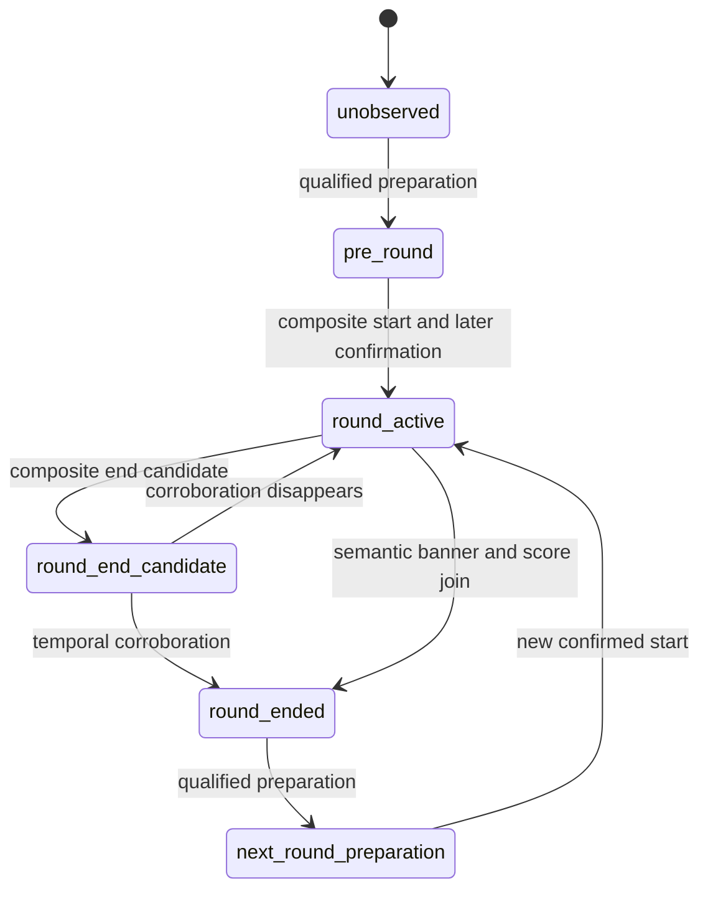

# Round Lifecycle Pipeline implementation

**実動画受入は未達です。** lifecycle、event contract、package associationの基盤を実装しましたが、現在の安全なprofileには必要な入力がなく、3境界は未検出です。30 PASS、29 FAIL解消、production採用を主張しません。

開始時に `git fetch origin` → `git checkout main` → `git pull --ff-only` を実行。開始SHA: `deaf3c8ed34a571f38a46e947ade5beea187d930`。GT、pack、assertion、full sampler、NCC0.90、identity/ownership/spectator/OCR/geometry/mapの安全条件を維持。新しいtimer/score/HP/spectator candidateは生成せず、`.env.local` も変更していません。

## 1. Existing behavior

最新正常完了full16: 23 PASS /55 FAIL /4 NE。round start/endは0、packageはpartial1件 `[7.369336,171.002669]` でR2も含む。profile16はtimer誤認で却下済みです。今回の画像再解析は安全側profile13を明示指定しました。

## 2. Root cause

- R1開始前後ではAbility/Weapon、R2開始前後ではWeapon identityが不足。R1終了直後はspectator exclusion未確認。
- profile13にはHP readerしかなく、timer/ally score/enemy score reader、buy/end phase templateがない。
- 一般textureのshared_bannerは購入表示を拾わず戦闘背景を拾う。score変化とのjoinだけでround endへ昇格する経路があった。
- actor契約、重複抑止、断続点リセット、pre-round所属が未完成だった。

前の3点は認識入力の問題、最後は今回実装したpipeline契約です。入力不足を条件緩和で補いません。

## 3. Round lifecycle state machine

`hud/round_lifecycle.py` をHUD direct event builderへ接続しました。



全状態でgap >1秒、または明示されたsource discontinuity/content_jumpによってpending candidateを破棄しunobservedへ戻します。source continuity segmentをevent attributesへ保持。active中のmenu開閉だけではstartを再armせず、endは次の資格付きstartまで再発火しません。end未観測で新たな購入phase列が成立しても、欠落endは生成しません。

## 4. Evidence sources

既存のphase/state/timer reset、semantic banner/score transitionという複合証拠を使います。一般textureだけのshared_bannerからendをjoinしません。scoreを推測生成しません。

実画像診断は保存full16の3–6、72–77、109–114秒の全342 native PTSを再認識しました。保存認識結果を画像認識として再利用せず、信頼済みanchorやsignalも注入していません。各区間に真正な校正prefix `[0.036003,0.202669,0.402669]` を付け、prefixと区間のgapはtemporal reset対象にしました。geometry retained policyは変更していません。

全native PTSに保存画像があり、filename丸めの最大差は0.000336秒。source SHA、raw terminal hash、frame hash、profile/assets fingerprintを診断に記録。これはarchive PTSに限定した診断で、動画の全container frameや新しいfull sampler実行の証明ではありません。

## 5. Boundary detection logic

Start: 既存のbuy/menuまたはbuy banner→live、finite accepted timer reset >3秒、前後HUD confidence>=0.65に加え、後続liveフレームのtimer countdown整合を確認します。候補後0.05秒以上で確定し、event時刻は最初のcandidate PTSを保ちます。単発reset、jitter、timer不明、低confidenceを拒否します。

End: semantic round_end_template、またはvalidated round_end_bannerと、別PTSのscore変化を最大3秒窓でjoin。介在するgap >1秒／source cutを拒否し、confidence>=0.65を維持。joined endは複数PTSの証拠を保持します。他の既存banner＋timer停止候補には後続観測のcorroborationが必要です。従来のconfidence0.85未満のcross-check条件も維持します。

動画固有のround数、GT時刻、round ID、禁止end時刻をdetectorへ渡していません。R2 endが0という評価期待はruntime条件ではありません。

## 6. Actor contract

actorはイベントの主体、producerは検出元です。round_start/endはmatchルールのlifecycleなのでsystem。teamはteamの集団行動、playerはplayerへ帰属する行動です。source registryに `allowed_actors=[system]` を追加し、native producerでsystemを生成します。package/traceでteam→systemを変換しません。旧contractでこのoptional metadataがない場合は従来のproducer-only validationを維持。詳細: `docs/event_actor_contract.md`。

## 7. Package association rule

round_windowはpackageの観測context範囲です。実際のactive start/endはsource eventが保持し、context開始をdetected startと読み替えません。boundary eventはexplicit associationで一度だけ所属し、contextの伸長で移動・複製しません。

gapまたはsource continuity segment不一致ではcomplete roundとしてstart/endを結合しません。欠落境界のpartial fragmentはquality/completenessを0に維持します。診断fragmentの範囲は検出round boundaryではありません。源のend eventがあるmissing-start fragmentでもendを失いません。

## 8. Pre-round context rule

confidence>=0.65のbuy menu/buy phaseを持つ最新の連続準備episodeを次の実start packageへ含めます。過去の確定境界を越えて前roundの準備を再利用しません。終了後から次の準備開始前の連続観測は、終了したpackageのpost contextへ所属。gap >1秒で拡張を止め、共有endpointのobservationは後packageへ一度だけ所属します。

初期の資格付き準備contextは最初のdetected start packageへ含めます。校正prefixからstate/snapshotを肯定せず、最初の準備証拠以前のunknown観測をGTからroundへ所属させません。snapshot admissionのconfidence条件は維持。早期R1 snapshotが自動的にPASSになるとは扱いません。

## 9. Trace contract

adapterはnative type/actor/time/confidence/attributesを保持します。evidence_provenanceはattributes内のproducer、source PTS、confirmation PTS、signal種別、continuity segmentです。round labelは既存のnative package順の命名規約で、GT IDを入力しません。共有endpointのstate/owner/visualは後packageへ所属し、end eventは前packageに残します。

## 10. Tests

- 関連unit/integration **82 PASS /1 SKIP**。任意のsibling-pack fixture未配置によるSKIPです。実際のcanonical packはoffline replayで全82 assertionを別途評価しました。
- `python3 -m ruff check src tests scripts/e2e scripts/diagnostics`: PASS。
- `python3 -m mypy src/valorant_ai_coach`: PASS、97 source files。
- start/end、duplicate、jitter、gap、source cut、2round遷移、false second endなし、actor、pre/post context、低confidence、native→package→trace provenance、共有endpointを検証。
- texture banner＋score transitionからendを生成しないnegative testを追加。
- 実画像temporal受入が不合格のため、指定ゲートに従い全体pytest/full regressionとfull E2Eは実行していません。
- Windows/Piで同じproduction code・Python・profile形式。Windows実機は未検証で、archive PTS、JPEG decode、relative assets、Tesseract/FFmpeg/ffprobe配置の確認が必要です。

## 11. E2E comparison

### Continuous real-frame gate: NOT QUALIFIED

| Window sec | Frames | Wall sec | States | Round events |
| --- | ---: | ---: | --- | ---: |
| [3.0, 6.0] | 78 | 163.863 | {'unknown': 78} | 0 |
| [72.0, 77.0] | 79 | 241.049 | {'unknown': 79} | 0 |
| [109.0, 114.0] | 185 | 399.443 | {'buy_menu_open': 34, 'unknown': 130, 'live_first_person': 21} | 0 |

合計342フレーム、813.722秒（約13分34秒）。3区間のbuy/end template、両score、numeric timerの既知数はいずれも0。前のprofile13 fullの同じ区間でもstate件数は同じで差分0です。R1 start/endとR2 startは未検出。R2 endも0ですが、全入力未資格の結果なので、他3境界を正しく検出してfalse endを防げたという証明ではありません。

### Fixed sampled regression

| Metric | Previous | Current | Delta |
| --- | ---: | ---: | ---: |
| PASS | 7 | 7 | 0 |
| FAIL | 12 | 12 | 0 |
| NE | 11 | 11 | 0 |
| Frames | 30 | 30 | 0 |
| Wall sec | 326.450 | 285.415 | -41.035 (-12.57%) |

suite/source/PTS一致、comparable=true。全failure項目とstate件数も変わりません。exit1は既存FAILによるもので実行異常ではありません。runtime変動をlifecycle変更による高速化と断定しません。isolated sampledはtemporal/full negative assertionを評価しません。

### Full archive → final-source offline contract replay

以下Currentは保存rawを現builder/adapter/canonical evaluatorで再評価した値で、新しいfull認識runではありません。

| Metric | Previous full | Current offline | Delta |
| --- | ---: | ---: | ---: |
| PASS | 23 | 23 | 0 |
| FAIL | 55 | 55 | 0 |
| NE | 4 | 4 | 0 |
| Round start events | 0 | 0 | 0 |
| Round end events | 0 | 0 | 0 |
| Native packages | 1 partial | 1 partial | 0 |
| sample_round_1 partial assigned observations | 4499 | 4499 | 0 |
| sample_round_2 observations | 0 | 0 | 0 |
| Negative failures | 0 | 0 | 0 |
| Canonical discontinuity assertion violations | 0 | 0 | 0 |
| Boundary duplicate count | 0 | 0 | 0 |

package/traceは保存出力と意味的に一致、status/failure-code差分0。新しくPASSになったIDはありません。windowは両方 `[7.369336,171.002669]`、boundary confidenceは不存在。前回full時間15149.129秒、今回full時間は未計測です。

固定した最初の受入ID:

| Assertion | Current | Failure |
| --- | --- | --- |
| GT-R1-ROUND-END | fail | missing_point:GT-R1-ROUND-END |
| GT-R1-ROUND-START | fail | missing_point:GT-R1-ROUND-START |
| GT-R2-ROUND-START | fail | missing_point:GT-R2-ROUND-START |
| event_count_constraints-000 | fail | count:sample_round_1:round_start |
| event_count_constraints-002 | fail | count:sample_round_1:round_end |
| event_count_constraints-004 | fail | count:sample_round_2:round_start |
| ordering_constraints-001 | not_evaluated | required point missing |

**Negativeの限定:** canonical negative20件はPASSですが、NEG-CONTENT-JUMP-SPANはtemporal featureが0なのでstate/owner断続安全の証明にはなりません。保存traceには74.433–74.450のcutを跨ぐcombat_report_visibleとunknown-owner区間が残ります。source readerがこのcut markerを供給していません。今回のsource marker/gapリセットのunit証明と、実画像でcutを発見できる証明を区別します。

29 package-scope assertionsも全てFAILです。actor契約は実装済みですが、実イベント不足、state/owner coverage、death属性、snapshot fields、mapなど別predicateが残ります。下表は現在のcanonical failureです。機械JSONには分析開始時のsecondary blockersをhistoricalと明記して保存しました。

| Assertion | Current canonical failure |
| --- | --- |
| GT-R2-ROUND-START | missing_point:GT-R2-ROUND-START |
| GT-R2-DEATH | missing_point:GT-R2-DEATH |
| GT-R2-BUY-FLAG | state_coverage:GT-R2-BUY-FLAG |
| GT-R2-BUY-MENU-1 | state_coverage:GT-R2-BUY-MENU-1 |
| GT-R2-BUY-MENU-2 | state_coverage:GT-R2-BUY-MENU-2 |
| GT-R2-ASTRAL-1 | state_coverage:GT-R2-ASTRAL-1 |
| GT-R2-ASTRAL-2 | state_coverage:GT-R2-ASTRAL-2 |
| GT-R2-EXPANDED-MAP | state_coverage:GT-R2-EXPANDED-MAP |
| GT-R2-SPECTATOR | state_coverage:GT-R2-SPECTATOR |
| OWN-R2-SELF | ownership_coverage:OWN-R2-SELF |
| OWN-R2-SELF-DEAD | ownership_coverage:OWN-R2-SELF-DEAD |
| OWN-R2-TEAMMATE | ownership_coverage:OWN-R2-TEAMMATE |
| GT-R1-SNAP-0035 | missing_snapshot:GT-R1-SNAP-0035 |
| GT-R1-SNAP-0415 | missing_snapshot:GT-R1-SNAP-0415 |
| GT-R2-SNAP-820 | missing_snapshot:GT-R2-SNAP-820 |
| GT-R2-SNAP-1050 | missing_snapshot:GT-R2-SNAP-1050 |
| GT-R2-SNAP-11145 | missing_snapshot:GT-R2-SNAP-11145 |
| GT-R2-SNAP-143 | missing_snapshot:GT-R2-SNAP-143 |
| GT-R2-SNAP-1475 | missing_snapshot:GT-R2-SNAP-1475 |
| GT-R2-SNAP-1476 | missing_snapshot:GT-R2-SNAP-1476 |
| GT-R2-SNAP-1477 | missing_snapshot:GT-R2-SNAP-1477 |
| GT-R2-SNAP-149 | missing_snapshot:GT-R2-SNAP-149 |
| GT-R2-SNAP-151 | missing_snapshot:GT-R2-SNAP-151 |
| GT-R2-SNAP-170 | missing_snapshot:GT-R2-SNAP-170 |
| GT-R1-SNAP-0035-DERIVED-zone_id | missing_derived_snapshot:GT-R1-SNAP-0035-DERIVED-zone_id |
| GT-R1-SNAP-0415-DERIVED-zone_id | missing_derived_snapshot:GT-R1-SNAP-0415-DERIVED-zone_id |
| GT-R2-SNAP-820-DERIVED-zone_id | missing_derived_snapshot:GT-R2-SNAP-820-DERIVED-zone_id |
| event_count_constraints-004 | count:sample_round_2:round_start |
| event_count_constraints-005 | count:sample_round_2:player_death |

## 12. Remaining blockers

### Independent preparation confidence contract (2026-10-08)

The global semantic purchase phase can be qualified while primary state and player HUD confidence remain unknown/zero. Package/trace already carried that independent confidence, but the direct start candidate gate and lifecycle preparation state still used only player HUD confidence. They now consume the same source-qualified preparation confidence: `buy_phase_banner` plus `buy_phase_visible=true` and finite non-boolean ROI confidence `center_phase_banner_semantic_text` in `[0.90,1]`. Legacy HUD-confidence behavior is retained. Phase confidence does not raise player confidence or authorize owned values.

The candidate still requires current `live_first_person` with HUD confidence at least 0.65, accepted prior/current timers with a reset greater than three seconds, then a later live frame with accepted consistent timer over at least 0.05 seconds. Missing timer, live evidence, phase corroboration or explicit continuity invalidation prevents a boundary. Event provenance retains preparation confidence and its source; actor remains `system`.

Optional lifecycle diagnostics export detached scalar state/candidate/confidence records. The default event-output contract is unchanged and tested for identical output with/without the sink. A native short-window replay (all 12 PTS in 3.8–4.25 seconds and all six PTS in 111.25–111.6 seconds, plus genuine calibration prefixes) verifies `pre_round` first at 3.902669 and 111.352669, with preparation confidence 0.982176 and 0.953142 respectively while player HUD confidence stays zero. The state remains preparation rather than active: all 18 primary states remain unknown, timer/score pairs remain unavailable, start/end candidates and emitted boundaries are zero. Native package generation correctly rejects these all-unknown windows; the diagnostic records the rejection instead of forcing a package. The initial diagnostic attempt stopped on this expected rejection, and the repaired diagnostic was executed once with rejection handling. Runtime is 48.959 seconds; no previous comparable state diagnostic exists.

| Check | Previous | Current | Delta |
| --- | ---: | ---: | ---: |
| Targeted PASS / FAIL / NE | 0 / 5 / 2 | 0 / 5 / 2 | 0 / 0 / 0 |
| Targeted runtime (seconds) | 76.886 | 76.923 | +0.037 (+0.048%) |
| Sampled PASS / FAIL / NE | 7 / 12 / 11 | 7 / 12 / 11 | 0 / 0 / 0 |
| Sampled runtime (seconds) | 285.123 | 287.019 | +1.896 (+0.665%) |

Both partial E2Es preserve their complete failure sets and terminal hashes; neither evaluates full temporal/negative acceptance. The optional state sink was added afterward and verified through output-invariance/runtime tests. Related tests before the sink: 143 passed; sink/runtime follow-up: 34 passed. Ruff and mypy (98 source files) pass. Canonical remains historical 23/55/4, with no newly passing assertion claimed. These windows do not replace the required complete boundary acceptance windows. No full E2E or full regression runs without the three genuine boundary gates. Current evidence is [machine readable](../e2e_reports/match_001/lifecycle_preparation_confidence_diagnostics.json). Windows execution remains unverified.

### Source continuity follow-up (2026-10-08)

At HEAD `9bb50ab`, lifecycle and semantic phase trackers consume explicit `content_jump`/`discontinuity` flags, but a repository source audit finds no image-based producer for those flags. Explicit-marker unit tests establish reset behavior only; the absence of generated events and canonical discontinuity violations does not establish real content-jump safety.

A diagnostic replay of 135 source images in five explicit windows measures 130 adjacent native PTS pairs without running recognition or injecting labels. Source-video and completed-archive hashes are checked before and after. On 96×54 RGB thumbnails (INTER_AREA), mean normalized absolute difference is 0.182667 for PTS 74.402669→74.486003, whose source images show a discontinuous timer/score change. It is larger for the reviewed TEAM ACE/ability animation (75.786003→75.802669: 0.336146) and purple ability-view transition during purchase phase (111.269336→111.352669: 0.230095). The image review is diagnostic provenance, not accepted OCR or runtime evidence. Sample gaps differ, so these magnitudes are not rates or calibrated confidence.

A magnitude-only cut/reset predicate is therefore rejected: these observations do not distinguish editing from normal visual effects. No cut threshold, sampler or production safety policy was changed. A source-qualified composite continuity producer is still needed before score/banner evidence can safely join across these transitions. Measurements took 12.093 seconds; there is no comparable previous measurement or runtime delta. See [machine-readable diagnostics](../e2e_reports/match_001/source_discontinuity_diagnostics.json). Canonical counts remain the historical 23/55/4; current full counts are unmeasured.

1. 3境界のphase/state/timer/scoreを安全に供給する完全profileがない。禁止されたOCR/spectator candidate追加、threshold緩和で補いません。
2. knife等のWeapon identity、R1 Ability、死亡直後のexclusionが未資格。unknownをliveへ変換しません。
3. source content-jump marker producerがない。GT cutをruntimeへ注入しません。partial fragmentの命名だけでは物理round番号を確定できないケースも残ります。
4. death属性、snapshot fields、state/owner coverage、map/visualは別機能です。

次に直す1つの機能は**資格付きshared phase evidenceのproducer/profile供給**です。既存timer/score入力を含む資格確認を行い、不足するものはunknownに保ちます。入力が成立した後に今回の連続gateを再実行し、3境界・negative・sampledが通った候補だけfull regression/fullへ進めます。同じ不足profileでfullを再実行しません。全成功条件を満たしたとは扱いません。

推奨command（ローカルOCR環境を有効にする。WindowsはPython名とlocal pathを置換）:

```bash
python3 -m pytest -q tests/unit/test_round_lifecycle.py tests/unit/test_round_boundary_regressions.py
python3 scripts/diagnostics/diagnose_round_lifecycle.py --video ValorantData/videos/Valorant_09-25-2026_0-37-29-379.mp4 --source-sha256 71d58558559d6f578433ce9f234bf176f76fd5a86657dbfe3eba1e7d36136b06 --raw-processing outputs/recognition-investigation/timer-only-profile15/full16/raw_processing.json --frames-root outputs/recognition-investigation/timer-only-profile15/full16/processing_frames --profile outputs/hud_profiles/pi-structural-20261007-13/hud_layout.json --window 3 6 --window 72 77 --window 109 114 --output outputs/round-lifecycle-continuous.json
python3 scripts/e2e/run_dataset_case.py --video ValorantData/videos/Valorant_09-25-2026_0-37-29-379.mp4 --video-id match_001 --validation-pack ValorantData/valorant_e2e_validation_pack_v3 --hud-layout outputs/hud_profiles/pi-structural-20261007-13/hud_layout.json --mode sampled
```

## Qualified global system-event path (authorized follow-up)

The user authorized identity-independent global lifecycle evidence while retaining player identity/ownership policies and fixed validation assertions. An opt-in production lifecycle and qualification loader now bind reviewed component splits to profile/assets and shared HUD code, and require exact-PTS continuity attestation for every frame. System-only events traverse native package and trace with provenance; no player facts are authorized. Related159 tests, Ruff and mypy99 pass. This is implementation verification, not real boundary acceptance: no profile/continuity producer is qualified and no new canonical full E2E was run. R1 end still needs same-segment corroboration; default profiles and sampler are unchanged. Full details: [global contract](global_round_start_contract.md).

### Frozen timer representation and fresh frame holdout

The historical white-text OCR candidate17 was already rejected: its sampled review found `1:26` read as `4:26` despite an earlier holdout reporting no wrong reads. It is not adopted. The raw strict glyph-seven hypothesis also failed: ten manually reviewed training frames yielded at most seven supporting frames, below the unchanged 80% support rule. No threshold reduction or incomplete alphabet export was used.

An explicit `comparison_preprocessing: gaussian3x3_v1` option now applies the same fixed 3×3 Gaussian representation to normalized current glyphs and binary reference glyphs. Default `binary_v1`, segmentation, colon validation, NCC 0.90 and class margin 0.04 remain unchanged. This is a different candidate representation whose safety requires qualification; an unchanged numeric threshold alone does not prove safety. Ten digit classes meet the training support floor (three distinct supporting frames and 80% class support). Training glyph results are 153 correct / 1 unknown / 0 wrong, not a holdout result. Closely spaced additional seven frames are correlated training evidence.

Profile/assets and shared recognizer code were frozen before selecting 32 new same-video cached frames at fixed uniform rank. Selection excluded a 0.12-second neighborhood around 1,676 PTS found in prior available review/training metadata and the entire additional training neighborhood. Manual source-image display labels were saved before predictions, with no Validation Pack lookup. The frozen production profile's `SubregionReader` gives **25 correct / 7 unknown / 0 wrong**. Seven unknowns are segmentation, border contact or NCC rejection; no values were filled in. Eight source-field type controls yield zero false positives. Four previously reviewed wrong-read controls yield **0 correct / 4 unknown / 0 wrong**: the error was suppressed through abstention, not recovered as a correct value.

The holdout is frame-disjoint within the same video, not independent-video qualification. Its reference-coordinate crops do not establish calibrated analyzer/geometry or temporal behavior. The negative controls use score-adjacent and HP-adjacent fields, not naturally absent timers in the canonical timer ROI, and are not proven independent of all historical reviews. Consequently no global qualification manifest was created and the profile remains unadopted. The original candidate freeze remains an immutable pre-prediction snapshot; subsequent outcomes are in the separate result report.

| Check | Previous | Current | Delta |
| --- | --- | --- | --- |
| Accepted canonical PASS / FAIL / NE | 23 / 55 / 4 | No new full measurement | Unmeasured; no gain claimed |
| New same-video frame holdout correct / unknown / wrong | No comparable frozen-candidate run | 25 / 7 / 0 | N/A |
| Previously reviewed wrong-read controls correct / unknown / wrong | Different rejected readers/cohorts | 0 / 4 / 0 | Not comparable |
| Source-field negative false positives | No comparable run | 0 / 8 | N/A |
| Holdout reader runtime | No comparable run | 0.967 seconds | N/A |
| Control reader runtime | No comparable run | 0.356 seconds | N/A |

The reader runtimes exclude selection, image review, extraction and a full analyzer run; they are not targeted/sampled/full E2E timings. An initial diagnostic harness stopped on an incorrect `ReaderResult.source` access and was corrected to `sources`; a control-selection attempt stopped on rounded filename precision. Neither changed the reader, candidate or frozen source labels. Related tests: 146 passed in 22.66 seconds; Ruff, mypy (99 source files) and `git diff --check` pass. Source SHA256 was verified after the experiments. No new targeted/sampled/full E2E or full regression was run at this stage. Windows execution remains unverified.

Next: natural timer-absent controls and calibrated continuous validation of the frozen candidate, then qualification of source continuity and same-segment end evidence. Player-owned facts still require their existing identity evidence. All three genuine boundary gates, sampled safety and independent qualification must pass before canonical full E2E. [Machine-readable results](../e2e_reports/match_001/timer_glyph_training_holdout_diagnostics.json) retain fingerprints, source/frame hashes, scope and blockers; canonical assertion statuses remain unchanged.

### Calibrated continuous analyzer replay of the frozen timer profile

The next replay executes the actual `RealHudAnalyzer` with the unchanged frozen profile over every archived canonical PTS in `[3,6]`, `[72,77]` and `[109,114]`, with three genuine calibration-prefix frames per independent window. Source/archive terminal hashes and profile/assets are verified before/after. It is continuous at the existing canonical sampling density, not every native 60-fps source frame, and is neither a new independent holdout nor canonical evaluation. No synthetic continuity token or qualification manifest is supplied.

| Window | Observations | Accepted numeric timers | Both scores known | Boundary events | Analyzer seconds |
| --- | ---: | ---: | ---: | ---: | ---: |
| 3–6 sec | 78 | 60 | 0 | 0 | 168.594 |
| 72–77 sec | 79 | 20 | 0 | 0 | 245.435 |
| 109–114 sec | 185 | 144 | 0 | 0 | 409.578 |

The total is 342 window observations plus nine calibration-prefix observations and 224 accepted numeric timer values. Overall wall time is 835.422 seconds (13 min 55 sec), including setup/verification. There is no earlier comparable run of these three full windows with this frozen profile; deltas against earlier shortened windows or rejected readers would be misleading. Acceptance counts are reader outputs, not 224 manually verified correct labels.

Actual source display/provenance survives calibrated analysis: `0:00` at 4.086003→`1:39` at 4.152669, corroborated by `1:39` at 4.202669; `0:00` at 111.402669→`1:40` at 111.436003→`1:39` at 111.502669. These PTS are recorded observations, not production constants or asserted boundaries. Native/trace timer transport is exercised in the final window, including snapshot `1:38` at 113.119336; player ownership still follows existing identity gates.

The end window has no qualified result/score evidence. Near the source cut, `0:29` at 74.319336 is accepted, but sampled timer observations at 74.402669 and 74.486003 are unknown. No end is inferred. The all-unknown first two windows produce an explicit native package rejection; the third produces one partial fragment `[112.686003,113.786003]`, not R1/R2 lifecycle packages. No global component report exists, so the qualified global path is inactive. Zero events here does not prove real negative/discontinuity safety.

Next priority is the **source-qualified continuity producer** and natural timer-absent controls, followed by same-segment result/score evidence. Repeating full E2E with these missing inputs would not resolve the blockers. No production code, threshold, assertion, GT, sampler or frozen candidate was changed for this replay. Canonical historical 23/55/4 remains the last accepted result; new full deltas remain unmeasured. [Machine-readable continuous diagnostics](../e2e_reports/match_001/timer_continuous_analyzer_diagnostics.json) preserve the relevant source/archive/profile fingerprints and outputs.

### Camera correspondence continuity hypothesis

`scripts/diagnostics/diagnose_source_continuity.py` adds a descriptive measurement, not a runtime producer. It verifies source-video/manifest hashes before and after and all 135 source-frame hashes against the completed earlier diagnostic manifest. Before processing 130 existing pairs it freezes a fixed method: 640×360 INTER_AREA thumbnail, central camera region `[0.20,0.20,0.90,0.80]`, up to 300 corners, bidirectional Lucas–Kanade tracks with at most one-pixel return error, and 11×11 nonflat patches compared at NCC 0.90 across a 3×3 spatial grid. Image thumbnails are retained instead of full-HD frames to limit Pi memory. No GT, numeric expectations, temporal labels, continuity confidence, segment ID or boundary is produced.

| Observed pair | High-NCC camera tracks | Occupied grid cells | Interpretation |
| --- | ---: | ---: | --- |
| 4.086003→4.152669 | 2 | 2 | Genuine start context has sparse wall texture and changing weapon animation |
| 111.402669→111.436003 | 3 | 1 | Genuine start context is predominantly purple with sparse spatial support |
| 74.402669→74.486003 | 2 | 2 | Reviewed content jump still shares some room geometry |
| 75.786003→75.802669 | 0 | 0 | Strong normal animation has no bidirectional camera tracks |

Post-measurement source review confirms the first two contexts are low texture. A few high-NCC tracks cannot attest continuity: the reviewed jump also has two. Requiring broad texture support would abstain at both genuine starts; lowering support to make those starts pass is unjustified. The standalone sparse-flow hypothesis therefore remains insufficient and is not adopted. Neither a low track count nor a high pixel difference is promoted to a production cut decision. These reused source pairs are not a new blind training/holdout qualification.

| Measurement | Previous | Current | Delta |
| --- | --- | --- | --- |
| Source pair count | 130 pixel-difference pairs | Same 130 with camera correspondence | 0 |
| Runtime | 12.093 seconds | 18.596 seconds | +6.503 seconds; different diagnostic work |
| Qualified continuity producer | None | None | No qualification gain |
| Canonical PASS / FAIL / NE | Historical 23 / 55 / 4 | No new run | Unmeasured |

Eight diagnostic tests pass (0.46 seconds): translated textured camera correspondence, unrelated-scene rejection statistics, flat-scene abstention, exclusion of top HUD pixels, and invalid source shapes/dtypes. Ruff and diff whitespace checks pass. There is no production source change in this follow-up; the earlier mypy99 result remains historical. No new targeted/sampled/full run or automatic Git write was made. Next work must combine qualified current-frame lifecycle evidence with continuity evidence that remains observable through low-texture/ability views; source tracks alone cannot satisfy the first acceptance gates. [Machine-readable results](../e2e_reports/match_001/source_correspondence_diagnostics.json) retain exact source hashes, method, selected measurements and qualification limitations. Windows remains unverified.

### Opt-in composite source continuity producer

A fixed camera-grid/timer/phase hypothesis is now implemented in `hud/source_continuity.py` and connected to the qualified global event path in `RealHudAnalyzer`. It runs only when a valid code/profile-bound qualification report has been loaded. No real report exists, so current profiles remain inactive. Caller-provided `global_continuity_segment` and confidence signals no longer attest continuity: the internal producer uses actual source pixels and accepted global inputs. It never writes player facts.

Every link requires current valid geometry, matching source dimensions, a positive PTS gap no greater than one second, accepted prior/current timer confidence at least 0.90, and a consistent countdown. A timer rise greater than three seconds is allowed only with prior confirmed semantic purchase phase and current absence of that phase. Independently, at least three nonflat camera tiles must match at NCC 0.90 across at least two rows and two columns of a fixed 3×3 central-camera grid. Flat regions do not count. Missing/weak timer, contradictory values, insufficient spatial support, explicit discontinuity, invalid geometry or source/gap breaks the segment. Epochs change after rejection, so later evidence cannot resume the old segment. First frames provide no attestation. The candidate uses minimum source confidence rather than treating confidence as an accuracy guarantee.

These are new candidate requirements, not a qualified continuity guarantee. The fixed method and current profile/shared-code fingerprints were saved before further qualification. Earlier timer holdout results remain historical: adding shared code changes the qualification fingerprint even though timer assets/reader behavior are unchanged. No report is rebound automatically.

The source training simulation reuses 135 previously reviewed frames and a test-only qualification object, with reference-coordinate geometry assumed. It does not run the global boundary detector or create/install a runtime qualification report. Results: 63 proposed composite links, 56 unavailable timer pairs, 11 insufficient spatial supports, four inter-window gap breaks and one initial frame; 5.991 seconds. R1 start timer pair has three high-NCC camera tiles across two rows/two columns; R2 start has five. The reviewed cut at 74.486003 is rejected because the accepted timer pair is absent. These are exploratory training outcomes, not independent negative/holdout acceptance or new boundary events.

Related tests168 pass in21.91 seconds; Ruff and mypy100 pass. New tests cover timer reset with/without phase, contradictory countdown, weak/missing input, flat/unrelated/local-only camera support, source gap/PTS, explicit cuts, geometry reset, identity-independent proof without observation mutation, and refusal of externally supplied continuity tokens. Default paths retain their existing behavior. No new targeted/sampled/full run or full regression was executed for this candidate. Canonical historical23/55/4 and new-full deltas remain unchanged/unmeasured.

Next: freeze/select fresh frame-disjoint composite holdout and independently reviewed negative controls; do not use this training simulation to generate a qualification report. Natural timer-absent controls and R1 end score/result evidence also remain necessary. A qualified report, actual continuous lifecycle acceptance, sampled safety and then canonical full are still required. See [machine-readable candidate diagnostics](../e2e_reports/match_001/composite_source_continuity_diagnostics.json). Windows remains unverified.

### Fixed composite positive holdout

After the composite candidate/code freeze, 16 four-frame contexts were selected by fixed uniform rank from434 eligible contexts. Selection excludes a0.12-second neighborhood around3,164 PTS in available prior review/training metadata and the entire additional timer-training neighborhood. The64 selected source frames are disjoint between contexts. All pair sheets and surrounding-context sheets were manually reviewed, and32 timer display labels plus16 visible-continuity labels were frozen before predictions. No Validation Pack was consulted. Four archived source samples establish reviewed visible continuity, not a claim about unseen native frames or every possible edit.

Actual `RealHudAnalyzer` processes64 heldout frames plus three genuine calibration-prefix frames using the unchanged frozen profile. Source/archive terminal associations, frame hashes, code and profile/assets are checked. A separate composite simulation consumes the calibrated analyzer outputs and actual source images with a test-only qualification object; no report is installed and no qualified global events are produced. Geometry is effective on all67 inputs (one fresh/66 retained); all primary states are unknown. The separate simulation's `geometry_valid=True` assumption is not an additional geometry qualification.

| Metric | Previous | Current | Delta |
| --- | --- | --- | --- |
| Continuity inputs | Training135 frames | Holdout16 contexts/64 frames | Different cohorts |
| Proposed composite links | Training63 | Holdout5 | Not a comparable count |
| Holdout abstentions | No prior comparable cohort | 11 (8 camera-support/3 unavailable-timer) | N/A |
| Reviewed center timer correct/unknown/wrong | Earlier different32-frame cohort25/7/0 | New32 center frames27/5/0 | Different cohorts; no accuracy-gain claim |
| Analyzer runtime | Training reader-only simulation5.991 seconds | Actual calibrated analyzer135.131 seconds | Different work; not a speed comparison |
| Native round boundaries | No new canonical measurement | 0 in positive holdout replay | No qualification/PASS gain |
| Canonical PASS/FAIL/NE | Historical23/55/4 | No new run | Unmeasured |

Positive cases alone cannot measure false continuity acceptance. Independent content-cut negatives and phase-reset holdout remain incomplete; no qualification report or adoption is justified yet. Unknowns remain unknown, and neither spatial support nor timer thresholds were changed after holdout. The initial local harness stopped on a missing `scripts` import before inference; correcting `PYTHONPATH` allowed one completed recognition replay without altering labels/candidate. No production changes were made in this follow-up. Earlier related168 tests/Ruff/mypy100 remain historical; diff-check passes. No targeted/sampled/full E2E or full regression was newly run. Next independent reviewed negative controls and end evidence; avoid repeating full E2E while those gates are absent. [Hash-bound holdout report](../e2e_reports/match_001/composite_continuity_holdout_diagnostics.json). Windows remains unverified.

### Stale-source controls reject v1; pixel-independent v2 remains unqualified

Nine fixed-rank source frames, disjoint in PTS from specified composite training/positive-holdout and timer-training manifests, were selected before prediction. Their source timer crops were manually transcribed first (nine correct reader outputs). Counterfactual controls feed the same decoded source image and accepted timer result twice while advancing only the test observation PTS by0.1sec. This is a stale-source/replay test, not naturally edited footage; test PTS never enter canonical runtime, and the real video/Validation Pack remain unchanged. Other historical reviews may exist, so broad independence is not claimed.

V1 incorrectly attests all9 repeated images as new continuity evidence. This rejects v1 as a qualification candidate, despite its earlier positive holdout. V2 (`camera_grid_timer_phase_v2`) adds exact decoded-pixel SHA256 comparison: identical pixels at a different PTS break the continuity epoch. Internal proof retains current/prior pixel hashes. A repeated frozen frame cannot corroborate a boundary merely by acquiring a new timestamp. Camera NCC0.90, timer0.90, phase policy and spatial-support requirements are unchanged. This strengthens an unadopted path; no existing default recognition profile or player policy changes.

| Metric | Previous v1 | Current v2 | Delta |
| --- | ---: | ---: | ---: |
| Stale-source false attestations | 9/9 | 0/9 | -9 |
| Prior positive regression links | 5/16 | 5/16 | 0 |
| Prior positive regression abstentions | 11/16 | 11/16 | 0 |
| Prior positive outcomes changed | — | 0 | No change |

Positive regression reuses saved calibrated timer outputs and actual source images in a separate test-only binding simulation. Phase confidence was not persisted and is left unavailable rather than invented; this cohort contains no reset cases. The simulation assumes valid geometry and is not a new analyzer/temporal acceptance run. The stale-control reader replay took1.512sec; this excludes positive regression and is not an E2E runtime.

New tests explicitly reject identical pixels at distinct PTS and verify that subsequent distinct evidence uses a new segment. Ordinary source fixtures now include evolving HUD pixels outside the camera region; they still demonstrate positive spatial/timer evidence rather than disabling all links. Related170 tests pass in23.15sec, Ruff/mypy100/diff-check pass. Source-video SHA256 was verified after the experiments. V2 code/method/profile binding is frozen anew. Earlier positive holdout and these controls are now regression data for v2; fresh v2 qualification remains necessary. No real report/adoption or new targeted/sampled/full/full-regression run is claimed. Canonical historical23/55/4 remains the last accepted result, with new-full deltas unmeasured. Natural-cut controls, phase-reset qualification and R1 end evidence remain blockers. [Machine-readable defect and fix](../e2e_reports/match_001/composite_stale_source_diagnostics.json). Windows remains unverified.

### Native cut regression and lifecycle arming contract blocker

V2 was checked against three native-frame pairs across the previously manually reviewed cut. Original PTS ticks/time base and source PNG hashes are preserved; no explicit discontinuity flag or GT value is passed to the producer. The pair74.4193359375→74.4693359375 has independently read `0:29`→`0:06` and is rejected as an inconsistent countdown. The immediate74.43600260416666→74.45266927083334 pair and the broader74.40266927083333→74.48600260416667 pair reject unavailable accepted timers. False links:0/3, runtime1.177sec. These are correlated regression cases from one previously reviewed cut, not three independent event negatives or fresh qualification.

A separate optimistic projection replays all78 source samples in3–6sec and185 in109–114sec, using actual saved calibrated timer/phase values and the verified source images. Other state flags are omitted and primary state is projected unknown; geometry is assumed valid and qualification is a test-only object. This favors acceptance and is deliberately not claimed equivalent to native production. Even this projection produces **zero start events**. R1 states:75unobserved/3pre_round; R2:185unobserved. R1 continuity outcomes:15links/36insufficient-camera/26unavailable-timer/1initial. R2:124links/17insufficient-camera/43unavailable-timer/1initial.

The current consumer resets previous observation/preparation whenever source proof is absent or changes segment. At R1, a rejected link at4.069336 clears preparation; the next attested phase at4.086003 supplies only one new global phase observation before reset at4.152669. At R2, the phase link at111.402669 is rejected; the first attested reset at111.436003 arrives without a global previous phase. Thus independently confirmed semantic-phase timing is not carried through the source-pair contract, and repeated phase qualification in the consumer prevents candidate creation. Producing more qualification files alone would not fix this behavior.

Next implementation target: **carry source-qualified semantic-phase temporal provenance into continuity/lifecycle initialization**, preserving actual distinct source frames, existing confidence/minimum duration and cut boundaries. Do not arm from a bare phase float, invent prior evidence, weaken camera support or join an unsupported segment. No fix or acceptance is claimed by this diagnostic. No production source/default profile, threshold, GT, assertion or sampler changed in this follow-up; previous170tests/Ruff/mypy100 results remain historical. No new full E2E is justified while even optimistic start gates fail. Canonical historical23/55/4 remains unchanged, with no new measurement. [Exact diagnostic scope and hashes](../e2e_reports/match_001/composite_pipeline_gate_diagnostics.json).

### Qualified evidence merge and segment-local preparation

The final supplemental merge could overwrite internally measured continuity and reader confidence. Replaying the four new analyzer-to-event-builder regression cases against the earlier merge reproduces four externally supplied proofs at the consumer boundary. The qualified analyzer now excludes external global, semantic-phase and phase/result-template signals, and keeps the internal final evidence mapping. Genuine producer measurements and explicit content-cut notices remain available. Default profiles keep their existing supplemental behavior. Unit fixtures mock source features and calibration; they are not image qualification.

Semantic phase endpoints alone cannot re-arm the lifecycle: seven consumed phase samples in the saved R1 projection have semantic start PTS older than the currently consumed continuity segment. The consumer now requires at least two actual attested phase observations spanning the existing 0.05-second confirmation minimum inside the current segment. Missing proof/cuts still reset them. A synthetic 10-ms phase pair with older semantic provenance produces one start without this duration check and zero with it. A genuine-duration synthetic three-frame control still produces one system start. Event provenance keeps actual preparation endpoints/count, with phase confidence included in the minimum; no external semantic PTS is copied into preparation.

| Metric | Previous | Current | Delta |
| --- | ---: | ---: | ---: |
| External-proof overwrites in four synthetic cases | 4 | 0 | -4 |
| Start from synthetic 10-ms preparation | 1 | 0 | -1 |
| Saved-source projection inputs | 263 | 263 | 0 |
| Saved-source projected starts | 0 | 0 | 0 |
| Projected pre-round samples | 3 | 3 | 0 |
| Projected unobserved samples | 260 | 260 | 0 |
| Projection wall-clock seconds | 24.891 | 26.482 | +1.592 (+6.39%) |

The source projection reuses historical calibrated numeric/phase outputs with actual verified images, assumed geometry and omitted other state flags. A test-only qualification object is never installed. Source-video SHA, terminal raw association, all selected frame hashes, profile/assets, diagnostic and current code hashes are verified. Continuity outcomes are unchanged. Recording differs, so this runtime is not an E2E benchmark or a speed-gain claim. No boundary acceptance or canonical PASS gain follows from the simulation. Related 183 tests pass in22.94sec with the local Validation Pack path (no skips); Ruff and mypy100 pass. Both before-fix controls restore the exact current source bytes afterwards. The initial bare pytest invocation failed on the repository `tests` import before execution; explicit `PYTHONPATH` resolved collection.

The new code fingerprint invalidates previous qualification bindings; historical split results are not silently rebound. There is still no real runtime report, sampled/full candidate acceptance or new canonical result. Thresholds, player identity/ownership, Validation Pack and full sampler are unchanged; Windows is unverified. The next evidence task is to inspect contiguous native source frames between the saved analysis PTS, using unchanged acceptance requirements. This may distinguish missing transport from genuinely unsupported phase/continuity; it does not authorize skipping rejected frames or importing old phase context. R1 end still needs independently corroborated same-segment evidence. [Contract verification](../e2e_reports/match_001/global_source_contract_diagnostics.json).

### Native source preparation: density alone does not resolve the gate

`scripts/diagnostics/diagnose_native_global_lifecycle.py` inspects every native frame in explicit interior windows, using the frozen configured timer/text readers and unchanged continuity/lifecycle code. It loads no Validation Pack and supplies no expected values, round IDs or inferred cut labels. Original integer source PTS/time base are retained through FFmpeg `showinfo`; decoded PTS and PNG counts must equal the independently probed source list. Frame/file/pixel hashes and source video/profile/code/script binding are checked. Reference geometry and unknown primary state are diagnostic assumptions, and a test-only qualification object is never installed. This is not a real qualified native run.

Extraction tests reproduced two errors before source acceptance: accurate seek on a nonzero-origin stream discards desired prefix frames, and duration-bounded decoding can discard tail frames. The implementation uses source timestamps/keyframe decoding, a PTS-select filter and the exact native frame count. An initial real-source cohort contained58frames because the seeked ffprobe interval itself ended too early; matching that truncated list did not prove whole-window coverage. Its immutable results/images are retained with a failed-coverage audit and cannot serve as temporal acceptance. The fixed probe must observe frames before and after the requested interior range; a16-test suite includes this truncation guard, rounded-PTS/order/duplicate/missing-frame rejection and real FFmpeg nonzero-origin extraction. EOF/prefix windows without those coverage witnesses fail closed.

The corrected run processes30nativeframes each in3.902669–4.402669 and111.186003–111.686003, with no source-frame skipping. These are development windows around previously observed reader transitions, not independent holdout. Manual source-crop review **after** predictions finds54correct displayed strings,6unknowns and0wrong strings. This qualifies neither semantic game-clock validity nor boundaries. All60source PNG/pixel hashes are verified again after review. No unknown value is filled.

| Native diagnostic metric | R1 window | R2 window |
| --- | ---: | ---: |
| Source frames | 30 | 30 |
| Accepted timer strings | 30 | 24 |
| Timer unknown | 0 | 6 |
| Confirmed phase samples | 8 | 9 |
| Attested composite links | 23 | 18 |
| Missing timer-pair rejections | 0 | 6 |
| Camera-support rejections | 4 | 4 |
| Timer-transition rejections | 2 | 1 |
| Projected pre-round samples | 6 | 0 |
| Simulated starts | 0 | 0 |
| Window wall-clock seconds | 34.388 | 33.021 |

R1 source timer changes from `0:00` to visibly real `2:25` at4.1193359375 and4.136002604166667, then `1:39` at4.152669270833333. The reading is not an OCR error. The immediate prior phase is no longer confirmed at4.102669 even though earlier preparation is armed. The producer rejects the reset, then the46second drop. Rejected links still have5and6camera witnesses respectively, so camera matching alone does not establish clock semantics or absence of content discontinuity. Two transient-value observations span16.667ms; confirmation over the existing0.05sec cannot treat the following different value as consistent countdown. The images alone do not establish whether the clock is a rendering/phase transition or the content is discontinuous; neither interpretation is forced into production.

R2 first6timer outputs remain unknown. Camera-support failures at111.319336(one witness) and111.369336(two witnesses) break preparation. The final confirmed-phase fragment111.38600260416666–111.40266927083333 spans only16.667ms in its current segment. The reset at111.43600260416666 has6camera witnesses but its prior frame no longer confirms phase. Older semantic preparation cannot be imported across the unsupported links.

The hypothesis that denser source input alone resolves starts is rejected: archived optimistic projection0starts and full-native-window simulation0starts, delta0, on different cohorts. A phase latch alone is also insufficient given the R1 future clock contradiction and R2 preparation gap. Corrected diagnostic runtime69.292seconds is not comparable to the wider archived projection or the rejected incomplete58-frame run. Canonical23/55/4 remains historical, with new current/delta unmeasured. No default production/profile/threshold, GT/assertion or full sampler changed. Ruff/mypy100 and the16new tests pass; the earlier183related tests remain historical with identical production source fingerprint. No new targeted/sampled/full or full regression is justified yet. Windows is unverified.

Next: distinguish accurately recognized display text from temporally qualified lifecycle clock, and bind preparation to actual source-safe phase context. Any hypothesis must preserve current-frame values, the existing confidence/duration floors and independently reviewed negative/holdout evidence; never special-case `2:25`, inject expected clocks or ignore unsupported continuity. R1 end and qualified score/result evidence remain separate blockers. [Native-source measurements and provenance](../e2e_reports/match_001/native_global_preparation_diagnostics.json).

Additional native motion diagnostic: at111.319336 the fixed forward/back+patch NCC method finds18high-NCC points over three cells; excluding the profile's purchase UI (with6px margin for11×11patches) leaves14over those cells. At111.369336 the apparent six points over two top-row cells reduce to two points in one cell after the same exclusion. The extra second-column witness was purchase UI. Combining it with the static camera-grid evidence would double-count global phase UI rather than establish independent scene continuity; this motion fallback is not adopted as a sufficient fix. Three correlated known-cut grid controls also fail the existing spatial distribution gate, but are not fresh negative holdout. No camera/geometry acceptance policy changed.

Example diagnostic command (use a fresh output directory):

```bash
python3 scripts/diagnostics/diagnose_native_global_lifecycle.py \
  --video ValorantData/videos/Valorant_09-25-2026_0-37-29-379.mp4 \
  --source-sha256 71d58558559d6f578433ce9f234bf176f76fd5a86657dbfe3eba1e7d36136b06 \
  --profile outputs/hud_profiles/round-global-timer-glyph-20261008/hud_layout.json \
  --window 3.902669 4.402669 --window 111.186003 111.686003 \
  --output-dir outputs/recognition-investigation/native-global-new-run
```

The same Python script is used on Windows with its Python launcher; assets and runtime tools still require Windows verification. The window arguments constrain offline diagnostics and are not production detection parameters.


### Active round latch: phase jitter regression

The qualified global consumer could overwrite `round_active` with `pre_round` after two sufficiently separated purchase-phase observations. A later reset then emits another start without a qualified end. A phase observation at a genuine qualified score/result end also overwrites active state before the end predicate runs, hiding that end. This is a consumer state-machine defect, independent of OCR accuracy.

A before-fix synthetic control through the real `HudDirectEventBuilder` reproduces two starts and zero ends. The consumer now ignores phase as new preparation while the round is active. A qualified end or a source reset must close that lifecycle before new preparation can arm it. Existing confidence/duration requirements remain. Phase is still available to the end predicate; observations and player facts are unchanged. After the fix the same synthetic sequence emits one system start and one system end. A separate source-cut case rejects old preparation, then accepts a start only after new-segment preparation. Existing R1-to-R2 package/trace contract tests pass. These fixtures supply synthetic qualified proofs; they do not establish real-image continuity or boundary acceptance.

| Synthetic contract metric | Previous | Current | Delta |
| --- | ---: | ---: | ---: |
| Starts in one active lifecycle | 2 | 1 | -1 |
| Qualified ends retained during phase reappearance | 0 | 1 | +1 |

Related151tests PASS in23.86sec with the local Validation Pack path; Ruff PASS; mypy100 PASS. This is a focused regression suite, not full regression. Target assertions remain `GT-R1-ROUND-START`, `GT-R1-ROUND-END`, `GT-R2-ROUND-START`, event counts000/002/004 and ordering001. No new canonical assertion is claimed PASS. The accepted23/55/4 is historical; current/delta are unmeasured. No new targeted/sampled/full run is justified while native clock/phase/continuity evidence and end qualification remain unsupported. No threshold, geometry, identity/ownership, GT, assertion or sampler changed.

The recognizer fingerprint changes to `e9cd7c81e972a3e548b0da40819b31bef99f8329366c1be58ab216c9454bca9e`; older qualification bindings must not be reused. No real report is installed or profile adopted. Next: obtain independent qualified global clock/phase/continuity evidence; accurately read transient display values are not automatically lifecycle clocks. Windows remains unverified. [Synthetic contract diagnostics](../e2e_reports/match_001/global_active_round_diagnostics.json).


### Opt-in global score reader: development evidence, not qualification

The result/score end path lacks a qualified score producer. Under the user's explicit fixed-assertion timer/score authorization, `StrictScoreGlyphReader` and profile kind `strict_score_glyphs` now support only `ally_score` / `enemy_score`. They reuse the complete ten-class binary-reference validation and optional symmetric gaussian3x3 comparison, with fixed NCC0.90 and competitor margin0.04. Score grammar is independent of timer grammar: one or two aligned digits, no leading zero, colon, extra components or clipped foreground. Invalid explicit profiles stay present as unknown readers and cannot fall back to OCR or supply HP/timer roles. Success preserves source display/confidence; it neither establishes player identity nor emits a boundary. Default profiles and geometry are unchanged.

The first local development sidecar borrows the already reviewed timer glyph assets, keeping all ten competing digits rather than limiting classes to observed scores. Inner ROI bounds follow the visible score field, not GT values. An initial development crop probe reads ally0 but rejects enemy1 for border foreground. That rejection is retained, not filled. The frozen sidecar then evaluates all60previously extracted/hash-bound native frames (120score readings), with the original integer PTS, source/video/profile/assets/code/script binding. This cohort overlaps existing timer/phase development and is not independent holdout. Manual review of both source contact sheets occurs after prediction. Source PNG hashes are checked again after review.

| Development source result | Ally | Enemy | Total |
| --- | ---: | ---: | ---: |
| Correct displayed strings | 60 | 24 | 84 |
| Unknown | 0 | 36 | 36 |
| Wrong displayed strings | 0 | 0 | 0 |

All30visible enemy1 readings in the first window remain unknown. In the second window24enemy2 readings are correct and the first6unknown. All36abstentions are foreground-border failures. In an inspected first-window crop Otsu chooses140, includes score-card background/edge pixels and triggers the unchanged border guard. Do not treat those source-visible labels as runtime values, remove competitor classes or relax the border/NCC/margin guards. Next investigate value-invariant foreground extraction on explicit training frames, then fresh disjoint holdout/negative controls. The current sidecar is development-only and is not copied into the runtime HUD profile.

Runtime8.265sec,60frames,7.259frames/sec: this is score-only source diagnostics, not E2E. Previous comparable run and runtime delta are unavailable. Related194tests PASS24.49sec, Ruff PASS and mypy101 PASS; full regression was not run. The measured diagnostic harness is preserved privately with its frozen hash; a subsequent explicit-reader-kind validation affects only invalid configurations, and its current hash is separately recorded. Recognition code/profile did not change after this measured run.

No qualification report, adoption, canonical event or new PASS is claimed. Canonical23/55/4 remains historical; current/delta are unmeasured. Targeted/sampled/full are gated because starts remain unqualified, enemy score coverage is incomplete, and R1 end still lacks corroborated same-segment result/score evidence. New code fingerprint invalidates earlier qualification bindings. Validation Pack/GT/assertions, sampler and player-owned policies remain fixed. Windows is unverified. [Source statistics and bindings](../e2e_reports/match_001/score_glyph_development_diagnostics.json).


### Score foreground extraction and same-video heldout source comparison

The first reader's Otsu partition mixes bright score-card backgrounds with thin white glyphs. The opt-in `foreground_preprocessing: white200_v1` now extracts only fixed bright uint8 text above200 after the same resizing. This is a preprocessing threshold, not a lower acceptance threshold. Default `otsu_v1`, NCC0.90, competitor gap0.04, all ten classes, source-display output and the structural border/layout guards remain. There is no retry or alternate-reader fallback after rejection. Invalid foreground modes fail closed; profile fingerprints include the explicit mode. Unit controls cover all ten digits, two-digit scores, dim text, bright backgrounds, clipping and extra components. No generic timer/HP preprocessing changed.

The same60developmentframes improve120readings from84correct/36unknown/0wrong to114correct/6unknown/0wrong. This is training/development evidence, not qualification. Code and sidecar are then frozen before heldout selection. Fixed whole-video fractions generate six short native windows; intervals within0.12sec of any source in the frozen128frame glyph cohort,12additional seven-training frames or60score-development frames are rejected before extraction. Three heldout contexts (27frames) and three separate spatial-negative source contexts (27frames) preserve every source PTS inside their explicit windows, checked with the existing exact native extraction contract. Source-video/profile/code/input hashes are checked before and after; all54PNG/pixel hashes are checked again after evaluation. No Validation Pack is loaded and no GT window chooses inputs. Manual source labels are recorded **before** predictions; neither recognizer nor candidate selector loads them.

| Same heldout54score reads | Previous Otsu | Current white200 | Delta |
| --- | ---: | ---: | ---: |
| Correct | 19 | 36 | +17 |
| Unknown | 35 | 18 | -17 |
| Wrong | 0 | 0 | 0 |
| Wall-clock seconds | 5.561358 | 5.560424 | -0.000934 |

The per-reading transitions are17unknown→correct,19correct→correct and18unknown→unknown. No unknown→wrong or correct→wrong occurs. The tiny runtime difference is measurement variation, not a speed claim. Baseline Otsu is reevaluated on the same frozen source set after labeling solely for comparison; labels remain evaluator inputs. Development runtime8.265→8.807sec (+0.541sec,+6.55%); heldout and development runtimes measure score-only diagnostics, not E2E. Source extraction54frames takes46.697sec.

Spatial controls use54fixed non-score crops from the separate27sourceframes, reviewed before prediction. False acceptance0/54; negative-reader runtime3.473sec. These are field-type controls, **not** natural absent-score UI, content-cut or round-event negatives. Heldout evidence covers three correlated short contexts of the same video and displayed classes0/1/2; it does not establish independent-video/all-score qualification. The18heldout abstentions still reject bright background/particles at the ROI border. Keep them unknown; do not use source labels to fill values or lower guards.

Related217tests PASS25.14sec, Ruff PASS, mypy101 PASS. No complete runtime qualification, profile adoption, canonical boundary or new PASS is claimed. Historical canonical23/55/4 remains; current/delta unmeasured. No targeted/sampled/full/full-regression run is warranted while starts and same-segment R1-end corroboration remain unsupported. GT/assertions, full sampler, identity/player ownership and geometry thresholds are unchanged. The changed code fingerprint invalidates older qualification bindings; Windows is unverified. Next investigate source-safe foreground/absent-UI negatives and carry qualified global evidence without bridging rejected clock/camera links. [Frozen comparison and provenance](../e2e_reports/match_001/score_white_holdout_diagnostics.json).


### Score reader → actual calibrated analyzer source verification

Reader-only holdout does not prove that the production analyzer retains accepted scores after geometry/state/identity handling. A separate development sidecar combines the unchanged existing template/anchor/timer profile with the frozen opt-in score readers. It is not installed as the runtime profile. Three actual `RealHudAnalyzer` instances each process the three historically source-associated calibration prefix frames and all nine native source frames of one heldout window:36inputs including27heldout. No injected anchors, reader objects, signals, Validation Pack or qualification object are supplied. The historical prefix only establishes geometry under the existing retained policy; its long gap cannot corroborate temporal events. Source video, profile/assets, current code, diagnostic script and every input frame are hash-checked before and after.

| Same27source frames /54score reads | Reader-only previous | Actual analyzer current | Delta |
| --- | ---: | ---: | ---: |
| Correct | 36 | 36 | 0 |
| Unknown | 18 | 18 | 0 |
| Wrong | 0 | 0 | 0 |

All27heldout primary states stay unknown. No player-specific HUD-valid, HP, armor, weapon-text or populated ability-slot fact is released. Accepted score integers and their reader ROI confidence reach actual observations while unknown identity stays unknown; no global proof is borrowed for player facts. All18score abstentions remain null. Each12-input instance has1fresh geometry/12effective/11retained; aggregate3fresh/36effective/33retained includes the repeated prefix. This is not a full-video geometry-rate improvement and does not prove scene continuity across the prefix gap. The analyzer emits zero events, because actual global qualification remains absent and no boundary evidence is injected. Production package/trace/evaluator acceptance is still unverified.

Actual-analyzer runtime85.399sec for36inputs (0.422processedframes/sec). Reader-only holdout5.560sec processes27inputs without template/identity/state/calibration/HP OCR; these runtimes are not comparable and no speed conclusion follows. Previous comparable analyzer run/runtime delta is unavailable. No production code changed in this diagnostic; prior217relatedtests25.14sec, Ruff PASS and mypy101 PASS remain valid for that unchanged source. No new regression suite, targeted/sampled/full or canonical result is claimed. Historical23/55/4 remains; current/delta are unmeasured. No profile adoption, threshold/geometry/identity/ownership/GT/assertion/full-sampler change. Windows is unverified. Next: qualify absent-score/UI controls and genuine same-segment phase/clock/result evidence, preserving current abstentions and player ownership gates. [Actual source analyzer contract measurements](../e2e_reports/match_001/score_source_analyzer_diagnostics.json).


### R1 result qualification gap: current numeric source inputs rechecked

Current frozen score/timer readers were replayed against the10previously reviewed native R1-end images. The raw source images and original integer PTS are hash-bound to the prior source review; the video SHA is verified at the terminal of this short replay and every PNG hash is checked again. No labels are passed to readers. Post-prediction review gives score18correct/2unknown/0wrong (20reads), timer4correct/6unknown/0wrong (10reads). In the previously reviewed TEAM ACE frame the timer reader abstains and scores read0/1. Later source0/2reads are correct. An optimistic actual-camera composite simulation with assumed geometry and a never-installed test-only qualification object still attests0links:1initial,8accepted-timer-pair-unavailable and1insufficient-spatial-camera-support. These are development/archived-source measurements, not fresh qualification or real events. Runtime5.161sec; no comparable previous run/delta.

The available verified result-positive support is1frame **in this10frame local reviewed window**, not a proved whole-video count. It cannot establish the required semantic reference's3supported independent training images plus separate reviewed holdout/negative controls. The source score update after the recorded content discontinuity cannot corroborate or backdate the earlier result. Better score reading alone therefore does not satisfy the current end contract. Do not duplicate/synthetically perturb the single image and count it as independent support, copy review labels into runtime, bridge the cut or relax acceptance.

Asked for the Pi path of another unedited source video with phase→start or result→score continuity. Additional source data may qualify shared recognizers; it does not remove the need for independent same-segment evidence on the target video. No reply is assumed, and another genuinely qualified global cue remains a possible source-backed alternative. There is still no real qualification report, production boundary, profile adoption or canonical PASS change. Historical23/55/4 remains; current/delta unmeasured. No production source changed; prior217relatedtests/Ruff/mypy101 remain historical checks on unchanged source. No new full E2E is warranted. [Current inputs and exact qualification gap](../e2e_reports/match_001/round_result_qualification_gap.json).


### Roster source investigation and source-link safety repair

The ten archived native R1-end frames were inspected for an alternative global cue. The first two images visibly show one ally portrait and five enemy portraits; the remaining eight show no ally portraits and five enemy portraits. This is a source-visible UI description, not a qualified alive-count or player death. Existing fixed-slot saturation/contrast heuristics mark all five ally slots alive in frame7 despite no visible ally portraits. Other frames are ambiguous. Color-only roster is therefore rejected as independent boundary evidence; no threshold, identity gate or detector is relaxed and no new round/death fact is generated. Existing camera witness measurements also fail to establish continuous corroboration across this window.

A separate safety defect was reproduced in the existing roster debounce: both endpoints of duplicate-PTS, reversed-PTS and explicit-cut pairs could receive corroborated counts. Six synthetic invalid endpoint acceptances fall from6 to0 (delta−6), using the exact HEAD helper as the comparison without rolling back tracked source. The helper now requires finite strictly increasing adjacent PTS, the existing maximum1second gap and no content_jump/discontinuity at the later frame. The analyzer supplies cut indices from extracted and supplemental signals so look-ahead cannot bridge a supplied cut. Two new agreeing frames within the new segment remain eligible under the unchanged five-slot/confidence policy. This repairs a source contract; it does not qualify the underlying color heuristic or add a new global roster route.

Six new parameterized unit cases cover duplicate/backward times, feature cuts, post-cut recovery and both supplemental cut markers through the actual analyzer. Related198tests pass in28.71sec; one trace test initially skips without its external pack path, then all9trace-adapter tests pass in0.29sec with the installed pack, zero skips (199unique related cases pass across these runs). Ruff passes; mypy passes101source files. Production code fingerprint changes from6011f168… to8ea9523e…; earlier image measurements remain historical and cannot be rebound as current runtime qualification. Validation Pack, GT, assertion semantics, full sampler, NCC0.90, geometry/OCR acceptance and player-owned fact gates remain unchanged. No targeted/sampled/full E2E is run because the three boundary acceptance points still lack real qualified continuous evidence. Canonical23/55/4 remains historical; current/delta unmeasured, no newly accepted assertion. Windows remains unverified. The pending additional-source question has no assumed answer. [Source rows, synthetic comparison and bindings](../e2e_reports/match_001/roster_source_link_diagnostics.json).


### Archived context expansion and natural-absence control inventory

The three fixed first/middle/last buy-menu review images (PTS83.419336,88.786003,110.019336) still display timer and both scores. They cannot serve as absent-score/timer negatives. All64images from the prior uniformly ranked unknown review were then inspected using four topbar sheets, with every decoded pixel hash verified against the source manifest. All64show timer and scores. This is an inventory of this cohort only, not a whole-video absence claim. Spatial field-type negatives remain useful but do not replace natural absent-UI or content-cut controls.

For broader score coverage, the frozen Otsu/white readers were evaluated on50of those64archived frames after excluding14within0.12sec of the full128glyph cohort, additional12seven-training frames,60development frames and54previous heldout/negative-source frames. Source selection is fixed before predictions and uses no GT/Validation Pack values or windows. Manual topbar review precedes predictions; source label JSON is serialized afterward solely for evaluation and never loaded by readers/selector. Input hashes, code, profile, script and exclusion bindings are verified at terminal; source-video SHA is rechecked. The archived timestamps are rounded observation PTS, not a fresh native continuous extraction. Reference-size ROI geometry is assumed, not calibrated analyzer verification. This is supplementary same-video positive evidence, not independent lifecycle qualification.

| Same50source frames /100score readings | Previous Otsu | Current white200 | Delta |
| --- | ---: | ---: | ---: |
| Correct | 55 | 76 | +21 |
| Unknown | 45 | 24 | −21 |
| Wrong | 0 | 0 | 0 |
| Wall-clock seconds | 3.677137 | 3.646539 | −0.030598 |

Transitions:55correct→correct,21unknown→correct,24unknown→unknown, zero new wrongs. Runtime−0.83%is short-run variation; no E2E speed claim. The24abstentions remain unknown. These sources still cover displayed classes0/1/2of one video. No natural absent-UI controls were obtained and no qualification report/profile adoption is created. Existing source interruptions and R1 result support gaps still prevent the three actual boundary acceptances. Canonical23/55/4 is historical; current/delta unmeasured, no new assertion PASS. No targeted/sampled/full E2E is justified before these gates pass. Production/test/shared-script source is unchanged during this diagnostic, so the prior199unique related cases/Ruff/mypy101 checks remain applicable. GT, thresholds, ownership, geometry and full sampler stay fixed; Windows unverified. [Source inventory, comparison and bindings](../e2e_reports/match_001/score_archived_context_diagnostics.json).


### Later result reference development: support exists, target transfer fails

The prior75.802669source image was rechecked and visibly contains TEAM ACE. Inspecting25hash-bound archived source images in75.2–76.4shows the same result text in all25. This clarifies the earlier gap: one positive was verified in the short74.36–74.52window; it was never a whole-video count. Later reference-development images do exist. They are correlated frames of one result episode **after** the target content discontinuity, not25independent events or evidence of when R1 ended. They cannot corroborate/backdate the earlier boundary.

A single fixed reference hypothesis uses three actual distinct images at75.402669,75.802669and76.269336. Training-only foreground intersection above210(uint8), a one-pixel contrast ring, median grayscale reference and three spatial groups feed the existing SemanticTextReference with unchanged per-group NCC0.90. No numerical/GT value, boundary time or ID goes into the matcher. Reference/mask are frozen before predictions; no retry or tuning occurs. All three training examples meet0.90, so the existing constructor succeeds. Eleven other source images remain after0.12sec training-neighbourhood exclusion:3correct accepts,8unknown,0wrong. All were reviewed before predictions. These are same-episode heldout frames, not independent event qualification. Three actual canonical banner-ROI controls (purchase-phase text and two ordinary world views) have0false positives; they do not qualify content-cut or false-round safety.

The already-reviewed early ten-frame source window is then tested as a regression transfer control. The TEAM ACE at74.436002604sec scores0.3876 and stays unknown; the other nine source frames have0false acceptances. The hypothesis is rejected as a sufficient R1-end input. Do not tune on this target control, lower0.90, or count copies/perturbations of its one image as new support. Broader independent training/holdout and qualified same-segment corroboration remain necessary. Existing geometry, player ownership and source-discontinuity policy are unchanged.

Reference development/evaluation runtime1.446sec; no comparable previous runtime/delta. Production/test/shared-script code is unchanged; prior199unique related cases/Ruff/mypy101 checks remain applicable. No runtime sidecar/profile adoption, global qualification report, generated boundary, targeted/sampled/full or canonical PASS change. Historical23/55/4 remains; current/delta unmeasured. Reference images stay Pi-local; hashes/counts/PTS/NCC/reasons are shared in [result-reference diagnostics](../e2e_reports/match_001/round_result_reference_development.json). Windows unverified. This is component source investigation, not lifecycle completion.


### Latest main synchronization and accepted-source contract replay

Read-only remote verification found87upstream commits after the earlier9bb50abd work baseline. Fetched origin and fast-forwarded local main to **fd099fd938830745c749d1a58e9092565bcd7ed3** while preserving the existing uncommitted tracked/untracked source and report files. A private recovery snapshot is kept locally. Only builder.py and test_round_boundary_regressions.py overlap: builder merges cleanly; equivalent boundary filtering uses upstream style, retaining the additional local partial-fragment safety test. Unaffected local changes are byte-verified after synchronization. No new commit or push is made.

Main adds a partial-fragment rule that retains later observed-but-unusable timestamps within the observed fragment; it does not use them as gameplay continuity. Existing local timer-display and global-boundary work remains. Related199tests pass with the installed Validation Pack, zero skips31.44sec; package-builder3tests pass1.90sec. Ruff and mypy101source files pass, as does diff checking. This updates verification to current main; earlier runs keep their original code/commit bindings.

The adopted profile13terminal archive is then replayed through the actual latest builder, trace adapter and unchanged canonical evaluator. All4634saved observations, events, visual observations and zone resolutions are supplied unchanged. No image recognition is rerun, no qualification/GT/round ID/time is injected. Input archive/evaluator assertion hashes and source-video SHA are verified before and after; production-source hashes are frozen through processing. The native packages, trace, all82assertion outcomes and failure set are exactly equal to the archived result:23PASS/55FAIL/4NE, delta0/0/0. One partial package remains at7.369336–171.002669, with no round boundaries. Negative assertion failures remain0in this archived compatibility replay, which does not establish fresh recognition or temporal detection safety. Replay runtime34.047sec; no directly comparable previous run, since the earlier replay used rejected profile16 rather than accepted13. Full video recognition still requires about3h36m36for the historical accepted run; no new full E2E is executed.

This confirms that main synchronization and package scope changes do not repair the real boundary source gap or alter historical assertion statuses. Real lifecycle qualification and all three continuous boundary acceptances remain unmet; fresh full result/delta are unmeasured. No new PASS or feature completion is claimed. Next priority remains source-qualified global lifecycle evidence, with fixed GT/thresholds/identity/ownership/discontinuity policy. Windows unverified. [Latest-main compatibility evidence](../e2e_reports/match_001/latest_main_contract_compatibility.json).


### Diagnostic handoff for publication

The user requested publishing the current work on main and will perform the remaining diagnostics. This handoff is based on upstream main fd099fd938830745c749d1a58e9092565bcd7ed3 with the documented local changes merged. All239cases in changed/new test modules pass in29.88sec with the local Validation Pack configured. Latest Ruff and mypy101source-file checks pass; no production source changed after those checks. Full regression and fresh full E2E are not claimed.

The global lifecycle route is opt-in and still requires a real profile/code-bound qualification report. The development numeric/result references are not adopted or bundled as qualified runtime assets. Real R1 start/end and R2 start acceptance remains incomplete. The accepted source archive replay stays23PASS/55FAIL/4NE with all82statuses unchanged; this is compatibility evidence, not a new full run. Diagnostic images, source video and generated development profiles remain Pi-local; published reports contain statistics, provenance and hashes. Follow the existing source qualification and continuous validation gates before installing a profile or running final full E2E. NCC0.90, ownership, identity, geometry, OCR/discontinuity policies and Validation Pack assertions remain fixed.


### R1 independent scene investigation (2026-10-09)

The native R1 phase disappearance and both timer-anomaly links now have timer/phase-independent distributed crop NCC and bidirectional feature tracking. At the reset, all six NCC values exceed0.995 and135accepted patches span six regions; the following display drop has minimum NCC0.946 and137accepted patches in five regions. This supports scene continuity/UI transition rather than whole-camera replacement, but cannot exclude edits preserving the same view or prove uninterrupted gameplay time. Every raw display is retained. An actual discontinuity control retains55patch tracks, so LK alone cannot authorize continuity. Excluded-pixel mutation leaves all metrics unchanged. ORB support is insufficient and explicitly inconclusive.

R2 receives the same frozen method; full-view purple occlusion and teammate overlays make R1 crops unsuitable as universal background evidence. It stays inconclusive rather than being declared a cut or qualified continuous. The proposed contract separates image scene status, raw clock/display semantics and content-time vetoes with an explicit pending transient UI state. Production adoption is not enabled; no thresholds, discontinuity/ownership policies, GT, assertions, sampler or runtime source are changed. Related95unit tests pass6.88sec, Ruff passes and mypy101files passes. No targeted/sampled/full is justified without qualification; canonical historical23/55/4 stays the baseline, current/delta unmeasured. No assertion is relabelled. See [full investigation and contract specification](r1_scene_transition_investigation.md) and [source-bound measurements](../e2e_reports/match_001/r1_independent_scene_diagnostics.json). Next priority is the qualified transient-UI evidence contract, with scene-preserving-edit and occlusion negatives; R1-end reference transfer remains separate.


### Transient UI diagnostic temporal prototype

The independent-scene investigation now has an executable diagnostic state machine that retains every raw timer display, models confirmed preparation and pending UI transition, and refuses all event/clock authorization. Cuts, duplicate pixels, gaps, uncertain scene support and phase jitter clear context. Eleven targeted unit cases pass; current106related tests passed before the final state-label correction, with the11prototype cases rerun afterward. Production source and policies remain unchanged.

A frozen all-six-crop NCC0.90 + distributed LK/affine descriptive predicate is insufficient across actual continuous source motion: the preparation span resets before R1 phase loss, producing6phase candidates and24unobserved outputs; R2 gives2and28. No transient state or boundary is declared. This is a rejected automated evidence hypothesis, not a reason to reduce thresholds or invalidate the separate critical-link image finding. The next source-producer work is motion-compensated correspondence and occlusion validity with real cut/duplicate/occlusion controls. Canonical23/55/4is historical, current/delta unmeasured. [Contract, results and limitations](r1_scene_transition_investigation.md#diagnostic-temporal-contract-prototype-follow-up); [source-bound replay](../e2e_reports/match_001/transient_ui_contract_replay.json).


### Crop-local affine scene diagnostics

Source-only affine compensation now supplements the scene diagnostic, with crop-local warping and valid masks to prevent excluded UI entering transformed ROIs. All previous raw R1/R2metrics remain exactly equal; original code SHA is preserved in a private version1snapshot and new diagnostics have separate bindings. At4.302669,2raw high-NCC crops become5compensated ones, indicating motion rather than an automatic cut; the remaining0.899crop is not rounded into acceptance. Weak-texture crops remain unknown. A real cut still has one compensated0.915crop, reinforcing that single-ROI similarity cannot authorize continuity. The different-scene control has no usable affine transform.

All107related cases pass7.31sec, Ruff passes and mypy101production files passes. Production source, thresholds, canonical statuses, full sampler and GT remain unchanged. No qualification or event is created; R2occlusion and R1clock semantics remain blockers. Next work is explicit background/occlusion validity and independent qualification; no full E2E is justified by these descriptive metrics. [Source evidence and controls](../e2e_reports/match_001/scene_motion_compensation_diagnostics.json).


### Opt-in production camera evidence excludes phase/result pixels

The actual CompositeSourceContinuity camera grid overlapped the phase/result panel, violating separation of phase and camera witnesses. Camera-cell NCC now removes a padded canonical panel rectangle from its inputs instead of zero-filling it; OpenCV receives explicit2Dvalid vectors. NCC0.90, variance/support/spatial minima, timer/reset semantics, duplicate/gap/geometry/content-cut vetoes remain unchanged. Method provenance is versioned and the shared code fingerprint changes, so stale qualification reports cannot be reused. No new real qualification or profile is adopted. This is limited panel exclusion, not full semantic-background or occlusion recognition.

All60native R1/R2images and58adjacent pairs are compared against the original HEAD camera method, with terminal video/report/image/pixel/code bindings. R1spatial-quorum links remain25/29; R2falls24→23/29. At111.386002604the old3witnesses become2after panel exclusion, removing an occluded link's camera quorum. This is not a content-cut label or canonical gain. Timer-dependent R1breaks remain fail-closed. Four new unit cases and the complete135related tests pass8.71sec; Ruff and mypy101files pass. Canonical23/55/4is historical, current/delta unmeasured; no full E2E is justified before actual qualification and three continuous boundary acceptances. [Implementation and limitations](r1_scene_transition_investigation.md#production-camera-evidence-phase-contamination-removed); [actual camera comparison](../e2e_reports/match_001/phase_excluded_camera_diagnostics.json).


### Frozen scene-only holdout: static crops are insufficient

A predecode reservation freezes production/scene fingerprints and three explicit source intervals, separate from the60scene-development images. All90native frames and87adjacent pairs are decoded/verified; frame hashes are disjoint from that scene development set. All90contact-sheet panels are reviewed with timer/top HUD and phase/result pixels masked in the visualization only. Ordinary camera/knife/teammate motion is visible, with no obvious whole-scene replacement; uninterrupted game time is not certified.

Phase-excluded production camera quorum covers5/29,1/29and17/29links respectively:23/87total,64abstentions. All-six raw crop NCC succeeds0/87, while LK covers≥3regions on87/87. Fixed crops visibly include foreground/teammates in these withheld contexts, so distributed tracks are not sufficient world-background evidence. Universal fixed-ROI qualification is rejected; neither missing NCC nor motion is labelled a cut, and no threshold is reduced. The next source requirement is region visibility/foreground validity plus motion-aware correspondence. The cohort now supplies development evidence and must not be reused as qualification holdout after method redesign.

Runtime63.483sec includes decode/hashes/measurements; no comparable previous timing. Production code is unchanged in this follow-up and terminal fingerprints match the prior135tests/Ruff/mypy101checks. No new runtime qualification, event, canonical assertion result or full run. Historical23/55/4stays the baseline; current/delta unmeasured. [Decision and source scope](scene_continuity_qualification.md); [withheld measurements](../e2e_reports/match_001/scene_holdout_diagnostics.json); [review provenance](../e2e_reports/match_001/scene_holdout_review.json).


### Cross-region motion diagnostic removes self-fit support

The accepted source patches now have a leave-one-region-out affine diagnostic. The tested region does not fit its own prediction model, and missing peer support stays unknown. This identifies a concrete distinction missed by raw patch counts: the known discontinuity's55patches have peer residual medians10.023/9.671/2.776px in their three supported regions, whereas R1timer reset/drop medians are below0.56px in available groups. Duplicate images fit perfectly and still need an explicit pixel veto.

Ordinary-motion former-holdout spans have high residual in at least one group on70/87links, so error cannot itself label foreground or cuts; parallax/model mismatch also contributes. The150frames/145pairs and three controls are source/hash-bound. Old scene outputs remain exactly equal with an optional track sink; the prior code version is preserved. These cohorts are development now, not new qualification. Six new cases and141related tests pass9.27sec; Ruff and mypy101source files pass. Production, safety thresholds, geometry, GT and assertion statuses remain unchanged; no proof/event/profile/full or canonical gain is claimed. [Results and limits](scene_continuity_qualification.md#out-of-region-motion-consensus-development-follow-up); [model evidence](../e2e_reports/match_001/out_of_region_motion_diagnostics.json).


### Qualified transient UI contract (2026-10-09)

The independent R1 image investigation supports visible scene continuity at phase disappearance and the two anomalous clock links, while scene-preserving edits remain unresolved. An opt-in production `transient_ui_transition` contract now requires separately qualified current-frame scene/UI evidence, preserves every original clock display and source linkage, and confirms an active clock without GT timing/value constants. Synthetic native→package→trace tests cover two rounds, preparation association and no inferred second end; external supplemental proof remains filtered.

No real scene/UI producer or paired qualification is installed, so actual R1/R2 start detection remains incomplete. Historical canonical23/55/4 is unchanged as the baseline; Current/Delta are unmeasured, not synthetic-unit results. No full E2E is justified before qualified source inputs and the three-boundary acceptance gate. Prior diagnostic fingerprints are historical version bindings and cannot qualify changed production code. [Current contract and verification](transient_ui_lifecycle_contract.md) details the remaining background/occlusion and positive UI-evidence producer task. R1-end result reference remains a separate blocker; thresholds, GT, assertions, sampler, geometry and ownership are fixed.

Current follow-up verification: **200 related unit tests PASS (24.97sec), Ruff PASS, mypy102source files PASS**. No fresh canonical E2E or real-source qualification is claimed.


### Reviewed-world feature development follow-up

Restricting background labels to actually linked reviewed reference features raises R1descriptive support21→26of29native links and establishes diagnostic pre_round→transient_ui_transition while retaining every display. Whole-crop matching and a three-reference bank had failed the existing preparation-duration gate. No qualification or runtime event follows from training data; R2remains unsupported and canonical Current/Delta unmeasured. The prototype also no longer counts an initially unattested image toward phase duration. All219related cases pass26.05sec, Ruff passes, and production fingerprint matches the earlier mypy102file check. A prospective same-video holdout is frozen before decode. [Evidence, alternative hypotheses, tests and next gate](scene_world_feature_development.md).

## Frozen scene-world reference holdout result

The subsequent [native holdout investigation](scene_world_feature_holdout.md) measured36previously reserved frames /30adjacent links. The frozen method supported0links, including no distributed adjacent support in nearby R1 camera poses. All36masked panels were reviewed. This rejects production qualification of the current reference bank; missing support remains unknown, not a content-cut label. The original R1 critical-link evidence still favours visible scene continuity with a transient UI display change, while uninterrupted game time remains unproven. No scene/UI qualification or runtime boundary was created, no canonical E2E was rerun, and the82assertion statuses remain unchanged. Reference coverage and trusted producer qualification precede production activation.

## Wider world-patch search: insufficient remedy

The [96-native-image comparison](scene_patch_search_investigation.md) tests whether crop-local search range alone caused the failed scene qualification. Unique reciprocal NCC≥0.90search across existing non-UI crops reduces R1support26→19/29; R2stays0/29and the30former-holdout links remain unsupported. Rejection-stage diagnostics expose repeated-wall ambiguity and missing appearance support. Wider search is rejected as a sufficient remedy; no threshold relaxation, cut inference, qualification or event follows. Production and the82assertion matrix are unchanged; canonical Current/Delta is unmeasured. Next work needs distinctive world-feature structure/reference coverage and independent qualification, not looser patch acceptance.

## Joint feature translation trial

The [four-pose constellation investigation](scene_constellation_investigation.md) retains ambiguous patch alternatives and rejects competing distributed motions. Real poses yield0accepted tracks: either the finite peak budget cannot assess all alternatives, or the changed pose supplies no coherent distributed translation. Static reference-only eligibility removes21/114patches but does not establish support. This implementation is rejected for qualification; neither all spatial methods nor visible scene continuity is disproved. Production and all82assertions are unchanged; no qualification/event/full run or canonical gain is claimed. Next work is distinguishable reviewed background structure and reference pose coverage, preserving the source/producer qualification gate.


## Continuous reviewed-world chain checkpoint

The [continuous tracking investigation](scene_world_chain_investigation.md) preserves reviewed source feature identities without reseeding. Prefix support is0/35; separate stable-input feature support4/29 stops despite86tracks because spatial witnesses occupy one row. Dense source-world crops support3/29; adding a manually reviewed seventh background region leaves3/29 unchanged. Upper and added lower crop NCC values are below0.90 despite full valid warp coverage. These methods remain diagnostic-only and unqualified; missing support is not a cut label. Seven focused tests and Ruff pass. Production fingerprints and all82assertion rows are unchanged; no fresh canonical run, qualification or real boundary is claimed. Work pauses at the requested checkpoint with trusted scene/UI producer qualification still unfinished.
