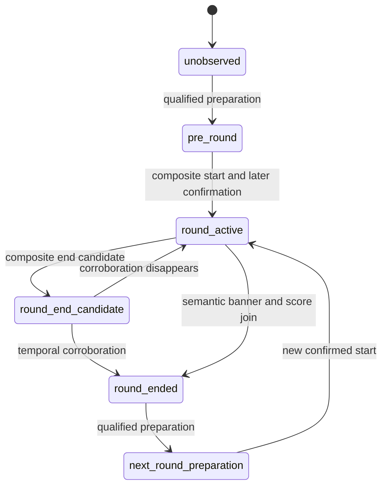

# Round Lifecycle Pipeline implementation

**実動画受入は未達です。** lifecycle、event contract、package associationの基盤を実装しましたが、現在の安全なprofileには必要な入力がなく、3境界は未検出です。30 PASS、29 FAIL解消、production採用を主張しません。

開始時に `git fetch origin` → `git checkout main` → `git pull --ff-only` を実行。開始SHA: `deaf3c8ed34a571f38a46e947ade5beea187d930`。GT、pack、assertion、full sampler、NCC0.90、identity/ownership/spectator/OCR/geometry/mapの安全条件を維持。新しいtimer/score/HP/spectator candidateは生成せず、`.env.local` も変更していません。

## 1. Existing behavior

最新正常完了full16: 23 PASS /55 FAIL /4 NE。round start/endは0、packageはpartial1件 `[7.369336,171.002669]` でR2も含む。profile16はtimer誤認で却下済みです。今回の画像再解析は安全側profile13を明示指定しました。

## 2. Root cause

- R1開始前後ではAbility/Weapon、R2開始前後ではWeapon identityが不足。R1終了直後はspectator exclusion未確認。
- profile13にはHP readerしかなく、timer/ally score/enemy score reader、buy/end phase templateがない。
- 一般textureのshared_bannerは購入表示を拾わず戦闘背景を拾う。score変化とのjoinだけでround endへ昇格する経路があった。
- actor契約、重複抑止、断続点リセット、pre-round所属が未完成だった。

前の3点は認識入力の問題、最後は今回実装したpipeline契約です。入力不足を条件緩和で補いません。

## 3. Round lifecycle state machine

`hud/round_lifecycle.py` をHUD direct event builderへ接続しました。



全状態でgap >1秒、または明示されたsource discontinuity/content_jumpによってpending candidateを破棄しunobservedへ戻します。source continuity segmentをevent attributesへ保持。active中のmenu開閉だけではstartを再armせず、endは次の資格付きstartまで再発火しません。end未観測で新たな購入phase列が成立しても、欠落endは生成しません。

## 4. Evidence sources

既存のphase/state/timer reset、semantic banner/score transitionという複合証拠を使います。一般textureだけのshared_bannerからendをjoinしません。scoreを推測生成しません。

実画像診断は保存full16の3–6、72–77、109–114秒の全342 native PTSを再認識しました。保存認識結果を画像認識として再利用せず、信頼済みanchorやsignalも注入していません。各区間に真正な校正prefix `[0.036003,0.202669,0.402669]` を付け、prefixと区間のgapはtemporal reset対象にしました。geometry retained policyは変更していません。

全native PTSに保存画像があり、filename丸めの最大差は0.000336秒。source SHA、raw terminal hash、frame hash、profile/assets fingerprintを診断に記録。これはarchive PTSに限定した診断で、動画の全container frameや新しいfull sampler実行の証明ではありません。

## 5. Boundary detection logic

Start: 既存のbuy/menuまたはbuy banner→live、finite accepted timer reset >3秒、前後HUD confidence>=0.65に加え、後続liveフレームのtimer countdown整合を確認します。候補後0.05秒以上で確定し、event時刻は最初のcandidate PTSを保ちます。単発reset、jitter、timer不明、低confidenceを拒否します。

End: semantic round_end_template、またはvalidated round_end_bannerと、別PTSのscore変化を最大3秒窓でjoin。介在するgap >1秒／source cutを拒否し、confidence>=0.65を維持。joined endは複数PTSの証拠を保持します。他の既存banner＋timer停止候補には後続観測のcorroborationが必要です。従来のconfidence0.85未満のcross-check条件も維持します。

動画固有のround数、GT時刻、round ID、禁止end時刻をdetectorへ渡していません。R2 endが0という評価期待はruntime条件ではありません。

## 6. Actor contract

actorはイベントの主体、producerは検出元です。round_start/endはmatchルールのlifecycleなのでsystem。teamはteamの集団行動、playerはplayerへ帰属する行動です。source registryに `allowed_actors=[system]` を追加し、native producerでsystemを生成します。package/traceでteam→systemを変換しません。旧contractでこのoptional metadataがない場合は従来のproducer-only validationを維持。詳細: `docs/event_actor_contract.md`。

## 7. Package association rule

round_windowはpackageの観測context範囲です。実際のactive start/endはsource eventが保持し、context開始をdetected startと読み替えません。boundary eventはexplicit associationで一度だけ所属し、contextの伸長で移動・複製しません。

gapまたはsource continuity segment不一致ではcomplete roundとしてstart/endを結合しません。欠落境界のpartial fragmentはquality/completenessを0に維持します。診断fragmentの範囲は検出round boundaryではありません。源のend eventがあるmissing-start fragmentでもendを失いません。

## 8. Pre-round context rule

confidence>=0.65のbuy menu/buy phaseを持つ最新の連続準備episodeを次の実start packageへ含めます。過去の確定境界を越えて前roundの準備を再利用しません。終了後から次の準備開始前の連続観測は、終了したpackageのpost contextへ所属。gap >1秒で拡張を止め、共有endpointのobservationは後packageへ一度だけ所属します。

初期の資格付き準備contextは最初のdetected start packageへ含めます。校正prefixからstate/snapshotを肯定せず、最初の準備証拠以前のunknown観測をGTからroundへ所属させません。snapshot admissionのconfidence条件は維持。早期R1 snapshotが自動的にPASSになるとは扱いません。

## 9. Trace contract

adapterはnative type/actor/time/confidence/attributesを保持します。evidence_provenanceはattributes内のproducer、source PTS、confirmation PTS、signal種別、continuity segmentです。round labelは既存のnative package順の命名規約で、GT IDを入力しません。共有endpointのstate/owner/visualは後packageへ所属し、end eventは前packageに残します。

## 10. Tests

- 関連unit/integration **82 PASS /1 SKIP**。任意のsibling-pack fixture未配置によるSKIPです。実際のcanonical packはoffline replayで全82 assertionを別途評価しました。
- `python3 -m ruff check src tests scripts/e2e scripts/diagnostics`: PASS。
- `python3 -m mypy src/valorant_ai_coach`: PASS、97 source files。
- start/end、duplicate、jitter、gap、source cut、2round遷移、false second endなし、actor、pre/post context、低confidence、native→package→trace provenance、共有endpointを検証。
- texture banner＋score transitionからendを生成しないnegative testを追加。
- 実画像temporal受入が不合格のため、指定ゲートに従い全体pytest/full regressionとfull E2Eは実行していません。
- Windows/Piで同じproduction code・Python・profile形式。Windows実機は未検証で、archive PTS、JPEG decode、relative assets、Tesseract/FFmpeg/ffprobe配置の確認が必要です。

## 11. E2E comparison

### Continuous real-frame gate: NOT QUALIFIED

| Window sec | Frames | Wall sec | States | Round events |
| --- | ---: | ---: | --- | ---: |
| [3.0, 6.0] | 78 | 163.863 | {'unknown': 78} | 0 |
| [72.0, 77.0] | 79 | 241.049 | {'unknown': 79} | 0 |
| [109.0, 114.0] | 185 | 399.443 | {'buy_menu_open': 34, 'unknown': 130, 'live_first_person': 21} | 0 |

合計342フレーム、813.722秒（約13分34秒）。3区間のbuy/end template、両score、numeric timerの既知数はいずれも0。前のprofile13 fullの同じ区間でもstate件数は同じで差分0です。R1 start/endとR2 startは未検出。R2 endも0ですが、全入力未資格の結果なので、他3境界を正しく検出してfalse endを防げたという証明ではありません。

### Fixed sampled regression

| Metric | Previous | Current | Delta |
| --- | ---: | ---: | ---: |
| PASS | 7 | 7 | 0 |
| FAIL | 12 | 12 | 0 |
| NE | 11 | 11 | 0 |
| Frames | 30 | 30 | 0 |
| Wall sec | 326.450 | 285.415 | -41.035 (-12.57%) |

suite/source/PTS一致、comparable=true。全failure項目とstate件数も変わりません。exit1は既存FAILによるもので実行異常ではありません。runtime変動をlifecycle変更による高速化と断定しません。isolated sampledはtemporal/full negative assertionを評価しません。

### Full archive → final-source offline contract replay

以下Currentは保存rawを現builder/adapter/canonical evaluatorで再評価した値で、新しいfull認識runではありません。

| Metric | Previous full | Current offline | Delta |
| --- | ---: | ---: | ---: |
| PASS | 23 | 23 | 0 |
| FAIL | 55 | 55 | 0 |
| NE | 4 | 4 | 0 |
| Round start events | 0 | 0 | 0 |
| Round end events | 0 | 0 | 0 |
| Native packages | 1 partial | 1 partial | 0 |
| sample_round_1 partial assigned observations | 4499 | 4499 | 0 |
| sample_round_2 observations | 0 | 0 | 0 |
| Negative failures | 0 | 0 | 0 |
| Canonical discontinuity assertion violations | 0 | 0 | 0 |
| Boundary duplicate count | 0 | 0 | 0 |

package/traceは保存出力と意味的に一致、status/failure-code差分0。新しくPASSになったIDはありません。windowは両方 `[7.369336,171.002669]`、boundary confidenceは不存在。前回full時間15149.129秒、今回full時間は未計測です。

固定した最初の受入ID:

| Assertion | Current | Failure |
| --- | --- | --- |
| GT-R1-ROUND-END | fail | missing_point:GT-R1-ROUND-END |
| GT-R1-ROUND-START | fail | missing_point:GT-R1-ROUND-START |
| GT-R2-ROUND-START | fail | missing_point:GT-R2-ROUND-START |
| event_count_constraints-000 | fail | count:sample_round_1:round_start |
| event_count_constraints-002 | fail | count:sample_round_1:round_end |
| event_count_constraints-004 | fail | count:sample_round_2:round_start |
| ordering_constraints-001 | not_evaluated | required point missing |

**Negativeの限定:** canonical negative20件はPASSですが、NEG-CONTENT-JUMP-SPANはtemporal featureが0なのでstate/owner断続安全の証明にはなりません。保存traceには74.433–74.450のcutを跨ぐcombat_report_visibleとunknown-owner区間が残ります。source readerがこのcut markerを供給していません。今回のsource marker/gapリセットのunit証明と、実画像でcutを発見できる証明を区別します。

29 package-scope assertionsも全てFAILです。actor契約は実装済みですが、実イベント不足、state/owner coverage、death属性、snapshot fields、mapなど別predicateが残ります。下表は現在のcanonical failureです。機械JSONには分析開始時のsecondary blockersをhistoricalと明記して保存しました。

| Assertion | Current canonical failure |
| --- | --- |
| GT-R2-ROUND-START | missing_point:GT-R2-ROUND-START |
| GT-R2-DEATH | missing_point:GT-R2-DEATH |
| GT-R2-BUY-FLAG | state_coverage:GT-R2-BUY-FLAG |
| GT-R2-BUY-MENU-1 | state_coverage:GT-R2-BUY-MENU-1 |
| GT-R2-BUY-MENU-2 | state_coverage:GT-R2-BUY-MENU-2 |
| GT-R2-ASTRAL-1 | state_coverage:GT-R2-ASTRAL-1 |
| GT-R2-ASTRAL-2 | state_coverage:GT-R2-ASTRAL-2 |
| GT-R2-EXPANDED-MAP | state_coverage:GT-R2-EXPANDED-MAP |
| GT-R2-SPECTATOR | state_coverage:GT-R2-SPECTATOR |
| OWN-R2-SELF | ownership_coverage:OWN-R2-SELF |
| OWN-R2-SELF-DEAD | ownership_coverage:OWN-R2-SELF-DEAD |
| OWN-R2-TEAMMATE | ownership_coverage:OWN-R2-TEAMMATE |
| GT-R1-SNAP-0035 | missing_snapshot:GT-R1-SNAP-0035 |
| GT-R1-SNAP-0415 | missing_snapshot:GT-R1-SNAP-0415 |
| GT-R2-SNAP-820 | missing_snapshot:GT-R2-SNAP-820 |
| GT-R2-SNAP-1050 | missing_snapshot:GT-R2-SNAP-1050 |
| GT-R2-SNAP-11145 | missing_snapshot:GT-R2-SNAP-11145 |
| GT-R2-SNAP-143 | missing_snapshot:GT-R2-SNAP-143 |
| GT-R2-SNAP-1475 | missing_snapshot:GT-R2-SNAP-1475 |
| GT-R2-SNAP-1476 | missing_snapshot:GT-R2-SNAP-1476 |
| GT-R2-SNAP-1477 | missing_snapshot:GT-R2-SNAP-1477 |
| GT-R2-SNAP-149 | missing_snapshot:GT-R2-SNAP-149 |
| GT-R2-SNAP-151 | missing_snapshot:GT-R2-SNAP-151 |
| GT-R2-SNAP-170 | missing_snapshot:GT-R2-SNAP-170 |
| GT-R1-SNAP-0035-DERIVED-zone_id | missing_derived_snapshot:GT-R1-SNAP-0035-DERIVED-zone_id |
| GT-R1-SNAP-0415-DERIVED-zone_id | missing_derived_snapshot:GT-R1-SNAP-0415-DERIVED-zone_id |
| GT-R2-SNAP-820-DERIVED-zone_id | missing_derived_snapshot:GT-R2-SNAP-820-DERIVED-zone_id |
| event_count_constraints-004 | count:sample_round_2:round_start |
| event_count_constraints-005 | count:sample_round_2:player_death |

## 12. Remaining blockers

### Independent preparation confidence contract (2026-10-08)

The global semantic purchase phase can be qualified while primary state and player HUD confidence remain unknown/zero. Package/trace already carried that independent confidence, but the direct start candidate gate and lifecycle preparation state still used only player HUD confidence. They now consume the same source-qualified preparation confidence: `buy_phase_banner` plus `buy_phase_visible=true` and finite non-boolean ROI confidence `center_phase_banner_semantic_text` in `[0.90,1]`. Legacy HUD-confidence behavior is retained. Phase confidence does not raise player confidence or authorize owned values.

The candidate still requires current `live_first_person` with HUD confidence at least 0.65, accepted prior/current timers with a reset greater than three seconds, then a later live frame with accepted consistent timer over at least 0.05 seconds. Missing timer, live evidence, phase corroboration or explicit continuity invalidation prevents a boundary. Event provenance retains preparation confidence and its source; actor remains `system`.

Optional lifecycle diagnostics export detached scalar state/candidate/confidence records. The default event-output contract is unchanged and tested for identical output with/without the sink. A native short-window replay (all 12 PTS in 3.8–4.25 seconds and all six PTS in 111.25–111.6 seconds, plus genuine calibration prefixes) verifies `pre_round` first at 3.902669 and 111.352669, with preparation confidence 0.982176 and 0.953142 respectively while player HUD confidence stays zero. The state remains preparation rather than active: all 18 primary states remain unknown, timer/score pairs remain unavailable, start/end candidates and emitted boundaries are zero. Native package generation correctly rejects these all-unknown windows; the diagnostic records the rejection instead of forcing a package. The initial diagnostic attempt stopped on this expected rejection, and the repaired diagnostic was executed once with rejection handling. Runtime is 48.959 seconds; no previous comparable state diagnostic exists.

| Check | Previous | Current | Delta |
| --- | ---: | ---: | ---: |
| Targeted PASS / FAIL / NE | 0 / 5 / 2 | 0 / 5 / 2 | 0 / 0 / 0 |
| Targeted runtime (seconds) | 76.886 | 76.923 | +0.037 (+0.048%) |
| Sampled PASS / FAIL / NE | 7 / 12 / 11 | 7 / 12 / 11 | 0 / 0 / 0 |
| Sampled runtime (seconds) | 285.123 | 287.019 | +1.896 (+0.665%) |

Both partial E2Es preserve their complete failure sets and terminal hashes; neither evaluates full temporal/negative acceptance. The optional state sink was added afterward and verified through output-invariance/runtime tests. Related tests before the sink: 143 passed; sink/runtime follow-up: 34 passed. Ruff and mypy (98 source files) pass. Canonical remains historical 23/55/4, with no newly passing assertion claimed. These windows do not replace the required complete boundary acceptance windows. No full E2E or full regression runs without the three genuine boundary gates. Current evidence is [machine readable](../e2e_reports/match_001/lifecycle_preparation_confidence_diagnostics.json). Windows execution remains unverified.

### Source continuity follow-up (2026-10-08)

At HEAD `9bb50ab`, lifecycle and semantic phase trackers consume explicit `content_jump`/`discontinuity` flags, but a repository source audit finds no image-based producer for those flags. Explicit-marker unit tests establish reset behavior only; the absence of generated events and canonical discontinuity violations does not establish real content-jump safety.

A diagnostic replay of 135 source images in five explicit windows measures 130 adjacent native PTS pairs without running recognition or injecting labels. Source-video and completed-archive hashes are checked before and after. On 96×54 RGB thumbnails (INTER_AREA), mean normalized absolute difference is 0.182667 for PTS 74.402669→74.486003, whose source images show a discontinuous timer/score change. It is larger for the reviewed TEAM ACE/ability animation (75.786003→75.802669: 0.336146) and purple ability-view transition during purchase phase (111.269336→111.352669: 0.230095). The image review is diagnostic provenance, not accepted OCR or runtime evidence. Sample gaps differ, so these magnitudes are not rates or calibrated confidence.

A magnitude-only cut/reset predicate is therefore rejected: these observations do not distinguish editing from normal visual effects. No cut threshold, sampler or production safety policy was changed. A source-qualified composite continuity producer is still needed before score/banner evidence can safely join across these transitions. Measurements took 12.093 seconds; there is no comparable previous measurement or runtime delta. See [machine-readable diagnostics](../e2e_reports/match_001/source_discontinuity_diagnostics.json). Canonical counts remain the historical 23/55/4; current full counts are unmeasured.

1. 3境界のphase/state/timer/scoreを安全に供給する完全profileがない。禁止されたOCR/spectator candidate追加、threshold緩和で補いません。
2. knife等のWeapon identity、R1 Ability、死亡直後のexclusionが未資格。unknownをliveへ変換しません。
3. source content-jump marker producerがない。GT cutをruntimeへ注入しません。partial fragmentの命名だけでは物理round番号を確定できないケースも残ります。
4. death属性、snapshot fields、state/owner coverage、map/visualは別機能です。

次に直す1つの機能は**資格付きshared phase evidenceのproducer/profile供給**です。既存timer/score入力を含む資格確認を行い、不足するものはunknownに保ちます。入力が成立した後に今回の連続gateを再実行し、3境界・negative・sampledが通った候補だけfull regression/fullへ進めます。同じ不足profileでfullを再実行しません。全成功条件を満たしたとは扱いません。

推奨command（ローカルOCR環境を有効にする。WindowsはPython名とlocal pathを置換）:

```bash
python3 -m pytest -q tests/unit/test_round_lifecycle.py tests/unit/test_round_boundary_regressions.py
python3 scripts/diagnostics/diagnose_round_lifecycle.py --video ValorantData/videos/Valorant_09-25-2026_0-37-29-379.mp4 --source-sha256 71d58558559d6f578433ce9f234bf176f76fd5a86657dbfe3eba1e7d36136b06 --raw-processing outputs/recognition-investigation/timer-only-profile15/full16/raw_processing.json --frames-root outputs/recognition-investigation/timer-only-profile15/full16/processing_frames --profile outputs/hud_profiles/pi-structural-20261007-13/hud_layout.json --window 3 6 --window 72 77 --window 109 114 --output outputs/round-lifecycle-continuous.json
python3 scripts/e2e/run_dataset_case.py --video ValorantData/videos/Valorant_09-25-2026_0-37-29-379.mp4 --video-id match_001 --validation-pack ValorantData/valorant_e2e_validation_pack_v3 --hud-layout outputs/hud_profiles/pi-structural-20261007-13/hud_layout.json --mode sampled
```

## Qualified global system-event path (authorized follow-up)

The user authorized identity-independent global lifecycle evidence while retaining player identity/ownership policies and fixed validation assertions. An opt-in production lifecycle and qualification loader now bind reviewed component splits to profile/assets and shared HUD code, and require exact-PTS continuity attestation for every frame. System-only events traverse native package and trace with provenance; no player facts are authorized. Related159 tests, Ruff and mypy99 pass. This is implementation verification, not real boundary acceptance: no profile/continuity producer is qualified and no new canonical full E2E was run. R1 end still needs same-segment corroboration; default profiles and sampler are unchanged. Full details: [global contract](global_round_start_contract.md).

### Frozen timer representation and fresh frame holdout

The historical white-text OCR candidate17 was already rejected: its sampled review found `1:26` read as `4:26` despite an earlier holdout reporting no wrong reads. It is not adopted. The raw strict glyph-seven hypothesis also failed: ten manually reviewed training frames yielded at most seven supporting frames, below the unchanged 80% support rule. No threshold reduction or incomplete alphabet export was used.

An explicit `comparison_preprocessing: gaussian3x3_v1` option now applies the same fixed 3×3 Gaussian representation to normalized current glyphs and binary reference glyphs. Default `binary_v1`, segmentation, colon validation, NCC 0.90 and class margin 0.04 remain unchanged. This is a different candidate representation whose safety requires qualification; an unchanged numeric threshold alone does not prove safety. Ten digit classes meet the training support floor (three distinct supporting frames and 80% class support). Training glyph results are 153 correct / 1 unknown / 0 wrong, not a holdout result. Closely spaced additional seven frames are correlated training evidence.

Profile/assets and shared recognizer code were frozen before selecting 32 new same-video cached frames at fixed uniform rank. Selection excluded a 0.12-second neighborhood around 1,676 PTS found in prior available review/training metadata and the entire additional training neighborhood. Manual source-image display labels were saved before predictions, with no Validation Pack lookup. The frozen production profile's `SubregionReader` gives **25 correct / 7 unknown / 0 wrong**. Seven unknowns are segmentation, border contact or NCC rejection; no values were filled in. Eight source-field type controls yield zero false positives. Four previously reviewed wrong-read controls yield **0 correct / 4 unknown / 0 wrong**: the error was suppressed through abstention, not recovered as a correct value.

The holdout is frame-disjoint within the same video, not independent-video qualification. Its reference-coordinate crops do not establish calibrated analyzer/geometry or temporal behavior. The negative controls use score-adjacent and HP-adjacent fields, not naturally absent timers in the canonical timer ROI, and are not proven independent of all historical reviews. Consequently no global qualification manifest was created and the profile remains unadopted. The original candidate freeze remains an immutable pre-prediction snapshot; subsequent outcomes are in the separate result report.

| Check | Previous | Current | Delta |
| --- | --- | --- | --- |
| Accepted canonical PASS / FAIL / NE | 23 / 55 / 4 | No new full measurement | Unmeasured; no gain claimed |
| New same-video frame holdout correct / unknown / wrong | No comparable frozen-candidate run | 25 / 7 / 0 | N/A |
| Previously reviewed wrong-read controls correct / unknown / wrong | Different rejected readers/cohorts | 0 / 4 / 0 | Not comparable |
| Source-field negative false positives | No comparable run | 0 / 8 | N/A |
| Holdout reader runtime | No comparable run | 0.967 seconds | N/A |
| Control reader runtime | No comparable run | 0.356 seconds | N/A |

The reader runtimes exclude selection, image review, extraction and a full analyzer run; they are not targeted/sampled/full E2E timings. An initial diagnostic harness stopped on an incorrect `ReaderResult.source` access and was corrected to `sources`; a control-selection attempt stopped on rounded filename precision. Neither changed the reader, candidate or frozen source labels. Related tests: 146 passed in 22.66 seconds; Ruff, mypy (99 source files) and `git diff --check` pass. Source SHA256 was verified after the experiments. No new targeted/sampled/full E2E or full regression was run at this stage. Windows execution remains unverified.

Next: natural timer-absent controls and calibrated continuous validation of the frozen candidate, then qualification of source continuity and same-segment end evidence. Player-owned facts still require their existing identity evidence. All three genuine boundary gates, sampled safety and independent qualification must pass before canonical full E2E. [Machine-readable results](../e2e_reports/match_001/timer_glyph_training_holdout_diagnostics.json) retain fingerprints, source/frame hashes, scope and blockers; canonical assertion statuses remain unchanged.

### Calibrated continuous analyzer replay of the frozen timer profile

The next replay executes the actual `RealHudAnalyzer` with the unchanged frozen profile over every archived canonical PTS in `[3,6]`, `[72,77]` and `[109,114]`, with three genuine calibration-prefix frames per independent window. Source/archive terminal hashes and profile/assets are verified before/after. It is continuous at the existing canonical sampling density, not every native 60-fps source frame, and is neither a new independent holdout nor canonical evaluation. No synthetic continuity token or qualification manifest is supplied.

| Window | Observations | Accepted numeric timers | Both scores known | Boundary events | Analyzer seconds |
| --- | ---: | ---: | ---: | ---: | ---: |
| 3–6 sec | 78 | 60 | 0 | 0 | 168.594 |
| 72–77 sec | 79 | 20 | 0 | 0 | 245.435 |
| 109–114 sec | 185 | 144 | 0 | 0 | 409.578 |

The total is 342 window observations plus nine calibration-prefix observations and 224 accepted numeric timer values. Overall wall time is 835.422 seconds (13 min 55 sec), including setup/verification. There is no earlier comparable run of these three full windows with this frozen profile; deltas against earlier shortened windows or rejected readers would be misleading. Acceptance counts are reader outputs, not 224 manually verified correct labels.

Actual source display/provenance survives calibrated analysis: `0:00` at 4.086003→`1:39` at 4.152669, corroborated by `1:39` at 4.202669; `0:00` at 111.402669→`1:40` at 111.436003→`1:39` at 111.502669. These PTS are recorded observations, not production constants or asserted boundaries. Native/trace timer transport is exercised in the final window, including snapshot `1:38` at 113.119336; player ownership still follows existing identity gates.

The end window has no qualified result/score evidence. Near the source cut, `0:29` at 74.319336 is accepted, but sampled timer observations at 74.402669 and 74.486003 are unknown. No end is inferred. The all-unknown first two windows produce an explicit native package rejection; the third produces one partial fragment `[112.686003,113.786003]`, not R1/R2 lifecycle packages. No global component report exists, so the qualified global path is inactive. Zero events here does not prove real negative/discontinuity safety.

Next priority is the **source-qualified continuity producer** and natural timer-absent controls, followed by same-segment result/score evidence. Repeating full E2E with these missing inputs would not resolve the blockers. No production code, threshold, assertion, GT, sampler or frozen candidate was changed for this replay. Canonical historical 23/55/4 remains the last accepted result; new full deltas remain unmeasured. [Machine-readable continuous diagnostics](../e2e_reports/match_001/timer_continuous_analyzer_diagnostics.json) preserve the relevant source/archive/profile fingerprints and outputs.

### Camera correspondence continuity hypothesis

`scripts/diagnostics/diagnose_source_continuity.py` adds a descriptive measurement, not a runtime producer. It verifies source-video/manifest hashes before and after and all 135 source-frame hashes against the completed earlier diagnostic manifest. Before processing 130 existing pairs it freezes a fixed method: 640×360 INTER_AREA thumbnail, central camera region `[0.20,0.20,0.90,0.80]`, up to 300 corners, bidirectional Lucas–Kanade tracks with at most one-pixel return error, and 11×11 nonflat patches compared at NCC 0.90 across a 3×3 spatial grid. Image thumbnails are retained instead of full-HD frames to limit Pi memory. No GT, numeric expectations, temporal labels, continuity confidence, segment ID or boundary is produced.

| Observed pair | High-NCC camera tracks | Occupied grid cells | Interpretation |
| --- | ---: | ---: | --- |
| 4.086003→4.152669 | 2 | 2 | Genuine start context has sparse wall texture and changing weapon animation |
| 111.402669→111.436003 | 3 | 1 | Genuine start context is predominantly purple with sparse spatial support |
| 74.402669→74.486003 | 2 | 2 | Reviewed content jump still shares some room geometry |
| 75.786003→75.802669 | 0 | 0 | Strong normal animation has no bidirectional camera tracks |

Post-measurement source review confirms the first two contexts are low texture. A few high-NCC tracks cannot attest continuity: the reviewed jump also has two. Requiring broad texture support would abstain at both genuine starts; lowering support to make those starts pass is unjustified. The standalone sparse-flow hypothesis therefore remains insufficient and is not adopted. Neither a low track count nor a high pixel difference is promoted to a production cut decision. These reused source pairs are not a new blind training/holdout qualification.

| Measurement | Previous | Current | Delta |
| --- | --- | --- | --- |
| Source pair count | 130 pixel-difference pairs | Same 130 with camera correspondence | 0 |
| Runtime | 12.093 seconds | 18.596 seconds | +6.503 seconds; different diagnostic work |
| Qualified continuity producer | None | None | No qualification gain |
| Canonical PASS / FAIL / NE | Historical 23 / 55 / 4 | No new run | Unmeasured |

Eight diagnostic tests pass (0.46 seconds): translated textured camera correspondence, unrelated-scene rejection statistics, flat-scene abstention, exclusion of top HUD pixels, and invalid source shapes/dtypes. Ruff and diff whitespace checks pass. There is no production source change in this follow-up; the earlier mypy99 result remains historical. No new targeted/sampled/full run or automatic Git write was made. Next work must combine qualified current-frame lifecycle evidence with continuity evidence that remains observable through low-texture/ability views; source tracks alone cannot satisfy the first acceptance gates. [Machine-readable results](../e2e_reports/match_001/source_correspondence_diagnostics.json) retain exact source hashes, method, selected measurements and qualification limitations. Windows remains unverified.

### Opt-in composite source continuity producer

A fixed camera-grid/timer/phase hypothesis is now implemented in `hud/source_continuity.py` and connected to the qualified global event path in `RealHudAnalyzer`. It runs only when a valid code/profile-bound qualification report has been loaded. No real report exists, so current profiles remain inactive. Caller-provided `global_continuity_segment` and confidence signals no longer attest continuity: the internal producer uses actual source pixels and accepted global inputs. It never writes player facts.

Every link requires current valid geometry, matching source dimensions, a positive PTS gap no greater than one second, accepted prior/current timer confidence at least 0.90, and a consistent countdown. A timer rise greater than three seconds is allowed only with prior confirmed semantic purchase phase and current absence of that phase. Independently, at least three nonflat camera tiles must match at NCC 0.90 across at least two rows and two columns of a fixed 3×3 central-camera grid. Flat regions do not count. Missing/weak timer, contradictory values, insufficient spatial support, explicit discontinuity, invalid geometry or source/gap breaks the segment. Epochs change after rejection, so later evidence cannot resume the old segment. First frames provide no attestation. The candidate uses minimum source confidence rather than treating confidence as an accuracy guarantee.

These are new candidate requirements, not a qualified continuity guarantee. The fixed method and current profile/shared-code fingerprints were saved before further qualification. Earlier timer holdout results remain historical: adding shared code changes the qualification fingerprint even though timer assets/reader behavior are unchanged. No report is rebound automatically.

The source training simulation reuses 135 previously reviewed frames and a test-only qualification object, with reference-coordinate geometry assumed. It does not run the global boundary detector or create/install a runtime qualification report. Results: 63 proposed composite links, 56 unavailable timer pairs, 11 insufficient spatial supports, four inter-window gap breaks and one initial frame; 5.991 seconds. R1 start timer pair has three high-NCC camera tiles across two rows/two columns; R2 start has five. The reviewed cut at 74.486003 is rejected because the accepted timer pair is absent. These are exploratory training outcomes, not independent negative/holdout acceptance or new boundary events.

Related tests168 pass in21.91 seconds; Ruff and mypy100 pass. New tests cover timer reset with/without phase, contradictory countdown, weak/missing input, flat/unrelated/local-only camera support, source gap/PTS, explicit cuts, geometry reset, identity-independent proof without observation mutation, and refusal of externally supplied continuity tokens. Default paths retain their existing behavior. No new targeted/sampled/full run or full regression was executed for this candidate. Canonical historical23/55/4 and new-full deltas remain unchanged/unmeasured.

Next: freeze/select fresh frame-disjoint composite holdout and independently reviewed negative controls; do not use this training simulation to generate a qualification report. Natural timer-absent controls and R1 end score/result evidence also remain necessary. A qualified report, actual continuous lifecycle acceptance, sampled safety and then canonical full are still required. See [machine-readable candidate diagnostics](../e2e_reports/match_001/composite_source_continuity_diagnostics.json). Windows remains unverified.

### Fixed composite positive holdout

After the composite candidate/code freeze, 16 four-frame contexts were selected by fixed uniform rank from434 eligible contexts. Selection excludes a0.12-second neighborhood around3,164 PTS in available prior review/training metadata and the entire additional timer-training neighborhood. The64 selected source frames are disjoint between contexts. All pair sheets and surrounding-context sheets were manually reviewed, and32 timer display labels plus16 visible-continuity labels were frozen before predictions. No Validation Pack was consulted. Four archived source samples establish reviewed visible continuity, not a claim about unseen native frames or every possible edit.

Actual `RealHudAnalyzer` processes64 heldout frames plus three genuine calibration-prefix frames using the unchanged frozen profile. Source/archive terminal associations, frame hashes, code and profile/assets are checked. A separate composite simulation consumes the calibrated analyzer outputs and actual source images with a test-only qualification object; no report is installed and no qualified global events are produced. Geometry is effective on all67 inputs (one fresh/66 retained); all primary states are unknown. The separate simulation's `geometry_valid=True` assumption is not an additional geometry qualification.

| Metric | Previous | Current | Delta |
| --- | --- | --- | --- |
| Continuity inputs | Training135 frames | Holdout16 contexts/64 frames | Different cohorts |
| Proposed composite links | Training63 | Holdout5 | Not a comparable count |
| Holdout abstentions | No prior comparable cohort | 11 (8 camera-support/3 unavailable-timer) | N/A |
| Reviewed center timer correct/unknown/wrong | Earlier different32-frame cohort25/7/0 | New32 center frames27/5/0 | Different cohorts; no accuracy-gain claim |
| Analyzer runtime | Training reader-only simulation5.991 seconds | Actual calibrated analyzer135.131 seconds | Different work; not a speed comparison |
| Native round boundaries | No new canonical measurement | 0 in positive holdout replay | No qualification/PASS gain |
| Canonical PASS/FAIL/NE | Historical23/55/4 | No new run | Unmeasured |

Positive cases alone cannot measure false continuity acceptance. Independent content-cut negatives and phase-reset holdout remain incomplete; no qualification report or adoption is justified yet. Unknowns remain unknown, and neither spatial support nor timer thresholds were changed after holdout. The initial local harness stopped on a missing `scripts` import before inference; correcting `PYTHONPATH` allowed one completed recognition replay without altering labels/candidate. No production changes were made in this follow-up. Earlier related168 tests/Ruff/mypy100 remain historical; diff-check passes. No targeted/sampled/full E2E or full regression was newly run. Next independent reviewed negative controls and end evidence; avoid repeating full E2E while those gates are absent. [Hash-bound holdout report](../e2e_reports/match_001/composite_continuity_holdout_diagnostics.json). Windows remains unverified.

### Stale-source controls reject v1; pixel-independent v2 remains unqualified

Nine fixed-rank source frames, disjoint in PTS from specified composite training/positive-holdout and timer-training manifests, were selected before prediction. Their source timer crops were manually transcribed first (nine correct reader outputs). Counterfactual controls feed the same decoded source image and accepted timer result twice while advancing only the test observation PTS by0.1sec. This is a stale-source/replay test, not naturally edited footage; test PTS never enter canonical runtime, and the real video/Validation Pack remain unchanged. Other historical reviews may exist, so broad independence is not claimed.

V1 incorrectly attests all9 repeated images as new continuity evidence. This rejects v1 as a qualification candidate, despite its earlier positive holdout. V2 (`camera_grid_timer_phase_v2`) adds exact decoded-pixel SHA256 comparison: identical pixels at a different PTS break the continuity epoch. Internal proof retains current/prior pixel hashes. A repeated frozen frame cannot corroborate a boundary merely by acquiring a new timestamp. Camera NCC0.90, timer0.90, phase policy and spatial-support requirements are unchanged. This strengthens an unadopted path; no existing default recognition profile or player policy changes.

| Metric | Previous v1 | Current v2 | Delta |
| --- | ---: | ---: | ---: |
| Stale-source false attestations | 9/9 | 0/9 | -9 |
| Prior positive regression links | 5/16 | 5/16 | 0 |
| Prior positive regression abstentions | 11/16 | 11/16 | 0 |
| Prior positive outcomes changed | — | 0 | No change |

Positive regression reuses saved calibrated timer outputs and actual source images in a separate test-only binding simulation. Phase confidence was not persisted and is left unavailable rather than invented; this cohort contains no reset cases. The simulation assumes valid geometry and is not a new analyzer/temporal acceptance run. The stale-control reader replay took1.512sec; this excludes positive regression and is not an E2E runtime.

New tests explicitly reject identical pixels at distinct PTS and verify that subsequent distinct evidence uses a new segment. Ordinary source fixtures now include evolving HUD pixels outside the camera region; they still demonstrate positive spatial/timer evidence rather than disabling all links. Related170 tests pass in23.15sec, Ruff/mypy100/diff-check pass. Source-video SHA256 was verified after the experiments. V2 code/method/profile binding is frozen anew. Earlier positive holdout and these controls are now regression data for v2; fresh v2 qualification remains necessary. No real report/adoption or new targeted/sampled/full/full-regression run is claimed. Canonical historical23/55/4 remains the last accepted result, with new-full deltas unmeasured. Natural-cut controls, phase-reset qualification and R1 end evidence remain blockers. [Machine-readable defect and fix](../e2e_reports/match_001/composite_stale_source_diagnostics.json). Windows remains unverified.

### Native cut regression and lifecycle arming contract blocker

V2 was checked against three native-frame pairs across the previously manually reviewed cut. Original PTS ticks/time base and source PNG hashes are preserved; no explicit discontinuity flag or GT value is passed to the producer. The pair74.4193359375→74.4693359375 has independently read `0:29`→`0:06` and is rejected as an inconsistent countdown. The immediate74.43600260416666→74.45266927083334 pair and the broader74.40266927083333→74.48600260416667 pair reject unavailable accepted timers. False links:0/3, runtime1.177sec. These are correlated regression cases from one previously reviewed cut, not three independent event negatives or fresh qualification.

A separate optimistic projection replays all78 source samples in3–6sec and185 in109–114sec, using actual saved calibrated timer/phase values and the verified source images. Other state flags are omitted and primary state is projected unknown; geometry is assumed valid and qualification is a test-only object. This favors acceptance and is deliberately not claimed equivalent to native production. Even this projection produces **zero start events**. R1 states:75unobserved/3pre_round; R2:185unobserved. R1 continuity outcomes:15links/36insufficient-camera/26unavailable-timer/1initial. R2:124links/17insufficient-camera/43unavailable-timer/1initial.

The current consumer resets previous observation/preparation whenever source proof is absent or changes segment. At R1, a rejected link at4.069336 clears preparation; the next attested phase at4.086003 supplies only one new global phase observation before reset at4.152669. At R2, the phase link at111.402669 is rejected; the first attested reset at111.436003 arrives without a global previous phase. Thus independently confirmed semantic-phase timing is not carried through the source-pair contract, and repeated phase qualification in the consumer prevents candidate creation. Producing more qualification files alone would not fix this behavior.

Next implementation target: **carry source-qualified semantic-phase temporal provenance into continuity/lifecycle initialization**, preserving actual distinct source frames, existing confidence/minimum duration and cut boundaries. Do not arm from a bare phase float, invent prior evidence, weaken camera support or join an unsupported segment. No fix or acceptance is claimed by this diagnostic. No production source/default profile, threshold, GT, assertion or sampler changed in this follow-up; previous170tests/Ruff/mypy100 results remain historical. No new full E2E is justified while even optimistic start gates fail. Canonical historical23/55/4 remains unchanged, with no new measurement. [Exact diagnostic scope and hashes](../e2e_reports/match_001/composite_pipeline_gate_diagnostics.json).

### Qualified evidence merge and segment-local preparation

The final supplemental merge could overwrite internally measured continuity and reader confidence. Replaying the four new analyzer-to-event-builder regression cases against the earlier merge reproduces four externally supplied proofs at the consumer boundary. The qualified analyzer now excludes external global, semantic-phase and phase/result-template signals, and keeps the internal final evidence mapping. Genuine producer measurements and explicit content-cut notices remain available. Default profiles keep their existing supplemental behavior. Unit fixtures mock source features and calibration; they are not image qualification.

Semantic phase endpoints alone cannot re-arm the lifecycle: seven consumed phase samples in the saved R1 projection have semantic start PTS older than the currently consumed continuity segment. The consumer now requires at least two actual attested phase observations spanning the existing 0.05-second confirmation minimum inside the current segment. Missing proof/cuts still reset them. A synthetic 10-ms phase pair with older semantic provenance produces one start without this duration check and zero with it. A genuine-duration synthetic three-frame control still produces one system start. Event provenance keeps actual preparation endpoints/count, with phase confidence included in the minimum; no external semantic PTS is copied into preparation.

| Metric | Previous | Current | Delta |
| --- | ---: | ---: | ---: |
| External-proof overwrites in four synthetic cases | 4 | 0 | -4 |
| Start from synthetic 10-ms preparation | 1 | 0 | -1 |
| Saved-source projection inputs | 263 | 263 | 0 |
| Saved-source projected starts | 0 | 0 | 0 |
| Projected pre-round samples | 3 | 3 | 0 |
| Projected unobserved samples | 260 | 260 | 0 |
| Projection wall-clock seconds | 24.891 | 26.482 | +1.592 (+6.39%) |

The source projection reuses historical calibrated numeric/phase outputs with actual verified images, assumed geometry and omitted other state flags. A test-only qualification object is never installed. Source-video SHA, terminal raw association, all selected frame hashes, profile/assets, diagnostic and current code hashes are verified. Continuity outcomes are unchanged. Recording differs, so this runtime is not an E2E benchmark or a speed-gain claim. No boundary acceptance or canonical PASS gain follows from the simulation. Related 183 tests pass in22.94sec with the local Validation Pack path (no skips); Ruff and mypy100 pass. Both before-fix controls restore the exact current source bytes afterwards. The initial bare pytest invocation failed on the repository `tests` import before execution; explicit `PYTHONPATH` resolved collection.

The new code fingerprint invalidates previous qualification bindings; historical split results are not silently rebound. There is still no real runtime report, sampled/full candidate acceptance or new canonical result. Thresholds, player identity/ownership, Validation Pack and full sampler are unchanged; Windows is unverified. The next evidence task is to inspect contiguous native source frames between the saved analysis PTS, using unchanged acceptance requirements. This may distinguish missing transport from genuinely unsupported phase/continuity; it does not authorize skipping rejected frames or importing old phase context. R1 end still needs independently corroborated same-segment evidence. [Contract verification](../e2e_reports/match_001/global_source_contract_diagnostics.json).

### Native source preparation: density alone does not resolve the gate

`scripts/diagnostics/diagnose_native_global_lifecycle.py` inspects every native frame in explicit interior windows, using the frozen configured timer/text readers and unchanged continuity/lifecycle code. It loads no Validation Pack and supplies no expected values, round IDs or inferred cut labels. Original integer source PTS/time base are retained through FFmpeg `showinfo`; decoded PTS and PNG counts must equal the independently probed source list. Frame/file/pixel hashes and source video/profile/code/script binding are checked. Reference geometry and unknown primary state are diagnostic assumptions, and a test-only qualification object is never installed. This is not a real qualified native run.

Extraction tests reproduced two errors before source acceptance: accurate seek on a nonzero-origin stream discards desired prefix frames, and duration-bounded decoding can discard tail frames. The implementation uses source timestamps/keyframe decoding, a PTS-select filter and the exact native frame count. An initial real-source cohort contained58frames because the seeked ffprobe interval itself ended too early; matching that truncated list did not prove whole-window coverage. Its immutable results/images are retained with a failed-coverage audit and cannot serve as temporal acceptance. The fixed probe must observe frames before and after the requested interior range; a16-test suite includes this truncation guard, rounded-PTS/order/duplicate/missing-frame rejection and real FFmpeg nonzero-origin extraction. EOF/prefix windows without those coverage witnesses fail closed.

The corrected run processes30nativeframes each in3.902669–4.402669 and111.186003–111.686003, with no source-frame skipping. These are development windows around previously observed reader transitions, not independent holdout. Manual source-crop review **after** predictions finds54correct displayed strings,6unknowns and0wrong strings. This qualifies neither semantic game-clock validity nor boundaries. All60source PNG/pixel hashes are verified again after review. No unknown value is filled.

| Native diagnostic metric | R1 window | R2 window |
| --- | ---: | ---: |
| Source frames | 30 | 30 |
| Accepted timer strings | 30 | 24 |
| Timer unknown | 0 | 6 |
| Confirmed phase samples | 8 | 9 |
| Attested composite links | 23 | 18 |
| Missing timer-pair rejections | 0 | 6 |
| Camera-support rejections | 4 | 4 |
| Timer-transition rejections | 2 | 1 |
| Projected pre-round samples | 6 | 0 |
| Simulated starts | 0 | 0 |
| Window wall-clock seconds | 34.388 | 33.021 |

R1 source timer changes from `0:00` to visibly real `2:25` at4.1193359375 and4.136002604166667, then `1:39` at4.152669270833333. The reading is not an OCR error. The immediate prior phase is no longer confirmed at4.102669 even though earlier preparation is armed. The producer rejects the reset, then the46second drop. Rejected links still have5and6camera witnesses respectively, so camera matching alone does not establish clock semantics or absence of content discontinuity. Two transient-value observations span16.667ms; confirmation over the existing0.05sec cannot treat the following different value as consistent countdown. The images alone do not establish whether the clock is a rendering/phase transition or the content is discontinuous; neither interpretation is forced into production.

R2 first6timer outputs remain unknown. Camera-support failures at111.319336(one witness) and111.369336(two witnesses) break preparation. The final confirmed-phase fragment111.38600260416666–111.40266927083333 spans only16.667ms in its current segment. The reset at111.43600260416666 has6camera witnesses but its prior frame no longer confirms phase. Older semantic preparation cannot be imported across the unsupported links.

The hypothesis that denser source input alone resolves starts is rejected: archived optimistic projection0starts and full-native-window simulation0starts, delta0, on different cohorts. A phase latch alone is also insufficient given the R1 future clock contradiction and R2 preparation gap. Corrected diagnostic runtime69.292seconds is not comparable to the wider archived projection or the rejected incomplete58-frame run. Canonical23/55/4 remains historical, with new current/delta unmeasured. No default production/profile/threshold, GT/assertion or full sampler changed. Ruff/mypy100 and the16new tests pass; the earlier183related tests remain historical with identical production source fingerprint. No new targeted/sampled/full or full regression is justified yet. Windows is unverified.

Next: distinguish accurately recognized display text from temporally qualified lifecycle clock, and bind preparation to actual source-safe phase context. Any hypothesis must preserve current-frame values, the existing confidence/duration floors and independently reviewed negative/holdout evidence; never special-case `2:25`, inject expected clocks or ignore unsupported continuity. R1 end and qualified score/result evidence remain separate blockers. [Native-source measurements and provenance](../e2e_reports/match_001/native_global_preparation_diagnostics.json).

Additional native motion diagnostic: at111.319336 the fixed forward/back+patch NCC method finds18high-NCC points over three cells; excluding the profile's purchase UI (with6px margin for11×11patches) leaves14over those cells. At111.369336 the apparent six points over two top-row cells reduce to two points in one cell after the same exclusion. The extra second-column witness was purchase UI. Combining it with the static camera-grid evidence would double-count global phase UI rather than establish independent scene continuity; this motion fallback is not adopted as a sufficient fix. Three correlated known-cut grid controls also fail the existing spatial distribution gate, but are not fresh negative holdout. No camera/geometry acceptance policy changed.

Example diagnostic command (use a fresh output directory):

```bash
python3 scripts/diagnostics/diagnose_native_global_lifecycle.py \
  --video ValorantData/videos/Valorant_09-25-2026_0-37-29-379.mp4 \
  --source-sha256 71d58558559d6f578433ce9f234bf176f76fd5a86657dbfe3eba1e7d36136b06 \
  --profile outputs/hud_profiles/round-global-timer-glyph-20261008/hud_layout.json \
  --window 3.902669 4.402669 --window 111.186003 111.686003 \
  --output-dir outputs/recognition-investigation/native-global-new-run
```

The same Python script is used on Windows with its Python launcher; assets and runtime tools still require Windows verification. The window arguments constrain offline diagnostics and are not production detection parameters.


### Active round latch: phase jitter regression

The qualified global consumer could overwrite `round_active` with `pre_round` after two sufficiently separated purchase-phase observations. A later reset then emits another start without a qualified end. A phase observation at a genuine qualified score/result end also overwrites active state before the end predicate runs, hiding that end. This is a consumer state-machine defect, independent of OCR accuracy.

A before-fix synthetic control through the real `HudDirectEventBuilder` reproduces two starts and zero ends. The consumer now ignores phase as new preparation while the round is active. A qualified end or a source reset must close that lifecycle before new preparation can arm it. Existing confidence/duration requirements remain. Phase is still available to the end predicate; observations and player facts are unchanged. After the fix the same synthetic sequence emits one system start and one system end. A separate source-cut case rejects old preparation, then accepts a start only after new-segment preparation. Existing R1-to-R2 package/trace contract tests pass. These fixtures supply synthetic qualified proofs; they do not establish real-image continuity or boundary acceptance.

| Synthetic contract metric | Previous | Current | Delta |
| --- | ---: | ---: | ---: |
| Starts in one active lifecycle | 2 | 1 | -1 |
| Qualified ends retained during phase reappearance | 0 | 1 | +1 |

Related151tests PASS in23.86sec with the local Validation Pack path; Ruff PASS; mypy100 PASS. This is a focused regression suite, not full regression. Target assertions remain `GT-R1-ROUND-START`, `GT-R1-ROUND-END`, `GT-R2-ROUND-START`, event counts000/002/004 and ordering001. No new canonical assertion is claimed PASS. The accepted23/55/4 is historical; current/delta are unmeasured. No new targeted/sampled/full run is justified while native clock/phase/continuity evidence and end qualification remain unsupported. No threshold, geometry, identity/ownership, GT, assertion or sampler changed.

The recognizer fingerprint changes to `e9cd7c81e972a3e548b0da40819b31bef99f8329366c1be58ab216c9454bca9e`; older qualification bindings must not be reused. No real report is installed or profile adopted. Next: obtain independent qualified global clock/phase/continuity evidence; accurately read transient display values are not automatically lifecycle clocks. Windows remains unverified. [Synthetic contract diagnostics](../e2e_reports/match_001/global_active_round_diagnostics.json).


### Opt-in global score reader: development evidence, not qualification

The result/score end path lacks a qualified score producer. Under the user's explicit fixed-assertion timer/score authorization, `StrictScoreGlyphReader` and profile kind `strict_score_glyphs` now support only `ally_score` / `enemy_score`. They reuse the complete ten-class binary-reference validation and optional symmetric gaussian3x3 comparison, with fixed NCC0.90 and competitor margin0.04. Score grammar is independent of timer grammar: one or two aligned digits, no leading zero, colon, extra components or clipped foreground. Invalid explicit profiles stay present as unknown readers and cannot fall back to OCR or supply HP/timer roles. Success preserves source display/confidence; it neither establishes player identity nor emits a boundary. Default profiles and geometry are unchanged.

The first local development sidecar borrows the already reviewed timer glyph assets, keeping all ten competing digits rather than limiting classes to observed scores. Inner ROI bounds follow the visible score field, not GT values. An initial development crop probe reads ally0 but rejects enemy1 for border foreground. That rejection is retained, not filled. The frozen sidecar then evaluates all60previously extracted/hash-bound native frames (120score readings), with the original integer PTS, source/video/profile/assets/code/script binding. This cohort overlaps existing timer/phase development and is not independent holdout. Manual review of both source contact sheets occurs after prediction. Source PNG hashes are checked again after review.

| Development source result | Ally | Enemy | Total |
| --- | ---: | ---: | ---: |
| Correct displayed strings | 60 | 24 | 84 |
| Unknown | 0 | 36 | 36 |
| Wrong displayed strings | 0 | 0 | 0 |

All30visible enemy1 readings in the first window remain unknown. In the second window24enemy2 readings are correct and the first6unknown. All36abstentions are foreground-border failures. In an inspected first-window crop Otsu chooses140, includes score-card background/edge pixels and triggers the unchanged border guard. Do not treat those source-visible labels as runtime values, remove competitor classes or relax the border/NCC/margin guards. Next investigate value-invariant foreground extraction on explicit training frames, then fresh disjoint holdout/negative controls. The current sidecar is development-only and is not copied into the runtime HUD profile.

Runtime8.265sec,60frames,7.259frames/sec: this is score-only source diagnostics, not E2E. Previous comparable run and runtime delta are unavailable. Related194tests PASS24.49sec, Ruff PASS and mypy101 PASS; full regression was not run. The measured diagnostic harness is preserved privately with its frozen hash; a subsequent explicit-reader-kind validation affects only invalid configurations, and its current hash is separately recorded. Recognition code/profile did not change after this measured run.

No qualification report, adoption, canonical event or new PASS is claimed. Canonical23/55/4 remains historical; current/delta are unmeasured. Targeted/sampled/full are gated because starts remain unqualified, enemy score coverage is incomplete, and R1 end still lacks corroborated same-segment result/score evidence. New code fingerprint invalidates earlier qualification bindings. Validation Pack/GT/assertions, sampler and player-owned policies remain fixed. Windows is unverified. [Source statistics and bindings](../e2e_reports/match_001/score_glyph_development_diagnostics.json).


### Score foreground extraction and same-video heldout source comparison

The first reader's Otsu partition mixes bright score-card backgrounds with thin white glyphs. The opt-in `foreground_preprocessing: white200_v1` now extracts only fixed bright uint8 text above200 after the same resizing. This is a preprocessing threshold, not a lower acceptance threshold. Default `otsu_v1`, NCC0.90, competitor gap0.04, all ten classes, source-display output and the structural border/layout guards remain. There is no retry or alternate-reader fallback after rejection. Invalid foreground modes fail closed; profile fingerprints include the explicit mode. Unit controls cover all ten digits, two-digit scores, dim text, bright backgrounds, clipping and extra components. No generic timer/HP preprocessing changed.

The same60developmentframes improve120readings from84correct/36unknown/0wrong to114correct/6unknown/0wrong. This is training/development evidence, not qualification. Code and sidecar are then frozen before heldout selection. Fixed whole-video fractions generate six short native windows; intervals within0.12sec of any source in the frozen128frame glyph cohort,12additional seven-training frames or60score-development frames are rejected before extraction. Three heldout contexts (27frames) and three separate spatial-negative source contexts (27frames) preserve every source PTS inside their explicit windows, checked with the existing exact native extraction contract. Source-video/profile/code/input hashes are checked before and after; all54PNG/pixel hashes are checked again after evaluation. No Validation Pack is loaded and no GT window chooses inputs. Manual source labels are recorded **before** predictions; neither recognizer nor candidate selector loads them.

| Same heldout54score reads | Previous Otsu | Current white200 | Delta |
| --- | ---: | ---: | ---: |
| Correct | 19 | 36 | +17 |
| Unknown | 35 | 18 | -17 |
| Wrong | 0 | 0 | 0 |
| Wall-clock seconds | 5.561358 | 5.560424 | -0.000934 |

The per-reading transitions are17unknown→correct,19correct→correct and18unknown→unknown. No unknown→wrong or correct→wrong occurs. The tiny runtime difference is measurement variation, not a speed claim. Baseline Otsu is reevaluated on the same frozen source set after labeling solely for comparison; labels remain evaluator inputs. Development runtime8.265→8.807sec (+0.541sec,+6.55%); heldout and development runtimes measure score-only diagnostics, not E2E. Source extraction54frames takes46.697sec.

Spatial controls use54fixed non-score crops from the separate27sourceframes, reviewed before prediction. False acceptance0/54; negative-reader runtime3.473sec. These are field-type controls, **not** natural absent-score UI, content-cut or round-event negatives. Heldout evidence covers three correlated short contexts of the same video and displayed classes0/1/2; it does not establish independent-video/all-score qualification. The18heldout abstentions still reject bright background/particles at the ROI border. Keep them unknown; do not use source labels to fill values or lower guards.

Related217tests PASS25.14sec, Ruff PASS, mypy101 PASS. No complete runtime qualification, profile adoption, canonical boundary or new PASS is claimed. Historical canonical23/55/4 remains; current/delta unmeasured. No targeted/sampled/full/full-regression run is warranted while starts and same-segment R1-end corroboration remain unsupported. GT/assertions, full sampler, identity/player ownership and geometry thresholds are unchanged. The changed code fingerprint invalidates older qualification bindings; Windows is unverified. Next investigate source-safe foreground/absent-UI negatives and carry qualified global evidence without bridging rejected clock/camera links. [Frozen comparison and provenance](../e2e_reports/match_001/score_white_holdout_diagnostics.json).


### Score reader → actual calibrated analyzer source verification

Reader-only holdout does not prove that the production analyzer retains accepted scores after geometry/state/identity handling. A separate development sidecar combines the unchanged existing template/anchor/timer profile with the frozen opt-in score readers. It is not installed as the runtime profile. Three actual `RealHudAnalyzer` instances each process the three historically source-associated calibration prefix frames and all nine native source frames of one heldout window:36inputs including27heldout. No injected anchors, reader objects, signals, Validation Pack or qualification object are supplied. The historical prefix only establishes geometry under the existing retained policy; its long gap cannot corroborate temporal events. Source video, profile/assets, current code, diagnostic script and every input frame are hash-checked before and after.

| Same27source frames /54score reads | Reader-only previous | Actual analyzer current | Delta |
| --- | ---: | ---: | ---: |
| Correct | 36 | 36 | 0 |
| Unknown | 18 | 18 | 0 |
| Wrong | 0 | 0 | 0 |

All27heldout primary states stay unknown. No player-specific HUD-valid, HP, armor, weapon-text or populated ability-slot fact is released. Accepted score integers and their reader ROI confidence reach actual observations while unknown identity stays unknown; no global proof is borrowed for player facts. All18score abstentions remain null. Each12-input instance has1fresh geometry/12effective/11retained; aggregate3fresh/36effective/33retained includes the repeated prefix. This is not a full-video geometry-rate improvement and does not prove scene continuity across the prefix gap. The analyzer emits zero events, because actual global qualification remains absent and no boundary evidence is injected. Production package/trace/evaluator acceptance is still unverified.

Actual-analyzer runtime85.399sec for36inputs (0.422processedframes/sec). Reader-only holdout5.560sec processes27inputs without template/identity/state/calibration/HP OCR; these runtimes are not comparable and no speed conclusion follows. Previous comparable analyzer run/runtime delta is unavailable. No production code changed in this diagnostic; prior217relatedtests25.14sec, Ruff PASS and mypy101 PASS remain valid for that unchanged source. No new regression suite, targeted/sampled/full or canonical result is claimed. Historical23/55/4 remains; current/delta are unmeasured. No profile adoption, threshold/geometry/identity/ownership/GT/assertion/full-sampler change. Windows is unverified. Next: qualify absent-score/UI controls and genuine same-segment phase/clock/result evidence, preserving current abstentions and player ownership gates. [Actual source analyzer contract measurements](../e2e_reports/match_001/score_source_analyzer_diagnostics.json).


### R1 result qualification gap: current numeric source inputs rechecked

Current frozen score/timer readers were replayed against the10previously reviewed native R1-end images. The raw source images and original integer PTS are hash-bound to the prior source review; the video SHA is verified at the terminal of this short replay and every PNG hash is checked again. No labels are passed to readers. Post-prediction review gives score18correct/2unknown/0wrong (20reads), timer4correct/6unknown/0wrong (10reads). In the previously reviewed TEAM ACE frame the timer reader abstains and scores read0/1. Later source0/2reads are correct. An optimistic actual-camera composite simulation with assumed geometry and a never-installed test-only qualification object still attests0links:1initial,8accepted-timer-pair-unavailable and1insufficient-spatial-camera-support. These are development/archived-source measurements, not fresh qualification or real events. Runtime5.161sec; no comparable previous run/delta.

The available verified result-positive support is1frame **in this10frame local reviewed window**, not a proved whole-video count. It cannot establish the required semantic reference's3supported independent training images plus separate reviewed holdout/negative controls. The source score update after the recorded content discontinuity cannot corroborate or backdate the earlier result. Better score reading alone therefore does not satisfy the current end contract. Do not duplicate/synthetically perturb the single image and count it as independent support, copy review labels into runtime, bridge the cut or relax acceptance.

Asked for the Pi path of another unedited source video with phase→start or result→score continuity. Additional source data may qualify shared recognizers; it does not remove the need for independent same-segment evidence on the target video. No reply is assumed, and another genuinely qualified global cue remains a possible source-backed alternative. There is still no real qualification report, production boundary, profile adoption or canonical PASS change. Historical23/55/4 remains; current/delta unmeasured. No production source changed; prior217relatedtests/Ruff/mypy101 remain historical checks on unchanged source. No new full E2E is warranted. [Current inputs and exact qualification gap](../e2e_reports/match_001/round_result_qualification_gap.json).


### Roster source investigation and source-link safety repair

The ten archived native R1-end frames were inspected for an alternative global cue. The first two images visibly show one ally portrait and five enemy portraits; the remaining eight show no ally portraits and five enemy portraits. This is a source-visible UI description, not a qualified alive-count or player death. Existing fixed-slot saturation/contrast heuristics mark all five ally slots alive in frame7 despite no visible ally portraits. Other frames are ambiguous. Color-only roster is therefore rejected as independent boundary evidence; no threshold, identity gate or detector is relaxed and no new round/death fact is generated. Existing camera witness measurements also fail to establish continuous corroboration across this window.

A separate safety defect was reproduced in the existing roster debounce: both endpoints of duplicate-PTS, reversed-PTS and explicit-cut pairs could receive corroborated counts. Six synthetic invalid endpoint acceptances fall from6 to0 (delta−6), using the exact HEAD helper as the comparison without rolling back tracked source. The helper now requires finite strictly increasing adjacent PTS, the existing maximum1second gap and no content_jump/discontinuity at the later frame. The analyzer supplies cut indices from extracted and supplemental signals so look-ahead cannot bridge a supplied cut. Two new agreeing frames within the new segment remain eligible under the unchanged five-slot/confidence policy. This repairs a source contract; it does not qualify the underlying color heuristic or add a new global roster route.

Six new parameterized unit cases cover duplicate/backward times, feature cuts, post-cut recovery and both supplemental cut markers through the actual analyzer. Related198tests pass in28.71sec; one trace test initially skips without its external pack path, then all9trace-adapter tests pass in0.29sec with the installed pack, zero skips (199unique related cases pass across these runs). Ruff passes; mypy passes101source files. Production code fingerprint changes from6011f168… to8ea9523e…; earlier image measurements remain historical and cannot be rebound as current runtime qualification. Validation Pack, GT, assertion semantics, full sampler, NCC0.90, geometry/OCR acceptance and player-owned fact gates remain unchanged. No targeted/sampled/full E2E is run because the three boundary acceptance points still lack real qualified continuous evidence. Canonical23/55/4 remains historical; current/delta unmeasured, no newly accepted assertion. Windows remains unverified. The pending additional-source question has no assumed answer. [Source rows, synthetic comparison and bindings](../e2e_reports/match_001/roster_source_link_diagnostics.json).


### Archived context expansion and natural-absence control inventory

The three fixed first/middle/last buy-menu review images (PTS83.419336,88.786003,110.019336) still display timer and both scores. They cannot serve as absent-score/timer negatives. All64images from the prior uniformly ranked unknown review were then inspected using four topbar sheets, with every decoded pixel hash verified against the source manifest. All64show timer and scores. This is an inventory of this cohort only, not a whole-video absence claim. Spatial field-type negatives remain useful but do not replace natural absent-UI or content-cut controls.

For broader score coverage, the frozen Otsu/white readers were evaluated on50of those64archived frames after excluding14within0.12sec of the full128glyph cohort, additional12seven-training frames,60development frames and54previous heldout/negative-source frames. Source selection is fixed before predictions and uses no GT/Validation Pack values or windows. Manual topbar review precedes predictions; source label JSON is serialized afterward solely for evaluation and never loaded by readers/selector. Input hashes, code, profile, script and exclusion bindings are verified at terminal; source-video SHA is rechecked. The archived timestamps are rounded observation PTS, not a fresh native continuous extraction. Reference-size ROI geometry is assumed, not calibrated analyzer verification. This is supplementary same-video positive evidence, not independent lifecycle qualification.

| Same50source frames /100score readings | Previous Otsu | Current white200 | Delta |
| --- | ---: | ---: | ---: |
| Correct | 55 | 76 | +21 |
| Unknown | 45 | 24 | −21 |
| Wrong | 0 | 0 | 0 |
| Wall-clock seconds | 3.677137 | 3.646539 | −0.030598 |

Transitions:55correct→correct,21unknown→correct,24unknown→unknown, zero new wrongs. Runtime−0.83%is short-run variation; no E2E speed claim. The24abstentions remain unknown. These sources still cover displayed classes0/1/2of one video. No natural absent-UI controls were obtained and no qualification report/profile adoption is created. Existing source interruptions and R1 result support gaps still prevent the three actual boundary acceptances. Canonical23/55/4 is historical; current/delta unmeasured, no new assertion PASS. No targeted/sampled/full E2E is justified before these gates pass. Production/test/shared-script source is unchanged during this diagnostic, so the prior199unique related cases/Ruff/mypy101 checks remain applicable. GT, thresholds, ownership, geometry and full sampler stay fixed; Windows unverified. [Source inventory, comparison and bindings](../e2e_reports/match_001/score_archived_context_diagnostics.json).


### Later result reference development: support exists, target transfer fails

The prior75.802669source image was rechecked and visibly contains TEAM ACE. Inspecting25hash-bound archived source images in75.2–76.4shows the same result text in all25. This clarifies the earlier gap: one positive was verified in the short74.36–74.52window; it was never a whole-video count. Later reference-development images do exist. They are correlated frames of one result episode **after** the target content discontinuity, not25independent events or evidence of when R1 ended. They cannot corroborate/backdate the earlier boundary.

A single fixed reference hypothesis uses three actual distinct images at75.402669,75.802669and76.269336. Training-only foreground intersection above210(uint8), a one-pixel contrast ring, median grayscale reference and three spatial groups feed the existing SemanticTextReference with unchanged per-group NCC0.90. No numerical/GT value, boundary time or ID goes into the matcher. Reference/mask are frozen before predictions; no retry or tuning occurs. All three training examples meet0.90, so the existing constructor succeeds. Eleven other source images remain after0.12sec training-neighbourhood exclusion:3correct accepts,8unknown,0wrong. All were reviewed before predictions. These are same-episode heldout frames, not independent event qualification. Three actual canonical banner-ROI controls (purchase-phase text and two ordinary world views) have0false positives; they do not qualify content-cut or false-round safety.

The already-reviewed early ten-frame source window is then tested as a regression transfer control. The TEAM ACE at74.436002604sec scores0.3876 and stays unknown; the other nine source frames have0false acceptances. The hypothesis is rejected as a sufficient R1-end input. Do not tune on this target control, lower0.90, or count copies/perturbations of its one image as new support. Broader independent training/holdout and qualified same-segment corroboration remain necessary. Existing geometry, player ownership and source-discontinuity policy are unchanged.

Reference development/evaluation runtime1.446sec; no comparable previous runtime/delta. Production/test/shared-script code is unchanged; prior199unique related cases/Ruff/mypy101 checks remain applicable. No runtime sidecar/profile adoption, global qualification report, generated boundary, targeted/sampled/full or canonical PASS change. Historical23/55/4 remains; current/delta unmeasured. Reference images stay Pi-local; hashes/counts/PTS/NCC/reasons are shared in [result-reference diagnostics](../e2e_reports/match_001/round_result_reference_development.json). Windows unverified. This is component source investigation, not lifecycle completion.


### Latest main synchronization and accepted-source contract replay

Read-only remote verification found87upstream commits after the earlier9bb50abd work baseline. Fetched origin and fast-forwarded local main to **fd099fd938830745c749d1a58e9092565bcd7ed3** while preserving the existing uncommitted tracked/untracked source and report files. A private recovery snapshot is kept locally. Only builder.py and test_round_boundary_regressions.py overlap: builder merges cleanly; equivalent boundary filtering uses upstream style, retaining the additional local partial-fragment safety test. Unaffected local changes are byte-verified after synchronization. No new commit or push is made.

Main adds a partial-fragment rule that retains later observed-but-unusable timestamps within the observed fragment; it does not use them as gameplay continuity. Existing local timer-display and global-boundary work remains. Related199tests pass with the installed Validation Pack, zero skips31.44sec; package-builder3tests pass1.90sec. Ruff and mypy101source files pass, as does diff checking. This updates verification to current main; earlier runs keep their original code/commit bindings.

The adopted profile13terminal archive is then replayed through the actual latest builder, trace adapter and unchanged canonical evaluator. All4634saved observations, events, visual observations and zone resolutions are supplied unchanged. No image recognition is rerun, no qualification/GT/round ID/time is injected. Input archive/evaluator assertion hashes and source-video SHA are verified before and after; production-source hashes are frozen through processing. The native packages, trace, all82assertion outcomes and failure set are exactly equal to the archived result:23PASS/55FAIL/4NE, delta0/0/0. One partial package remains at7.369336–171.002669, with no round boundaries. Negative assertion failures remain0in this archived compatibility replay, which does not establish fresh recognition or temporal detection safety. Replay runtime34.047sec; no directly comparable previous run, since the earlier replay used rejected profile16 rather than accepted13. Full video recognition still requires about3h36m36for the historical accepted run; no new full E2E is executed.

This confirms that main synchronization and package scope changes do not repair the real boundary source gap or alter historical assertion statuses. Real lifecycle qualification and all three continuous boundary acceptances remain unmet; fresh full result/delta are unmeasured. No new PASS or feature completion is claimed. Next priority remains source-qualified global lifecycle evidence, with fixed GT/thresholds/identity/ownership/discontinuity policy. Windows unverified. [Latest-main compatibility evidence](../e2e_reports/match_001/latest_main_contract_compatibility.json).


### Diagnostic handoff for publication

The user requested publishing the current work on main and will perform the remaining diagnostics. This handoff is based on upstream main fd099fd938830745c749d1a58e9092565bcd7ed3 with the documented local changes merged. All239cases in changed/new test modules pass in29.88sec with the local Validation Pack configured. Latest Ruff and mypy101source-file checks pass; no production source changed after those checks. Full regression and fresh full E2E are not claimed.

The global lifecycle route is opt-in and still requires a real profile/code-bound qualification report. The development numeric/result references are not adopted or bundled as qualified runtime assets. Real R1 start/end and R2 start acceptance remains incomplete. The accepted source archive replay stays23PASS/55FAIL/4NE with all82statuses unchanged; this is compatibility evidence, not a new full run. Diagnostic images, source video and generated development profiles remain Pi-local; published reports contain statistics, provenance and hashes. Follow the existing source qualification and continuous validation gates before installing a profile or running final full E2E. NCC0.90, ownership, identity, geometry, OCR/discontinuity policies and Validation Pack assertions remain fixed.


### R1 independent scene investigation (2026-10-09)

The native R1 phase disappearance and both timer-anomaly links now have timer/phase-independent distributed crop NCC and bidirectional feature tracking. At the reset, all six NCC values exceed0.995 and135accepted patches span six regions; the following display drop has minimum NCC0.946 and137accepted patches in five regions. This supports scene continuity/UI transition rather than whole-camera replacement, but cannot exclude edits preserving the same view or prove uninterrupted gameplay time. Every raw display is retained. An actual discontinuity control retains55patch tracks, so LK alone cannot authorize continuity. Excluded-pixel mutation leaves all metrics unchanged. ORB support is insufficient and explicitly inconclusive.

R2 receives the same frozen method; full-view purple occlusion and teammate overlays make R1 crops unsuitable as universal background evidence. It stays inconclusive rather than being declared a cut or qualified continuous. The proposed contract separates image scene status, raw clock/display semantics and content-time vetoes with an explicit pending transient UI state. Production adoption is not enabled; no thresholds, discontinuity/ownership policies, GT, assertions, sampler or runtime source are changed. Related95unit tests pass6.88sec, Ruff passes and mypy101files passes. No targeted/sampled/full is justified without qualification; canonical historical23/55/4 stays the baseline, current/delta unmeasured. No assertion is relabelled. See [full investigation and contract specification](r1_scene_transition_investigation.md) and [source-bound measurements](../e2e_reports/match_001/r1_independent_scene_diagnostics.json). Next priority is the qualified transient-UI evidence contract, with scene-preserving-edit and occlusion negatives; R1-end reference transfer remains separate.


### Transient UI diagnostic temporal prototype

The independent-scene investigation now has an executable diagnostic state machine that retains every raw timer display, models confirmed preparation and pending UI transition, and refuses all event/clock authorization. Cuts, duplicate pixels, gaps, uncertain scene support and phase jitter clear context. Eleven targeted unit cases pass; current106related tests passed before the final state-label correction, with the11prototype cases rerun afterward. Production source and policies remain unchanged.

A frozen all-six-crop NCC0.90 + distributed LK/affine descriptive predicate is insufficient across actual continuous source motion: the preparation span resets before R1 phase loss, producing6phase candidates and24unobserved outputs; R2 gives2and28. No transient state or boundary is declared. This is a rejected automated evidence hypothesis, not a reason to reduce thresholds or invalidate the separate critical-link image finding. The next source-producer work is motion-compensated correspondence and occlusion validity with real cut/duplicate/occlusion controls. Canonical23/55/4is historical, current/delta unmeasured. [Contract, results and limitations](r1_scene_transition_investigation.md#diagnostic-temporal-contract-prototype-follow-up); [source-bound replay](../e2e_reports/match_001/transient_ui_contract_replay.json).


### Crop-local affine scene diagnostics

Source-only affine compensation now supplements the scene diagnostic, with crop-local warping and valid masks to prevent excluded UI entering transformed ROIs. All previous raw R1/R2metrics remain exactly equal; original code SHA is preserved in a private version1snapshot and new diagnostics have separate bindings. At4.302669,2raw high-NCC crops become5compensated ones, indicating motion rather than an automatic cut; the remaining0.899crop is not rounded into acceptance. Weak-texture crops remain unknown. A real cut still has one compensated0.915crop, reinforcing that single-ROI similarity cannot authorize continuity. The different-scene control has no usable affine transform.

All107related cases pass7.31sec, Ruff passes and mypy101production files passes. Production source, thresholds, canonical statuses, full sampler and GT remain unchanged. No qualification or event is created; R2occlusion and R1clock semantics remain blockers. Next work is explicit background/occlusion validity and independent qualification; no full E2E is justified by these descriptive metrics. [Source evidence and controls](../e2e_reports/match_001/scene_motion_compensation_diagnostics.json).


### Opt-in production camera evidence excludes phase/result pixels

The actual CompositeSourceContinuity camera grid overlapped the phase/result panel, violating separation of phase and camera witnesses. Camera-cell NCC now removes a padded canonical panel rectangle from its inputs instead of zero-filling it; OpenCV receives explicit2Dvalid vectors. NCC0.90, variance/support/spatial minima, timer/reset semantics, duplicate/gap/geometry/content-cut vetoes remain unchanged. Method provenance is versioned and the shared code fingerprint changes, so stale qualification reports cannot be reused. No new real qualification or profile is adopted. This is limited panel exclusion, not full semantic-background or occlusion recognition.

All60native R1/R2images and58adjacent pairs are compared against the original HEAD camera method, with terminal video/report/image/pixel/code bindings. R1spatial-quorum links remain25/29; R2falls24→23/29. At111.386002604the old3witnesses become2after panel exclusion, removing an occluded link's camera quorum. This is not a content-cut label or canonical gain. Timer-dependent R1breaks remain fail-closed. Four new unit cases and the complete135related tests pass8.71sec; Ruff and mypy101files pass. Canonical23/55/4is historical, current/delta unmeasured; no full E2E is justified before actual qualification and three continuous boundary acceptances. [Implementation and limitations](r1_scene_transition_investigation.md#production-camera-evidence-phase-contamination-removed); [actual camera comparison](../e2e_reports/match_001/phase_excluded_camera_diagnostics.json).


### Frozen scene-only holdout: static crops are insufficient

A predecode reservation freezes production/scene fingerprints and three explicit source intervals, separate from the60scene-development images. All90native frames and87adjacent pairs are decoded/verified; frame hashes are disjoint from that scene development set. All90contact-sheet panels are reviewed with timer/top HUD and phase/result pixels masked in the visualization only. Ordinary camera/knife/teammate motion is visible, with no obvious whole-scene replacement; uninterrupted game time is not certified.

Phase-excluded production camera quorum covers5/29,1/29and17/29links respectively:23/87total,64abstentions. All-six raw crop NCC succeeds0/87, while LK covers≥3regions on87/87. Fixed crops visibly include foreground/teammates in these withheld contexts, so distributed tracks are not sufficient world-background evidence. Universal fixed-ROI qualification is rejected; neither missing NCC nor motion is labelled a cut, and no threshold is reduced. The next source requirement is region visibility/foreground validity plus motion-aware correspondence. The cohort now supplies development evidence and must not be reused as qualification holdout after method redesign.

Runtime63.483sec includes decode/hashes/measurements; no comparable previous timing. Production code is unchanged in this follow-up and terminal fingerprints match the prior135tests/Ruff/mypy101checks. No new runtime qualification, event, canonical assertion result or full run. Historical23/55/4stays the baseline; current/delta unmeasured. [Decision and source scope](scene_continuity_qualification.md); [withheld measurements](../e2e_reports/match_001/scene_holdout_diagnostics.json); [review provenance](../e2e_reports/match_001/scene_holdout_review.json).


### Cross-region motion diagnostic removes self-fit support

The accepted source patches now have a leave-one-region-out affine diagnostic. The tested region does not fit its own prediction model, and missing peer support stays unknown. This identifies a concrete distinction missed by raw patch counts: the known discontinuity's55patches have peer residual medians10.023/9.671/2.776px in their three supported regions, whereas R1timer reset/drop medians are below0.56px in available groups. Duplicate images fit perfectly and still need an explicit pixel veto.

Ordinary-motion former-holdout spans have high residual in at least one group on70/87links, so error cannot itself label foreground or cuts; parallax/model mismatch also contributes. The150frames/145pairs and three controls are source/hash-bound. Old scene outputs remain exactly equal with an optional track sink; the prior code version is preserved. These cohorts are development now, not new qualification. Six new cases and141related tests pass9.27sec; Ruff and mypy101source files pass. Production, safety thresholds, geometry, GT and assertion statuses remain unchanged; no proof/event/profile/full or canonical gain is claimed. [Results and limits](scene_continuity_qualification.md#out-of-region-motion-consensus-development-follow-up); [model evidence](../e2e_reports/match_001/out_of_region_motion_diagnostics.json).


### Qualified transient UI contract (2026-10-09)

The independent R1 image investigation supports visible scene continuity at phase disappearance and the two anomalous clock links, while scene-preserving edits remain unresolved. An opt-in production `transient_ui_transition` contract now requires separately qualified current-frame scene/UI evidence, preserves every original clock display and source linkage, and confirms an active clock without GT timing/value constants. Synthetic native→package→trace tests cover two rounds, preparation association and no inferred second end; external supplemental proof remains filtered.

No real scene/UI producer or paired qualification is installed, so actual R1/R2 start detection remains incomplete. Historical canonical23/55/4 is unchanged as the baseline; Current/Delta are unmeasured, not synthetic-unit results. No full E2E is justified before qualified source inputs and the three-boundary acceptance gate. Prior diagnostic fingerprints are historical version bindings and cannot qualify changed production code. [Current contract and verification](transient_ui_lifecycle_contract.md) details the remaining background/occlusion and positive UI-evidence producer task. R1-end result reference remains a separate blocker; thresholds, GT, assertions, sampler, geometry and ownership are fixed.

Current follow-up verification: **200 related unit tests PASS (24.97sec), Ruff PASS, mypy102source files PASS**. No fresh canonical E2E or real-source qualification is claimed.


### Reviewed-world feature development follow-up

Restricting background labels to actually linked reviewed reference features raises R1descriptive support21→26of29native links and establishes diagnostic pre_round→transient_ui_transition while retaining every display. Whole-crop matching and a three-reference bank had failed the existing preparation-duration gate. No qualification or runtime event follows from training data; R2remains unsupported and canonical Current/Delta unmeasured. The prototype also no longer counts an initially unattested image toward phase duration. All219related cases pass26.05sec, Ruff passes, and production fingerprint matches the earlier mypy102file check. A prospective same-video holdout is frozen before decode. [Evidence, alternative hypotheses, tests and next gate](scene_world_feature_development.md).

## Frozen scene-world reference holdout result

The subsequent [native holdout investigation](scene_world_feature_holdout.md) measured36previously reserved frames /30adjacent links. The frozen method supported0links, including no distributed adjacent support in nearby R1 camera poses. All36masked panels were reviewed. This rejects production qualification of the current reference bank; missing support remains unknown, not a content-cut label. The original R1 critical-link evidence still favours visible scene continuity with a transient UI display change, while uninterrupted game time remains unproven. No scene/UI qualification or runtime boundary was created, no canonical E2E was rerun, and the82assertion statuses remain unchanged. Reference coverage and trusted producer qualification precede production activation.

## Wider world-patch search: insufficient remedy

The [96-native-image comparison](scene_patch_search_investigation.md) tests whether crop-local search range alone caused the failed scene qualification. Unique reciprocal NCC≥0.90search across existing non-UI crops reduces R1support26→19/29; R2stays0/29and the30former-holdout links remain unsupported. Rejection-stage diagnostics expose repeated-wall ambiguity and missing appearance support. Wider search is rejected as a sufficient remedy; no threshold relaxation, cut inference, qualification or event follows. Production and the82assertion matrix are unchanged; canonical Current/Delta is unmeasured. Next work needs distinctive world-feature structure/reference coverage and independent qualification, not looser patch acceptance.

## Joint feature translation trial

The [four-pose constellation investigation](scene_constellation_investigation.md) retains ambiguous patch alternatives and rejects competing distributed motions. Real poses yield0accepted tracks: either the finite peak budget cannot assess all alternatives, or the changed pose supplies no coherent distributed translation. Static reference-only eligibility removes21/114patches but does not establish support. This implementation is rejected for qualification; neither all spatial methods nor visible scene continuity is disproved. Production and all82assertions are unchanged; no qualification/event/full run or canonical gain is claimed. Next work is distinguishable reviewed background structure and reference pose coverage, preserving the source/producer qualification gate.


## Continuous reviewed-world chain checkpoint

The [continuous tracking investigation](scene_world_chain_investigation.md) preserves reviewed source feature identities without reseeding. Prefix support is0/35; separate stable-input feature support4/29 stops despite86tracks because spatial witnesses occupy one row. Dense source-world crops support3/29; adding a manually reviewed seventh background region leaves3/29 unchanged. Upper and added lower crop NCC values are below0.90 despite full valid warp coverage. These methods remain diagnostic-only and unqualified; missing support is not a cut label. Seven focused tests and Ruff pass. Production fingerprints and all82assertion rows are unchanged; no fresh canonical run, qualification or real boundary is claimed. Work pauses at the requested checkpoint with trusted scene/UI producer qualification still unfinished.


## Native-resolution world-chain hypothesis (2026-10-09)

The [latest-main R1 diagnostic](scene_world_resolution_investigation.md) tests original1920×1080grayscale while preserving normalized spatial limits, NCC0.90and the existing reviewed source footprints. Prefix support remains0/35; separate stable support changes4→0/29despite more initial features141→162. Removing downscaling alone is rejected as a remedy. Failure remains unknown rather than a cut label; production/qualification/events/82assertion rows are unchanged. Ten unit tests, Ruff and fresh mypy102files pass. Canonical Current/Delta remain unmeasured; no full E2E was run.


## Passive R1 world-chain rejection-stage follow-up

[Per-region evidence](scene_world_stage_investigation.md) identifies the missing source-world row: native upper regions lose all35tracks below unchanged OpenCV conditioning, while95original-world-supported points remain in one row. Canonical support loses its final upper witness as an affine outlier after earlier conditioning losses. A proposed lower ROI is rejected before matching because hands/charm and faint ability UI enter it. Instrumented results exactly match preserved behavior on128links;12tests/Ruff/mypy102files pass. Production, qualification, events and82assertion rows are unchanged. Canonical Current/Delta remain unmeasured; no full E2E was run. Next source work needs distinctive, reviewed world-only structure and pose coverage, rather than looser acceptance.


## Adjacent source-world photometry follow-up

[The declared alternative diagnostic](scene_adjacent_world_investigation.md) retains original world-feature identities and their seed NCC while measuring adjacent whole-crop appearance. Stable support3→5/29 confirms cumulative seed comparison explains two early abstentions, but the chain still stops at4.002669 before the timer transition: upper warped NCC0.833926, independent raw NCC0.896447, and the other upper crop's interior texture below1. Prefix remains0/35; no unknown is relabelled as a cut. Existing-mode dictionaries are unchanged on116links;15tests/Ruff/mypy102files pass. Production, qualification, events and82assertion rows are unchanged; canonical Current/Delta remain unmeasured. Strict full-footprint signal assessment is the next untested hypothesis, not a margin/threshold fallback.


## Complete source-footprint diagnostic follow-up

[The explicitly declared full-valid footprint](scene_full_footprint_investigation.md) excludes every sampled padding contribution while using complete reviewed crop support. Stable links5→11/29 reach the last purchase-phase image; all six photometric regions are strong there. At phase disappearance4.102669, all five remaining seed-region1tracks are original-seed partial-affine outliers, leaving only two seed regions, so no chain/event is bridged. Existing defaults are exact on174links;18tests/Ruff/mypy102files pass. Production, qualification and82assertion rows are unchanged; canonical Current/Delta are unmeasured. Next diagnose the source-camera projection residual, preserving the third-region requirement and HUD geometry policy.


## R1 camera-model membership follow-up

[The source-camera audit](scene_camera_model_investigation.md) finds that the original similarity RANSAC mask contains63/68points at phase disappearance, whereas the final same-matrix2pixel forward error includes66. An explicitly declared diagnostic keeps original consensus>=0.90and adds bidirectional final-model membership, original-seed/adjacent NCC>=0.90and distributed world-only crop photometry. Training support11→22/29now spans both2:25frames and the1:39transition; it stops at4.286003without reacquisition. Visible scene continuity is supported on these development frames; uninterrupted game time and independent qualification remain unproven. Existing defaults are exact on203links; exposed cut/duplicate controls reject,26unit tests/Ruff/mypy102files pass. Production and all82assertion rows are unchanged; canonical Current/Delta are unmeasured. No full E2E was run. Next freeze the method and qualify independent world-only scene/UI evidence before activation, preserving the separate R2/result gates.


## Frozen final-membership cohort result

[The pre-reserved camera cohort](scene_final_membership_cohort_investigation.md) yields0/33supported links on36native images, with0PNG-byte overlaps against2098previously stored images. The first wall seed retains94identities in6regions but fails unchanged0.90valid crop coverage; two other poses contain players/knife/UI in the fixed footprints and lack world-only seed attestation. Reviewed panels show continuous-looking motion rather than proving a cut. No qualification or runtime event follows; no code is tuned to this result.28tests/Ruff pass, production and82assertion rows remain unchanged, canonical Current/Delta are unmeasured. The next source contract must separate reviewed seed eligibility, current occlusion and motion-dependent appearance footprint; changing camera models or OCR thresholds does not resolve this blocker.


## Frame-bound world review eligibility contract

[The offline review gate](scene_world_review_contract.md) separates reviewed world-only seed/current footprints from matching scores. It pins canonical pixels/native PTS/video/epoch/provenance, rejects unreviewed or occluded footprints and terminates on missing review, gap, duplicate or cut without reacquisition. Three real seed examples change3hypothetical initializations→1reviewed; two unsafe/unattested seeds are rejected before extraction. The valid wall seed still abstains at the original coverage predicate, so no real support or boundary is invented.38related tests/Ruff/fresh mypy102files pass; production and82assertion statuses remain unchanged, canonical Current/Delta unmeasured. This wrapper is diagnostic only: offline annotations are not runtime truth or producer qualification. Next address projected-world appearance coverage and current occlusion without lowering0.90floors.


## Reviewed projected-world appearance development

[The declared projected-footprint diagnostic](scene_projected_world_investigation.md) reuses the exact existing adjacent source-camera transform on the exposed wall pair. Current bilinear taps must all lie in explicitly reviewed world; complete-source coverage>=0.90/NCC>=0.90are unchanged. Appearance support0→6regions, minimum NCC0.974528, explains fixed-crop coverage loss while94original identities remain. This is one-link development evidence; the original tracker still abstains and is not revived. Default decisions are exact on203links, exposed cut/duplicate controls reject,44tests/Ruff/fresh mypy102files pass. Production and82assertion rows remain unchanged; canonical Current/Delta unmeasured. Next integrate continuous source/current world eligibility and projected appearance before independent qualification, never copy offline per-frame annotations into runtime truth.


## Continuous reviewed projected-world checkpoint

[The integrated diagnostic](scene_projected_chain_implementation.md) preserves original world identities/current flow-footprint review while using projected appearance at unchanged0.90coverage/NCC floors. The exposed12native-frame wall episode changes0→4/11supported links; at2.586003hand/unknown lower-footprint review terminates tracking and no later image rejoins. An initially overlapping unknown annotation was correctly rejected; consistent positive-mask encoding leaves all first5rows unchanged. Existing defaults are exact on203links, exposed cut/duplicate controls reject,53tests/Ruff/fresh mypy102files pass. Production and82assertion rows are unchanged, canonical Current/Delta unmeasured. No qualification/event/full E2E is claimed. Next verify the actual R1transient episode, then independently qualify source/current semantic evidence before runtime activation.


## Actual R1 projected-world transient replay

[The frozen30-native-frame replay](r1_projected_chain_investigation.md) supports22/29links, unchanged count versus the previous final-membership diagnostic. Phase disappearance/both2:25frames/first1:39all have six distributed projected world regions with minimum NCC0.995367/0.995436/0.943096/0.952934. At4.286003the unchanged original model-consensus gate fails and tracking never rejoins. This directly reinforces visible scene continuity with transient UI, not uninterrupted hidden game time or runtime qualification. Shared replay CLI verifies code/source/PNG/pixels/coverage terminal bindings in9.819518seconds. Core bytes remain those with53tests/mypy102files passing; fresh Ruff passes. Production and82assertions remain unchanged, canonical Current/Delta unmeasured, no full E2E. Next implement image-derived world reference bootstrap/current occlusion with independent qualification; offline per-frame masks are not runtime truth.


## Image-only reviewed-landmark bootstrap result

[The strict diagnostic reference entrance](scene_world_bootstrap_contract.md) consumes current pixels without PTS/GT/per-frame world annotations. The unchanged unique reciprocal matcher supports only its own reference image, 1/7 exposed frames; all four actual R1 start-transition queries lack distributed quorum. This is rejected as a qualification remedy, not interpreted as a content cut. Matched patches do not authorize whole-ROI background masks. 62 related tests pass in14.84seconds, Ruff passes, and fresh mypy passes104source files on main80d0d46. Production and82assertion rows are unchanged; canonical Current/Delta remain unmeasured, with no full E2E. Next retain image-qualified source-world identities and reject current footprint occlusion without manual runtime masks before independent qualification; do not repeat reference-bank/threshold tuning.


## R1 tracked footprint scope audit

[The passive 15/21/31-pixel audit](scene_track_footprint_audit.md) finds complete projected original-source appearance support across the timer transient, but every critical all-size witness remains in one spatial row (0/6 distributed queries). Synthetic controls demonstrate both surrounding occlusion hidden by a matching central patch and small foreground hidden by mean NCC. These scores cannot authorize whole-ROI semantic masks or replace the missing distributed runtime producer. The unchanged diagnostic still supports22/29links; no production/qualification/event/canonical gain is claimed. All82assertions remain unchanged; canonical Current/Delta are unmeasured and no full E2E is run. Next source work must provide image-derived distributed background-domain evidence with explicit footprint/ambiguity/occlusion handling, preserving all floors.


## Distributed scene-domain ambiguity follow-up

[The frozen five-link domain audit](scene_domain_ambiguity_investigation.md) identifies distinctive upper-wall structure: domain0supports every transient link with NCC>=0.943096and no competing displacement in the declared17×17local lattice. Other high-NCC domains have5–39competing positions, so independently localized domain quorum remains0/5. Source-only tracking decisions stay22/29; no semantic mask, runtime proof, qualification, event or canonical improvement is claimed. Four focused tests pass; source/PNG/pixel/code bindings match terminal hashes. All82assertions are unchanged. Next test joint distributed camera hypotheses, preserving explicit competitors and complete footprints, rather than counting each repeated domain as independent evidence.


## Joint background-domain camera hypothesis checkpoint

[The complete local-lattice audit](scene_joint_domains_investigation.md) supports the fixed camera projection jointly on5/5critical native R1links with three-cell/two-row/two-column source/current witnesses and no surviving/unresolved local translation competitor. Per-domain independence remains0/5; it is not relabelled. Optional offset instrumentation preserves all five old domain dictionaries exactly; the tracker remains22/29. Eight new joint tests plus four domain tests pass, Ruff passes, and production/all82assertions are unchanged. This is exposed local appearance, not foreground-free semantic masks, hidden-time proof, qualification or canonical gain. Next freeze continuous source/limited witness scope and verify unexposed holdout/negative controls before runtime activation. No full E2E was run.


## Frozen joint source cohort: qualification withheld

[The36-frame native cohort](scene_joint_cohort_investigation.md) finds15previously exposed decoded images and no evaluated joint links. All three first-link original camera consensuses are below0.90(74.36%,84.21%,83.64%); the chain terminates without rejoining. Joint accuracy is not evaluated, rather than0/33wrong. Full-context review finds moving players/arms/knife/barrier/UI in fixed source footprints, so hypothetical seeds are not world-attested. No qualification/runtime event follows.15focused tests/Ruff pass; production and82assertions are unchanged, canonical Current/Delta unmeasured, no full E2E. Next complete image-only source-world seed eligibility before arbitrary-pose positive qualification; do not tune joint/consensus floors to this cohort.


## Stateless reference-domain initialization contract

[The image-only source initializer diagnostic](scene_domain_bootstrap_contract.md) explicitly distinguishes reviewed reference assets from previously observed native frames and rejects landmark-scope promotion/competing reference selection. Eight exposed images yield only the self-reference proposal; all actual R1transition queries fail unchanged global model consensus before joint appearance. The static route is rejected as a sufficient reacquisition/qualification remedy; no threshold/bank tuning follows.22related tests/Ruff pass; production and82assertions are unchanged, canonical Current/Delta unmeasured and no full E2E. Next preserve the measured continuous source-world chain from an actual image-supported seed, with explicit current/temporal scope and independent qualification; a reference asset cannot supply a prior native observation.


## Observed source seed to continuous image-derived scene links

[The complete observed-source diagnostic](observed_scene_chain_contract.md) binds the first actually observed native PTS/pixels without counting reference assets as a previous source frame. No manual current-frame masks are supplied. Original identities plus fixed joint appearance reproduce22/29native R1links including all5critical transient links; at4.286003original model consensus fails and the episode never rejoins. Four protocol and two image-only synthetic controls reject all links/rejoin.13related tests/Ruff pass; production and82assertions are unchanged, canonical Current/Delta unmeasured, no full E2E. This is exposed limited-scope appearance, not semantic foreground absence/hidden-time proof/runtime qualification. Next freeze independent continuous acquisition/holdout/negative assessment and source-confidence provenance before production integration.

## Verified native source entrance, qualification still withheld

See [native source entrance](native_source_entrance.md). The production video
service can decode explicit interior source windows and verify original integer
PTS against all native frames, source SHA256 and full native pixel identities.
The analyzer can deliver that input to the common observed scene episode without
scripts/diagnostics imports or sampled-PTS relabeling. The actual exposed R1
30-frame window remains pixel/measurement-equivalent to the saved replay, with
22 descriptive links and no qualification/proof/boundary released. A truncated
probe cannot cause a matching truncated decode because no probe-derived frame
count cap is used.178 related unit/integration tests, Ruff and mypy112files pass.
All82assertions remain unchanged; canonical Current/Delta are unmeasured.
Independent source/world and current-phase-absence qualification, native whole
video streaming, qualified lifecycle input and system event merge remain
incomplete. Full sampling and player identity/ownership policy are unchanged.

## R1 transient foreground interpretation remains unresolved

[Independent native localization](native_ui_localization.md) distinguishes phase
panel removal from the first transient frame's large lower-screen view-model
change. Six backgrounds remain closely matched, but the hand/knife presentation
changes and whole non-UI NCC falls to0.345489. A timer-only UI transition is not
proved; neither is a content cut. Keep fail-closed runtime qualification. Native
foreground/normal-animation controls are the next R1 investigation, ahead of R2
or result-banner adjustments. Production and82assertions remain unchanged;
canonical Current/Delta are unmeasured and no full E2E is justified yet.

## Qualified native scene transport entrance

[The explicit native scene transport](qualified_native_scene_transport.md) now preserves actual native source bindings in the lifecycle scene-proof contract, but only after matching paired global qualification. It releases no UI, event or player fact and is not enabled in default E2E orchestration.65contract/relatedtests, Ruff and113-filemypyPASS; real unqualified saved-frame guard returns0proofs/events. Independent source/UI qualification, native system lifecycle merge and canonical PASS improvement remain incomplete. Old code-bound qualification cannot inherit the new production fingerprint.


## Continuous R1 context exposes long-term model limitation

[The full 3–6 s native development window](r1_continuous_source_analysis.md) covers 180 frames without skipping. Initialization at3.886003s yields19links and stops at4.219336s: original seed partial-affine support52/58(89.6552%) fails the unchanged90%floor, while the same candidates from the preceding native image fit58/58withmaximumresidual0.322081px. An observational sink replay preserves all21productionoutputs exactly. The earlier short window stops4.286003s, so source-history dependence must be distinguished from a content cut. No threshold/policy/GT/sampler is changed; no continuity qualification or canonical result follows. Next separate original identity/acquisition from adjacent source motion under independently reviewed controls; foreground/UI qualification and native lifecycle integration remain blockers.


## Independent background appearance corroborates adjacent tracking at the stop

[The R1 stop-link follow-up](r1_continuous_source_analysis.md#follow-up-independent-appearance-at-the-stop) evaluates the frozen adjacent motion model on six background domains with the unchanged complete displacement lattice. All sixNCCs≥0.973564 and nojointalternative corroborate58/58adjacentpoints at4.219336s; long-termseedfailure is not itselfcontent-cut evidence. A separate180-frame client-graphcolorprobe is rejected after nativeimage review shows transparent world/weapon contamination. No productionpolicy/threshold/profile/GT/assertionchange or qualification; all82assertions unchanged, canonicalCurrent/Deltaunmeasured. Initialforeground/UI qualification and native lifecycle/package/trace delivery remain incomplete.


## Near-flat revealed background cannot supply a supported UI absence reference

[The fixed panel-background feasibility probe](r1_phase_background_reference_feasibility.md) measures180existingnativeframes with three fixed groups. The reviewed first panel-gone image has groupcontrast0.850787/1.650267/0.530326, below the existingmaskedNCCfloor5, so the specific proposal has0supportingframes and is rejected before any asset/profile/qualification generation. Highwhole-cropNCCdoesnotoverride unavailablegroupstructure.29semanticunit tests/RuffPASS; production thresholds/policies/source unchanged, all82assertion records unchanged andcanonicalCurrent/Deltaunmeasured. Next examine otherpositiveglobal image/temporalstructures for qualifiedUItransitions; native lifecycle/package/trace work remains incomplete.


## Foreground pose correspondence does not qualify a normal-animation whitelist

[The fixed three-region correspondence investigation](r1_foreground_correspondence_analysis.md) compares four consecutive earlier/R1post-pose pairs plus two visibly different-pose controls. NativeBGRconversion, reciprocalLK≤1px, patchNCC≥0.90/contrast5 andpartial-affine2px/consensus0.90 produce first-pair74/85inliers(87.06%)and0/4geometricquorums. All6results remain unqualified; no ROI/threshold retuning or animation whitelist follows.3diagnostic tests/RuffPASS; production/all82assertions unchanged, canonicalCurrent/Deltaunmeasured. Existing-video provenance question is pending; source/world/UI qualification and native lifecycle/event/package/trace integration remain incomplete.


## Native global observation entrance separates measurement from authorization

[Native system observation transport](native_system_observation_transport.md) now passes decoder-owned frames through verified image reads and the existing analyzer, preserving actual PTS/hash, accepted original timer display/provenance, phase/score confidence and incompatible-state guards. The global projection excludes player-owned facts and does not build events or issue proofs. Terminal native/profile/code mutation or stale cached profile rejects buffered output. 81 related tests, Ruff and 114-file mypy pass. A four-frame exposed R1 transport check takes 3.545511 seconds but all four frames require calibration and release no timer display, proof or event. This early-window blocker does not reclassify canonical geometry failures. No qualification or default sampler/threshold/GT/assertion change; all 82 assertion records unchanged, canonical Current/Delta unmeasured. Independent source/foreground/UI qualification and native lifecycle/package/trace delivery remain incomplete; no full E2E candidate exists.


## Continuous native prefix resolves acquisition-context rejection

[Native prefix validation](native_system_prefix_validation.md) now processes all256source frames from the first probed video PTS through R1 in one decoder epoch, with the existing production analyzer and no supplied anchors. Geometry acquires once and remains effective on256frames under the unchanged retention policy. Of256timer displays234are accepted and22unknown; accuracy for all234is not claimed. The same four formerly calibration-required images now preserve4/4displays, and24same-pixel prior reviewed predictions agree exactly. Runtime500.588115seconds,0proofs/events, no qualification. This resolves the isolated-window acquisition-context blocker without changing geometry/recognition policy; foreground/source/UI qualification is still missing.18native-input tests/RuffPASS, production fingerprint unchanged since114-filemypyPASS. All82assertion records unchanged, canonicalCurrent/Deltaunmeasured. Next independently qualify continuity/UI and integrate lifecycle/package/trace; no fullE2E candidate exists.


## Qualified native join now reaches system events, package and trace contracts

[The explicit native lifecycle entrance](native_qualified_lifecycle_pipeline.md) joins analyzer-owned global observations, native scene witnesses and positively matched opt-in phase-absence/result references under matching paired qualification. Native source bindings and terminal hashes are checked; missing presence matches never become absence, and player-owned facts are excluded. Synthetic start/end/next-start yield two schema-valid packages with upcoming-round preparation and actor/time/provenance preserved through trace. Testing fixed leaked private candidate event fields.150relatedtests/Ruff/115-filemypyPASS. An actual four-frame source guard rejects missing qualification with0proofs/events; no positive R1 absence reference or paired real-image qualification was generated/adopted. All82assertionrecords unchanged, canonicalCurrent/Deltaunmeasured. Standard full orchestration/native streaming merge remains incomplete; next qualify real source/UI inputs before activation or another fullE2E. Historical code-bound reports were not resigned.


## Standard processor can receive qualified native boundaries without changing sampled facts

[Native event merge](native_event_merge.md) adds an explicit in-memory native result argument to the shared processor. Current qualification/code/profile and terminal video hashes are checked, source-bound lifecycle replay must reproduce events, conflicts are rejected and sampled observations/frame count remain unchanged. Native preparation provenance now prevents an extra leading partial package and assigns upcoming-round context without inventing sampled state.227relatedunit/integrationtests/Ruff/116-filemypyPASS. An actual saved-image negative receiver guard rejects an unqualified fixture with0events/packages; no real source/UI reference or qualification was adopted. All82assertionrecords unchanged, canonicalCurrent/Deltaunmeasured. Automatic native streaming/provider/EOF continuity and standard CLI activation remain incomplete; real qualification is still the principal blocker, so no fullE2E was run.


## R1 complete adjacent appearance sweep remains unqualified

[The fixed-region native sweep](r1_adjacent_region_analysis.md) evaluates all179adjacent pairs across180existing frames. At the first transient image, six candidate background regions have sceneNCC≥0.995074 while three mixed foreground regions change by69.43%/78.02%/100%. Scene contrast floor1 and masked-reference floor5 are reported separately: six versus two usable background regions at that link. This is neither a timer-only change nor independent source-cut/normal-animation qualification.5diagnostic tests/RuffPASS; production safety/thresholds/GT/all82assertions unchanged, canonicalCurrent/Deltaunmeasured. No fullE2E or qualification was produced; positive UI absence and source/foreground continuity remain blockers.


## Explicit native source origin and EOF are supported

[The endpoint contract](native_source_endpoint_contract.md) separates physical source edges from interior-window coverage. start0preserves a nonzero firstPTS; explicitendNoneverifies probe/decodeEOF; numericinterior endpoints remain guarded, and negative source origins are rejected rather than skipped.22decoder tests/64related tests/Ruff/116-filemypyPASS, with verification scope detailed in the document. An actual7-frame prefix preserves allarchivedpixels and firsttick553; actualEOF/fullE2Ewasnotrun. No qualification/defaultsampler/GT/assertionchange or canonicalgain. Automatic incremental processing and independently qualified R1source/UI remain unfinished; all82assertions unchanged.


## Whole native PNG buffering lacks a storage guarantee

[The fixed lossless codec assessment](native_full_source_storage_assessment.md) verifies48outputs across8exposed source frames and6serialencoder runs. Level9saves9.43%bytes but increases encodewall63.72%; cohort extrapolation to10259frames remains19.70GB versus17.26GBobservedfree. Extrapolation is not measured all-source storage. Reject compression changes and unbounded all-native PNG decoding; preserve oneepoch/state/terminal verification while designing bounded storage. No provider/qualification/defaultsampler/GT/assertionchange or canonicalgain; all82assertions unchanged. RuffPASS, no unnecessary fullE2E.


## Raw XOR/zlib native cache rejected after exact reconstruction

[The native pixel-cache experiment](native_pixel_archive_rejection.md) preserves180actual frames/pixels/PTS/epoch across two reading passes, but increases storage from377191642to475393177bytes(+26.03%). Construction86.34s/tworeadpasses125.25s do not establish a speed comparison. The production prototype was removed and retained only as diagnostics;54finaltests/Ruff/116-filemypyPASS. No adopted cache/qualification/defaultsampler/GT/assertionchange or canonicalgain; all82assertions unchanged. Next separately test existing PNG spatial prediction rather than repeat rawdelta variants, and retain singleepoch/state/terminal/budget requirements. R1source/UI qualification remains missing.


## Optional lossless PNG up prediction preserves native input

[PNG spatial prediction](native_png_prediction.md) supports explicitupencoding while retainingnonedefault. The fixed8-frame cohort reduces bytes18.34%/encodewall8.25%;96encoded outputs matchsource pixels. Two actual7-frame source-prefix decodes matchpixels/PTS/timebase exactly, with19.32%fewerbytes.91relatedtests/Ruff/116-filemypyPASS. Extrapolated17.76GBstilllacks capacity assurance, so total-byte enforcement/automaticprovider remain unfinished. No actualqualification/defaultsampler/GT/assertionchange or canonicalgain; all82assertions unchanged. R1source/UI qualification remains the primaryacceptanceblocker; no fullE2Ewasrun.


## Native PNG writes can enforce an explicit aggregate limit

[The native PNG budget](native_png_budget.md) streams oneencoder into bounded chunk writes and withholds all frames until exit/nativePTS/pixel/sourcehash verification. Overflow/timeout/truncation reject and clean up, withno frame skip or epoch concatenation. Actual7-frame prefix fits20MBwith14926335bytes and unchangedpixels/PTS;50byteattempt neverentersconsumer.101relatedtests/Ruff/116-filemypyPASS. DefaultbudgetNone/predictionnone preserve priorroute. Automaticqualifiedprovider and actualR1source/UI remain incomplete; no fullE2E or canonicalgain, all82assertions unchanged.


## Explicit processor collection of qualified native lifecycle

[Whole-source provider](native_lifecycle_provider.md) adds opt-in automatic source-origin-to-EOF collection with a mandatory PNG budget and unchanged default sampling. Paired current qualification/assets are checked before decode; one producer call must cover every actual decoded pixel/PTS in one epoch. Decoder terminal verification and lifecycle replay precede publication; errors do not fall back to sampled boundaries. Actual R1 source/UI qualification remains unavailable, so no full E2E or canonical gain is claimed. CLI activation and incremental streaming remain incomplete; all82assertion records are unchanged.


## Shared full runner exposes native provider explicitly

The [provider's shared runner interface](native_lifecycle_provider.md) now requires paired scene-profile/positive-byte-budget options for full-source input, propagates scene binding through production settings and uses configured FFmpeg. Dataset settings hash scene assets and budget at start/end; raw mode records source scope. Default commands and bounded modes retain previous semantics. Actual R1 source/UI qualification is still absent, no new full E2E or canonical assertion gain is claimed. Incremental buffering remains unfinished; this closes CLI reachability, not real-image qualification.


## User-assured unedited source removes the edit-exclusion blocker

The user explicitly guarantees no editing/reordering/intentional deletion or speed change for the SHA-bound current video. [Contracted UI-start analysis](unedited_input_lifecycle.md) therefore excludes scene-preserving edit without repeating image proofs. Default video assumptions stay unchanged. A contracted qualification-loader branch retains timer/phase/UI holdout and negative controls while removing mandatory edit/paired-scene components. Fresh current-reader analysis over256nativeframes finds one start candidate at4.102669s, corroborated at4.202669s; both2:25frames remain in the evidence.112relatedtests/Ruff/118-filemypyPASS; native diagnostic499.209010s,0releasedevents. Production provider/receiver activation and actual reader/UI qualification remain unfinished. All82canonical assertion records remain unchanged; no full E2E or PASSgain is claimed. Foreground edit-exclusion is no longer a blocker for this source; do not re-prove the user input guarantee.


## Assured native start reaches qualified event/package/trace and shared CLI

[The assured production connection](unedited_input_lifecycle.md) collects producer-owned phase scans and global observations under an explicit source-hash-bound no-edit contract and current timer/phase/UI qualification. It verifies before decode and after collection, then receiver replay rejects source/contract/scan/event/owned-field tampering. Native system actor/PTS/provenance and preparation context reach package/trace without replacing sampled facts. Shared full CLI now accepts contract+byte-budget instead of scene assets for this source; defaults remain unchanged.161relatedtestsPASS/1Windows-hostskip/Ruff/119-filemypyPASS. This is start-only, no real qualification adopted or new full/canonicalgain. The previous fresh256-frame candidate report remains historical; it was not resigned after source changes. Next actual holdout/negative UI+reader qualification, then continuous/sampled/canonical acceptance.


## Unedited-input frozen R2 application follow-up

The unchanged start tracker proposes one R2 start candidate from 30 verified saved
native frames, preserving `0:00 → 1:40 → 1:39`; confidence 0.931478.
Timer correct/unknown/wrong stays 24/6/0. This known development window assumes
reference geometry and eligible unoccluded global state; it is not independent
holdout, full-analyzer qualification or R1→R2 lifecycle validation. No qualified
event, end or new canonical PASS is claimed. See `docs/unedited_input_lifecycle.md`
and `e2e_reports/match_001/r2_unedited_reader_temporal_replay.json`.


## Started-latch display-transition regression repair

Problem/root cause: the start-only assured tracker called reset on invalid phase
scan, occlusion, menu/spectator/remote state or unqualified result flags before
checking its already-started latch. Subsequent preparation could therefore produce
a second start without any qualified end. Six synthetic transition cases reproduce
two candidates before the fix, at 0.12 and 0.46 seconds. Three source-break cases
already pass. These times are unit fixtures, not production constants or GT.

Change: source binding, cadence/epoch/duplicate-pixel and explicit content-jump/
discontinuity checks still run first and clear state as before. After those checks,
a started tracker remains latched before UI rejection checks. Rejected UI evidence
still clears pre-start preparation. No current state, player fact or end is inferred.
End/rearm integration remains pending and cannot be replaced by display jitter.

Tests: all nine new cases pass (previous 6 FAIL / 3 PASS, current 0 FAIL / 9 PASS).
Related tracker/qualified native/receiver/provider/global lifecycle tests:
126 PASS in 30.69 seconds. Ruff `src tests scripts/e2e` PASS; mypy 119 source
files PASS; `git diff --check` PASS. Saved actual analyzer output replay covers
322 frames across R1, R2 and three fixed controls. Both start candidate contents
and all control candidate counts remain exactly unchanged; replay runtime 0.067
seconds is cached-output replay, not fresh recognition or E2E runtime.

The production code fingerprint changes. Earlier image/reader reports retain their
historical code binding; none was resigned into qualification. No global sidecar
is installed and no full/targeted/sampled E2E was launched. Canonical Previous is
23/55/4; Current and Delta remain unmeasured, including canonical negative and
discontinuity metrics. No threshold, identity/ownership, geometry, source sampler,
Validation Pack or assertion was changed. Windows remains unverified.

Evidence: `e2e_reports/match_001/unedited_start_latch_regression.json`.
Next: qualified result/score input and end/rearm integration, with a justified
independent temporal holdout before canonical evaluation.


## Qualified assured end and next-round preparation

Problem: the assured route was start-only; it could not close a round or rearm
within one full native epoch. Added UneditedRoundLifecycle around the existing
start tracker. Existing entry-point names remain compatible.

The producer transports calibrated semantic round-result match/confidence only
when the current qualification includes both score and round_result. The receiver
validates the evidence shape/types and rejects result evidence under a start-only
qualification. End requires an already-started lifecycle, adjacent source-bound
frames, valid scans/unoccluded compatible states, all four accepted score readings
at the existing 0.90 guard, exactly one point changing on one side, and current
qualified semantic result at 0.90. This preserves the existing global end predicate
and additionally rejects invalid prior-frame UI context. No score or timestamp is
inferred and no earlier banner time is substituted.

A confirmed end clears preparation and the start latch while retaining the actual
source position. Subsequent confirmed purchase-phase evidence enters
next_round_preparation; the unchanged transient UI/clock policy confirms a new
start. No second end can fire while ended/preparing. Source gap/epoch/marker guards
still clear pending state. These events remain system actor through the native
receiver, RoundPackage builder and trace adapter; no player fact is released.

| Synthetic contract metric | Previous start-only fixture | Current | Delta |
| --- | ---: | ---: | ---: |
| Start events | 1 | 2 | +1 |
| End events | 0 | 1 | +1 |
| Native packages | 1 | 2 | +1 |

This table is **synthetic unit evidence**, not real-video E2E. The two-start/
one-end sequence, pre-round association, exact system actor/time/type trace,
low/unknown/bool scores, two-point jumps, absent/low result, menu, current/prior
occlusion, invalid prior scan, start-only qualification rejection and receiver
result-tampering checks pass. Related184 tests PASS79.73sec; Ruff PASS; mypy120
files PASS; git diff --check PASS. A subsequent documentation-only module-header
edit changes the code fingerprint; historical fixture/test bindings are not real
qualification and no real sidecar is resigned.

No result reference, score reader, threshold, ownership/identity/geometry policy,
Validation Pack, assertion or sampler changed. Runtime still requires a freshly
qualified complete producer. Actual result/score qualification is absent and the
early TEAM ACE reference still fails; no actual end, package split, canonical PASS
gain or negative-regression result is claimed. Full E2E was not run because its
actual-image acceptance gates remain unmet. Windows is unverified.

Remaining blocker: qualified current-frame result/score input plus independent
whole-producer temporal qualification and canonical evaluation. Existing end logic
needs result present on the score-transition frame; current reviewed early banner
and later score transition do not satisfy that simultaneity, so this connection
alone must not be presented as a solved R1 end or guaranteed 30 PASS.

Evidence: `e2e_reports/match_001/assured_end_rearm_contract.json`.

## Actual end-input availability and combat-report global context

The current configured analyzer was measured on ten verified archived native
R1-end frames with four real origin frames for geometric context only. Timer
is4correct/6unknown/0wrong; score pairs and semantic result matches are both0.
The profile has no configured ally/enemy score readers or result signal. All
ten states are unknown and eight carry a combat-report flag. This is input
availability diagnosis, not independent temporal qualification or an end event.

The assured global end wrapper now permits combat-report context alone on the
current and prior score frames; it still requires qualified result plus accepted
adjacent one-point score transition and all source/occlusion/conflicting-state
guards. It cannot establish player facts.139relatedtestsPASS55.93sec, Ruff/mypy
PASS; no full E2E or canonical gain. Actual result/score qualification and the
early-banner/later-score simultaneity mismatch remain unresolved. All original
diagnostic fingerprints and82assertion records are preserved. Details and limits:
[actual inputs](unedited_input_lifecycle.md),
`e2e_reports/match_001/r1_end_actual_global_inputs.json`.

## Score value-confidence consumer integration fix

Reusing the frozen opt-in score sidecar on the same ten native images yields
18correct/2unknown/0wrong and8complete pairs (default0, delta+8), without adopting
a profile or releasing events. Actual output exposed a key mismatch: analyzer
value confidence is `score_ally_value`/`score_enemy_value`, while both boundary
consumers expected reversed names. Both consumers now use the producer keys;
generic/legacy confidence cannot authorize a score. Fixtures are corrected and
an actual-analyzer-to-consumer unit test prevents recurrence.187relatedtests,
Ruff and120-filemypyPASS. Result inputs and independent temporal qualification
remain missing, so no full E2E or canonical improvement is claimed. See
[contract evidence](unedited_input_lifecycle.md) and
`e2e_reports/match_001/r1_end_existing_score_analyzer.json`.

## Unedited input and explicit source-break transport

The source-SHA-bound unedited route removes edit-only scene qualification while
retaining timer/phase/UI holdout qualification, PTS/cadence and all player safety
rules. R1's actual `2:25` samples remain visible in the transient UI evidence.
An integration gap is repaired: analyzer break markers now reach native replay,
and integer continuity segments match the builder. Until native break times
reach fragment association, the receiver rejects any post-start source reset,
including repeated source pixels, before package publication. No synthetic end
or clock correction is used.100relatedtests (71.71seconds), Ruff and mypyPASS;
no new canonical E2E or claimed PASS gain. See
[contract, comparison and blockers](unedited_input_lifecycle.md).

## Explicit source-break package fragments

The builder now accepts optional ordered `continuity_breaks`. It partitions
observations, boundary pairing, pre/post-round context and derived temporal state
by source segment. It retains original source metadata and global package
numbering, and invents no game boundary at a source break.11new cases and105
related tests pass (83.44seconds), along with Ruff/mypy. This builder entrance is
not yet wired to native processing: the receiver guard remains until sampled
HUD/Visual temporal resets also consume native source breaks. Default callers
retain the existing empty-break path. See
[scope, comparison and remaining integration](unedited_input_lifecycle.md).

## Visual consumer source-break contract

Real Visual analysis/trigger scanning now accepts optional ordered source cuts.
Pixel/map tracking and event/trigger history reset at cuts independently of the
sampled gap limit; notification survives an unreadable first frame. Pre-cut HUD
context and cross-cut semantic windows are excluded. Visual code joins the global
qualification fingerprint.14new cases and72Visual regression tests pass
(48.85seconds), with Ruff/mypyPASS. Native automatic orchestration and sampled
HUD transport are still pending, so the receiver guard remains active. No new
canonical result or actual qualification is claimed. See
[implementation, evidence and limits](unedited_input_lifecycle.md).

## Native cuts through common orchestration

Replay-derived assured source cuts now reach both sampled HUD stages, Visual
trigger/final processing and package fragments. Exact downstream cut lists are
receiver-validated; incompatible consumers stop. Final and pre-Pass-A snapshots
compare event and cut lists, rejecting a late break even when events are unchanged.
7new cases and108relatedtests pass (89.75seconds), Ruff/mypyPASS. Standalone
receivers retain the default guard. No real boundary qualification or canonical
run is claimed; actual reader/UI qualification and R1 end remain the next blockers.
See [integration and comparison](unedited_input_lifecycle.md).


## Enlarged-domain score foreground: limited positive evidence

Problem / target: `GT-R1-ROUND-END` needs accepted current-frame global score
inputs; this is one input blocker, not a guaranteed PASS fix. Native grayscale
background suppression changed interpolation and lost accepted glyphs.

Change / hypothesis: extract the production reader's original threshold stage
into `_foreground_mask` with the identical white200/Otsu OpenCV calls. The
training-only `EnlargedBackgroundScoreReader` estimates per-row background from
maximum left/right eight-column medians AFTER the unchanged cubic enlargement,
then keeps the original white200 mask where contrast is at least12. It inherits
all10class competition, NCC0.90, margin0.04, grammar and border safety. No retry,
expected value, Validation Pack input, temporal filling or production registration.

Evidence / comparisons:

| Cohort / score metric | Previous | Current | Delta |
| --- | ---: | ---: | ---: |
| Original60frame training accepted |114|114|0|
| Original60frame training unknown |6|6|0|
| Exposed27frame development correct |10|50|+40 (+400%)|
| Exposed27frame development unknown |44|4|-40 (-90.91%)|
| Exposed27frame development wrong |0|0|0|
| Fixed new27frame window correct |46|47|+1 (+2.17%)|
| Fixed new27frame window unknown |8|7|-1 (-12.5%)|
| Fixed new27frame window wrong |0|0|0|

All114original accepted training displays stay the same. Default production
reader values/confidences/sources reproduce all120stored fields. Stored training
acceptance is not independently reviewed correctness. The exposed active27frames
are explicitly development, never untouched holdout. Their40recoveries and10
preserved correct reads match earlier post-prediction source-pixel review.

Before new decoding, freeze125.10–125.55seconds outside the saved known native
ranges; no expected value/image selection. Decode all27native frames with exact
256tick cadence, retain source PNG/pixel hashes and verify terminal video SHA,
plan/code/inputs. Source topbar sheet review after predictions shows score0/2in
every frame. Previous46correct remain correct;1unknown becomes correct,7stay
unknown. Runtime29.589515seconds, no comparable runtime delta. This is a frozen
new-window check, but historical full JPEG exposure is not exhaustively excluded
and all27frames are correlated, with the same two score classes as development.
It does not establish broad independent qualification or geometry/lifecycle.

Tests:96related score/timer/template cases PASS (2.13seconds), Ruff PASS,
mypy120source files PASS. The first mypy check required a type-only cast of the
OpenCV ndarray; it changes no pixel operation. Initial training freeze/report
retain their historical pre-cast code fingerprint; a new development freeze
binds the corrected code. Production default behavior is unchanged, but its
source fingerprint changes and old qualification cannot be reused. Default mask
unit tests compare exact OpenCV output for both modes; synthetic dim-background
and uniform-bright controls do not substitute for natural negatives.

Files: `src/valorant_ai_coach/hud/score_glyphs.py`,
`scripts/diagnostics/score_enlarged_background.py`,
`scripts/diagnostics/probe_score_enlarged_background.py`,
`tests/unit/test_score_enlarged_background.py`; hash-bound freeze/results/review
JSONs prefixed `score_enlarged_background_` in `e2e_reports/match_001`.
Images remain Pi-local. The initial active replay stopped on an integer-vs-display
string assertion in diagnostic comparison; normalization of stored numeric
values corrected the comparison without changing reader pixels or predictions.

Conclusion / remaining blocker: promising segmentation evidence, no production
profile adoption, qualification or event release. No targeted/sampled/full
canonical run, new assertion PASS or negative/discontinuity guarantee is claimed;
archived23PASS/55FAIL/4NE remains the reference and canonical Current/Delta are
unavailable. Next validate this frozen method on source-reviewed natural
score-absent and difficult negatives. Do not tune against the new window.
Real UI/start qualification and R1 end result evidence remain independent gates.
Windows OpenCV/ROI/profile/runtime behavior remains unverified on hardware.


## Opt-in production foreground and actual producer check

Problem / hypothesis / target: background segmentation blocks global score
coverage relevant to `GT-R1-ROUND-END`. Keep the frozen enlarged-domain algorithm
and inspect real negative backgrounds before exposing an opt-in production mode.

Evidence: the existing64frame score-menu source review explicitly reports zero
natural timer-absent and zero score-absent frames. Do not relabel these positive
fields as absent negatives. Two fixed3x3grids on walls/architectural edges/smoke
in native frames1/14/27of the125.10–125.55archive supply54unmodified44x45crops.
Both contact sheets are manually reviewed before predictions; none shows a
numeric glyph. PNG and decoded-pixel hashes bind the original source. Both
readers reject all54crops: false numeric Previous0 / Current0 / Delta0;
unknown54 /54 /0. Offline comparison runtime6.750111seconds. These correlated
HUD-external controls test background rejection, not true nominal score-field
absence or lifecycle negative qualification. No arbitrary additional-video
requirement is imposed; unavailable evidence stays explicitly unproven.

Change: `StrictScoreGlyphReader` accepts explicit
`foreground_preprocessing="white200_rowcontrast_v1"`, requiringGaussian3x3.
The exact frozen enlarged-domain median support/contrast12mask is used once,
with all10classes, NCC0.90, margin0.04, grammar and border checks unchanged.
Successful reads record `foreground_white200_rowcontrast_v1` provenance.
Otsu/white200/default profiles retain their former behavior. The opt-in sidecar
`score-reader-rowcontrast-pipeline.templates.json` changes only the two score
preprocessing fields relative to the prior opt-in white pipeline; identity,
HP, timer, spectator, geometry and allother entries are unchanged. It is not
selected as the adopted profile and no real qualification is created.

Production parity:108actual score fields from exposed development/new-window
archives match the frozen diagnostic's values/confidences exactly. Accepted
reads retain the new preprocessing source tag. Runtime4.677465seconds. The
previous/current comparison is algorithm output parity, not canonical coverage.

Actual producer: `probe_native_end_inputs.py` processes the27saved native frames
with the opt-in sidecar plus4origin prefix frames for geometry context. The large
gap is explicitly not temporal evidence. All54produced score values/confidences
match the nominal reader replay:47correct/7unknown/0wrong. Nominal previous
baseline on the same source has46correct/8unknown/0wrong, giving+1/-1/0; that
baseline is not a previous actual-analyzer run.20frames have both score fields,
16have timer display,27have valid phase scans,0have matched round result.
Primary stateunknown27; HP/armor/ammo/weapon facts0 and player-specific validity
false27. No unknown identity is promoted to player ownership. Runtime52.234331
seconds; no comparable prior actual-analyzer runtime.0released events and no
qualification are deliberate; they do not prove canonical negative assertions.

Tests:82score/template/foreground cases PASS (1.87seconds); Ruff PASS;
mypy120source files PASS. Profile tests exercise both score roles and default
isolation. Exact production/diagnostic mask and all10synthetic display outputs
agree. An initial synthetic test assumed a renderer designed for Otsu would be
accepted under white200; it was corrected to check exact frozen-diagnostic
parity without relaxing acceptance. Actual accepted-source provenance is checked
on the108real-field replay. Code/profile fingerprints change, so historical
qualification cannot be reused; original diagnostic bindings remain unchanged.

Reports: `score_enlarged_background_controls_{complete_plan,review,results}.json`,
`score_rowcontrast_production_reader_parity.json`,
`score_rowcontrast_native_archive_manifest.json`,
`score_rowcontrast_actual_analyzer.json` in `e2e_reports/match_001`.
Images remain local. Production fingerprint
`44030c081c6d359c6fd618cfae128c5f339191f31942e0b623a06ae460f1073f`;
opt-in profile fingerprint
`8f075f9580c8e6e9980d5ab807e6ea7b8c4b0fda181b3a64b1c24546f9c7fa66`.

Conclusion / remaining blocker: the image→profile→production-reader→HUD-producer
path now carries the frozen foreground behavior correctly. Real current-profile
qualification, boundary/control replay and canonical targeted/sampled gates
remain. R1 result/UI qualification remains independent; this change cannot
claim33round/packageFAIL resolved. No full E2E or new canonical assertion
status; archived23PASS/55FAIL/4NE remains the reference, Current/Delta unknown.
Windows remains unverified on hardware. Next replay this fixed profile through
native lifecycle boundary/control intervals before any promotion/full run.


## R1 end score replay and result configuration correction

Problem / target: determine whether the frozen opt-in score preprocessing removes
an input blocker for `GT-R1-ROUND-END`. Replay the same10native frames at
74.3693359375–74.5193359375with identical4frame geometry prefix; do not use any
GT expected value/time in production. Actual stored PNG hashes/native cadence
and current code/profile bind the replay.

| Same10frame diagnostic | Previous | Current | Delta |
| --- | ---: | ---: | ---: |
| Score correct fields |18|19|+1 (+5.56%)|
| Score unknown fields |2|1|-1 (-50%)|
| Score wrong fields |0|0|0|
| Complete score pairs |8|9|+1 (+12.5%)|
| Timer accepted frames |4|4|0|
| Result matched frames |0|0|0|
| Wall seconds |33.461699|33.170153|-0.291545 (-0.87%)|

All18accepted score displays are preserved. The ally0at74.38600260416666becomes
accepted; the earlier ally field staysunknown. Source image review confirms0/1
until74.4693359375and0/2from74.48600260416667. Runtime change is observational
noise-scale difference, not demonstrated speedup. No boundary or qualification
is produced; allframeprimary states remainunknown.

Important correction to result interpretation: the score-only white/rowcontrast
pipeline sidecars contain NO `round_end_template` signal. In the actual producer,
`round_result_matched` requires that signal to be true and its matcher to be
`semantic_text_ncc_v1` (`hud/analyzers.py`). Therefore result0in these runs means
unavailable configuration; it does not measure the early banner's NCC. The
separate historical reference diagnostic rejects the early TEAM ACE at roughly
0.388; that trained late reference has never been configured in this score
sidecar. Both facts are blockers, but they are different measurements. Earlier
sections saying result0remain historical; this paragraph clarifies their cause.

Diagnostic change: `probe_native_end_inputs.py` now records `global_signal_setup`
for phase/result, with `not_configured`, `semantic_matcher_unavailable`, or
`loaded` status, configuration/loaded booleans and loader diagnostics. This
observes the actual loader, not merely a rawJSONkey. Loaded does not mean a
current-frame match or lifecycle qualification. Existing reports are not
rewritten/resigned. Threeunit cases cover missingprofile/omittedsignal,
invalidassets, and genuinely loaded syntheticreference. Tests3PASS; RuffPASS;
mypy120source filesPASS. This turn changes no production recognition behavior.

Reports: `r1_end_rowcontrast_archive_manifest.json`,
`r1_end_rowcontrast_actual_analyzer.json`, `r1_end_rowcontrast_comparison.json`.
The comparison supplies posthoc loader status bound to the exact profile hash,
separately from the immutable producer report. All82canonicalassertion statuses
retain their original digest; no new full E2E or claimed PASS. Archived baseline
23PASS/55FAIL/4NE; canonical Current/Delta unknown. Negative/discontinuity gates
are not newly verified by this input diagnostic. Windows remains unverified.

Next action: make an explicitly diagnostic sidecar using the existing hash-bound
late-result reference and its original training assets; inspect actualproducer
result evidence and temporal relation to score/timer. Do not silently promote
that reference, lowerNCC, or reinterpret score improvement as round-end success.


## Existing late result reference connected to actual producer

Problem / target: `GT-R1-ROUND-END` remains blocked; prior score-only profiles
omit the semantic result input. Test actual loader/producer transport with the
existing reference, without making a new reference or changing thresholds.

Change: diagnostic-only `score-rowcontrast-late-result-diagnostic.templates.json`
adds only`round_end_template`to the previous score-rowcontrast sidecar. Original
reference/mask/regions PNGs are copied byte-for-byte after verifying the original
freeze hashes. Three training crops are regenerated exactly from hash-verified
source JPEG pixels, with original frame hashes and crop842,178,1078,247. Bounds
are mapped into the existing round_end_banner ROI. Semantic loader confirms
3supported training frames, no profile diagnostics. No code, geometry, NCC,
identity, validation/assertion or default-profile change. No adoption or real
qualification. Profile binding hashes the copied assets and new crop assets.

Evidence: actual`RealHudAnalyzer.observe_frames(_build_events=False)`processes
3training,11existingholdout,3negative and10earlynativeframes, with4origin native
prefix frames for geometry. Input samples are ordered by their original stored
PTS; archived JPEG gaps are explicitly NOT continuous/native lifecycle evidence.
Source PNG/JPEG byte/pixel hashes and terminal source-video/profile/code hashes
verify. Direct nominal reference measurement matches producer counts in every
cohort; no loss is found between profile and producer.

| Result-input cohort | Previous omitted signal | Current diagnostic profile | Delta |
| --- | ---: | ---: | ---: |
| Training accepted /3 |0|3|+3|
| Existing holdout accepted /11 |0|3|+3|
| Negative false positive /3 |0|0|0|
| Early native accepted /10 |0|0|0|

Previous counts in this table follow the absent-signal contract, not a new
paired replay with the old profile. The11holdout frames were previously exposed
and belong to the same episode; they are not fresh independent qualification.
The early visible TEAM ACE remainsNCC0.3875529176, below0.90. No threshold is
lowered to force it through. Runtime68.830835seconds, no comparable prior run or
runtime delta. No event is released;`_build_events=False`and absent qualification
make this an input diagnostic, not evidence of end-to-end event safety.

Temporal observation: the accepted score step0/1→0/2occurs between native
74.4693359375and74.48600260416667, with no accepted result on that current frame.
Accepted result samples are75.402669,75.536003,75.602669,75.619336,75.802669,
76.269336. None coincides with an observed one-point score step. Thus the
observed same-frame result/score-step conjunction count is0. This distinguishes
configuration transport (now demonstrated) from appearance mismatch and temporal
contract. Gapped samples cannot authorize delayed corroboration/backdating.

Reports: `late_result_diagnostic_profile_binding.json`,
`late_result_actual_producer_replay.json`, `late_result_score_temporal_alignment.json`.
Assets remain Pi-local beneath the profile's`result-late-diagnostic`directory;
original reference freeze/reports are preserved. The production fingerprint is
unchanged44030c081c6d359c6fd618cfae128c5f339191f31942e0b623a06ae460f1073f;
diagnostic profile fingerprint is
10bfac00544e510ebf3f3e2c0072c9beba24938b2ff996c9012f7e4046d82c99.

Conclusion / remaining blocker: result evidence reaches the producer, but the
current same-frame end predicate still lacks the necessary conjunction. Do not
claim a round end, qualification, canonical improvement or33FAIL resolved.
All82assertion statuses remain bound to the original digest; archived baseline
23PASS/55FAIL/4NE, canonical Current/Delta unavailable. No full E2E. Windows
remains unverified. Next gather a continuous native interval through the clock/
score transition and later result support, then evaluate bounded temporal
corroboration and independent controls without GT timestamps or cross-gap joins.

Related verification:32signal-setup/semantic-text unit cases PASS (0.87seconds), RuffPASS, mypy120source filesPASS.


## Continuous native result/score timing measured

Problem / target: mixed archived samples cannot prove that score and delayed
semantic result belong to one continuous episode. Measure actual inputs relevant
to`GT-R1-ROUND-END`without changing the reference or end predicate.

Change / execution: freeze an explicit74.20–76.00native interval using the
existing diagnostic result/rowcontrast profile. Process all108native frames at
256ticks with4separateorigin prefix frames for geometry; the prefix gap is not
lifecycle evidence. This is input continuity inside the window, not a complete
R1start→end state-machine run. No production logic, threshold, GT, assertion,
sampler or adoptedprofile change.

The first attempt terminates before the analyzer: temporary lossless PNG output
exceeds the diagnostic200MBbudget. Its terminal error/log hash is preserved in
a new budgeted plan. Available disk17GB permits explicit500MBbounded storage.
Diagnostic CLI now accepts`--native-max-png-bytes`(default200MBretained; positive
value required). Retry only after actual terminal failure, with identical input
interval and no skips. Native decode and producer finish successfully. Images
remain local; no status/log polling occurs during either run.

Evidence / current counts:108native frames,17timer displays,47complete score
pairs,29accepted result frames,108valid phase scans and108unknown primary
states. One epoch, exact256tick cadence,0adjacent repeated pixel hashes,
0explicit content_jump/discontinuity markers. This does not attempt to reprove
no-edit assurance. Source/profile/code/input bindings remain verified; no
qualification or event is released. Runtime297.784433seconds; Previous comparable
continuous run and runtime Delta unavailable. The shorter10frame and gapped
archive runs are not runtime comparators.

| Input timing | Actual native PTS seconds |
| --- | ---: |
| Accepted clock decrease |74.45266927083334|
| Accepted0/1→0/2score step |74.48600260416667|
| New score plateau reaches0.05seconds |74.53600260416667|
| First accepted result |75.3193359375|
| First result run reaches0.05seconds |75.3693359375|

The first result run contains27consecutive native matches through75.75266927083334,
minimumNCC0.9248682987. A second2frame match at75.802669–75.819336does not reach
0.05seconds; it is not counted as stable. Score step→result onset delay0.833333s;
score step→result stability delay0.883333s. Same-frame result/score-step conjunction
remains0, as in the prior gapped observation; the native evidence now resolves
that specific continuity gap. Timer/score/result values are not imputed through
unknowns. All17accepted timer fields are manually reviewed after predictions:
17correct/0wrong,91abstentions remainunknown. No correctness label is claimed for
allscore/result outputs without a complete independent review.

Reports: `r1_end_continuous_result_{plan,budgeted_plan,inputs,alignment}.json`,
`r1_end_continuous_numeric_pattern.json`, `r1_end_continuous_timer_review.json`.
The existing numeric descriptor finds1conditional clock/score pattern and emits
0events. Native timing measurements use actual ticks; no event timestamp or
roundIDis copied from GT. The parser handles absent optional timer-display fields
as missing, without reconstructing text.

Tests:14signal-setup/numeric-transition unit casesPASS; RuffPASS;
mypy120source filesPASS. An initial unit invocation used a nonexistent filename,
ran0tests and was corrected; only the completed14case run counts as evidence.
No new canonical targeted/sampled/full run; all82assertion statuses retain their
original digest. Baseline23PASS/55FAIL/4NE, canonical Current/Delta unavailable.
Negative/discontinuity assertions are not newly verified by this input run.
Windows OpenCV/PNG/PTS/storage behavior remains unverified on hardware.

Conclusion / remaining blocker: temporal mismatch is established in continuous
native input. The existing same-frame predicate cannot consume these separately
accepted facts. Next specify an explicit pending-end corroboration contract with
bounded latency, qualified inputs, native source continuity, contradiction/gap/
discontinuity resets and negative controls. Do not choose a timeout by fitting GT,
force the earlyNCC0.388banner through, fill current unknowns or release events
from unqualified diagnostic evidence. Complete R1active lifecycle context and
independent qualification still remain gates.


## Pending-end contract: frozen diagnostic hypothesis

Problem / target: `GT-R1-ROUND-END`needs time-distributed global evidence; the
actual same-frame score-step/result conjunction is0. Prototype the temporal
relationship before changing production events or claiming qualification.

Change / hypothesis: `scripts/diagnostics/pending_end_contract.py`consumes
hash-bound producer rows and the existing numeric-pattern descriptor. It requires
native PTS/epoch/timebase/pixel provenance, prior accepted score stability,
accepted one-point score update/new score stability, and later consecutively
accepted result stability. Each stability uses existing0.05seconds; NCC remains
0.90and numeric acceptance remains unchanged. Freeze maximum correlation1second
from the observed clock change before replay. This is a conservative TRAINING
hypothesis chosen with observed input available, not an independently established
game guarantee. It is not a new production policy and is not selected with GT
expected timestamps/values. No timeout sweep or extension is performed.

Rejection contract: source PTS/cadence/epoch mismatch or repeated adjacent pixels
cannot corroborate; explicit content_jump/discontinuity, phase scan unavailable,
occlusion, menu/spectator/unsafe context or purchase phase prevents correlation.
An accepted conflicting score or additional clock transition invalidates pending
evidence; result nonmatches reset result stability. Timeout never extends.
Current unknown numeric fields remainunknown. Previously accepted score evidence
is stored as history, never substituted into current values/identity/ownership.
This conservative batch prototype rejects an entire inspected interval on unsafe
context/source markers; it is not yet the streaming lifecycle state machine.

Tests:15new synthetic contract cases plus11existing numeric cases,26PASS
(0.74seconds); RuffPASS; mypy120source filesPASS. Artificial values/times differ
from the video. Controls cover missing current score preservation, immutable
input, no event/qualification/active claim, discontinuity, spectator, phase,
score rollback, weak/brief/absent result, gap/epoch/repeatedpixels/missing source,
nonextending timeout, secondclock transition before score stability and result
jitter. No tests load Validation Pack or realqualification.

Evidence: freeze records code and3producer-report hashes. Fixed replay finds
1conditional R1pattern: clock1143593, score1144105, scorestable1144873,
resultfirst1156905, resultstable1157673ticks. Result minimumconfidence0.9248683;
prior/new score minimum0.9266304. At confirmation current score is[None,None],
and historical observed score is[0,2]; no missing field is filled. The
menu-entry report yields0patterns with conflicting-context rejection, and
active-context report0patterns. These are reused reports with different profiles,
not independently qualified negatives for the newly configured result profile.
Offline replay0.042859seconds; no comparable previous runtime/delta.

Previous same-frame conjunction0 and Current conditional pattern1 are DIFFERENT
metrics, not evidence of+1PASS or+1event. Released events Previous0 / Current0 /
Delta0. No active round is asserted, event timestamp chosen, roundIDassigned,
qualification minted or production/defaultprofile/safety behavior changed.

Artifacts: `pending_end_diagnostic_freeze.json`,
`pending_end_diagnostic_results.json`, `tests/unit/test_pending_end_contract.py`.
The original82assertion digest is preserved. No new canonical targeted/sampled/
full run; archived23PASS/55FAIL/4NE remains baseline and canonical Current/Delta
unavailable. Windows remains unverified. Next validate the FIXED hypothesis on
current-profile independent native controls and complete active lifecycle context,
then specify streaming pending-end qualification/event/provenance. No automatic
promotion from a descriptive training pattern to a boundary.


## Current-profile native controls for fixed pending-end hypothesis

Problem / target: reused control predictions used profiles without result input,
so they could not validate the newly configured semantic path relevant to
`GT-R1-ROUND-END`. Keep reader/reference/contract constants frozen.

Evidence / change: actual analyzer reprocesses all27saved83.20–83.65menu-entry
native frames under the current diagnostic result/rowcontrast sidecar. Result
matcher is loaded, result false matches0; primaryunknown13/menu14,26accepted
timer reads and27complete score pairs. All81timer-display/score output values
match the previous source-bound run, including the unaccepted ghosted timer;
unknown is not filled. Pending-end patterns Previous0 / Current0 / Delta0;
result false positives0 /0 /0, timer26 /26 /0, pairs27 /27 /0. Reused source,
not a fresh independent holdout. Current runtime66.943425seconds versus older
fresh decode90.207540; these input modes differ, so no speedup/runtime Delta
is claimed.

Before new decoding, freeze130.00–131.20seconds outside the saved known native
inventory. This1.2second interval exceeds the1second hypothesis horizon and is
selected without expected values or source-image inspection. All72native frames
are decoded/analyzed, exact cadence verified and unchanged PNGs archived.
Current loaded result profile yields0result matches,0pending patterns,
64accepted timer displays,27score pairs,72unknown primary states. All72result
ROI crops are reviewed AFTER prediction: no result text visible,0false matches.
No blanket numeric correctness claim is inferred from confidence; numeric
acceptance counts are kept separate. Player-specific validity remainsfalse and
owned HP/armor/ammo/weapon facts0. No sampling/threshold/identity/ownership change.

Runtime156.645030seconds; Previous comparable active run and runtime Delta
unavailable. Terminal source/profile/code/PNG bindings verify; fixed hypothesis
script hash is unchanged. Offline two-report replay0.064235seconds. These are
same-video correlated controls, and historical full JPEG exposure is not
exhaustively excluded. They are useful native negatives, not complete independent
positive/end qualification or a canonical negative-assertion run.

Reports: `pending_end_menu_current_{archive_manifest,inputs}.json`,
`pending_end_new_active_{plan,inputs}.json`,
`pending_end_current_profile_controls.json`. Contact sheet hash and review scope
are stored; images remain Pi-local. No production code changed this turn, so
prior26relatedunit/Ruff/mypy results apply to the identical implementation;
no redundant broad tests are rerun for new read-only diagnostic data.

Conclusion / remaining blocker: configured result/score changes introduce no
conditional-end pattern in these two controls. Released events stay0;
qualification/defaultprofile adoption/canonical Current/Delta remain absent.
Original82assertion status digest is preserved; archived23PASS/55FAIL/4NE remains
the baseline. Full E2E is not run because complete qualified lifecycle context
is still missing. Windows remains unverified. Next implement a streaming
pending-end collector behind an explicit separately qualified opt-in contract,
preserve the current default route, and test resets/duplicates/event provenance.
Independent positive temporal qualification and R1start→active→end source
context remain gates before production release or canonical adoption.

## Streaming pending-end implementation, independently gated

Added a bounded collector behind the new `ui_end_transition` qualification
component. Exact unedited-source assurance and qualified timer/score/result are
mandatory. Existing qualifications retain the same-frame route. Current numeric
unknowns and player ownership are never filled. Source breaks, contradictions,
unsafe contexts and timeout discard pending evidence; result jitter cannot
aggregate separated runs. End rearms the next preparation once.

The native system actor, source PTS, confidence and separate confirmation/evidence
PTS survive native events, two packages and trace in synthetic integration tests.
The timestamp rule is the first observed score change, not an earlier GT-aligned
clock time. Actual stored R1 predictions reproduce a conditional end pattern at
74.48600260416667sec; that lies outside the unchanged acceptance window and is
not a PASS. Menu/active controls remain0patterns. Actual-producer phase scans
and358native R1 rows retain one start candidate at4.102669270833333sec. No edit
proof is requested for the explicitly assured source.

191related unit tests, Ruff and mypy121source files PASS. No real qualification,
released event or canonical Current/Delta is claimed. Archived23/55/4 remains
baseline. Independent temporal timestamp review and complete qualified lifecycle
remain gates before targeted/sampled/full adoption. See the detailed
[source contract audit and streaming evidence](unedited_input_lifecycle.md).

## Current-frame phase text survives temporal flag suppression

The assured native path now carries source phase presence/confidence independently
of the classified flag. An unconfirmed positive text match is neither preparation
nor phase disappearance; it discards start/pending-end evidence and vetoes a
same-frame end. Thresholds, default flags, ownership, sampler and assertions are
unchanged. Actual21image holdout transport is correct on21/21; current30native R1
frames preserve the4.102669start candidate.168relatedtests, Ruff and mypyPASS.
Independent temporal qualification still gates production release and canonical
evaluation. See [evidence and remaining blocker](current_frame_phase_contract.md).

## Shared-translation result hypothesis rejected

The same late result reference tested at a common translated position on all108
native end-window images adds0matches; earlyNCCremains0.387553. Only1complete
early word appears in the reviewed32frame prefix and red display overlaps its
glyph masks. No thresholds/masks/reference or production path is changed.
Qualification and actual end remain missing; no canonical gain is claimed.
See [diagnostic, tests and next composite-evidence task](result_translation_feasibility.md).
