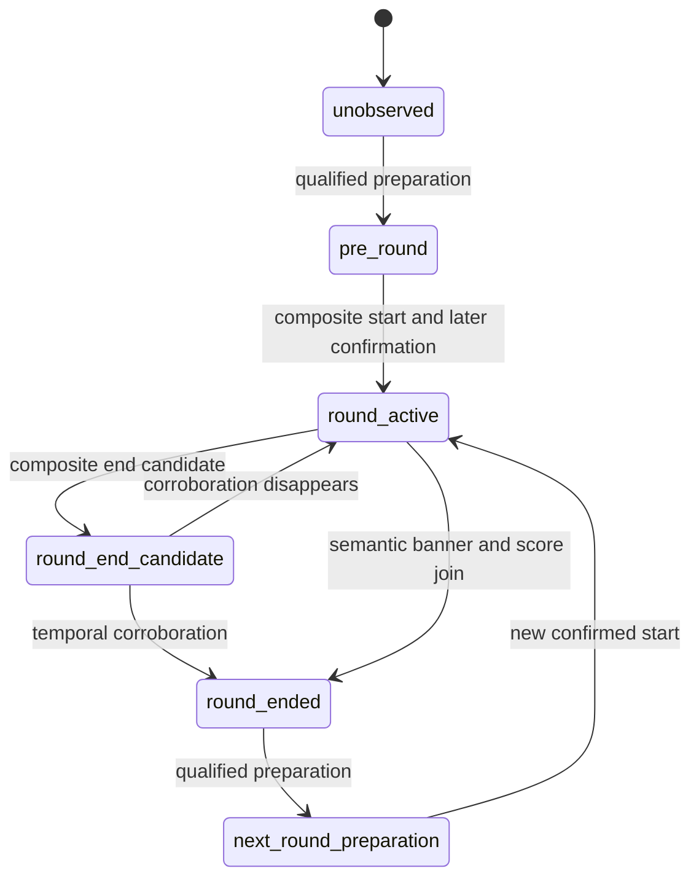

# Round Lifecycle Pipeline implementation

**実動画受入は未達です。** lifecycle、event contract、package associationの基盤を実装しましたが、現在の安全なprofileには必要な入力がなく、3境界は未検出です。30 PASS、29 FAIL解消、production採用を主張しません。

開始時に `git fetch origin` → `git checkout main` → `git pull --ff-only` を実行。開始SHA: `deaf3c8ed34a571f38a46e947ade5beea187d930`。GT、pack、assertion、full sampler、NCC0.90、identity/ownership/spectator/OCR/geometry/mapの安全条件を維持。新しいtimer/score/HP/spectator candidateは生成せず、`.env.local` も変更していません。

## 1. Existing behavior

最新正常完了full16: 23 PASS /55 FAIL /4 NE。round start/endは0、packageはpartial1件 `[7.369336,171.002669]` でR2も含む。profile16はtimer誤認で却下済みです。今回の画像再解析は安全側profile13を明示指定しました。

## 2. Root cause

- R1開始前後ではAbility/Weapon、R2開始前後ではWeapon identityが不足。R1終了直後はspectator exclusion未確認。
- profile13にはHP readerしかなく、timer/ally score/enemy score reader、buy/end phase templateがない。
- 一般textureのshared_bannerは購入表示を拾わず戦闘背景を拾う。score変化とのjoinだけでround endへ昇格する経路があった。
- actor契約、重複抑止、断続点リセット、pre-round所属が未完成だった。

前の3点は認識入力の問題、最後は今回実装したpipeline契約です。入力不足を条件緩和で補いません。

## 3. Round lifecycle state machine

`hud/round_lifecycle.py` をHUD direct event builderへ接続しました。



全状態でgap >1秒、または明示されたsource discontinuity/content_jumpによってpending candidateを破棄しunobservedへ戻します。source continuity segmentをevent attributesへ保持。active中のmenu開閉だけではstartを再armせず、endは次の資格付きstartまで再発火しません。end未観測で新たな購入phase列が成立しても、欠落endは生成しません。

## 4. Evidence sources

既存のphase/state/timer reset、semantic banner/score transitionという複合証拠を使います。一般textureだけのshared_bannerからendをjoinしません。scoreを推測生成しません。

実画像診断は保存full16の3–6、72–77、109–114秒の全342 native PTSを再認識しました。保存認識結果を画像認識として再利用せず、信頼済みanchorやsignalも注入していません。各区間に真正な校正prefix `[0.036003,0.202669,0.402669]` を付け、prefixと区間のgapはtemporal reset対象にしました。geometry retained policyは変更していません。

全native PTSに保存画像があり、filename丸めの最大差は0.000336秒。source SHA、raw terminal hash、frame hash、profile/assets fingerprintを診断に記録。これはarchive PTSに限定した診断で、動画の全container frameや新しいfull sampler実行の証明ではありません。

## 5. Boundary detection logic

Start: 既存のbuy/menuまたはbuy banner→live、finite accepted timer reset >3秒、前後HUD confidence>=0.65に加え、後続liveフレームのtimer countdown整合を確認します。候補後0.05秒以上で確定し、event時刻は最初のcandidate PTSを保ちます。単発reset、jitter、timer不明、低confidenceを拒否します。

End: semantic round_end_template、またはvalidated round_end_bannerと、別PTSのscore変化を最大3秒窓でjoin。介在するgap >1秒／source cutを拒否し、confidence>=0.65を維持。joined endは複数PTSの証拠を保持します。他の既存banner＋timer停止候補には後続観測のcorroborationが必要です。従来のconfidence0.85未満のcross-check条件も維持します。

動画固有のround数、GT時刻、round ID、禁止end時刻をdetectorへ渡していません。R2 endが0という評価期待はruntime条件ではありません。

## 6. Actor contract

actorはイベントの主体、producerは検出元です。round_start/endはmatchルールのlifecycleなのでsystem。teamはteamの集団行動、playerはplayerへ帰属する行動です。source registryに `allowed_actors=[system]` を追加し、native producerでsystemを生成します。package/traceでteam→systemを変換しません。旧contractでこのoptional metadataがない場合は従来のproducer-only validationを維持。詳細: `docs/event_actor_contract.md`。

## 7. Package association rule

round_windowはpackageの観測context範囲です。実際のactive start/endはsource eventが保持し、context開始をdetected startと読み替えません。boundary eventはexplicit associationで一度だけ所属し、contextの伸長で移動・複製しません。

gapまたはsource continuity segment不一致ではcomplete roundとしてstart/endを結合しません。欠落境界のpartial fragmentはquality/completenessを0に維持します。診断fragmentの範囲は検出round boundaryではありません。源のend eventがあるmissing-start fragmentでもendを失いません。

## 8. Pre-round context rule

confidence>=0.65のbuy menu/buy phaseを持つ最新の連続準備episodeを次の実start packageへ含めます。過去の確定境界を越えて前roundの準備を再利用しません。終了後から次の準備開始前の連続観測は、終了したpackageのpost contextへ所属。gap >1秒で拡張を止め、共有endpointのobservationは後packageへ一度だけ所属します。

初期の資格付き準備contextは最初のdetected start packageへ含めます。校正prefixからstate/snapshotを肯定せず、最初の準備証拠以前のunknown観測をGTからroundへ所属させません。snapshot admissionのconfidence条件は維持。早期R1 snapshotが自動的にPASSになるとは扱いません。

## 9. Trace contract

adapterはnative type/actor/time/confidence/attributesを保持します。evidence_provenanceはattributes内のproducer、source PTS、confirmation PTS、signal種別、continuity segmentです。round labelは既存のnative package順の命名規約で、GT IDを入力しません。共有endpointのstate/owner/visualは後packageへ所属し、end eventは前packageに残します。

## 10. Tests

- 関連unit/integration **82 PASS /1 SKIP**。任意のsibling-pack fixture未配置によるSKIPです。実際のcanonical packはoffline replayで全82 assertionを別途評価しました。
- `python3 -m ruff check src tests scripts/e2e scripts/diagnostics`: PASS。
- `python3 -m mypy src/valorant_ai_coach`: PASS、97 source files。
- start/end、duplicate、jitter、gap、source cut、2round遷移、false second endなし、actor、pre/post context、低confidence、native→package→trace provenance、共有endpointを検証。
- texture banner＋score transitionからendを生成しないnegative testを追加。
- 実画像temporal受入が不合格のため、指定ゲートに従い全体pytest/full regressionとfull E2Eは実行していません。
- Windows/Piで同じproduction code・Python・profile形式。Windows実機は未検証で、archive PTS、JPEG decode、relative assets、Tesseract/FFmpeg/ffprobe配置の確認が必要です。

## 11. E2E comparison

### Continuous real-frame gate: NOT QUALIFIED

| Window sec | Frames | Wall sec | States | Round events |
| --- | ---: | ---: | --- | ---: |
| [3.0, 6.0] | 78 | 163.863 | {'unknown': 78} | 0 |
| [72.0, 77.0] | 79 | 241.049 | {'unknown': 79} | 0 |
| [109.0, 114.0] | 185 | 399.443 | {'buy_menu_open': 34, 'unknown': 130, 'live_first_person': 21} | 0 |

合計342フレーム、813.722秒（約13分34秒）。3区間のbuy/end template、両score、numeric timerの既知数はいずれも0。前のprofile13 fullの同じ区間でもstate件数は同じで差分0です。R1 start/endとR2 startは未検出。R2 endも0ですが、全入力未資格の結果なので、他3境界を正しく検出してfalse endを防げたという証明ではありません。

### Fixed sampled regression

| Metric | Previous | Current | Delta |
| --- | ---: | ---: | ---: |
| PASS | 7 | 7 | 0 |
| FAIL | 12 | 12 | 0 |
| NE | 11 | 11 | 0 |
| Frames | 30 | 30 | 0 |
| Wall sec | 326.450 | 285.415 | -41.035 (-12.57%) |

suite/source/PTS一致、comparable=true。全failure項目とstate件数も変わりません。exit1は既存FAILによるもので実行異常ではありません。runtime変動をlifecycle変更による高速化と断定しません。isolated sampledはtemporal/full negative assertionを評価しません。

### Full archive → final-source offline contract replay

以下Currentは保存rawを現builder/adapter/canonical evaluatorで再評価した値で、新しいfull認識runではありません。

| Metric | Previous full | Current offline | Delta |
| --- | ---: | ---: | ---: |
| PASS | 23 | 23 | 0 |
| FAIL | 55 | 55 | 0 |
| NE | 4 | 4 | 0 |
| Round start events | 0 | 0 | 0 |
| Round end events | 0 | 0 | 0 |
| Native packages | 1 partial | 1 partial | 0 |
| sample_round_1 partial assigned observations | 4499 | 4499 | 0 |
| sample_round_2 observations | 0 | 0 | 0 |
| Negative failures | 0 | 0 | 0 |
| Canonical discontinuity assertion violations | 0 | 0 | 0 |
| Boundary duplicate count | 0 | 0 | 0 |

package/traceは保存出力と意味的に一致、status/failure-code差分0。新しくPASSになったIDはありません。windowは両方 `[7.369336,171.002669]`、boundary confidenceは不存在。前回full時間15149.129秒、今回full時間は未計測です。

固定した最初の受入ID:

| Assertion | Current | Failure |
| --- | --- | --- |
| GT-R1-ROUND-END | fail | missing_point:GT-R1-ROUND-END |
| GT-R1-ROUND-START | fail | missing_point:GT-R1-ROUND-START |
| GT-R2-ROUND-START | fail | missing_point:GT-R2-ROUND-START |
| event_count_constraints-000 | fail | count:sample_round_1:round_start |
| event_count_constraints-002 | fail | count:sample_round_1:round_end |
| event_count_constraints-004 | fail | count:sample_round_2:round_start |
| ordering_constraints-001 | not_evaluated | required point missing |

**Negativeの限定:** canonical negative20件はPASSですが、NEG-CONTENT-JUMP-SPANはtemporal featureが0なのでstate/owner断続安全の証明にはなりません。保存traceには74.433–74.450のcutを跨ぐcombat_report_visibleとunknown-owner区間が残ります。source readerがこのcut markerを供給していません。今回のsource marker/gapリセットのunit証明と、実画像でcutを発見できる証明を区別します。

29 package-scope assertionsも全てFAILです。actor契約は実装済みですが、実イベント不足、state/owner coverage、death属性、snapshot fields、mapなど別predicateが残ります。下表は現在のcanonical failureです。機械JSONには分析開始時のsecondary blockersをhistoricalと明記して保存しました。

| Assertion | Current canonical failure |
| --- | --- |
| GT-R2-ROUND-START | missing_point:GT-R2-ROUND-START |
| GT-R2-DEATH | missing_point:GT-R2-DEATH |
| GT-R2-BUY-FLAG | state_coverage:GT-R2-BUY-FLAG |
| GT-R2-BUY-MENU-1 | state_coverage:GT-R2-BUY-MENU-1 |
| GT-R2-BUY-MENU-2 | state_coverage:GT-R2-BUY-MENU-2 |
| GT-R2-ASTRAL-1 | state_coverage:GT-R2-ASTRAL-1 |
| GT-R2-ASTRAL-2 | state_coverage:GT-R2-ASTRAL-2 |
| GT-R2-EXPANDED-MAP | state_coverage:GT-R2-EXPANDED-MAP |
| GT-R2-SPECTATOR | state_coverage:GT-R2-SPECTATOR |
| OWN-R2-SELF | ownership_coverage:OWN-R2-SELF |
| OWN-R2-SELF-DEAD | ownership_coverage:OWN-R2-SELF-DEAD |
| OWN-R2-TEAMMATE | ownership_coverage:OWN-R2-TEAMMATE |
| GT-R1-SNAP-0035 | missing_snapshot:GT-R1-SNAP-0035 |
| GT-R1-SNAP-0415 | missing_snapshot:GT-R1-SNAP-0415 |
| GT-R2-SNAP-820 | missing_snapshot:GT-R2-SNAP-820 |
| GT-R2-SNAP-1050 | missing_snapshot:GT-R2-SNAP-1050 |
| GT-R2-SNAP-11145 | missing_snapshot:GT-R2-SNAP-11145 |
| GT-R2-SNAP-143 | missing_snapshot:GT-R2-SNAP-143 |
| GT-R2-SNAP-1475 | missing_snapshot:GT-R2-SNAP-1475 |
| GT-R2-SNAP-1476 | missing_snapshot:GT-R2-SNAP-1476 |
| GT-R2-SNAP-1477 | missing_snapshot:GT-R2-SNAP-1477 |
| GT-R2-SNAP-149 | missing_snapshot:GT-R2-SNAP-149 |
| GT-R2-SNAP-151 | missing_snapshot:GT-R2-SNAP-151 |
| GT-R2-SNAP-170 | missing_snapshot:GT-R2-SNAP-170 |
| GT-R1-SNAP-0035-DERIVED-zone_id | missing_derived_snapshot:GT-R1-SNAP-0035-DERIVED-zone_id |
| GT-R1-SNAP-0415-DERIVED-zone_id | missing_derived_snapshot:GT-R1-SNAP-0415-DERIVED-zone_id |
| GT-R2-SNAP-820-DERIVED-zone_id | missing_derived_snapshot:GT-R2-SNAP-820-DERIVED-zone_id |
| event_count_constraints-004 | count:sample_round_2:round_start |
| event_count_constraints-005 | count:sample_round_2:player_death |

## 12. Remaining blockers

1. 3境界のphase/state/timer/scoreを安全に供給する完全profileがない。禁止されたOCR/spectator candidate追加、threshold緩和で補いません。
2. knife等のWeapon identity、R1 Ability、死亡直後のexclusionが未資格。unknownをliveへ変換しません。
3. source content-jump marker producerがない。GT cutをruntimeへ注入しません。partial fragmentの命名だけでは物理round番号を確定できないケースも残ります。
4. death属性、snapshot fields、state/owner coverage、map/visualは別機能です。

次に直す1つの機能は**資格付きshared phase evidenceのproducer/profile供給**です。既存timer/score入力を含む資格確認を行い、不足するものはunknownに保ちます。入力が成立した後に今回の連続gateを再実行し、3境界・negative・sampledが通った候補だけfull regression/fullへ進めます。同じ不足profileでfullを再実行しません。全成功条件を満たしたとは扱いません。

推奨command（ローカルOCR環境を有効にする。WindowsはPython名とlocal pathを置換）:

```bash
python3 -m pytest -q tests/unit/test_round_lifecycle.py tests/unit/test_round_boundary_regressions.py
python3 scripts/diagnostics/diagnose_round_lifecycle.py --video ValorantData/videos/Valorant_09-25-2026_0-37-29-379.mp4 --source-sha256 71d58558559d6f578433ce9f234bf176f76fd5a86657dbfe3eba1e7d36136b06 --raw-processing outputs/recognition-investigation/timer-only-profile15/full16/raw_processing.json --frames-root outputs/recognition-investigation/timer-only-profile15/full16/processing_frames --profile outputs/hud_profiles/pi-structural-20261007-13/hud_layout.json --window 3 6 --window 72 77 --window 109 114 --output outputs/round-lifecycle-continuous.json
python3 scripts/e2e/run_dataset_case.py --video ValorantData/videos/Valorant_09-25-2026_0-37-29-379.mp4 --video-id match_001 --validation-pack ValorantData/valorant_e2e_validation_pack_v3 --hud-layout outputs/hud_profiles/pi-structural-20261007-13/hud_layout.json --mode sampled
```
